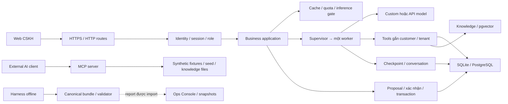

# Codebase Map — RetailOps hiện tại

> Cập nhật **2026-10-08**. Checkout: `codex/phase4-harness`; commit đã kiểm: `8a666fcce464c96b1dd5fc6848a2d4168c6505d1`.
> Runtime baseline của PR: `49671b928ad6badfaa01331174eb73f0e366752e`. PR [#36](https://github.com/tuteemovaixlong/CSKH_ban_le/pull/36) chưa merge theo evidence gần nhất.
> Bản đồ mô tả code trong checkout và evidence đã ghi; phiên bản đang chạy EC2 đọc riêng trong runbook/status. Các cập nhật tài liệu hiện chưa commit/push.

## Đọc nhanh: hệ thống và việc sắp làm

RetailOps là web CSKH bán lẻ: đăng nhập/session → chat đa agent → tra đơn, chính sách, bảo hành và hỗ trợ → backend xử lý thao tác nghiệp vụ có kiểm quyền. Web đi qua HTTPS trên EC2; model có thể chạy ở endpoint riêng/Colab hoặc API. SQLite/PostgreSQL giữ identity và nghiệp vụ; pgvector phục vụ knowledge retrieval. Ops Console hiển thị báo cáo/usage. Harness Phase 4 tạo và kiểm bundle offline để chuẩn bị đo lường.

| Phần | Trạng thái hiện tại |
|---|---|
| Runtime, identity, workflow, cache/concurrency | Có trong code; Module 2.5 đã merged/postmerge verified theo [project status](../CURRENT_PROJECT_STATUS.md). Trạng thái deploy được ghi riêng ở đó. |
| Phase 4 build harness | N1 hash mutation, N3 denominator, N4 tool/safety types **DONE theo acceptance v1**. |
| Nghiệm thu `8a666fc` | K1–K8/C1–C6 PASS; independent sign-off PENDING. |
| Evidence đã có | 5 CI checks SUCCESS; Gemini báo full suite 575 tests OK/49 skipped. Local full-suite có 1 timing failure, được ghi rõ trong packet. Mock250/263 hợp lệ, quality185/237; chưa là model-quality evidence. |
| Chưa thực hiện | Chưa merge PR #36/G2; chưa mở live/full run hoặc cấp READY FOR MEASUREMENT trong lượt này. |

**Sắp làm:** packet 8a666fc → sign-off model khác/human mới → owner review → merge → G2 offline → dừng review harness, chuyển lane preflight.

Nguồn quyết định: [acceptance v1](../phase4/PHASE_4_ACCEPTANCE_CRITERIA.md), [review](../phase4/REVIEW_GEMINI_PHASE4_2026-10-07.md), [plan/handoff](../phase4/PLAN_REVIEW_HANDOFF_GEMINI_2026-10-07.md), [evidence 8a666fc](../phase4/PHASE_4_ACCEPTANCE_EVIDENCE_8a666fc.md). Không thêm checklist hoặc mở lại việc DONE.

## 1. Kiến trúc và luồng dữ liệu



Mũi tên biểu diễn quan hệ chính, không phải mọi lời gọi. Graph chat chính gọi `BoundTools` trực tiếp. MCP server có tool implementation riêng trên synthetic fixtures/seed và knowledge files; không dùng session/customer binding của web. Supervisor hiện chọn một worker trong mỗi lượt; checkpoint giữ state để resume hội thoại/approval.

## 2. Bản đồ thư mục

Inventory ngày cập nhật: **65 file Python trong `retailops/`**, **8 file `retailops_*.py` ở root**, **12 file Python trong `evals/harness/`**; gồm `__init__.py`, không gồm bytecode. Số dòng của inventory 2026-10-02 được bỏ để tránh nhầm với kích thước hiện tại.

| Khu vực | Vai trò | File nên mở trước |
|---|---|---|
| `retailops/` | Composition root, cấu hình, gateway, quota/concurrency | [bootstrap.py](../../retailops/bootstrap.py), [config.py](../../retailops/config.py), [inference_gate.py](../../retailops/inference_gate.py) |
| `retailops/http/` | Public/private adapter, API, OAuth, assets | [public.py](../../retailops/http/public.py), [routes.py](../../retailops/http/routes.py), [auth_google.py](../../retailops/http/auth_google.py) |
| `retailops/identity/` | Account, tenant membership, session, credential, reconciliation | [store.py](../../retailops/identity/store.py), [persistent.py](../../retailops/identity/persistent.py), [reconcile.py](../../retailops/identity/reconcile.py) |
| `retailops/business/` | Chat use cases, đơn/catalog, cache, permissions, feedback/export | [application.py](../../retailops/business/application.py), [store.py](../../retailops/business/store.py), [cache.py](../../retailops/business/cache.py) |
| `retailops/workflow/` | LangGraph routing, model/tool loop, checkpoint, approval | [graph.py](../../retailops/workflow/graph.py), [supervisor.py](../../retailops/workflow/supervisor.py), [approval.py](../../retailops/workflow/approval.py) |
| `retailops/workflow/subagents/` | Order, policy, dispute, general workers | [order_agent.py](../../retailops/workflow/subagents/order_agent.py), [policy_agent.py](../../retailops/workflow/subagents/policy_agent.py), [dispute_agent.py](../../retailops/workflow/subagents/dispute_agent.py), [witty_agent.py](../../retailops/workflow/subagents/witty_agent.py) |
| `retailops/guardrails/` | Topic/sentiment/abuse triage | [topic_filter.py](../../retailops/guardrails/topic_filter.py), [sentiment.py](../../retailops/guardrails/sentiment.py) |
| `retailops/storage/` | PostgreSQL adapter/schema, import/backfill | [postgres.py](../../retailops/storage/postgres.py), [pg_schema.py](../../retailops/storage/pg_schema.py), [import_sqlite.py](../../retailops/storage/import_sqlite.py) |
| `retailops/knowledge/` | Ingest/chunk/embed/retrieve, citation provenance | [repository.py](../../retailops/knowledge/repository.py), [tool.py](../../retailops/knowledge/tool.py), [embedding.py](../../retailops/knowledge/embedding.py) |
| `web/` | Chat, lịch sử, provider selector, nghiệp vụ theo role | [app.js](../../web/app.js), [index.html](../../web/index.html), [chat-focus.js](../../web/chat-focus.js) |
| `opsconsole/` | Dashboard report/usage/deployment snapshots; CLI import/evaluation | [server.py](../../opsconsole/server.py), [evaluation.py](../../opsconsole/evaluation.py), [usage.py](../../opsconsole/usage.py) |
| `evals/` | Frozen scenarios, qrels, harness Phase 4 | [README](../../evals/README.md), [runner.py](../../evals/harness/runner.py), [validator.py](../../evals/harness/validator.py) |
| `notebooks/` | Colab agent/model runtime, vLLM/GGUF helpers, smoke | [colab_agent.ipynb](../../notebooks/colab_agent.ipynb), [colab_runtime.py](../../notebooks/colab_runtime.py), [colab_vllm_l4.py](../../notebooks/colab_vllm_l4.py) |
| `deploy/`, `.github/workflows/` | Container, Caddy, PostgreSQL, rollout, CI/deploy guard | [SETUP](../../deploy/SETUP.md), [ci.yml](../../.github/workflows/ci.yml), [deploy-ec2.yml](../../.github/workflows/deploy-ec2.yml) |
| `scripts/`, `tests/` | Contracts, notebook generation, evaluation scripts, regressions | [check_docs_contract.py](../../scripts/check_docs_contract.py), [build_agent_notebook.py](../../scripts/build_agent_notebook.py), [test_phase4_schema.py](../../tests/test_phase4_schema.py) |
| `docs/../phase4/` | Scope, acceptance, evidence, đo lường/chi phí, backlog | [acceptance](../phase4/PHASE_4_ACCEPTANCE_CRITERIA.md), [handoff](../phase4/PHASE_4_EXECUTION_HANDOFF.md), [backlog](../phase4/PHASE_5_BACKLOG.md) |

## 3. Entry points và file root

`python -m retailops` → [__main__.py](../../retailops/__main__.py) → `bootstrap.py`. Commands: `check-config`, `serve-public`, `serve-private`, `identity`, `database`, `knowledge`.

| File / entry | Vai trò hiện tại |
|---|---|
| [retailops_public.py](../../retailops_public.py) | Wrapper public HTTP; Docker public dùng entry này, implementation trong package. |
| [retailops_api.py](../../retailops_api.py) | Wrapper private HTTP cho local/SSM/test; không phải cách đăng nhập EC2. |
| [retailops_agent.py](../../retailops_agent.py) | RemoteAgent giao tiếp endpoint Custom, lớp tương thích graph. |
| [retailops_providers.py](../../retailops_providers.py) | API gateway: OpenRouter/Anthropic/Google hoặc endpoint OpenAI-compatible theo cấu hình. |
| [retailops_tools.py](../../retailops_tools.py) | BoundTools theo tenant/customer: tra dữ liệu, chuẩn bị hủy, yêu cầu hỗ trợ. |
| [retailops_mcp_server.py](../../retailops_mcp_server.py) | External AI integration qua stdio/SSE; tool implementation riêng trên synthetic fixtures/seed và knowledge files. |
| [retailops_conversation.py](../../retailops_conversation.py) | Catalog/presentation helper cho UI; chat reasoning đi qua agent. |
| [retailops_baseline.py](../../retailops_baseline.py) | Model config, scaffold intent/slot và baseline/compatibility helpers. |
| [phase4_harness.py](../../scripts/phase4_harness.py) | CLI mock-run/validate/recompute/sidecar-check/qrels-check. |
| `python -m opsconsole.server` | Dashboard đọc snapshot, Waitress8100 phía sau Caddy theo admin deployment. |

Public runtime dùng Waitress8000 phía sau Caddy HTTPS. Người dùng mở web EC2 theo [EC2 workflow](../EC2_WEB_WORKFLOW.md); kiểm host/origin theo runbook, không hardcode IP cũ.

## 4. Một lượt chat và thao tác nghiệp vụ

1. Public HTTP xác thực cookie và lấy binding do server quản lý: tenant, principal/customer và role. Private demo xác thực Bearer, dùng customer do server ánh xạ trong Application/SQLite demo.
2. `http/routes.py` gọi `business/application.py`; application quản lý conversation/provider, cache, quota và inference gate.
3. Khi cache miss/bypass, graph supervisor dùng intent/context cùng topic/sentiment để chọn `order`, `policy`, `dispute` hoặc `witty` worker; model/tool loop có giới hạn. Runtime với model thật mặc định `multi_agent`; `single_agent` là lựa chọn cấu hình/test.
4. Tools dùng bound customer/tenant để tra đơn/knowledge; kết quả và trace đưa về worker. Conversation/checkpoint hỗ trợ resume.
5. Application lưu turn/usage và chỉ cache kết quả đủ điều kiện; provider giữ nhất quán, không tự đổi model khi lỗi.
6. Hủy đơn: prepare → proposal → xác nhận rõ ràng → backend kiểm role/ownership, trạng thái/version, thời hạn/idempotency → transaction/audit.

Prepare_cancellation không tự hủy đơn; `request_human_support` có thể lưu feedback/handoff. Vì vậy không gọi toàn bộ tool surface là “chỉ đọc”. Staff desk và manager CRUD là API có permission riêng.

Nguồn: [LangGraph](../LANGGRAPH.md), [identity](../PERSISTENT_IDENTITY.md), [system foundation](../SYSTEM_FOUNDATION.md).

## 5. Identity, dữ liệu, model và RAG

| Phần | Cơ chế trong code |
|---|---|
| Private/synthetic demo | Seeded SQLite; public guest demo có workspace/session riêng. |
| Public persistent-demo/live | SQLite identity + tenant business DB, hoặc PostgreSQL identity/tenant schemas theo cấu hình. Có lane live trong code không đồng nghĩa đã nghiệm thu dữ liệu/model live. |
| Identity schema | v4; migration v1/v2/v3, unresolved-collision guard, reconciliation journal. [reconcile.py](../../retailops/identity/reconcile.py) phối hợp Identity/Business; journal hỗ trợ recovery, không phải distributed ACID. |
| Business schema | SQLite v3 / PostgreSQL v4; tách version khỏi Identity v4. |
| Model Custom | RemoteAgent protocol `/agent/identity`, `/agent/chat`; Colab/Ollama proxy là một deployment path. |
| Model API | Server adapter cấu hình API provider hoặc OpenAI-compatible endpoint. Custom/API chỉ bật khi được cấu hình; provider của conversation được giữ nhất quán. |
| Quota/concurrency/cache | [account_usage.py](../../retailops/account_usage.py), `inference_gate.py`, `business/cache.py`; reservation/bounded inference được ghép trong application. |
| Knowledge/RAG | PostgreSQL/pgvector theo tenant, hybrid vector/lexical retrieval. Embedding `feature-hash-v1`, 384 chiều, là baseline xác định; chưa mặc định neural embedding/reranker mới. |
| Citation | Kiểm provenance source/chunk; correctness/entailment của câu trả lời cần được đánh giá riêng. |

Nâng model/embedding/reranker, OCR hoặc ablation thuộc workstream đo/Phase4B có điều kiện; không kéo vào closure PR harness.

## 6. Harness Phase 4 và R10–R13

Harness là evaluation tooling riêng với business runtime. Runner hiện là **mock offline**, không chứng minh chất lượng model thật hoặc readiness của lane live.

```text
Frozen scenarios + sidecar + qrels
  → Phase4MockRunner / grader / telemetry
  → writer: manifest.json, attempts.jsonl, grading.jsonl, retrieval.jsonl,
            errors.jsonl, aggregate.json, checksums.sha256
  → validator: schema / joins / provenance / checksums / aggregate recompute
  → evidence / acceptance v1
```

| Phần trọng tâm | Module / vai trò | Trạng thái v1 |
|---|---|---|
| R10 — grader/safety | [grader.py](../../evals/harness/grader.py), [schema.py](../../evals/harness/schema.py): rubric, tool/safety types, hard veto | DONE OFFLINE; semantic tool evidence ở backlog. |
| R11 — readiness gates | [gates.py](../../evals/harness/gates.py): G0–G7; chỉ G5 grant measurement readiness | DONE OFFLINE GUARD; live lane chưa nghiệm thu. |
| R12 — bundle/reproducibility | [runner.py](../../evals/harness/runner.py), [writer.py](../../evals/harness/writer.py), [validator.py](../../evals/harness/validator.py), [constants.py](../../evals/harness/constants.py) | Hash mutation/blocked denominator DONE; actual-source replay hardening/count semantics deferred. |
| R13 — packaging/deploy guard | [eligibility](../../scripts/check_deploy_eligibility.py), [deploy workflow](../../.github/workflows/deploy-ec2.yml), [deployment contract](../../scripts/check_deployment_contract.py) | DONE OFFLINE/CI; full PR mixed packaging, guard eligible=true. |

Inputs: `baseline_v1.jsonl` 30 ca, `benchmark_250.jsonl` 250 ca, `master_250_v1.jsonl` 250 ca; frozen hashes/counts ở contracts. [sidecar.py](../../evals/harness/sidecar.py) bổ sung identity/fixture labels; [qrels.py](../../evals/harness/qrels.py) quản lý retrieval labels. [build_agent_notebook.py](../../scripts/build_agent_notebook.py) giữ generated notebook đồng bộ source.

N1 replay hardening, N3 completeness/counts, N4 positive-count thiếu tool names và L2/L4/L5 ở [Phase5 backlog](../phase4/PHASE_5_BACKLOG.md); không dùng để giữ merge hoặc mở audit mới.

## 7. Ops Console, CI và triển khai

| Nhánh | Vai trò |
|---|---|
| Ops Console server/UI | Đọc report/usage/deployment snapshots; không có endpoint thực thi chat/hủy đơn/deploy. CLI/importer riêng; dashboard không tự đóng G5. |
| `ci.yml` | Offline contracts/tests, Docker packaging, Colab Python3.13 source/runtime compatibility theo workflow. |
| `ops-console.yml` | Portable Windows/Ubuntu và PostgreSQL integration; console/UI/quota regressions. |
| `live-e2e.yml` | Live verification riêng; CI offline không thay bằng chứng live. |
| `deploy-ec2.yml` | Guard changed-files trước deploy; cần main, deploy-enabled variable và eligibility. |
| `deploy/` | Compose/Caddy/PostgreSQL, publish/activate, rollout/source consistency, live-E2E scripts. |

Full diff PR #36 có packaging nên `deploy_eligible=true` theo evidence đã kiểm. Owner xét policy/variables hiện hữu trước merge; không coi PR eval-only hoặc mặc định deploy-skipped. Bản đồ không thay đổi variables, merge hay triển khai.

## 8. Khi cần hiểu/sửa X, mở đâu

| Nhu cầu | Đọc trước |
|---|---|
| Khởi động/cấu hình | `retailops/__main__.py`, `retailops/bootstrap.py`, `retailops/config.py` |
| Login/session/role/tenant | `retailops/http/public.py`, `retailops/identity/store.py`, `retailops/identity/persistent.py` |
| Collision/migration/reconciliation | `retailops/identity/reconcile.py`, `retailops/storage/pg_schema.py`, `retailops/identity/store.py` |
| Chat/provider/history | `retailops/business/application.py`, `retailops/models.py`, `retailops_providers.py` |
| Routing/worker/tool loop | `retailops/workflow/graph.py`, `retailops/workflow/supervisor.py`, worker tương ứng trong `retailops/workflow/subagents/` |
| Hủy đơn/approval/idempotency | `retailops/http/routes.py`, `retailops/business/store.py`, `retailops/workflow/approval.py` |
| Catalog/bảo hành/staff desk | `retailops/http/routes.py`, `retailops/business/store.py`, `retailops/business/warranty.py` |
| Quota/concurrency/cache | `retailops/account_usage.py`, `retailops/inference_gate.py`, `retailops/business/cache.py` |
| RAG/citation | `retailops/knowledge/repository.py`, `retailops/knowledge/tool.py`, `retailops/knowledge/citations.py` |
| MCP external integration | `retailops_mcp_server.py`, `retailops/workflow/mcp_client.py` |
| Ops reports/usage/import | `opsconsole/server.py`, `opsconsole/evaluation.py`, `opsconsole/usage.py` |
| Harness R10–R12 | `evals/harness/schema.py`, `evals/harness/grader.py`, `evals/harness/validator.py`, tests liên quan |
| Deploy guard R13 | `scripts/check_deploy_eligibility.py`, `.github/workflows/deploy-ec2.yml`, `tests/test_deploy_guard.py` |
| Gemini làm ngay | [review](../phase4/REVIEW_GEMINI_PHASE4_2026-10-07.md) → [plan](../phase4/PLAN_REVIEW_HANDOFF_GEMINI_2026-10-07.md) → [acceptance](../phase4/PHASE_4_ACCEPTANCE_CRITERIA.md) |

Path trong bảng tính từ repo root. Chọn 2–3 file đầu rồi mở dependency khi cần. Không nạp toàn bộ `data/`, `evals/`, `scratch/`, `artifacts/`; chỉ lấy case/report liên quan. Bỏ bytecode, secret/env và `__pycache__/` khỏi context.

## 9. Phạm vi tiếp theo và điều kiện dừng

| Bước | Ai thực hiện | Phạm vi / kết quả |
|---|---|---|
| 1. Technical closure | Gemini | DONE tại 8a666fc: K7/C6 sạch, checklist kỹ thuật đạt theo evidence; dừng sửa code. |
| 2. Evidence | Gemini / reviewer độc lập mới | Giao packet 8a666fc + acceptance v1 + frozen diff; xác minh đúng 8 mục và ký độc lập. |
| 3. Sign-off | Model khác/human mới | Chưa tham gia N1–N5; chỉ nhận acceptance + frozen diff/evidence, xác minh 8 mục. Không dùng reviewer/agents cũ hoặc Gemini tác giả tự ký. |
| 4. Owner review/merge | Owner và người được giao merge | 8/8 PASS + independent PASS; xem mixed-packaging eligibility, merge theo policy. |
| 5. G2 offline | Gemini theo handoff | Merged checkout/SHA: CI, contracts/frozen hashes, mock replay đúng harness SHA. PASS thì kết thúc review build harness. |
| 6. Sau G2 | Owner/Gemini theo lane plan | Lane preflight → G3 approval → G4 live smoke evidence → G5 readiness → G6 full-run approval → G7 measured. |

**Đúng 8 mục, không K9:** K1 hash mutation reject; K2 blocked denominator; K3 malformed tool/safety types reject; K4 CI xanh; K5 >=563 tests, 0 failures/errors; K6 mock 250; K7 patch whitespace; K8 C1–C6 contracts. C6 chính là K7.

Một mục FAIL thì chỉ sửa nguyên nhân mục đó. Ngoài 8 mục → Phase 5 backlog, không block merge. **8/8 PASS + independent PASS thì dừng review harness, chuyển owner review.** G2 không cấp READY FOR MEASUREMENT; chỉ G5 cấp khi có evidence/approval tương ứng. Cập nhật bản đồ là bước chuẩn bị tài liệu; chưa thực thi các bước sửa/merge/live trên đây.
