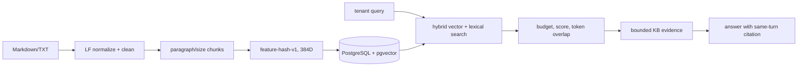

# AI RAG pipeline

> Scope: tenant-scoped knowledge ingestion and retrieval in the current checkout. This records source behavior; it does not claim neural-search quality or a live database deployment.
>
> Digest: [`../_digest/code/RAG.digest`](../_digest/code/RAG.digest). Sources: [`../../retailops/knowledge/`](../../retailops/knowledge/), [`../../data/knowledge/`](../../data/knowledge/).

## 1. Source documents

`read_directory()` accepts only `.md` and `.txt`, walks the directory in sorted order, cleans text, derives a title and emits a `repo://data/knowledge/...` URI ([`chunking.py`](../../retailops/knowledge/chunking.py#L1-L45)). The repository has nine sample Markdown documents covering cancellation, FAQ, payments, shipping, returns and policy topics; the cancellation source explicitly limits itself to RetailOps Demo ([`cancellation.md`](../../data/knowledge/cancellation.md#L1-L9)).

## 2. Cleaning and chunking

Text is normalized from CRLF/CR to LF, trailing whitespace is removed, repeated blank lines collapse and the result is stripped ([`chunking.py`](../../retailops/knowledge/chunking.py#L18-L21)). `chunks()` validates a 300–2000 target and 0–300 overlap, splits paragraphs/long blocks, carries tail overlap and caps chunks at 4000 characters ([`chunking.py`](../../retailops/knowledge/chunking.py#L63-L83)). `checksum()` stores SHA-256 over cleaned UTF-8 content ([`chunking.py`](../../retailops/knowledge/chunking.py#L86-L87)).

## 3. Embedding

The embedder is dependency-free feature hashing: dimension 384, model ID `feature-hash-v1`, token/bigram/character-trigram features, then L2 normalization ([`embedding.py`](../../retailops/knowledge/embedding.py#L1-L43)). The source calls it a deterministic baseline rather than neural semantic quality and allows a later neural embedder behind the same API/schema ([`embedding.py`](../../retailops/knowledge/embedding.py#L1-L7)).

## 4. Storage and ingestion

`KnowledgeRepository` requires PostgreSQL and schema version 3 ([`repository.py`](../../retailops/knowledge/repository.py#L1-L21)). Replacement validates source key/title/URI, chunks/checksums content, derives deterministic IDs, stores metadata and writes model/vector rows ([`repository.py`](../../retailops/knowledge/repository.py#L27-L57)). Batch ingestion reports document/chunk/change counts, model ID and source keys ([`repository.py`](../../retailops/knowledge/repository.py#L59-L65)). CLI commands are tenant-scoped; repository creation rejects non-PostgreSQL storage ([`cli.py`](../../retailops/knowledge/cli.py#L9-L38)).

## 5. Retrieval

Search validates a 1–500 character query and limit 1–10, computes the same embedding and executes hybrid pgvector/lexical search. Score is `0.75*vector_score + 0.25*lexical_score`, ordered by score then ID ([`repository.py`](../../retailops/knowledge/repository.py#L67-L96)). Results include source key/title/URI/chunk/scores and a `KB:<source>#chunk-<ordinal>` citation ([`repository.py`](../../retailops/knowledge/repository.py#L89-L96)).

## 6. Tool budget and evidence filtering

The tool allows at most two searches, three sources, 2800 reply characters and 3600 total serialized characters; minimum score is 0.15 and is explicitly a heuristic ([`tool.py`](../../retailops/knowledge/tool.py#L11-L16)). It rejects invalid queries, refuses to invent policy when PostgreSQL/schema/search is unavailable, filters malformed/non-finite/low-score candidates and requires token overlap ([`tool.py`](../../retailops/knowledge/tool.py#L36-L68)). Evidence is bounded, deduplicated and labeled `evidence_found` or `no_evidence` ([`tool.py`](../../retailops/knowledge/tool.py#L69-L96)).

## 7. Citation provenance

`cited_sources()` accepts only `KB:` IDs present in evidence returned in the same turn. Unknown references raise `knowledge_citation_invalid`; retrieved evidence without an answer citation raises `knowledge_citation_missing` ([`citations.py`](../../retailops/knowledge/citations.py#L1-L27)). The module states provenance validation does not prove semantic entailment; that is a separate evaluation task ([`citations.py`](../../retailops/knowledge/citations.py#L15-L20)).

## 8. End-to-end flow

The flow maps directly to chunking ([`chunking.py`](../../retailops/knowledge/chunking.py#L18-L83)), embedding ([`embedding.py`](../../retailops/knowledge/embedding.py#L13-L43)), storage/search (`retailops/knowledge/repository.py:27-96`), tool bounds (`retailops/knowledge/tool.py:36-96`) and citation validation (`retailops/knowledge/citations.py:15-27`).

## 9. Unknown / unverified

- [UNVERIFIED] The checked source names only `feature-hash-v1`; no active neural embedder or reranker is established here.
- [UNVERIFIED] No PostgreSQL tenant migration or live traffic is proven by source inspection.
- [UNVERIFIED] The RAG digest link is a cache artifact until `docs/_digest/code/RAG.digest` exists; direct source citations remain authoritative for this page.
