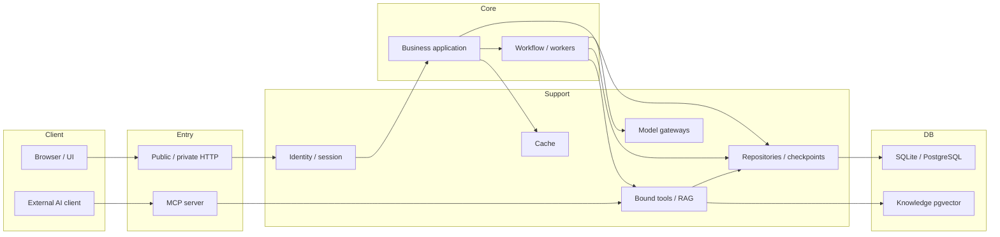
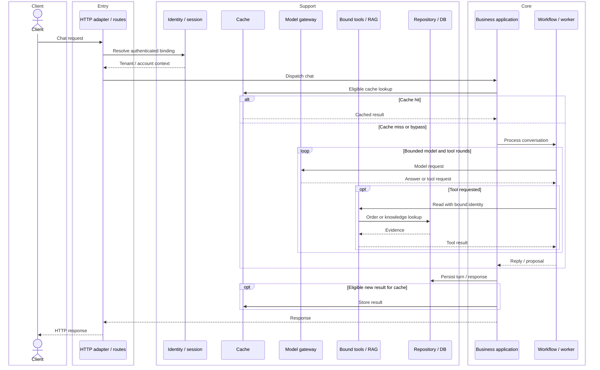
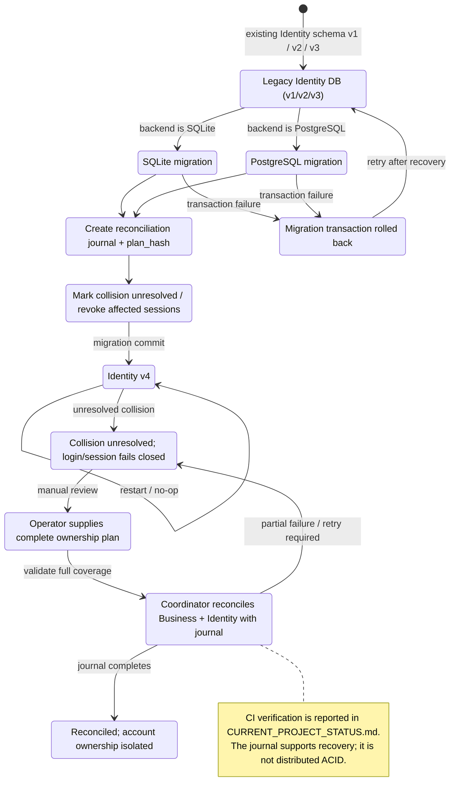

# Codebase Map

## 1. Tổng quan

Metadata inventory được quét ngày 2026-10-02; trạng thái sơ đồ migration được cập nhật ngày 2026-10-03 từ status/CI report. Phạm vi lúc quét: **64 file Python trong `retailops/` (8,437 dòng)** và **8 file `retailops_*.py` ở root (2,848 dòng)**. Số dòng là snapshot inventory, không phải số đo sau các commit N08.

Chỉ thu thập tên file, docstring cấp module, import statement và số dòng. Mô tả bên dưới tóm tắt docstring; quan hệ giữa module suy từ import. Bản đồ hỗ trợ chọn file đưa vào context, không xác nhận logic runtime hay trạng thái hoàn tất của plan.

- Cây thư mục: `tree retailops /F /A` trên Windows (tương đương `tree retailops/`).
- Docstring/import: trích metadata AST, không import/chạy module; không đưa thân hàm vào context.
- Số dòng: `"C:\\Program Files\\Git\\usr\\bin\\wc.exe" -l <các file .py>`.
- `wc -l` đếm newline, gồm cả dòng trống/comment; dùng làm ước tính kích thước file, không phải số dòng logic. Bỏ `__pycache__/` khỏi cây mã nguồn.

## 2. Cấu trúc thư mục

Tổng dưới đây tính trực tiếp trong mỗi thư mục; `workflow/` không cộng lại `workflow/subagents/`.

| Module | Chức năng | 2–3 file chính | Số file / dòng |
| --- | --- | --- | --- |
| `retailops/` | Cấu hình và ghép các backend thành ứng dụng; tiện ích lỗi, schema, gateway và quota. | `bootstrap.py`, `config.py`, `models.py` | 9 / 728 |
| `retailops/http/` | Public/private HTTP adapter, route nghiệp vụ, assets và OAuth. | `public.py`, `routes.py`, `auth_google.py` | 6 / 885 |
| `retailops/identity/` | Account, membership, credential và session; backend demo, SQLite persistent và PostgreSQL. | `store.py`, `persistent.py`, `postgres.py` | 8 / 1,125 |
| `retailops/business/` | Use case chat/đơn hàng, repository nghiệp vụ, cache, role, bảo hành và export. | `application.py`, `store.py`, `cache.py` | 8 / 2,239 |
| `retailops/guardrails/` | Lọc chủ đề, sentiment và theo dõi lạm dụng ngoài phạm vi. | `topic_filter.py`, `sentiment.py`, `rate_limiter.py` | 4 / 163 |
| `retailops/knowledge/` | Ingestion, chunking, embedding baseline, retrieval pgvector và citation. | `repository.py`, `tool.py`, `embedding.py` | 7 / 406 |
| `retailops/storage/` | Transaction, DDL, repository adapter, import SQLite và backfill. | `postgres.py`, `pg_schema.py`, `pg_repositories.py` | 7 / 691 |
| `retailops/workflow/` | Ghép graph, routing, model/tool loop, checkpoint và human approval. | `graph.py`, `supervisor.py`, `agent.py` | 9 / 1,023 |
| `retailops/workflow/subagents/` | Worker order/policy/dispute/general và runtime worker chỉ đọc dùng chung. | `dispute_agent.py`, `read_worker.py`, `order_agent.py` | 6 / 1,177 |

<details>
<summary>Cây tên file đầy đủ (64 module Python)</summary>

```text
retailops/
  __init__.py
  __main__.py
  account_usage.py
  bootstrap.py
  config.py
  core.py
  inference_gate.py
  models.py
  schema.py
  http/
    __init__.py
    assets.py
    auth_google.py
    private.py
    public.py
    routes.py
  identity/
    __init__.py
    bearer.py
    cli.py
    contracts.py
    demo.py
    persistent.py
    postgres.py
    store.py
  business/
    __init__.py
    application.py
    cache.py
    export.py
    permissions.py
    schema.py
    store.py
    warranty.py
  guardrails/
    __init__.py
    rate_limiter.py
    sentiment.py
    topic_filter.py
  knowledge/
    __init__.py
    chunking.py
    citations.py
    cli.py
    embedding.py
    repository.py
    tool.py
  storage/
    __init__.py
    backfill.py
    cli.py
    import_sqlite.py
    pg_repositories.py
    pg_schema.py
    postgres.py
  workflow/
    __init__.py
    agent.py
    approval.py
    checkpoints.py
    graph.py
    mcp_client.py
    schema.py
    state.py
    supervisor.py
  workflow/subagents/
    __init__.py
    dispute_agent.py
    order_agent.py
    policy_agent.py
    read_worker.py
    witty_agent.py
  **/__pycache__/  [KHÔNG ĐƯA VÀO CONTEXT]
```

</details>

<details>
<summary>Danh mục docstring và số dòng từng file</summary>

### Tầng chung / khởi động — retailops/

| File | Chức năng theo docstring | Dòng |
| --- | --- | ---: |
| [__init__.py](../retailops/__init__.py) | Khởi tạo package; docstring ghi import không khởi động dịch vụ. | 1 |
| [__main__.py](../retailops/__main__.py) | CLI hệ thống: `python -m retailops`, cấu hình và phục vụ HTTP. | 49 |
| [account_usage.py](../retailops/account_usage.py) | Tổng hợp usage AI theo account; dự trữ quota trước I/O, không lưu prompt/answer. | 190 |
| [bootstrap.py](../retailops/bootstrap.py) | Ghép cấu hình, model gateway, identity/storage và HTTP adapter lúc khởi động. | 62 |
| [config.py](../retailops/config.py) | Xác thực cấu hình khởi động; che secret trong repr/summary. | 145 |
| [core.py](../retailops/core.py) | Lỗi nghiệp vụ, từ vựng chung và vị trí assets. | 24 |
| [inference_gate.py](../retailops/inference_gate.py) | Giới hạn concurrency, hàng đợi và timeout cho model I/O. | 203 |
| [models.py](../retailops/models.py) | Dựng model gateway theo cấu hình. | 28 |
| [schema.py](../retailops/schema.py) | Khởi tạo/migration SQLite theo transaction. | 26 |

### HTTP — retailops/http/

| File | Chức năng theo docstring | Dòng |
| --- | --- | ---: |
| [__init__.py](../retailops/http/__init__.py) | Khởi tạo package HTTP. | 1 |
| [assets.py](../retailops/http/assets.py) | Assets UI cố định, cùng origin cho hai HTTP adapter. | 9 |
| [auth_google.py](../retailops/http/auth_google.py) | Đăng nhập Google OAuth 2.0/SSO. | 197 |
| [private.py](../retailops/http/private.py) | HTTP adapter localhost/SSM. | 103 |
| [public.py](../retailops/http/public.py) | WSGI adapter cho HTTPS; session backend cấp binding nghiệp vụ. | 149 |
| [routes.py](../retailops/http/routes.py) | Dispatch route nghiệp vụ dùng chung cho hai adapter. | 426 |

### Identity / session — retailops/identity/

| File | Chức năng theo docstring | Dòng |
| --- | --- | ---: |
| [__init__.py](../retailops/identity/__init__.py) | Khởi tạo package identity. | 1 |
| [bearer.py](../retailops/identity/bearer.py) | Xác thực bearer demo private, trả identity do server quản lý. | 13 |
| [cli.py](../retailops/identity/cli.py) | CLI cấp account/credential cho operator. | 79 |
| [contracts.py](../retailops/identity/contracts.py) | Hợp đồng session xác thực và binding. | 30 |
| [demo.py](../retailops/identity/demo.py) | Workspace/session demo tạm có lời mời. | 180 |
| [persistent.py](../retailops/identity/persistent.py) | Lifecycle session độc lập với tenant DB trong persistent pilot. | 146 |
| [postgres.py](../retailops/identity/postgres.py) | Session account bền vững trên PostgreSQL. | 42 |
| [store.py](../retailops/identity/store.py) | Principal, membership, session thu hồi được; credential dạng hash. | 634 |

### Nghiệp vụ — retailops/business/

| File | Chức năng theo docstring | Dòng |
| --- | --- | ---: |
| [__init__.py](../retailops/business/__init__.py) | Khởi tạo package nghiệp vụ. | 1 |
| [application.py](../retailops/business/application.py) | Use case hội thoại, chọn provider và tra cứu đơn. | 478 |
| [cache.py](../retailops/business/cache.py) | Cache exact, semantic/vector và kết quả tool. | 335 |
| [export.py](../retailops/business/export.py) | Xuất dữ liệu SFT/DPO từ feedback và turn. | 168 |
| [permissions.py](../retailops/business/permissions.py) | Chính sách role tường minh. | 13 |
| [schema.py](../retailops/business/schema.py) | Không có docstring đầu file; vai trò schema suy từ tên file và import của `store.py`/`retailops/schema.py`. | 108 |
| [store.py](../retailops/business/store.py) | Repository SQLite nghiệp vụ và quy tắc hủy đơn nguyên tử. | 1065 |
| [warranty.py](../retailops/business/warranty.py) | Ưu tiên bảo hành catalog/chính sách chung và kiểm tra điều kiện. | 71 |

### Guardrails — retailops/guardrails/

| File | Chức năng theo docstring | Dòng |
| --- | --- | ---: |
| [__init__.py](../retailops/guardrails/__init__.py) | Khởi tạo package guardrails. | 1 |
| [rate_limiter.py](../retailops/guardrails/rate_limiter.py) | Theo dõi rate limit và lạm dụng câu hỏi ngoài phạm vi CSKH. | 30 |
| [sentiment.py](../retailops/guardrails/sentiment.py) | Nhận diện bực bội/tức giận để định hướng cách trả lời. | 71 |
| [topic_filter.py](../retailops/guardrails/topic_filter.py) | Lọc chủ đề bị cấm/nhạy cảm. | 61 |

### Knowledge / RAG — retailops/knowledge/

| File | Chức năng theo docstring | Dòng |
| --- | --- | ---: |
| [__init__.py](../retailops/knowledge/__init__.py) | Package ingestion/retrieval RAG theo tenant. | 5 |
| [chunking.py](../retailops/knowledge/chunking.py) | Đọc và chia đoạn Markdown/text theo cách xác định. | 87 |
| [citations.py](../retailops/knowledge/citations.py) | Kiểm tra nguồn gốc citation; không xác minh nội dung trả lời suy ra đúng từ nguồn. | 28 |
| [cli.py](../retailops/knowledge/cli.py) | CLI ingestion/search knowledge theo tenant. | 38 |
| [embedding.py](../retailops/knowledge/embedding.py) | Embedding baseline feature hashing, xác định và offline; docstring không tuyên bố neural embedding. | 55 |
| [repository.py](../retailops/knowledge/repository.py) | Repository pgvector theo tenant, truy cập model chỉ đọc. | 97 |
| [tool.py](../retailops/knowledge/tool.py) | Knowledge tool chỉ đọc, có giới hạn; tenant lấy từ bound store. | 96 |

### Storage PostgreSQL / migration — retailops/storage/

| File | Chức năng theo docstring | Dòng |
| --- | --- | ---: |
| [__init__.py](../retailops/storage/__init__.py) | Khởi tạo storage adapter; import không kết nối DB. | 1 |
| [backfill.py](../retailops/storage/backfill.py) | Backfill liên kết order→product theo tên canonical, có dry-run cho SQLite/PostgreSQL. | 111 |
| [cli.py](../retailops/storage/cli.py) | CLI khởi tạo DB và import offline tường minh. | 39 |
| [import_sqlite.py](../retailops/storage/import_sqlite.py) | Import bản sao workspace SQLite persistent đã dừng vào PostgreSQL trống. | 107 |
| [pg_repositories.py](../retailops/storage/pg_repositories.py) | Adapter repository business/identity dùng PostgreSQL. | 45 |
| [pg_schema.py](../retailops/storage/pg_schema.py) | DDL PostgreSQL và migration nghiệp vụ theo giai đoạn. | 292 |
| [postgres.py](../retailops/storage/postgres.py) | Transaction và SQL parameterized cho repository PostgreSQL. | 96 |

### Workflow LangGraph — retailops/workflow/

| File | Chức năng theo docstring | Dòng |
| --- | --- | ---: |
| [__init__.py](../retailops/workflow/__init__.py) | Package LangGraph workflow có checkpoint bền vững theo tenant. | 5 |
| [agent.py](../retailops/workflow/agent.py) | Vòng model→tools→model có giới hạn; tools chỉ đọc. | 145 |
| [approval.py](../retailops/workflow/approval.py) | Graph duyệt bởi con người: interrupt bền vững rồi transaction nghiệp vụ. | 83 |
| [checkpoints.py](../retailops/workflow/checkpoints.py) | LangGraph saver đồng bộ qua SQL theo tenant. | 123 |
| [graph.py](../retailops/workflow/graph.py) | Ghép Supervisor và worker chuyên trách trong StateGraph. | 174 |
| [mcp_client.py](../retailops/workflow/mcp_client.py) | MCP client adapter, discovery và kết nối in-process/SSE. | 113 |
| [schema.py](../retailops/workflow/schema.py) | Bảng graph portable cho migration business. | 22 |
| [state.py](../retailops/workflow/state.py) | State schema chung cho routing, checkpoint và human approval. | 50 |
| [supervisor.py](../retailops/workflow/supervisor.py) | Router intent và triage guardrails/sentiment. | 308 |

### Worker chuyên trách — retailops/workflow/subagents/

| File | Chức năng theo docstring | Dòng |
| --- | --- | ---: |
| [__init__.py](../retailops/workflow/subagents/__init__.py) | Khởi tạo package subagents. | 1 |
| [dispute_agent.py](../retailops/workflow/subagents/dispute_agent.py) | Hủy đơn, khiếu nại/hoàn tiền qua proposal có human approval. | 511 |
| [order_agent.py](../retailops/workflow/subagents/order_agent.py) | Worker đơn hàng, kết quả theo ownership và phản hồi dựa trên bằng chứng. | 201 |
| [policy_agent.py](../retailops/workflow/subagents/policy_agent.py) | Worker chính sách, trích excerpt với provenance ID. | 54 |
| [read_worker.py](../retailops/workflow/subagents/read_worker.py) | Runtime worker chỉ đọc có giới hạn, phân biệt lỗi lookup/transport. | 328 |
| [witty_agent.py](../retailops/workflow/subagents/witty_agent.py) | Worker general/chit-chat chuyển hướng sang bán hàng, theo guardrails. | 82 |

</details>

### Entry points và module hỗ trợ ở root

Docstring chỉ nêu rõ entry HTTP public/private, baseline và MCP server. Các file gateway/tool/catalog cũng khớp mẫu `retailops_*.py`, được liệt kê đầy đủ nhưng không mặc định coi tất cả là CLI độc lập.

| File | Vai trò | Dòng |
| --- | --- | ---: |
| [retailops_agent.py](../retailops_agent.py) | Model adapter và lớp tương thích gọi graph có giới hạn. | 64 |
| [retailops_api.py](../retailops_api.py) | Entry HTTP private/lớp import tương thích; implementation trong `retailops/`. | 13 |
| [retailops_baseline.py](../retailops_baseline.py) | Scaffold đánh giá intent/slot với Ollama local hoặc HTTPS proxy. | 401 |
| [retailops_conversation.py](../retailops_conversation.py) | Catalog và hiển thị xác định cho nút UI; docstring ghi chat dùng agent. | 187 |
| [retailops_mcp_server.py](../retailops_mcp_server.py) | MCP server cho external AI client, transport stdio/SSE. | 1392 |
| [retailops_providers.py](../retailops_providers.py) | OpenRouter adapter cấu hình phía server. | 496 |
| [retailops_public.py](../retailops_public.py) | Entry HTTP public/lớp import tương thích; implementation trong `retailops/`. | 15 |
| [retailops_tools.py](../retailops_tools.py) | Tool chỉ đọc bound với customer đã xác thực. | 280 |

Entry hệ thống nằm trong package: `python -m retailops` → [retailops/__main__.py](../retailops/__main__.py) → `bootstrap.py` hoặc CLI identity/storage/knowledge.

## 3. Kiến trúc tổng quan

Kiến trúc nhóm theo **Client → Entry → Core → Support → DB**. Entry HTTP lấy binding từ identity; Core dùng cache, model gateway, bound tools và repository. MCP là nhánh vào riêng cho external AI client. Mũi tên chỉ thể hiện quan hệ ở mức module.



## 4. Chat request flow

Luồng chat ở mức tương tác giữa tầng: xác thực binding, dispatch, lookup cache, workflow/model/tools và trả response. Cache-hit bỏ qua workflow/model; kết quả mới chỉ được cache khi đủ điều kiện. Sequence dùng `box` để nhóm tầng; không mô tả từng function, lỗi chi tiết hay thứ tự lock.



## 5. Identity migration v1/v2/v3 → v4

Đây là **Identity schema**, không phải Business schema (SQLite Business v3 / PostgreSQL Business v4 là hai version khác). `CURRENT_PROJECT_STATUS.md` ghi Identity schema v1/v2/v3 được nâng lên v4 trên SQLite và PostgreSQL, và báo 47/47 PostgreSQL integration tests PASS trong CI run `37098929081`. Bản đồ phản ánh báo cáo đó; không tự xác nhận trạng thái live production hay thay thế kiểm tra CI `head_sha`.



## 6. Khi cần sửa X, đọc file nào

Đọc 2–3 file đầu tiên theo nhu cầu; mở thêm phụ thuộc khi cần. Những file ngoài `retailops/` được xác định từ import hoặc docstring của module liên quan.

| Nhu cầu | Đọc trước | Mở tiếp nếu cần |
| --- | --- | --- |
| Cấu hình / khởi động | `retailops/config.py`, `retailops/bootstrap.py`, `retailops/__main__.py` | `retailops/models.py` |
| Public HTTP / cookie / OAuth | `retailops/http/public.py`, `retailops/http/auth_google.py`, `retailops/identity/contracts.py` | `retailops/identity/persistent.py` |
| Account / role / session / credential | `retailops/identity/store.py`, `retailops/identity/persistent.py`, `retailops/business/permissions.py` | `retailops/identity/postgres.py`, `retailops/identity/cli.py` |
| Route API / quản lý đơn | `retailops/http/routes.py`, `retailops/business/application.py`, `retailops/business/store.py` | `retailops_tools.py` |
| Chat / lựa chọn workflow | `retailops/business/application.py`, `retailops/workflow/graph.py`, `retailops/workflow/supervisor.py` | `retailops/workflow/agent.py`, `retailops/workflow/state.py` |
| Order / policy / dispute worker | File tương ứng trong `retailops/workflow/subagents/` | `read_worker.py`, `retailops_tools.py` |
| Model provider / Ollama / OpenRouter | `retailops/models.py`, `retailops_agent.py`, `retailops_providers.py` | `retailops_baseline.py` |
| Giới hạn model I/O / concurrency | `retailops/inference_gate.py`, `retailops/business/application.py` | `retailops/identity/persistent.py`, `retailops/http/public.py` |
| Semantic / exact / tool cache | `retailops/business/cache.py`, `retailops/business/application.py` | `retailops/knowledge/embedding.py` |
| RAG ingestion / retrieval / embedding | `retailops/knowledge/repository.py`, `tool.py`, `embedding.py` | `chunking.py`, `cli.py` trong cùng package |
| Nguồn citation | `retailops/knowledge/citations.py`, `retailops/knowledge/tool.py` | `retailops/workflow/subagents/policy_agent.py` |
| Human approval / checkpoint | `retailops/workflow/approval.py`, `retailops/workflow/checkpoints.py`, `retailops/workflow/state.py` | `retailops/workflow/schema.py` |
| Migration SQLite / schema nghiệp vụ | `retailops/schema.py`, `retailops/business/schema.py`, `retailops/business/store.py` | `retailops/identity/store.py` |
| PostgreSQL / migration / transaction | `retailops/storage/pg_schema.py`, `postgres.py`, `pg_repositories.py` | `retailops/identity/postgres.py` |
| Import workspace / backfill product | `retailops/storage/cli.py`, `import_sqlite.py`, `backfill.py` | `retailops/storage/pg_schema.py` |
| Bảo hành / catalog / nút UI | `retailops/business/warranty.py`, `retailops_conversation.py`, `retailops/business/store.py` | `retailops_tools.py` |
| Usage / quota AI / export dữ liệu | `retailops/account_usage.py`, `retailops/business/export.py` | `retailops/identity/persistent.py`, `retailops/identity/store.py` |
| Guardrails sentiment / topic / abuse | `retailops/guardrails/sentiment.py`, `topic_filter.py`, `rate_limiter.py` | `retailops/workflow/supervisor.py` |
| Tích hợp MCP | `retailops_mcp_server.py`, `retailops/workflow/mcp_client.py` | Các import của client adapter |

## 7. Quy tắc context

| Thư mục | Quy tắc |
| --- | --- |
| `data/` | **KHÔNG nạp cả thư mục.** Chỉ chọn tệp dữ liệu/knowledge cụ thể khi nhiệm vụ cần. |
| `evals/` | **KHÔNG nạp cả thư mục.** Chỉ mở case/schema cần thiết cho đánh giá. |
| `scratch/` | **KHÔNG nạp mặc định.** Script/tài liệu tạm chỉ dùng khi có yêu cầu cụ thể. |
| `artifacts/` | **KHÔNG nạp mặc định.** Chỉ chọn báo cáo/kết quả liên quan. |
| `**/__pycache__/` | **KHÔNG ĐỌC.** Bytecode sinh tự động, không phải nguồn code để chỉnh. |

Với câu hỏi mới: chọn một hàng ở bảng mục 6, mở file tương ứng; dùng bản đồ này thay cho việc nạp toàn bộ code, plan và review vào context.

## 8. Lịch sử thay đổi lớn

| Mốc | Thay đổi | Phạm vi / nguồn |
| --- | --- | --- |
| Bản đồ ban đầu, 2026-10-02 | Liệt kê 64 module trong `retailops/`, 8 file root, docstring/import, số dòng và bảng tra cứu. | Metadata file và `wc -l`; không audit logic. |
| N08 status refresh, 2026-10-03 | Identity schema v1/v2/v3 → v4 trên SQLite/PostgreSQL; journal, collision guard và coordinator reconciliation. | CI run `37098929081` và 47/47 PostgreSQL tests PASS được `CURRENT_PROJECT_STATUS.md` báo cáo; merge review còn pending SHA check. |
| Bổ sung Mermaid | Thêm đúng 3 diagram: kiến trúc, chat sequence, identity migration; sắp xếp bản đồ theo cấu trúc mới. | 13 nút kiến trúc / 9 participant / 10 trạng thái kể cả nhóm; không đọc thêm code chi tiết. |
