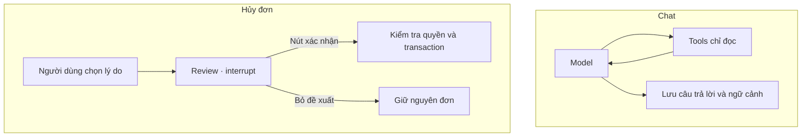

# RetailOps 0.9 — LangGraph và khôi phục luồng nghiệp vụ

## Phạm vi đã có

LangGraph 1.0.10 thực sự điều phối các node model/tools và review/commit.
Không dùng LangGraph Platform, LangSmith hosting, GPU mới hay dịch vụ trả phí bổ sung.



- Chat checkpoint lưu hội thoại chuẩn hóa, trace, focus, phiên bản đơn đã đọc và kết quả tool.
  Retry cùng `conversation_id` + `request_id` tiếp tục từ bước đã lưu, không tự đổi provider.
- Fingerprint gồm nội dung, role và provider. Thread ID được server tạo và ràng buộc customer
  trong database/schema của tenant; không nhận thread ID hay `Command` từ client.
- Saver dùng `BaseCheckpointSaver`, serializer không cho pickle fallback, trên cùng connection
  SQLite/PostgreSQL. Không serialize gateway, token, URL cấu hình, function hoặc suy luận riêng.
- Checkpoint và pending writes được ghi qua transaction ngắn. `durability='sync'` ghi xong
  trước bước tiếp theo; không giữ DB transaction trong lúc chờ model hoặc người dùng.
- Lease SQL 180 giây chặn hai process chạy cùng request. Writer cũ mất lease không được ghi
  checkpoint. Lỗi có xử lý giải phóng ngay; sau process crash thật có thể phải chờ lease hết hạn.
- Review dùng `interrupt`; nút xác nhận gửi quyết định qua server thành `Command(resume=...)`.
  Mỗi lần resume kiểm tra lại quyền, chủ đơn, TTL, trạng thái, version và idempotency.
  `prepare_cancellation` của model chỉ đọc dữ liệu và mở giao diện, không tự duyệt.
- Business transaction là nguồn quyết định. Nếu process chết sau khi commit đơn nhưng trước
  khi lưu checkpoint/trả HTTP, retry cùng key trả lại kết quả cũ và không ghi audit hủy lần hai.
- Tải lại trang liệt kê đề xuất chưa hết hạn bằng `GET /api/cancellation-proposals`.
  Người dùng phải bấm **Xem lại đề xuất**, rồi **Xác nhận**. Không tự resume giao dịch.
  UI dùng proposal ID làm idempotency key ổn định; key không phải mã đăng nhập.

## Giới hạn cần hiểu đúng

- HTTP tới model không có đảm bảo exactly-once. Crash sau khi nhà cung cấp nhận request
  nhưng trước checkpoint có thể gọi/bị tính phí lại khi người dùng retry. Không tự retry
  network node, không tự fallback. Mỗi lần thử API có gọi model giữ một lượt quota/ngày.
- Trace sau resume ghi số liệu của đường chạy đã checkpoint; lần gọi thất bại được audit
  riêng. Đây chưa phải tổng latency/chi phí của mọi lần thử. `metrics_scope` ghi rõ giới hạn.
- Không triển khai time travel, arbitrary state editing, subgraph namespace, asynchronous
  saver, streaming token, RAG/pgvector, MCP hay multi-agent trong phase này.
- Một lượt chat tối đa theo budget `agent_protocol.py`; deadline 110 giây mỗi invocation.
  Lease không phải hàng đợi toàn cụm. Khóa model chung trong process vẫn được giữ; quota API
  dùng DB chung nhưng chưa có admission/scheduling theo tenant hoặc reservation USD/token.
- Checkpoint chat hết hạn theo mốc conversation lúc bắt đầu; proposal giữ thêm 30 phút sau
  TTL. Dọn lazy khi tạo/chạy workflow tiếp theo, chỉ xóa run đã hết hạn và không giữ lease.
  Dữ liệu nghiệp vụ/audit không bị xóa theo checkpoint. Không có worker chạy nền để dọn.
- Chỉ đang hỗ trợ dữ liệu giả lập. `production` vẫn bị từ chối.

## Cài và kiểm tra

```bash
python -m pip install --only-binary=:all: --require-hashes -r requirements-graph.txt -r requirements-postgres.txt -r requirements-web.txt
python -m unittest discover -s tests -v
node tests/test_public_session.js
RETAILOPS_UI_TEST_MODE=persistent node tests/test_public_session.js
python scripts/build_agent_notebook.py --check
```

Dependency lock gồm wheel hashes CPython 3.11/3.12 Linux x86_64. Docker cài cùng lock.
Colab notebook mới tự cài requirements-graph trước test/source smoke. Proxy vẫn dùng
`retailops-agent-v1`: **proxy Colab cũ đang chạy vẫn kết nối được với web 0.9**, không cần
đổi token, model hoặc URL chỉ vì nâng graph. Dùng notebook mới cho lần smoke graph tiếp theo.

## Nâng database và web

Chỉ làm sau khi PR merge, CI/CD thành công và `deployed.env` trỏ đúng image 0.9.
Giữ image 0.8 và tạo backup đã kiểm tra theo [hướng dẫn PostgreSQL](POSTGRESQL.md).
Không dùng `down --volumes`.

**Nếu đang dùng PostgreSQL:** trong EC2 Session Manager, dùng cả hai Compose file:

```bash
cd /opt/retailops
retailops_pg() {
  sudo docker compose --project-name retailops-web --env-file deployed.env --env-file public.env -f compose.public.yaml -f compose.postgres.yaml "$@"
}
retailops_pg stop web
retailops_pg run --rm --no-deps --entrypoint python web -m retailops database migrate
retailops_pg up -d --no-build --pull never --force-recreate --wait --wait-timeout 90 web
```

`database migrate` nâng business schema v1 → v2 của từng tenant trong transaction riêng,
không sửa schema identity v1, không xóa/seed đơn. Chạy lại an toàn; nếu một tenant lỗi,
giữ web dừng, sửa lỗi rồi chạy lại. Không mở web 0.9 với tenant chưa migrate.
Không cần nâng PostgreSQL server hoặc mở port 5432.

**Nếu đang dùng SQLite:** backup workspace khi đã dừng writers, rồi recreate web với
Compose đang dùng. BusinessStore nâng v1 → v2 trong transaction khi mở kho, giữ nguyên
đơn, tài khoản và lịch sử. Guest/private/persistent đều dùng cùng migration.

SQLite import hỗ trợ business v1/v2; snapshot v2 mang cả checkpoint/interrupt sang PG,
vẫn đối chiếu nội dung các bảng. Login sessions không được import như trước.

Vì business schema đổi, **không rollback bằng cách chỉ đổi image về 0.8**. Cần dừng writers
và khôi phục backup v1 trước nâng cấp; những thay đổi sau backup sẽ không còn trong bản phục hồi.

Sau nâng, kiểm tra `/healthz` version 0.9; tạo đề xuất, tải lại trang, mở lại đề xuất,
xác nhận rồi thử cùng request key để kiểm tra replay. Test runtime model thật vẫn cần
Colab/API đang sẵn sàng; test CI dùng gateway giả lập và không phát sinh inference phí.

## Tài liệu nền

- [LangGraph persistence](https://docs.langchain.com/oss/python/langgraph/persistence)
- [LangGraph interrupts và resume](https://docs.langchain.com/oss/python/langgraph/interrupts)

Node bị interrupt có thể chạy lại từ đầu; vì vậy review không ghi giao dịch, và commit
gọi thao tác đã có idempotency thay vì tin rằng graph tự bảo đảm exactly-once.
