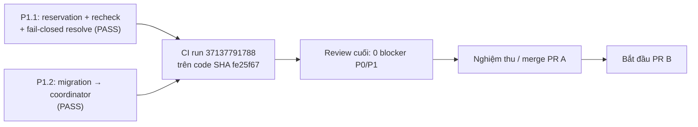

# N08 — Điều kiện dừng và bàn giao PR B

**Cập nhật:** 03/10/2026 · **Branch:** `feature/module-2.5-pr-a`  
**Code fix được CI xác minh:** `fe25f67` (CI Run ID `37137791788`)  
**Phạm vi:** Nghiệm thu P1.1/P1.2 và late-takeover session safety; không mở lại audit N08 toàn diện.

## Trạng thái hiện tại

Full suite cục bộ chạy **479 tests: OK, 50 SKIP, 0 FAIL/ERROR**. Skip do PostgreSQL/pgvector integration cần `RETAILOPS_TEST_DATABASE_URL` (toàn bộ chạy đầy đủ trên CI container PostgreSQL 16 thật). Bốn gate docs/deployment/eval/notebook và hash chuẩn hóa của hai benchmark đạt PASS.

GitHub Actions CI run `37137791788` trên code SHA `fe25f67`: host suite **479/479 PASS, 0 SKIP**; container suite **478 PASS / 1 SKIP** và PostgreSQL 16 live container thật. Cả hai test hồi quy SQLite (`test_n08_p11_reconciliation_toctou_target_taken_after_preflight_sqlite`) và PostgreSQL (`test_reconciliation_toctou_target_taken_after_preflight_on_postgres`) đều PASS (`ok`), bao phủ cả pre-existing session safety, `resolve()` fail-closed 503 `collision_unresolved`, `GET /api/orders` không trả dữ liệu sau late takeover, và retry hoàn tất an toàn.

**Kết luận:** Cả P1.1 và P1.2 đã được giải quyết triệt để và kiểm chứng thành công trên cả hai backend. Không còn phát hiện P0/P1. Nhánh `feature/module-2.5-pr-a` sẵn sàng nghiệm thu PR A; chưa merge vào `main`, chưa deploy lên EC2, chưa bắt đầu PR B.

## Các điều kiện dừng

| Gate | Tiêu chí đóng | Bằng chứng/trạng thái |
| --- | --- | --- |
| **P1.1 — Ownership, reservation và session safety** | Mọi target ownership conflict fail closed; reservations chặn writer hợp lệ; takeover sau Business commit không cho cả phiên mới lẫn phiên cũ truy cập customer đang unresolved; journal có thể resume an toàn. Có regression SQLite + PostgreSQL, gồm một session hợp lệ được tạo trước takeover. | **PASS** — `IdentityStore.resolve()` kiểm tra `unresolved_collisions` và membership collision cho `role == 'customer'`, fail-closed 503 `collision_unresolved`. Regression `reconcile_interleaving_cases.py` trên cả SQLite và PostgreSQL: session tạo trước takeover bị từ chối 503, `GET /api/orders` không trả dữ liệu; collision và journal an toàn (`business_committed`); retry hoàn tất và dữ liệu hợp lệ. CI Run `37137791788` PASS trên `fe25f67`. |
| **P1.2 — SQLite migration → coordinator** | Migration giữ collision unresolved; coordinator/CLI nhận và reconcile được; login/session fail closed cho đến hoàn tất; E2E từ legacy DB qua migration. | **PASS** — Migration giữ unresolved, coordinator nhận diện mượt mà, login/session fail-closed 503 cho đến khi reconcile xong; E2E chạy trên cả SQLite và PostgreSQL. CI Run `37137791788` PASS trên `fe25f67`. |
| **CI / tài liệu** | Full suite và gate liên quan xanh trên commit code cuối; docs phản ánh đúng SHA, kết quả và giới hạn. | **PASS** — Local suite 479 OK / 50 SKIP; CI Run `37137791788` host 479/479 PASS, container 478 PASS / 1 SKIP; 4/4 cổng hợp đồng PASS 100%; docs phản ánh chính xác code SHA `fe25f67`. |

**Điều kiện dừng vòng N08:** ĐÃ ĐẠT. P1.1 session-safety regression và P1.2 đạt trên cả SQLite và PostgreSQL, CI đạt SUCCESS trên code SHA `fe25f67`, không còn blocker P0/P1. Sẵn sàng nghiệm thu PR A.

## Known limitations được chấp nhận sau khi gates đạt

| Giới hạn | Cách xử lý |
| --- | --- |
| Collision chưa xác định được chủ sở hữu | Giữ unresolved/quarantine; không suy đoán mapping; yêu cầu operator cung cấp bằng chứng. |
| Identity DB và Business DB không có distributed ACID | Journal/idempotency/recovery giữ fail-closed và cho phép resume; không tuyên bố atomic commit xuyên hai DB. |
| Rollback về binary không hiểu guard/schema Identity v4 | Chỉ rollback bản tương thích; nếu không chắc, bật maintenance mode và theo runbook. |
| PR B chưa triển khai | Admission/concurrency, history, ToolCache invalidation, telemetry và OAuth hardening còn theo kế hoạch PR B. |
| Candidate chưa merge/deploy | Merge sau review và CI SHA khớp; deploy là gate riêng. |

Không mở rộng scope N08 ngoài blocker session-safety này trừ khi có bằng chứng mới về rò dữ liệu, corruption hoặc lỗi bảo mật nghiêm trọng. Không thực hiện commit/push/merge/deploy chỉ vì tài liệu có trạng thái READY.

## Quỹ đạo

## Bằng chứng nghiệm thu đã ghi nhận

- **Code SHA xác minh:** `fe25f67` (CI Actions Run ID: `37137791788`, `head_sha` khớp `fe25f67bec05430face0446b0e42fe50556f48dd`).
- **Kết quả kiểm thử:**
  - Cục bộ: 479 tests (429 PASS, 50 SKIP, 0 FAIL, 0 ERROR; skip do không có PG local).
  - CI Runner (PostgreSQL 16 container thật & Caddy live): host suite **479/479 PASS, 0 SKIP**; container suite **478 PASS / 1 SKIP, 0 FAIL**.
  - 4/4 cổng hợp đồng PASS 100%.
  - 5/5 marker HTTPS PASS (`PUBLIC_UI_ASSETS_OK`, `PUBLIC_HTTPS_PROXY_COOKIE_FLOW_OK`, `PUBLIC_CADDY_MAINTENANCE_SWITCH_OK`, `PERSISTENT_HTTPS_ACCOUNT_FLOW_OK`, `POSTGRES_HTTPS_IMPORT_RESTORE_OK`).
- **Regression session cũ:** `reconcile_interleaving_cases.py` trên cả SQLite và PostgreSQL chứng minh pre-existing session bị từ chối fail-closed 503 `collision_unresolved`, `GET /api/orders` không trả dữ liệu sau late takeover, collision và journal không kẹt, retry với key cũ hoàn tất an toàn.
- **Cam kết vận hành:** Nhánh `feature/module-2.5-pr-a` sẵn sàng nghiệm thu PR A; **chưa merge vào main, chưa deploy lên EC2, chưa bắt đầu PR B**.
