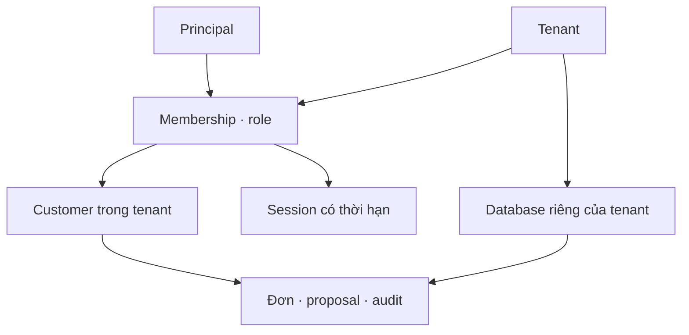

# RetailOps 0.7 — Tài khoản và dữ liệu độc lập với phiên

Đây là giai đoạn 2 của khung hệ thống, dùng **dữ liệu giả lập**. Không cần thêm dịch vụ
AWS, GPU hoặc gọi API model để cấp tài khoản và thử các luồng nghiệp vụ.

## Mô hình và giới hạn

| Khái niệm | Triển khai |
|---|---|
| Tenant | Một cửa hàng, mã do quản trị đặt; database có tên ngẫu nhiên do server tạo |
| Principal | Người dùng do quản trị cấp; chưa có đăng ký công khai, password, SSO hoặc MFA |
| Membership | Gắn principal với một tenant, một customer và role |
| Customer | Chủ sở hữu đơn trong tenant; nhiều principal được cấp cùng customer sẽ cùng xem dữ liệu đó |
| Credential | Mã cá nhân ngẫu nhiên 256 bit, gắn một membership; database chỉ lưu SHA-256 |
| Session | Cookie ngẫu nhiên riêng, chỉ lưu hash; hết hạn 8 giờ; logout, đổi quyền, đổi mã hoặc revoke làm mất hiệu lực |
| Business data | Đơn, proposal, nhật ký trong database tenant; không bị xóa khi session hết hạn |



| Role | Tra đơn, sản phẩm, chat | Chuẩn bị / tạo / xác nhận / bỏ đề xuất hủy |
|---|---|---|
| `customer` | Dữ liệu của customer được gắn | Có, vẫn kiểm tra owner/status/version/TTL/idempotency |
| `viewer` | Dữ liệu của customer được gắn | Bị từ chối tại HTTP và tool |

`viewer` vẫn tạo được conversation, focus và nhật ký truy cập. Đây là quyền đọc nghiệp vụ,
không phải quyền SQL chỉ đọc. Chưa có vai trò nhân viên xem toàn cửa hàng hoặc admin qua web.
Catalog sản phẩm hiện là catalog mẫu chung trong image, chưa tách catalog riêng từng tenant.
Audit nghiệp vụ vẫn ghi theo customer; audit cấp/đổi/thu hồi danh tính ghi theo membership.

## Chọn chế độ

| `RETAILOPS_DATA_MODE` | Đăng nhập | Vòng đời dữ liệu |
|---|---|---|
| `synthetic-demo` (mặc định) | Mã mời chung | Guest mới nhận bộ đơn mới; workspace có thể được dọn theo session |
| `persistent-demo` | Mã cá nhân đã cấp | Đăng nhập lại giữ dữ liệu của tài khoản |

Persistent mode chỉ hỗ trợ web HTTPS. Không nhận tenant, customer hay role từ request.
Mã mời chung và cookie guest không đăng nhập được vào persistent mode. Nếu một principal
thuộc hai cửa hàng, mỗi membership có mã riêng; phiên chọn cửa hàng qua mã đã cấp.

`GET /healthz` thêm `data_mode`; `scope` vẫn là `synthetic-demo` vì chưa xử lý đơn thật.
`GET /api/session` trả tên, tenant, principal, customer, role và permissions. UI dùng các
giá trị này để hiển thị tài khoản và danh sách đơn thực tế, không cố định hai tab O-101/O-102.

## Cấu trúc dữ liệu và migration

```text
<RETAILOPS_OUTPUT>/persistent/
  identity.sqlite3
  tenants/<storage-key-ngẫu-nhiên>.sqlite3
```

Các file WAL/SHM có thể nằm cạnh database. Web không tự seed tài khoản hoặc đơn khi login.
Mất file tenant thì request bị từ chối, kể cả khi application còn trong cache. Repository
đang hoạt động mở SQLite bằng `mode=rw` để không tự tạo database rỗng khi mất file.

Mỗi database có `retailops_schema(component, version)`. V1 khởi tạo trong transaction
`BEGIN IMMEDIATE`; DDL và marker cùng commit hoặc rollback. Business database cũ chưa có
version được nâng cấp tại chỗ: giữ đơn/proposal/replay/audit, bổ sung customers từ owner
hiện có, thêm provider_id nếu thiếu và ràng buộc customer bằng trigger. Không seed lại
trong migration. Version tương lai hoặc database thuộc component khác bị từ chối.

**Không tự chuyển database guest thành tenant.** Guest trước đây là bộ dữ liệu riêng của
phiên, chưa có danh tính được xác minh để gán sang tài khoản. Public guest và private demo
vẫn dùng các thư mục cũ. Khôi phục hoặc nhập dữ liệu cần chỉ rõ chủ sở hữu phía quản trị.

## Cấp tài khoản trên EC2 sau khi image 0.7 đã qua CI/CD

Các lệnh sau chạy trong **EC2 Session Manager**, ở `/opt/retailops`. Đây là thao tác quản trị
trên filesystem của server, không phải endpoint cho người dùng web. Chưa cần bật Colab.

Tạo hàm gọi đúng Compose project:

```bash
cd /opt/retailops
retailops_web() {
  sudo docker compose --project-name retailops-web --env-file deployed.env --env-file public.env -f compose.public.yaml "$@"
}
retailops_web up -d --no-build --pull never --force-recreate --wait --wait-timeout 60 web
```

Lệnh trên dùng image đã nằm trong `deployed.env`; phải là image 0.7 đã triển khai qua CD.
Health trả `version=0.7`. Nếu chưa đổi `RETAILOPS_DATA_MODE`, web vẫn ở chế độ guest.

Cấp tenant và dữ liệu mẫu một cách tường minh:

```bash
retailops_web exec -T web python -m retailops identity init-tenant --tenant retailops-demo --name "RetailOps Demo" --seed-demo
retailops_web exec -T web python -m retailops identity create-member --tenant retailops-demo --principal mai-anh --name "Mai Anh" --customer C-001 --role customer
```

Lệnh thứ hai trả `membership_id`. Thay `MEMBERSHIP_ID` trong lệnh tiếp theo bằng giá trị đó:

```bash
retailops_web exec -T web python -m retailops identity issue-credential --membership MEMBERSHIP_ID --credential-file /tmp/retailops-mai-anh-code
retailops_web exec -T web cat /tmp/retailops-mai-anh-code
```

Copy mã trên terminal riêng để đăng nhập và lưu ở nơi quản lý mã truy cập của bạn.
Không đưa mã vào repo, log hay ảnh gửi chat. File mode 0600, không được ghi đè. Tạo file
không thành công thì không đổi credential hiện có. Sau khi lưu mã, xóa bản giao tạm:

```bash
retailops_web exec -T web rm /tmp/retailops-mai-anh-code
```

Chỉnh `/opt/retailops/public.env` để có đúng một dòng:

```dotenv
RETAILOPS_DATA_MODE=persistent-demo
```

Giữ host/origin/cấu hình provider. Mã mời chung nếu còn trong file sẽ bị bỏ qua ở chế độ này.
Sau đó nạp cấu hình mới:

```bash
retailops_web up -d --no-build --pull never --force-recreate --wait --wait-timeout 60 web
```

Mở lại URL HTTPS, nhập mã cá nhân vừa lưu. Hủy O-101 rồi đăng xuất/đăng nhập lại: đơn phải
vẫn đã hủy. Cấp thêm principal khác với `--customer C-002 --role viewer` để thử tài khoản
chỉ thấy O-202 và không có quyền yêu cầu hủy. `create-member` không được gắn customer chưa có;
CLI `add-customer --tenant ... --customer ... --name ...` tạo customer trống, không tạo đơn.

Đổi quyền hoặc thu hồi:

```bash
retailops_web exec -T web python -m retailops identity set-role --membership MEMBERSHIP_ID --role viewer
retailops_web exec -T web python -m retailops identity revoke --membership MEMBERSHIP_ID
```

Hai lệnh là hai thao tác riêng: đổi quyền vẫn cho phép đăng nhập lại; revoke chặn cả mã lẫn
session. Cấp lại bằng `issue-credential` chỉ áp dụng cho membership đang hoạt động; dùng tên
file giao mã mới. Không có lệnh tự kích hoạt lại membership đã revoke trong phiên bản này.
Việc kiểm tra quyền diễn ra khi tiếp nhận request; request đã được nhận trước khi thu hồi
có thể hoàn tất. Khóa/lease điều phối request thuộc giai đoạn 3.

## Sao lưu và khôi phục trong giai đoạn này

Sao lưu **toàn bộ thư mục persistent**, gồm identity, mọi tenant và các file WAL hiện có.
Để nhất quán giữa các database, dừng web và không chạy CLI quản trị trong lúc sao lưu.
Không coi bản copy đang có nhiều process ghi là snapshot nhất quán.

```bash
retailops_web stop web
sudo install -d -m 0700 /opt/retailops/backups
retailops_snapshot=$(sudo mktemp /opt/retailops/backups/persistent.XXXXXX.tar)
sudo tar --create --file "$retailops_snapshot" --directory /opt/retailops/artifacts persistent
retailops_web up -d --no-build --pull never --wait --wait-timeout 60 web
```

Ghi lại đường dẫn trong biến `retailops_snapshot`. Archive chứa dữ liệu tài khoản và phiên;
chỉ người quản trị được đọc. Quy trình khôi phục:

1. Dừng web và CLI quản trị. Giữ lại thư mục hiện tại bằng tên khác, không ghi đè.
2. Giải nén snapshot vào thư mục phục hồi trống, kiểm tra có identity và đủ tenant.
3. Với cùng version image, chạy `PRAGMA integrity_check` và `PRAGMA foreign_key_check`
   trên các database; đăng nhập thử bản phục hồi trong môi trường tách biệt.
4. Xem lại quyền/membership đã thay đổi sau snapshot; khôi phục identity có thể phục hồi
   mã và session cũ. Thu hồi hoặc cấp lại mã cần thiết trước khi mở web cho khách.
5. Đặt thư mục phục hồi vào đúng `<output>/persistent`, owner 10001:10001 trên EC2,
   rồi bật web và kiểm tra đăng nhập/đơn/audit. Giữ bản trước phục hồi để đối chiếu.

Test tự động có round-trip bản copy lúc không có ghi và kiểm tra trạng thái hủy sau phục hồi.
Chưa có backup định kỳ, retention hoặc recovery workflow tự động. Không downgrade database
v1 bằng image cũ; muốn rollback toàn bộ thì dùng image và snapshot trước nâng cấp tương ứng.

## Bằng chứng kiểm tra và phần tiếp theo

```bash
python -m unittest discover -s tests -v
node tests/test_provider_selector.js
node tests/test_public_session.js
RETAILOPS_UI_TEST_MODE=persistent node tests/test_public_session.js
python scripts/build_agent_notebook.py --check
```

CI thêm kiểm tra account mode xuyên Caddy → Waitress trong Docker bằng CA thử riêng:
cấp tài khoản qua CLI đóng gói, login, kiểm tra quyền/cô lập, logout và restart. Không gọi model.

Giai đoạn tiếp theo vẫn là **luồng điều phối hệ thống**: request lifecycle, khóa conversation,
admission và budget reservation. Bản này giữ khóa agent toàn process và quota số lần thử API
cũ; chưa phải hạn mức USD/token, chưa có benchmark tải hoặc kết luận performance.
