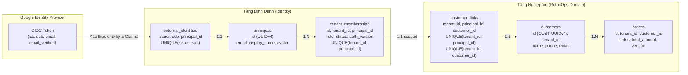

# Đặc Tả Kỹ Thuật: Định Danh Tài Khoản, RBAC & Hợp Đồng Import Đơn Hàng

> **Mã tài liệu**: `PLAN_ACCOUNT_IDENTITY_IMPORT_SPECIFICATION`
> **Trạng thái**: Đặc tả kỹ thuật kiến trúc chuẩn (Target Architecture Specification — SSOT, Dự kiến sau Module 2.5)
> **Kế thừa & Đối chiếu**: [REVIEW_ACCOUNT_ORDER_WORKFLOW.md](REVIEW_ACCOUNT_ORDER_WORKFLOW.md) (Mục 4–8 & N08), [PLAN_GOOGLE_ACCOUNT_RBAC_PRODUCTION.md](PLAN_GOOGLE_ACCOUNT_RBAC_PRODUCTION.md) (Phasing Roadmap)
> **Vai trò**: Nguồn đặc tả kỹ thuật duy nhất có thẩm quyền (SSOT) cho chuỗi định danh tài khoản, loại bỏ mã hash 32-bit (N08) bằng UUIDv4 opaque IDs, phân quyền RBAC dựa trên DB và hợp đồng import dữ liệu đơn hàng (JSONL/XLSX). Các thiết kế import và dynamic RBAC mang nhãn PLANNED (giai đoạn sau Module 2.5).
> **Mục tiêu**: Thiết kế chuẩn hóa toàn diện cho việc chuyển đổi sang Google Account thực, loại bỏ hoàn toàn lỗ hổng va chạm mã khách hàng 32-bit (N08), thiết lập Single Source of Truth (SSOT) cho phân quyền RBAC và xây dựng hợp đồng import dữ liệu đơn hàng (JSONL/XLSX/Connectors) an toàn cho môi trường bán lẻ thực tế.

---

## 1. Bối cảnh & Mục Tiêu Cốt Lõi

Đợt kiểm tra độc lập tại [REVIEW_ACCOUNT_ORDER_WORKFLOW.md](REVIEW_ACCOUNT_ORDER_WORKFLOW.md) đã chỉ ra rằng:
1. **Lỗ hổng N08 (P1)**: Trong `retailops/identity/store.py` và `retailops/identity/persistent.py`, mã khách hàng `customer_id` được sinh bằng công thức:
   $$\text{customer\_id} = \text{"CG-"} + \text{SHA256}(\text{email})[:8]$$
   Không gian giá trị chỉ có 32-bit entropy ($2^{32} \approx 4.29 \times 10^9$). Theo nghịch lý ngày sinh (Birthday Paradox), xác suất va chạm đạt 50% chỉ sau $\approx 77{,}000$ tài khoản. Thực nghiệm fixture đã chứng minh:
   ```text
   account-116154@example.test -> CG-7b9b7957
   account-130697@example.test -> CG-7b9b7957
   different_memberships = True; same_customer = True
   ```
   Hậu quả: Hai tài khoản Google độc lập trong cùng tenant bị gán chung một `customer_id`, khiến cơ chế SQL Ownership `WHERE customer_id = ?` coi cả hai là cùng một khách hàng, gây lộ đơn hàng xuyên tài khoản.
2. **Thiếu cơ chế phân quyền chuẩn (RBAC SSOT)**: Việc ghi đè role khi login dựa trên biến môi trường (`MANAGER_EMAILS`, `STAFF_EMAILS`) đảo ngược các quyết định cấp/thu hồi quyền của quản trị viên trong DB, không có audit trail đầy đủ và không thu hồi được phiên cũ qua `auth_version`.
3. **Chưa có luồng nhận đơn hàng thực tế**: Dữ liệu đơn hiện tại chỉ gồm seed cố định (`O-101..O-312`) hoặc sample orders giả lập (`O-700101..O-700103`). Hệ thống chưa có pipeline nạp đơn từ file JSONL/XLSX hoặc hệ thống bên ngoài có transaction, validation và de-duplication.

---

## 2. Mô Hình Định Danh & Khắc Phục Triệt Để N08

### 2.1. Chuỗi Tin Cậy Định Danh (Target Identity Chain)

Hệ thống chuyển đổi từ suy diễn định danh ad-hoc sang chuỗi quan hệ chặt chẽ:

$$\text{OIDC }(issuer, sub) \longrightarrow \text{Principal (Account)} \longrightarrow \text{Tenant Membership } (role, auth\_version) \longrightarrow \text{Verified Customer Link} \longrightarrow \text{orders.customer\_id}$$



### 2.2. Khắc Phục N08: Cấp Phát ID Opaque & Ràng Buộc Uniqueness

1. **Loại bỏ hoàn toàn công thức SHA-256 32-bit**:
   - `principal_id`: Khởi tạo bằng server-side UUIDv4 ngẫu nhiên định dạng chuỗi: `prin_<32_hex_chars>`.
   - `customer_id`: Khởi tạo bằng server-side UUIDv4 định dạng chuỗi: `cust_<32_hex_chars>`.
   - Entropy đạt $2^{122}$ bit, loại bỏ hoàn toàn nguy cơ va chạm thực tế.
2. **Khóa duy nhất (Unique Constraints)**:
   - `external_identities`: `UNIQUE (issuer, sub)` — Một định danh Google chỉ gắn duy nhất với một Principal trong hệ thống.
   - `tenant_memberships`: `UNIQUE (tenant_id, principal_id)` — Trong một cửa hàng (Tenant), một Principal chỉ có một Membership hoạt động.
   - `customer_links`: `UNIQUE (tenant_id, principal_id)` và `UNIQUE (tenant_id, customer_id)` — Đảm bảo quan hệ song ánh 1-1 giữa Account và Hồ sơ khách hàng trong phạm vi cửa hàng. Không tài khoản nào có thể chia sẻ chung `customer_id` trừ khi có chính sách chia sẻ tài khoản doanh nghiệp được cấp quyền tường minh qua bảng riêng.

### 2.3. Khởi Tạo Tài Khoản Mới: Khách Thật vs Môi Trường Demo

- **Nguyên tắc phân định rạch ròi**:
  - **Khách hàng thật (Live Customer Login)**: Khi khách đăng nhập Google lần đầu trên môi trường production, tài khoản được cấp `customer_id` sạch, danh sách đơn hàng ban đầu **hoàn toàn rỗng (0 đơn)**. Tuyệt đối không tự động nạp các đơn ảo như `O-700101` hay `O-101`.
  - **Môi trường Demo / Sandbox**: Chỉ khi hệ thống chạy ở chế độ demo tường minh (`DATA_MODE=synthetic-demo` hoặc `ALLOW_DEMO_TOKEN=true`), kho đơn hàng mẫu mới được nạp vào SQLite database tạm theo session của người dùng để thử nghiệm tính năng.

### 2.4. Phân Quyền Động (RBAC SSOT) & Quản Trị Phiên

1. **Cơ sở dữ liệu là Single Source of Truth (SSOT)**:
   - Bảng `tenant_memberships` lưu trữ vai trò thực tế: `customer`, `staff`, hoặc `manager`.
   - Biến môi trường (`MANAGER_EMAILS`, `STAFF_EMAILS`) chỉ được dùng một lần duy nhất trong quá trình **Bootstrap hệ thống lần đầu** khi tenant chưa có người quản trị. Sau khi bootstrap, mọi quyền được cấp phát qua giao diện quản trị hoặc API nội bộ có ghi log.
   - Khi người dùng đăng nhập lại, hệ thống đọc role từ bảng `tenant_memberships`. Đăng nhập không ghi đè quyền đã phân công trong DB.
2. **Cơ chế thu hồi quyền tức thời qua `auth_version`**:
   - Mỗi bản ghi `tenant_memberships` có trường `auth_version INTEGER NOT NULL DEFAULT 1`.
   - Session cookie chứa thông tin `auth_version` tại thời điểm cấp phiên.
   - Khi quản trị viên thay đổi vai trò (ví dụ: giáng cấp từ `staff` xuống `customer` hoặc khóa tài khoản), hệ thống thực hiện:
     ```sql
     UPDATE tenant_memberships
     SET role = :new_role, auth_version = auth_version + 1, updated_at = :now
     WHERE tenant_id = :tenant_id AND principal_id = :principal_id;
     ```
   - Middleware xác thực kiểm tra `session.auth_version == membership.auth_version`. Nếu lệch, session lập tức bị vô hiệu hóa, bắt buộc người dùng xác thực lại để nhận phiên có quyền mới.
3. **Ngữ cảnh hỗ trợ của nhân viên CSKH (Case-Scoped Context)**:
   - Nhân viên CSKH (`staff`) không được cấp quyền tùy tiện đọc đơn của bất kỳ khách hàng nào bằng cách client gửi `customer_id`.
   - Khi khách hàng yêu cầu hỗ trợ người thật (Human Support), hệ thống tạo bản ghi `support_cases(id, tenant_id, customer_id, assigned_staff_id, status)`.
   - Nhân viên chỉ được phép truy vấn đơn hàng hoặc chat với tư cách khách hàng trong phạm vi `support_case` đang mở và được phân công hợp lệ.

---

## 3. Hợp Đồng Import Đơn Hàng (Order Ingestion Contract)

Hệ thống cần cung cấp khả năng nạp dữ liệu đơn hàng từ các tệp dữ liệu chuẩn bán lẻ (JSONL, XLSX) hoặc các kênh bán hàng ngoài (TikTok Shop, Shopee, Lazada).

```mermaid
flowchart TD
    File[Tệp dữ liệu: orders.jsonl / orders.xlsx] --> Upload[/api/manager/orders/import-dry-run]
    Upload --> Adapter[Ingestion Adapter: Parse & Chuẩn hóa Schema]

    subgraph Validation ["Tầng Kiểm Tra (Staging & Validation)"]
        Adapter --> SchemaCheck{Kiểm tra kiểu dữ liệu & trường bắt buộc}
        SchemaCheck -->|Hợp lệ| DuplicateCheck{Kiểm tra trùng lặp khóa external}
        SchemaCheck -->|Lỗi| RowError[Ghi nhận lỗi theo từng dòng / cột]
        DuplicateCheck -->|Hợp lệ| EntityResolution[Ánh xạ Product ID & Variant ID trong Catalog]
        DuplicateCheck -->|Trùng| ConflictResolution{Chế độ: ignore / update}
    end

    EntityResolution --> DryRunReport[Trả báo cáo Dry-Run: Số đơn hợp lệ, lỗi, cảnh báo]
    DryRunReport --> ConfirmCommit[/api/manager/orders/import-commit]

    subgraph Transaction ["Tầng Ghi Dữ Liệu Nguyên Tử (Commit)"]
        ConfirmCommit --> DBTransaction[Mở DB Transaction]
        DBTransaction --> InsertOrders[Insert/Upsert bảng orders]
        InsertOrders --> InsertItems[Insert bảng order_items]
        InsertItems --> AuditRecord[Ghi audit_logs với actor_principal_id]
        AuditRecord --> CommitSuccess[Commit Transaction]
    end

    CommitSuccess --> InvalidateCache[Bump Tenant Cache Epoch & Invalidate ToolCache]
    CommitSuccess --> Response[Trả kết quả import: batch_id, imported_count]
```

### 3.1. Định Dạng Tệp & Schema Chuẩn Hóa

Hệ thống hỗ trợ 2 định dạng đầu vào:
1. **JSONL (`.jsonl`)**: Mỗi dòng là một JSON object đại diện cho một đơn hàng.
2. **Excel / Spreadsheet (`.xlsx`)**: Tấm bảng tính có header ở dòng đầu tiên.

Schema chuẩn hóa nội bộ (`CanonicalOrderImportSchema`):

| Trường dữ liệu | Kiểu dữ liệu | Bắt buộc | Quy tắc xác thực |
| :--- | :--- | :---: | :--- |
| `external_order_id` | String | Có | Mã đơn từ hệ thống nguồn (1–64 ký tự: chữ, số, gạch ngang, gạch dưới). |
| `source` | String | Có | Kênh bán: `tiktok_shop`, `shopee`, `lazada`, `pos`, `manual`. |
| `buyer_identifier` | String | Có | Số điện thoại hoặc email của người mua để liên kết khách hàng. |
| `buyer_name` | String | Không | Tên hiển thị người mua (tối đa 128 ký tự). |
| `order_status` | String | Có | Một trong các trạng thái: `pending`, `confirmed`, `shipping`, `delivered`, `cancelled`. |
| `total_amount` | Integer | Có | Tổng tiền đơn hàng (VND, số nguyên không âm). |
| `items` | Array/JSON | Có | Danh sách sản phẩm trong đơn (tối thiểu 1 sản phẩm). |
| `items[].product_id` | String | Có | Mã sản phẩm hợp lệ, bắt buộc tồn tại trong catalog của tenant. |
| `items[].variant_id` | String | Không | Mã biến thể (màu, size) hợp lệ trong catalog. |
| `items[].quantity` | Integer | Có | Số lượng mua (nguyên dương $\ge 1$). |
| `items[].unit_price` | Integer | Có | Giá bán đơn vị tại thời điểm mua. |
| `created_at` | ISO-8601 | Không | Thời gian đặt đơn thực tế; mặc định là thời điểm import nếu bỏ trống. |

### 3.2. Quy Trình 2 Pha: Dry-Run và Commit

Để ngăn chặn việc import hỏng một phần gây rác cơ sở dữ liệu:
1. **Pha 1 — Dry-Run (`POST /api/manager/orders/import-dry-run`)**:
   - Phân tích cú pháp tệp dữ liệu, kiểm tra tính hợp lệ của từng dòng.
   - Kiểm tra catalog: Xác minh toàn bộ `product_id` và `variant_id` có tồn tại trong kho của tenant hay không.
   - Kiểm tra trùng lặp: Đối chiếu `(tenant_id, source, external_order_id)` với các đơn đã có trong hệ thống.
   - Phản hồi báo cáo chi tiết:
     ```json
     {
       "dry_run": true,
       "total_rows": 150,
       "valid_rows": 148,
       "error_rows": 2,
       "duplicate_rows": 5,
       "errors": [
         {"row": 14, "external_id": "DH-9921", "field": "items[0].product_id", "message": "Sản phẩm P-888 không tồn tại trong kho"},
         {"row": 42, "external_id": "DH-9945", "field": "total_amount", "message": "Số tiền không hợp lệ: -50000"}
       ],
       "import_token": "imp_dry_run_8f9a2b1c7d3e4f5a"
     }
     ```
2. **Pha 2 — Commit (`POST /api/manager/orders/import-commit`)**:
   - Yêu cầu gửi kèm `import_token` đã được ký và cấp từ pha Dry-Run.
   - Toàn bộ quá trình ghi được bọc trong một **Database Transaction nguyên tử**:
     - Tạo hoặc ánh xạ `customer_id` theo số điện thoại / email của người mua trong tenant.
     - Insert đơn hàng vào bảng `orders` với `version = 1`.
     - Insert chi tiết sản phẩm vào bảng `order_items`.
     - Ghi nhận lịch sử vào bảng `order_audit_logs` với `actor_principal_id` lấy trực tiếp từ session của Manager thực hiện.
   - Nếu bất kỳ lỗi database nào xảy ra trong quá trình ghi, transaction được rollback toàn bộ.
   - Sau khi commit thành công:
     - Tăng số `cache_epoch` của tenant để làm mất hiệu lực các ToolCache và SemanticCache cũ liên quan đến đơn hàng.
     - Phát tín hiệu làm mới giao diện quản lý đơn hàng.

### 3.3. Bảo Toàn Tính Bất Biến Của Bộ Đóng Băng

- **Tách biệt hoàn toàn khỏi Benchmark**: Bộ kịch bản chuẩn `evals/scenarios/benchmark_250.jsonl` và `master_250_v1.jsonl` (SHA-256 LF `36fa8c7a...`) là bộ dữ liệu đánh giá đóng băng dùng để đo lường năng lực của LLM. Tuyệt đối không nạp tệp benchmark vào database bán lẻ và không dùng pipeline import đơn hàng để sửa đổi bộ benchmark.
- **Không nhầm lẫn với seed script**: Script `scripts/import_business_seed.py` chỉ dùng cho mục đích seed dữ liệu demo cục bộ. Mọi hoạt động nạp đơn hàng sản xuất phải đi qua module `retailops/business/importer.py` có xác thực và kiểm soát quyền hạn.

---

## 4. Đặc Tả Lược Đồ Cơ Sở Dữ Liệu (Schema DDL)

### 4.1. Lược Đồ Định Danh & Khách Hàng (PostgreSQL / SQLite)

```sql
-- 1. Bảng danh tính bên ngoài (Google OIDC)
CREATE TABLE IF NOT EXISTS external_identities (
    id VARCHAR(64) PRIMARY KEY,
    issuer VARCHAR(255) NOT NULL,
    sub VARCHAR(255) NOT NULL,
    principal_id VARCHAR(64) NOT NULL,
    email VARCHAR(255),
    email_verified BOOLEAN DEFAULT FALSE,
    created_at TIMESTAMP WITH TIME ZONE DEFAULT CURRENT_TIMESTAMP,
    updated_at TIMESTAMP WITH TIME ZONE DEFAULT CURRENT_TIMESTAMP,
    CONSTRAINT uq_external_issuer_sub UNIQUE (issuer, sub),
    CONSTRAINT fk_ext_ident_principal FOREIGN KEY (principal_id) REFERENCES principals(id) ON DELETE CASCADE
);

-- 2. Bảng thành viên cửa hàng và vai trò (RBAC SSOT)
CREATE TABLE IF NOT EXISTS tenant_memberships (
    id VARCHAR(64) PRIMARY KEY,
    tenant_id VARCHAR(64) NOT NULL,
    principal_id VARCHAR(64) NOT NULL,
    role VARCHAR(32) NOT NULL CHECK (role IN ('customer', 'staff', 'manager')),
    status VARCHAR(32) NOT NULL DEFAULT 'active' CHECK (status IN ('active', 'suspended', 'revoked')),
    auth_version INTEGER NOT NULL DEFAULT 1,
    created_at TIMESTAMP WITH TIME ZONE DEFAULT CURRENT_TIMESTAMP,
    updated_at TIMESTAMP WITH TIME ZONE DEFAULT CURRENT_TIMESTAMP,
    CONSTRAINT uq_membership_tenant_principal UNIQUE (tenant_id, principal_id)
);

-- 3. Bảng liên kết định danh người dùng với hồ sơ khách hàng
CREATE TABLE IF NOT EXISTS customer_links (
    id VARCHAR(64) PRIMARY KEY,
    tenant_id VARCHAR(64) NOT NULL,
    principal_id VARCHAR(64) NOT NULL,
    customer_id VARCHAR(64) NOT NULL,
    created_at TIMESTAMP WITH TIME ZONE DEFAULT CURRENT_TIMESTAMP,
    CONSTRAINT uq_cust_link_tenant_principal UNIQUE (tenant_id, principal_id),
    CONSTRAINT uq_cust_link_tenant_customer UNIQUE (tenant_id, customer_id),
    CONSTRAINT fk_cust_link_customer FOREIGN KEY (customer_id) REFERENCES customers(id) ON DELETE CASCADE
);
```

### 4.2. Lược Đồ Đơn Hàng Mở Rộng & Hỗ Trợ Đa Sản Phẩm (Post Module 2.5)

```sql
-- 4. Bảng chi tiết sản phẩm trong đơn hàng (Line Items)
CREATE TABLE IF NOT EXISTS order_items (
    id VARCHAR(64) PRIMARY KEY,
    tenant_id VARCHAR(64) NOT NULL,
    order_id VARCHAR(64) NOT NULL,
    product_id VARCHAR(64) NOT NULL,
    variant_id VARCHAR(64),
    product_title VARCHAR(255) NOT NULL,
    variant_name VARCHAR(128),
    quantity INTEGER NOT NULL CHECK (quantity > 0),
    unit_price INTEGER NOT NULL CHECK (unit_price >= 0),
    subtotal INTEGER NOT NULL CHECK (subtotal >= 0),
    created_at TIMESTAMP WITH TIME ZONE DEFAULT CURRENT_TIMESTAMP,
    CONSTRAINT fk_order_items_order FOREIGN KEY (order_id) REFERENCES orders(id) ON DELETE CASCADE
);

-- 5. Bảng ghi nhận các lô import đơn hàng
CREATE TABLE IF NOT EXISTS order_import_batches (
    id VARCHAR(64) PRIMARY KEY,
    tenant_id VARCHAR(64) NOT NULL,
    actor_principal_id VARCHAR(64) NOT NULL,
    source VARCHAR(64) NOT NULL,
    file_name VARCHAR(255) NOT NULL,
    total_records INTEGER NOT NULL,
    successful_records INTEGER NOT NULL,
    failed_records INTEGER NOT NULL,
    status VARCHAR(32) NOT NULL CHECK (status IN ('processing', 'completed', 'failed')),
    error_summary TEXT,
    created_at TIMESTAMP WITH TIME ZONE DEFAULT CURRENT_TIMESTAMP
);
```

---

## 5. Chiến Lược Di Trú & Kiểm Thử Nghiệm Thu (Migration & Test Gates)

### 5.1. Kế Hoạch Di Trú Dữ Liệu Khách Hàng (Data Migration)

1. **Quét dữ liệu hiện hữu**:
   - Viết script kiểm tra trong bảng `customers` xem có tồn tại các mã `CG-` trùng lặp giữa các email khác nhau hay không.
2. **Cập nhật mã khách hàng chuẩn**:
   - Đối với các tài khoản Google đã có trong hệ thống, sinh `customer_id` chuẩn dạng UUIDv4.
   - Di chuyển các đơn hàng liên kết sang `customer_id` mới trong cùng một transaction.
   - Cập nhật bảng `customer_links` tương ứng.

### 5.2. Bộ Tiêu Chuẩn Nghiệm Thu (Acceptance Gates)

| Mã kiểm thử | Tiêu chí nghiệm thu | Trạng thái yêu cầu |
| :--- | :--- | :---: |
| **GATE-N08-01** | Hai tài khoản Google có email khác nhau nhưng cố tình tạo va chạm SHA-256 vẫn nhận 2 `customer_id` độc lập hoàn toàn. | **BẮT BUỘC PASS** |
| **GATE-N08-02** | Khách hàng đăng nhập Google mới nhận tài khoản sạch với 0 đơn hàng; không xuất hiện các đơn mẫu `O-700101` hay `O-101`. | **BẮT BUỘC PASS** |
| **GATE-N08-03** | Quản trị viên thay đổi vai trò hoặc thu hồi quyền trong DB làm tăng `auth_version`, phiên cũ bị từ chối ngay ở request tiếp theo. | **BẮT BUỘC PASS** |
| **GATE-IMP-01** | Dry-run tệp JSONL/XLSX phát hiện chính xác các dòng sai format, thiếu sản phẩm trong kho hoặc trùng mã đơn bên ngoài. | **BẮT BUỘC PASS** |
| **GATE-IMP-02** | Commit import thực hiện atomic transaction; nếu có lỗi xảy ra thì không có đơn hàng rác nào được lưu lại trong DB. | **BẮT BUỘC PASS** |
| **GATE-IMP-03** | Sau khi import thành công, `cache_epoch` được tăng và AI Agent lập tức tra cứu được thông tin đơn hàng mới qua tool. | **BẮT BUỘC PASS** |
| **GATE-AUDIT-01**| Mọi thao tác import, đổi trạng thái đơn hoặc thao tác kho đều lưu `actor_principal_id` thực từ phiên làm việc có chứng thực. | **BẮT BUỘC PASS** |
