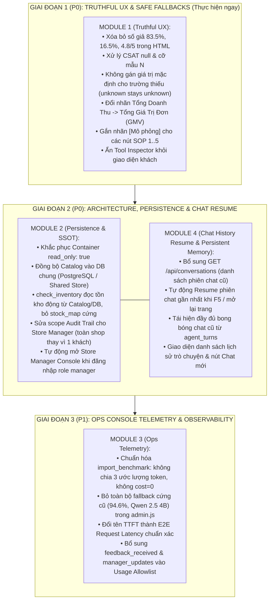

# Lộ Trình Cải Tổ Toàn Diện Giao Diện Quản Trị & Toàn Vẹn Dữ Liệu RetailOps 2026 (Master Remediation Plan)

> **Cơ sở xây dựng**: Tiếp thu toàn diện kết quả kiểm toán kỹ thuật từ chuyên gia (chuỗi kiểm tra UI → API → Application/Store → Persistence → Telemetry → Deployment).  
> **Cam kết chất lượng**: Không dùng số liệu giả, không tự suy diễn token/cost, Single Source of Truth cho Catalog/Kho hàng, bảo vệ biên giới bảo mật của từng vai trò (RBAC).

---

## 1. Bản Đồ Phân Kỳ 3 Giai Đoạn Thực Hiện

---

## 2. Danh Mục Các Tài Liệu Kế Hoạch Thành Phần

Các tài liệu thiết kế và lộ trình chi tiết cho từng giai đoạn được lưu tại:

1. 📄 **[Module 1: Truthful UX, Safe Fallbacks & Role Boundary (P0)](PLAN_FIX_UI_01_TRUTHFUL_UX.md)**
   - Khắc phục giao diện nhanh, giải quyết toàn bộ lỗi hiển thị số giả và thiếu sót về vai trò.
2. 📄 **[Module 2: Store Manager Persistence, Shared Inventory & Audit Scope (P0)](PLAN_FIX_UI_02_MANAGER_PERSISTENCE.md)**
   - Tái cấu trúc cơ chế lưu trữ sản phẩm và tồn kho, loại bỏ sự mất đồng bộ giữa Manager và AI Chatbot.
3. 📄 **[Module 3: Ops Console Observability, Benchmark Importer & Telemetry Integrity (P1)](PLAN_FIX_UI_03_OPSCONSOLE_INTEGRITY.md)**
   - Làm sạch số liệu nghiên cứu, đảm bảo báo cáo khoa học và chỉ số thực nghiệm chuẩn xác 100%.
4. 📄 **[Module 4: Khôi Phục Lịch Sử Chat & Hội Thoại Tiếp Diễn (P0)](PLAN_FIX_UI_04_CHAT_HISTORY_RESUME.md)**
   - Khôi phục phiên chat sau khi F5/mở lại trang, tiếp nối trí nhớ đa lượt cho AI và thêm giao diện lịch sử chat.

---

## 3. Thứ Tự Thực Thi Khuyến Nghị

* **Bước 1**: Triển khai ngay **Module 1 (Truthful UX)**. Bước này an toàn tuyệt đối, không làm thay đổi DB schema, loại bỏ ngay cảm giác "số ảo" cho người dùng khi mở trang web.
* **Bước 2**: Triển khai **Module 2 (Persistence & SSOT)**. Tạo bảng `products` persistent, nối `check_inventory` vào Catalog và mở rộng route Audit cho Manager.
* **Bước 3**: Triển khai **Module 3 (Ops Telemetry)**. Sửa importer và cập nhật giao diện `opsconsole` để phục vụ lấy số liệu thực nghiệm cho Luận văn.
