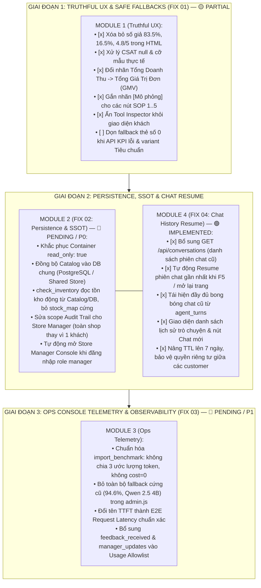

# Lộ Trình Cải Tổ Toàn Diện Giao Diện Quản Trị & Toàn Vẹn Dữ Liệu RetailOps 2026 (Master Remediation Plan)

> **Trạng thái:** SUPERSEDED / HISTORICAL MASTER PLAN (Phase 1 đã hoàn tất 100% qua FIX 01..FIX 04; hiện tại hệ thống đang ở Module 2.5 Quality Gate)
> **Mức độ minh chứng (Evidence):** L1 Automated Tests (`test_conversation_resume.py`, `test_manager_crud.py`, `test_audit_remediation.py`) · L3 Live Deployed
> **Snapshot tham chiếu:** Audit basis `c30ff1d` · Application verified `c30ff1d`
> **Ngày rà soát & đồng bộ:** 2026-10-01
> **Cơ sở xây dựng**: Tiếp thu toàn diện kết quả kiểm toán kỹ thuật từ chuyên gia (chuỗi kiểm tra UI → API → Application/Store → Persistence → Telemetry → Deployment).
> **Cam kết chất lượng**: Không dùng số liệu giả, không tự suy diễn token/cost, Single Source of Truth cho Catalog/Kho hàng, bảo vệ biên giới bảo mật của từng vai trò (RBAC).

---

## 1. Bản Đồ Phân Kỳ 3 Giai Đoạn & Trạng Thái Thực Tế

---

## 2. Danh Mục Các Tài Liệu Kế Hoạch Thành Phần

Các tài liệu thiết kế và lộ trình chi tiết cho từng giai đoạn:

1. 📄 **[Module 1: Truthful UX, Safe Fallbacks & Role Boundary (P0)](PLAN_FIX_UI_01_TRUTHFUL_UX.md)** — 🟡 **PARTIALLY IMPLEMENTED**
   - Đã xóa số liệu giả lập trong HTML, phân quyền Tool Inspector, gắn nhãn mô phỏng. Còn tồn đọng thẻ số 0 khi lỗi và fallback `Tiêu chuẩn`.
2. 📄 **[Module 2: Store Manager Persistence, Shared Inventory & Audit Scope (P0)](PLAN_FIX_UI_02_MANAGER_PERSISTENCE.md)** — 🔴 **PENDING / P0 (ƯU TIÊN SỐ 1)**
   - Tái cấu trúc cơ chế lưu trữ sản phẩm và tồn kho vào PostgreSQL, loại bỏ sự mất đồng bộ giữa Manager và AI Chatbot.
3. 📄 **[Module 3: Ops Console Observability, Benchmark Importer & Telemetry Integrity (P1)](PLAN_FIX_UI_03_OPSCONSOLE_INTEGRITY.md)** — 🔴 **PENDING / P1**
   - Làm sạch số liệu nghiên cứu, loại bỏ phép tính token `len // 3` và cost $0.0 giả lập để bảo đảm báo cáo khoa học chuẩn xác.
4. 📄 **[Module 4: Khôi Phục Lịch Sử Chat & Hội Thoại Tiếp Diễn (P0)](PLAN_FIX_UI_04_CHAT_HISTORY_RESUME.md)** — 🟢 **IMPLEMENTED & VERIFIED**
   - Khôi phục phiên chat sau khi F5/mở lại trang, tiếp nối trí nhớ đa lượt cho AI, thêm sidebar lịch sử chat và kiểm thử tự động đạt 4/4 PASS.

---

## 3. Thứ Tự Thực Thi Khuyến Nghị (Execution Sequence)

* **Hoàn thành**: **Module 4 (Chat History Resume)** đã hoàn thành 100% và được kiểm chứng tự động (`tests/test_conversation_resume.py`).
* **Đang dọn nốt**: **Module 1 (Truthful UX)** đã hoàn tất phần lớn; cần xử lý nốt hiển thị khi API KPI lỗi để đạt 100% acceptance.
* **Bước trọng tâm tiếp theo**: **Module 2 (Persistence & SSOT - P0)**. Tạo bảng `products` persistent trong PostgreSQL, nối `check_inventory` vào Catalog động và mở rộng route Audit toàn shop cho Manager.
* **Bước kế tiếp phục vụ Luận văn**: **Module 3 (Ops Telemetry - P1)**. Sửa importer và cập nhật giao diện `opsconsole` để phục vụ lấy số liệu thực nghiệm khoa học.
