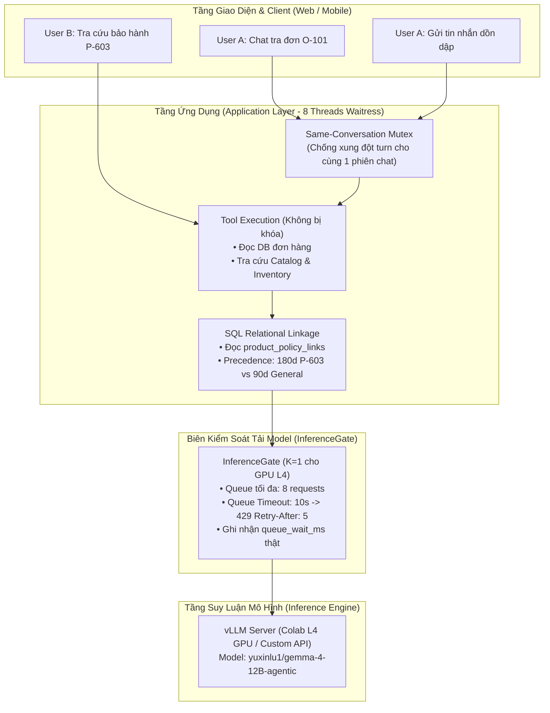

# KẾ HOẠCH GỘP: RUNTIME CONCURRENCY (PHASE 3) & RELATIONAL KNOWLEDGE LINKAGE (PHASE 2)

> **Mã kế hoạch:** `PLAN_CONCURRENCY_RELATIONAL_KNOWLEDGE_SPRINT`  
> **Trạng thái:** ACTIVE IMPLEMENTATION PLAN  
> **Phiên bản:** 1.0 (2026-09-25)  
> **Mục tiêu:** Gộp hai giai đoạn then chốt (Phase 3: Bounded Concurrency & Phase 2: SQL Relational Knowledge) thành một đợt build và triển khai thống nhất trên toàn bộ hệ thống RetailOps 2026.  
> **Cơ sở đối chiếu mã nguồn:** Commit `c6c7a1a` trên nhánh `main` (415/415 tests PASS).

---

## 1. Bối Cảnh & Lý Do Gộp Hai Giai Đoạn

1. **Phase 3 (Bounded Concurrency & InferenceGate):**
   - Trước đây, hệ thống còn tồn dư biến `self.agent_lock` trong `retailops/business/application.py`.
   - Cần hoàn tất chuyển đổi 100% sang `InferenceGate`:
     - Phân định rõ ràng: 8 luồng HTTP của Waitress xử lý I/O không bị block bởi inference.
     - Cổng `InferenceGate` chỉ kiểm soát biên gọi model thật ($K=1$ trên GPU L4, hàng đợi tối đa 8, timeout 10 giây).
     - Tuần tự hóa theo từng hội thoại (`conv_lock`) để chống ghi đè trạng thái khi người dùng gửi tin dồn dập.
2. **Phase 2 (SQL Relational Knowledge & Policy Linkage):**
   - Theo Architectural Decision Record (ADR) trong `docs/PLAN_ROADMAP_INDEX.md`, dự án đã quyết định hoãn cài đặt extension C Apache AGE/Cypher lên máy chủ production EC2.
   - Thay vào đó, áp dụng **SQL Relational Linkage** bằng bảng liên kết `product_policy_links` trên PostgreSQL 16 và SQLite để kết nối trực tiếp:
     $$\text{Khách hàng} \longleftrightarrow \text{Đơn hàng} \longleftrightarrow \text{Sản phẩm} \longleftrightarrow \text{Chính sách áp dụng}$$
   - Giải quyết triệt để vấn đề truy vấn thuộc tính bảo hành (ví dụ: Giày da P-603 bảo hành 180 ngày, ghi đè chính sách 90 ngày chung).
3. **Lợi ích khi gộp một lần build:**
   - Database migration một lần duy nhất lên schema version 5 (đồng bộ SQLite & PostgreSQL).
   - Kiểm thử toàn diện 415+ tests hiện có và bộ test mới trong một chu kỳ CI/CD duy nhất.
   - Tránh việc deploy phân mảnh gây gián đoạn phiên chat của người dùng trên EC2.

---

## 2. Kiến Trúc Kỹ Thuật Chi Tiết

---

## 3. Danh Mục Các Thay Đổi Cụ Thể Trong Mã Nguồn

### 3.1. Phần Concurrency: Dọn Dẹp & Hoàn Thiện `InferenceGate`
- **File:** `retailops/business/application.py`
  - Xóa bỏ `self.agent_lock = threading.Lock()` tại dòng 36.
  - Xóa bỏ kiểm tra tàn dư `if self.agent_lock.locked():` tại dòng 172.
  - Đảm bảo `conv_lock` (khóa hội thoại) và `InferenceGate` (khóa GPU) hoạt động phối hợp:
    1. Yêu cầu vào chat $\rightarrow$ lấy `conv_lock` không block (nếu đang bận tin trước $\rightarrow$ báo ngay 429 `Cuộc trò chuyện này đang xử lý yêu cầu khác`).
    2. Chạy workflow LangGraph, tra cứu DB, chuẩn bị tools $\rightarrow$ hoàn toàn **không tốn slot GPU**.
    3. Khi subagent thực sự gọi `gateway.chat()` $\rightarrow$ `GatedGateway` yêu cầu slot từ `InferenceGate.enter()`.
    4. Slot GPU chỉ bị giữ trong lúc chờ mạng và nhận token từ vLLM, sau đó giải phóng ngay qua `InferenceGate.exit()`.

### 3.2. Phần Relational Knowledge: Bảng `product_policy_links` (HOÃN — DEFERRED / FUTURE ADR)
- **Định vị & Quyết định Kiến trúc:**
  - Qua rà soát code nguồn, bảng `products` trong cả SQLite và PostgreSQL **đã có sẵn cột `warranty_days`**, và module `retailops/business/warranty.py` (với hàm `resolve_warranty_period` đã pass trong `tests/test_policy_precedence.py`) đã giải quyết trọn vẹn yêu cầu bảo hành 180 ngày cho P-603.
  - Do đó, **hoãn triển khai migration v5 và bảng `product_policy_links` ở Module 2.5 hiện tại**.
  - **Giữ nguyên Schema Business ở Version 4 (`BUSINESS_SCHEMA_CURRENT = 4`)** cho cả PR A và PR B.
  - Giữ lại thiết kế DDL `product_policy_links` như một Future ADR cho giai đoạn sau khi cần ánh xạ nâng cao các chính sách đổi hàng, trả hàng, vận chuyển (`return`, `exchange`, `shipping`).

### 3.3. Phần Data Integrity & Lưu Trữ Lịch Sử Chat (F12 & F13)
- **File Store:** `retailops/business/store.py`
  - **F12 FIX (Bảo toàn lịch sử chat)**: Xóa bỏ câu lệnh xóa cứng `DELETE FROM agent_turns ... LIMIT 6` trong `finish_turn()` (dòng 702–704).
  - Giữ nguyên toàn bộ các bản ghi trong `agent_turns` để bảng này lưu trữ lịch sử trọn vẹn của hội thoại, phục vụ resume chat trên web UI và transcript CSKH tại Staff Desk.
  - Chuyển logic giới hạn cửa sổ ngữ cảnh (bounded window 6 lượt) sang hàm `store.history(customer, conversation_id, limit=6)` khi nạp context gửi vào prompt của LLM.
- **File Routes & Application:** `retailops/http/routes.py` & `retailops/identity/persistent.py`
  - **F13 FIX (Đồng bộ vô hiệu hóa Cache theo Tenant Scope)**:
  - Trong môi trường multi-tenant (`PersistentSessions`, `PostgresSessions`), shared `ToolCache` bắt buộc phải được scope theo từng **Tenant** (`member['tenant_id']`), tuyệt đối không dùng global namespace dùng chung giữa các tenant để tránh xung đột `customer_id` (ví dụ: `C-001` của Tenant A và Tenant B).
  - Khi Manager cập nhật trạng thái đơn qua `POST /api/manager/orders/status`, lệnh invalidate áp dụng trên shared `ToolCache` của tenant đó, giúp toàn bộ active sessions trong tenant lập tức nhận dữ liệu mới.

### 3.4. Phần Bảo Mật Xác Thực: Chống OAuth Login CSRF (SEC-01)
- **File Auth & HTTP:** `retailops/http/auth_google.py` & `retailops/http/public.py`
  - **SEC-01 FIX (Ràng buộc State với Browser Session)**:
  - Khi người dùng gửi yêu cầu khởi tạo đăng nhập Google tại `/auth/google/login`:
    - Tạo một giá trị nonce ngẫu nhiên `oauth_browser_nonce` lưu vào cookie `retailops_oauth_transient` (`HttpOnly`, `SameSite=Lax`, `Path=/auth/google`, `Max-Age=600`).
    - Gắn `hashlib.sha256(oauth_browser_nonce).hexdigest()[:16]` vào payload của OAuth `state`.
  - Khi Google chuyển hướng về `/auth/google/callback`:
    - Kiểm tra cookie `retailops_oauth_transient` gửi kèm; đối chiếu băm với thông tin trong `state`.
    - Từ chối ngay lập tức nếu thiếu cookie hoặc không khớp (ngăn chặn tấn công ép đăng nhập tài khoản nạn nhân theo chuẩn RFC 6749 §10.12).
    - Xóa transient cookie sau khi đăng nhập thành công.

---

## 4. Ma Trận Nghiệm Thu (Verification Criteria)

| Mã | Kịch bản kiểm thử | Hành vi kỳ vọng | File kiểm thử |
| :--- | :--- | :--- | :--- |
| **C01** | Bounded Concurrency $K=1$ | 2 client gọi model cùng lúc $\rightarrow$ Request 1 xử lý, Request 2 xếp hàng trong `InferenceGate` với `queue_wait_ms > 0`. | `tests/test_inference_gate.py` |
| **C02** | Hàng đợi quá tải (> 8 requests) | Request thứ 9 bị từ chối ngay với HTTP 429 `model_busy` và header `Retry-After: 5`. | `tests/test_inference_gate.py` |
| **C03** | Chờ hàng đợi quá 10s | Request bị ngắt với HTTP 429 `queue_timeout`, slot không bị rò rỉ. | `tests/test_inference_gate.py` |
| **C04** | Chat cùng 1 phiên dồn dập | `conv_lock` từ chối tin nhắn thứ 2 khi tin thứ 1 chưa hoàn tất turn, bảo toàn checkpoint. | `tests/test_conversation.py` |
| **K01** | Schema Migration v5 | Khởi tạo DB sạch hoặc nâng cấp từ v4 $\rightarrow$ bảng `product_policy_links` được tạo thành công với chỉ mục. | `tests/test_schema_migration.py` |
| **K02** | Tra cứu liên kết P-603 | Gọi `get_product('P-603')` $\rightarrow$ kết quả có `linked_policies` chứa chính sách 180 ngày. | `tests/test_policy_precedence.py` |
| **K03** | Precedence bảo hành | Model trả lời câu hỏi về P-603 nêu đúng 180 ngày và dẫn chứng chính sách, không bịa "12 tháng". | `tests/test_policy_precedence.py` |
| **D01** | Bảo toàn Lịch sử Chat (F12) | Hội thoại qua 7 lượt chat không bị mất lượt đầu tiên trong DB; F5 và API `GET /api/conversations` trả về đủ cả 7 turns. | `tests/test_conversation_resume.py` |
| **D02** | Đồng bộ Cache Manager (F13) | Manager đổi đơn hàng từ `pending` sang `delivered` $\rightarrow$ phiên chat của khách hàng nhận biết trạng thái mới ngay, không dùng cache cũ. | `tests/test_business_api.py` |
| **S01** | OAuth CSRF State Binding (SEC-01) | Callback `/auth/google/callback` thiếu transient cookie hoặc khác browser bị từ chối HTTP 403 `oauth_state_invalid`. | `tests/test_auth_google.py` |
| **K04** | Toàn bộ Regression Suite | Chạy toàn bộ test suites của dự án $\ge 425$ tests đạt **PASS 100%**. | `python -m unittest discover tests` |

---

## 5. Kế Hoạch Triển Khai Từng Bước (Implementation Steps)

1. **Bước 1: Cập nhật Database Schema & Migrations (v5)**
   - Thêm migration `v5` vào `retailops/business/schema.py` và `retailops/storage/pg_schema.py`.
   - Nạp dữ liệu seed cho `product_policy_links` trong `retailops/business/store.py`.
2. **Bước 2: Cập nhật Tool & Subagent Logic**
   - Đính kèm `linked_policies` trong `retailops_tools.py`.
   - Củng cố prompt và hướng dẫn trong `order_agent.py` và `policy_agent.py`.
3. **Bước 3: Dọn dẹp Concurrency, Bảo toàn Chat History & Bảo mật Auth**
   - Gỡ bỏ hoàn toàn `self.agent_lock` trong `retailops/business/application.py`.
   - Bỏ `DELETE LIMIT 6` trong `store.py:finish_turn()`, chuyển giới hạn sang `store.history()`.
   - Bổ sung transient cookie bảo vệ state trong `retailops/http/auth_google.py`.
   - Đảm bảo `GatedGateway` đo đạc đầy đủ telemetry và hiển thị trong trace.
4. **Bước 4: Kiểm thử Tự Động & Đồng Bộ Artifacts**
   - Bổ sung kịch bản kiểm thử mới cho F12, F13, SEC-01 và policy precedence.
   - Đồng bộ `notebooks/colab_agent.ipynb` bằng `scripts/build_agent_notebook.py`.
   - Chạy toàn bộ 425+ tests đảm bảo không có lỗi hồi quy.
5. **Bước 5: Commit, Push & Tự Động Deploy EC2**
   - Commit với thông điệp chuẩn semantic.
   - Đẩy lên `main` và theo dõi GitHub Actions deploy lên máy chủ EC2.
