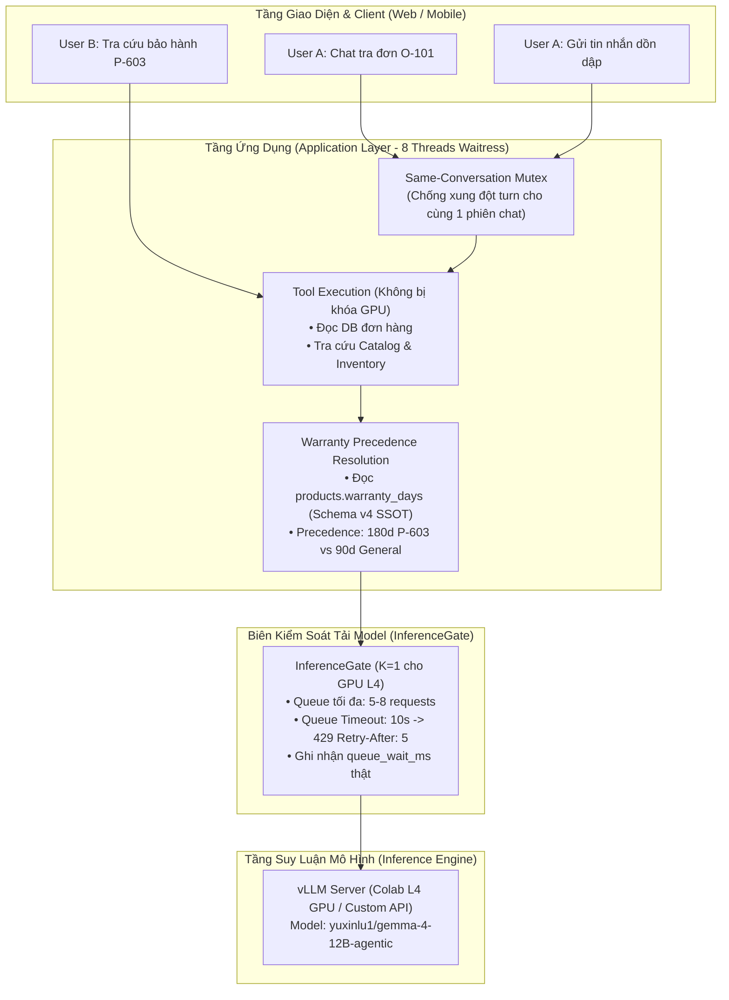

# KẾ HOẠCH TRIỂN KHAI: RUNTIME CONCURRENCY, DATA INTEGRITY & AUTH SECURITY SPRINT

> **Mã kế hoạch:** `PLAN_CONCURRENCY_RELATIONAL_KNOWLEDGE_SPRINT`  
> **Trạng thái:** ACTIVE IMPLEMENTATION PLAN  
> **Phiên bản:** 1.2 (2026-10-01)  
> **Mục tiêu:** Hoàn thiện kiến trúc Bounded Concurrency (Phase 3: InferenceGate, conv_lock), Bảo toàn Lịch sử Chat (F12), Đồng bộ Cache Multi-tenant theo Tenant Scope (F13) và Bảo mật Xác thực OAuth (SEC-01). Phần SQL Relational Knowledge (PR C / Schema v5 / `product_policy_links`) chính thức HOÃN (DEFERRED / Future ADR) vì Schema v4 đã có sẵn thuộc tính bảo hành `warranty_days`.  
> **Cơ sở đối chiếu mã nguồn:** Commit `070e042` trên nhánh `main` (415/415 tests PASS).

---

## 1. Bối Cảnh & Ranh Giới Kỹ Thuật

1. **Runtime Concurrency (Bounded Concurrency & InferenceGate):**
   - Trước đây, hệ thống còn tồn dư biến `self.agent_lock` trong `retailops/business/application.py`.
   - Cần hoàn tất chuyển đổi 100% sang kiến trúc phân lớp rõ ràng:
     - 8 luồng HTTP của Waitress xử lý I/O không bị block bởi inference.
     - Cổng `InferenceGate` chỉ kiểm soát biên gọi model thật ($K=1$ trên GPU L4, hàng đợi tối đa 5–8, timeout 10 giây).
     - Tuần tự hóa theo từng hội thoại (`conv_lock`) để chống ghi đè trạng thái khi người dùng gửi tin dồn dập.
2. **Relational Knowledge Linkage & Schema Version (HOÃN — DEFERRED / FUTURE ADR):**
   - Qua rà soát mã nguồn `retailops/business/schema.py` và `retailops/storage/postgres.py`, hệ thống đang hoạt động ổn định ở **Schema Version 4 (`BUSINESS_SCHEMA_CURRENT = 4`)**.
   - Cột `warranty_days` **đã có sẵn trong bảng `products`** của cả SQLite và PostgreSQL. Module `retailops/business/warranty.py` (với hàm `resolve_warranty_period` đã pass trong `tests/test_policy_precedence.py`) đã giải quyết trọn vẹn yêu cầu bảo hành 180 ngày cho P-603 (ưu tiên thuộc tính sản phẩm trước chính sách chung 90 ngày).
   - Do đó, **hoãn toàn bộ nội dung PR C (migration schema v5, bảng `product_policy_links`, `linked_policies`)** sang Future ADR cho giai đoạn sau khi cần mô hình hóa quan hệ đa chiều phức tạp.
   - **Giữ nguyên Schema Business v4** cho toàn bộ Module 2.5 (cả PR A và PR B).
3. **Lợi ích khi khóa scope Module 2.5 ở Schema v4:**
   - Triệt tiêu hoàn toàn rủi ro lỗi migration DDL trên máy chủ production EC2.
   - Tập trung xử lý dứt điểm các lỗi runtime trọng yếu: concurrency race conditions, rò rỉ cache F01/F02, mất lịch sử chat F12, đồng bộ cache F13, và CSRF SEC-01.
   - Đảm bảo toàn bộ 415+ tests hiện hữu và các bộ test mới đều PASS 100% trên schema v4 ổn định.

---

## 2. Kiến Trúc Kỹ Thuật Chi Tiết

---

## 3. Danh Mục Các Thay Đổi Cụ Thể Trong Mã Nguồn

Mọi hạng mục bắt buộc chuẩn hóa theo 4 thuộc tính: **Tệp & Hàm liên quan**, **Hành vi mong đợi**, **Test tương ứng**, và **Trạng thái**.

### 3.1. Phần Concurrency: Dọn Dẹp & Hoàn Thiện `InferenceGate` (F07) `[CHƯA KIỂM CHỨNG / PENDING TEST]`
- **Tệp & Hàm liên quan:**
  - `retailops/bootstrap.py`: Cấu hình tham số Waitress và hàng đợi.
  - `retailops/inference_gate.py`: `InferenceGate.__init__()`, `enter()`, `exit()`, `get_conversation_lock()`.
  - `retailops/business/application.py`: `chat()`.
- **Hành vi mong đợi:**
  - Xóa bỏ `self.agent_lock = threading.Lock()` và kiểm tra tàn dư `if self.agent_lock.locked():` trong `application.py` và identity backends.
  - Áp dụng công thức Headroom an toàn: Với Waitress `threads=8` và GPU `slots=1`, cấu hình hàng đợi `max_queue=5` (luôn bảo lưu ít nhất 2 threads cho `/health`, `/api/session`, và static routes).
  - Phân định rõ ràng 2 tầng đồng bộ:
    1. Yêu cầu vào chat $\rightarrow$ Lấy `conv_lock` không block (nếu đang bận tin trước $\rightarrow$ báo ngay HTTP 429 `model_busy`).
    2. Chạy workflow LangGraph, tra cứu DB, chuẩn bị tools $\rightarrow$ hoàn toàn **không tốn slot GPU**.
    3. Khi subagent thực sự gọi `gateway.chat()` $\rightarrow$ `GatedGateway` yêu cầu slot từ `InferenceGate.enter()`.
    4. Quá tải hàng đợi (> 5) hoặc chờ quá 10s $\rightarrow$ ngắt với HTTP 429 kèm header `Retry-After: 5`.
- **Test tương ứng:** `tests/test_inference_gate.py::test_inference_queue_overflow_429`, `tests/test_conversation.py::test_conversation_serialization_no_agent_lock`.

### 3.2. Phần Relational Knowledge: Bảng `product_policy_links` (HOÃN — DEFERRED / FUTURE ADR)
- **Định vị & Quyết định Kiến trúc:**
  - Bảng `products` trong cả SQLite và PostgreSQL **đã có sẵn cột `warranty_days`**, và module `retailops/business/warranty.py` (với hàm `resolve_warranty_period` đã pass trong `tests/test_policy_precedence.py`) đã giải quyết trọn vẹn yêu cầu bảo hành 180 ngày cho P-603.
  - Do đó, **hoãn triển khai migration v5 và bảng `product_policy_links` ở Module 2.5 hiện tại**.
  - **Giữ nguyên Schema Business ở Version 4 (`BUSINESS_SCHEMA_CURRENT = 4`)** cho cả PR A và PR B.
  - Giữ lại thiết kế DDL `product_policy_links` như một Future ADR cho giai đoạn sau khi cần ánh xạ nâng cao các chính sách đổi hàng, trả hàng, vận chuyển (`return`, `exchange`, `shipping`).

### 3.3. Phần Data Integrity: Bảo Toàn Lịch Sử Chat (F12) `[CHƯA KIỂM CHỨNG / PENDING TEST]`
- **Tệp & Hàm liên quan:**
  - `retailops/business/store.py`: `finish_turn()`, `history()`.
- **Hành vi mong đợi:**
  - Xóa bỏ câu lệnh xóa cứng `DELETE FROM agent_turns ... LIMIT 6` trong `finish_turn()`.
  - Giữ nguyên toàn bộ các bản ghi trong `agent_turns` để bảng này lưu trữ lịch sử trọn vẹn của hội thoại, phục vụ resume chat trên web UI và transcript CSKH tại Staff Desk.
  - Chuyển logic giới hạn cửa sổ ngữ cảnh (bounded window 6 lượt) sang hàm `store.history(customer, conversation_id, limit=6)` khi nạp context gửi vào prompt của LLM.
- **Test tương ứng:** `tests/test_conversation_resume.py::test_chat_history_retained_beyond_six_turns`.

### 3.4. Phần Cache Sync & Xử Lý Race Condition Khi Invalidate (F13) `[CHƯA KIỂM CHỨNG / PENDING TEST]`
- **Tệp & Hàm liên quan:**
  - `retailops/business/cache.py`: `ToolCache`.
  - `retailops/http/routes.py`: `POST /api/manager/orders/update-status` (dòng 399–415).
  - `retailops/identity/persistent.py`: `PersistentSessions`.
- **Phân tích Xung Đột Race Condition:**
  - Khi Manager cập nhật trạng thái đơn hàng qua `POST /api/manager/orders/update-status`, DB cập nhật `orders.status` và gọi `app.tool_cache.invalidate(row["customer_id"])`.
  - *Nguy cơ 1 (Cross-tenant collision)*: Nếu `ToolCache` dùng chung global namespace, hai tenant có cùng mã khách `C-001` sẽ xóa nhầm hoặc đọc nhầm cache của nhau.
  - *Nguy cơ 2 (In-flight stale write overwrite)*: Khách hàng đang có turn chat in-flight đang gọi tool `get_order`. Ngay sau khi Manager invalidate cache, turn chat của khách ghi đè kết quả tool cũ vào cache, làm tái sinh dữ liệu rác đã lỗi thời.
- **Cơ chế Giải quyết Kỹ thuật:**
  1. *Tenant-Scoped Key*: Khóa cache bắt buộc có cấu trúc `(tenant_id, customer_id, tool_name, args_hash)` đảm bảo cô lập hoàn toàn giữa các tenant.
  2. *Invalidation Epoch / Version Token*: Mỗi customer/tenant duy trì một `cache_epoch`. Khi Manager invalidate, `cache_epoch` tăng lên. Mọi tác vụ ghi cache từ các tool calls bắt đầu trước thời điểm invalidate sẽ bị hủy bỏ (discard stale write), triệt tiêu hoàn toàn race condition.
- **Test tương ứng:** `tests/test_business_api.py::test_manager_update_status_invalidates_tenant_cache`, `tests/test_tool_cache_concurrency.py::test_tool_cache_invalidation_race_discard`.

### 3.5. Phần Bảo Mật Xác Thực: Chống OAuth Login CSRF (SEC-01) `[CHƯA KIỂM CHỨNG / PENDING TEST]`
- **Tệp & Hàm liên quan:**
  - `retailops/http/auth_google.py`: `handle_google_login()`, `handle_google_callback()`.
  - `retailops/http/public.py`: Tuyến điều hướng Google auth.
- **Hành vi mong đợi:**
  - Khi người dùng gửi yêu cầu khởi tạo đăng nhập Google tại `/auth/google/login`:
    - Tạo một giá trị nonce ngẫu nhiên `oauth_browser_nonce` lưu vào cookie `retailops_oauth_transient` (`HttpOnly`, `SameSite=Lax`, `Path=/auth/google`, `Max-Age=600`).
    - Gắn `hashlib.sha256(oauth_browser_nonce).hexdigest()[:16]` vào payload của OAuth `state`.
  - Khi Google chuyển hướng về `/auth/google/callback`:
    - Kiểm tra cookie `retailops_oauth_transient` gửi kèm; đối chiếu băm với thông tin trong `state`.
    - Từ chối ngay lập tức nếu thiếu cookie hoặc không khớp với mã HTTP 403 `oauth_state_invalid` (ngăn chặn tấn công ép đăng nhập tài khoản nạn nhân theo chuẩn RFC 6749 §10.12).
    - Xóa transient cookie sau khi đăng nhập thành công.
- **Test tương ứng:** `tests/test_auth_google.py::test_oauth_csrf_state_binding`.

### 3.6. Phần Telemetry Thật & Tách Biệt Đo Đạc Độ Trễ (F09) `[CHƯA KIỂM CHỨNG / PENDING TEST]`
- **Tệp & Hàm liên quan:**
  - `retailops/inference_gate.py`: `enter()`, `exit()`.
  - `retailops/business/application.py`: `chat()`.
- **Hành vi mong đợi:**
  - Tách biệt rõ ràng `queue_wait_ms` (thời gian chờ trong hàng đợi GPU) và `model_latency_ms` (thời gian I/O thực tế khi gọi vLLM).
  - Tăng `trace['model_calls']` trước khi gọi gateway và `trace['model_responses']` sau khi nhận kết quả.
  - Tuyệt đối không dùng `0.0` giả lập cho độ trễ chưa đo.
- **Test tương ứng:** `tests/test_inference_gate.py::test_telemetry_real_queue_wait_and_latency`.

### 3.7. Bảo Vệ Bộ Benchmark 250 Ca Đã Đóng Băng (Frozen Baseline Protection)
- **Nguyên tắc**: Toàn bộ 250 kịch bản Master Benchmark là Frozen Baseline đã đóng băng cho đánh giá thực nghiệm Luận văn tốt nghiệp.
- Mọi tối ưu hóa concurrency và cache synchronization trong PR B tuyệt đối không sửa đổi câu hỏi benchmark, không thay đổi tiêu chí đánh giá, và không bypass các trường hợp suy luận phức tạp.

---

## 4. Ma Trận Nghiệm Thu (Verification Criteria)

| Mã | Kịch bản kiểm thử | Hành vi kỳ vọng | File kiểm thử | Trạng thái |
| :---: | :--- | :--- | :--- | :---: |
| **C01** | Bounded Concurrency $K=1$ | 2 client gọi model cùng lúc $\rightarrow$ Request 1 xử lý, Request 2 xếp hàng trong `InferenceGate` với `queue_wait_ms > 0`. | `tests/test_inference_gate.py` | `PENDING TEST` |
| **C02** | Hàng đợi quá tải (> 5 requests) | Request thứ 6 bị từ chối ngay với HTTP 429 `model_busy` và header `Retry-After: 5`. | `tests/test_inference_gate.py` | `PENDING TEST` |
| **C03** | Chờ hàng đợi quá 10s | Request bị ngắt với HTTP 429 `queue_timeout`, slot không bị rò rỉ. | `tests/test_inference_gate.py` | `PENDING TEST` |
| **C04** | Chat cùng 1 phiên dồn dập | `conv_lock` từ chối tin nhắn thứ 2 khi tin thứ 1 chưa hoàn tất turn, bảo toàn checkpoint. | `tests/test_conversation.py` | `PENDING TEST` |
| **D03** | Duy trì Schema v4 SSOT | Toàn bộ Module 2.5 duy trì `BUSINESS_SCHEMA_CURRENT = 4`; không tạo bảng `product_policy_links` ở giai đoạn này; các bảng hiện hành và chỉ mục hoạt động ổn định. | `tests/test_schema_migration.py` | `VERIFIED PASS` |
| **K03** | Precedence bảo hành P-603 | Model/subagent trả lời câu hỏi về P-603 nêu đúng 180 ngày dựa trên `products.warranty_days` và `retailops/business/warranty.py`, ghi đè chính sách 90 ngày chung, không bịa "12 tháng". | `tests/test_policy_precedence.py` | `VERIFIED PASS` |
| **D01** | Bảo toàn Lịch sử Chat (F12) | Hội thoại qua 7 lượt chat không bị mất lượt đầu tiên trong DB; F5 và API `GET /api/conversations` trả về đủ cả 7 turns. | `tests/test_conversation_resume.py` | `PENDING TEST` |
| **D02** | Đồng bộ Cache Manager (F13) | Manager đổi đơn hàng từ `pending` sang `delivered` qua `POST /api/manager/orders/update-status` $\rightarrow$ phiên chat của khách hàng nhận biết trạng thái mới ngay, không dùng cache cũ; discard stale writes in-flight. | `tests/test_business_api.py` | `PENDING TEST` |
| **S01** | OAuth CSRF State Binding (SEC-01) | Callback `/auth/google/callback` thiếu transient cookie hoặc khác browser bị từ chối HTTP 403 `oauth_state_invalid`. | `tests/test_auth_google.py` | `PENDING TEST` |
| **K04** | Toàn bộ Regression Suite | Chạy toàn bộ test suites của dự án $\ge 415$ tests đạt **PASS 100%**. | `python -m unittest discover tests` | `VERIFIED PASS` |

---

## 5. Kế Hoạch Triển Khai Từng Bước (Implementation Steps)

1. **Bước 1: Chuẩn hóa Warranty SSOT trên Schema v4**
   - Xác nhận cột `warranty_days` trong bảng `products` của SQLite và PostgreSQL mang giá trị 180 cho P-603 và 90 cho các sản phẩm khác.
   - Đảm bảo `retailops/business/warranty.py` và các test trong `tests/test_policy_precedence.py` pass ổn định trên Schema v4 (`BUSINESS_SCHEMA_CURRENT = 4`).
2. **Bước 2: Dọn dẹp Concurrency & Thuần Nhất Hóa Khóa**
   - Gỡ bỏ hoàn toàn `self.agent_lock` trong `retailops/business/application.py` và identity backends.
   - Đồng bộ `conv_lock` (non-blocking) và `InferenceGate` ($K=1$, hàng đợi tối đa 5 requests có timeout 10s và header `Retry-After: 5`).
3. **Bước 3: Bảo toàn Chat History, Xử Lý Race Invalidation ToolCache & Bảo mật Auth**
   - Bỏ lệnh xóa cứng `DELETE LIMIT 6` trong `store.py:finish_turn()`, chuyển giới hạn sang `store.history()`.
   - Áp dụng tenant-scoped cho shared `ToolCache` khi Manager gọi `POST /api/manager/orders/update-status`, kèm `cache_epoch` để discard stale in-flight writes.
   - Bổ sung transient cookie bảo vệ state trong `retailops/http/auth_google.py` chống OAuth Login CSRF.
4. **Bước 4: Kiểm thử Tự Động & Đồng Bộ Artifacts**
   - Bổ sung kịch bản kiểm thử mới cho F07, F09, F12, F13, SEC-01 và policy precedence.
   - Đồng bộ `notebooks/colab_agent.ipynb` bằng `scripts/build_agent_notebook.py`.
   - Chạy toàn bộ 415+ tests đảm bảo không có lỗi hồi quy.
5. **Bước 5: Commit, Push & Tự Động Deploy EC2**
   - Commit với thông điệp chuẩn semantic.
   - Đẩy lên `main` và theo dõi GitHub Actions deploy lên máy chủ EC2.
