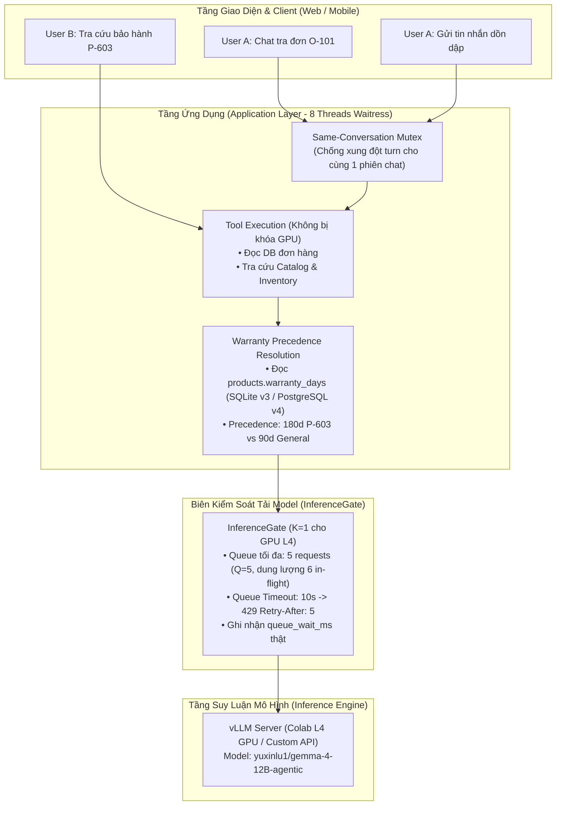

# KẾ HOẠCH TRIỂN KHAI: RUNTIME CONCURRENCY, DATA INTEGRITY & AUTH SECURITY SPRINT

> **Mã kế hoạch:** `PLAN_CONCURRENCY_RELATIONAL_KNOWLEDGE_SPRINT`
> **Trạng thái:** CANONICAL PR B SPEC — implementation waits for PR A/N08 acceptance; current P1.1 gate is documented in `N08_STOPPING_CONDITIONS.md`.
> **Phiên bản:** 1.2 (2026-10-01)
> **Mục tiêu:** Hoàn thiện kiến trúc Bounded Concurrency (Phase 3: InferenceGate, conv_lock), Bảo toàn Lịch sử Chat (F12), Đồng bộ Cache Multi-tenant theo Tenant Scope (F13) và Bảo mật Xác thực OAuth (SEC-01). Phần SQL Relational Knowledge (PR C / Schema v5 / `product_policy_links`) chính thức HOÃN (DEFERRED / Future ADR) vì Schema v4 đã có sẵn thuộc tính bảo hành `warranty_days`.
> **Cơ sở đối chiếu mã nguồn:** Commit baseline `070e042` trên nhánh `main` (kế thừa test suite lịch sử; mục tiêu sau khi hoàn thành PR A và PR B là đạt 415+ tests PASS bao phủ toàn diện các ca mới).

---

## 1. Bối Cảnh & Ranh Giới Kỹ Thuật

1. **Runtime Concurrency (Bounded Concurrency & InferenceGate):**
   - Trước đây, hệ thống còn tồn dư biến `self.agent_lock` trong `retailops/business/application.py`.
   - Cần hoàn tất chuyển đổi 100% sang kiến trúc phân lớp rõ ràng:
     - Admission giới hạn tối đa 6 chat được nhận xử lý đồng thời trên Waitress 8 workers, giảm nguy cơ chat chiếm hết worker; không bảo đảm luôn có hai worker rảnh hoặc một pool riêng.
     - Cổng `InferenceGate` chỉ kiểm soát biên gọi model thật ($K=1$ trên GPU L4, hàng đợi tối đa $Q=5$, dung lượng in-flight tối đa 6 requests, timeout 10 giây).
     - Tuần tự hóa theo từng hội thoại (`conv_lock`) để chống ghi đè trạng thái khi người dùng gửi tin dồn dập.
2. **Relational Knowledge Linkage & Schema Version (HOÃN — DEFERRED / FUTURE ADR):**
   - Phân định rõ ràng phiên bản schema theo từng backend:
     * **SQLite Business Schema:** Phiên bản **3** (hàm `migrate(db, component, initialize)` tại `retailops/schema.py:4, 11` với `component == "business"` đặt `target = 3`; kiểm chứng tại `tests/test_schema_migration.py:48, 65`).
     * **PostgreSQL Business Schema:** Phiên bản **4** (`retailops/storage/postgres.py:8`, `BUSINESS_SCHEMA_CURRENT = 4`; kiểm chứng tại `tests/test_postgres.py`).
   - Cả hai backend đều **đã có sẵn cột `warranty_days` trong bảng `products`** (SQLite `migrate_v3`, PostgreSQL DDL). Module `retailops/business/warranty.py` (với helper `resolve_warranty_period` kiểm thử trong `tests/test_policy_precedence.py`) xử lý logic ưu tiên bảo hành 180 ngày của sản phẩm P-603 trước chính sách chung 90 ngày.
   - **Quyết định đóng băng:** Giữ SQLite Business v3, PostgreSQL Business v4; tuyệt đối không thêm migration DDL trong PR A và PR B.
   - Hoãn toàn bộ nội dung PR C (migration schema v5, bảng `product_policy_links`, `linked_policies`) sang Future ADR cho giai đoạn sau.
3. **Lợi ích khi khóa scope Module 2.5 ở SQLite v3 / PostgreSQL v4:**
   - Triệt tiêu hoàn toàn rủi ro lỗi migration DDL trên máy chủ production EC2.
   - Tập trung xử lý dứt điểm các lỗi runtime trọng yếu: concurrency race conditions, rò rỉ cache F01/F02, mất lịch sử chat F12, đồng bộ cache F13, và CSRF SEC-01.
   - Đảm bảo toàn bộ test suites hiện hữu và các bộ test mới bổ sung (hướng tới target dự kiến 415+ tests sau PR A/B) đều PASS 100% trên schema hiện tại (SQLite v3 / PostgreSQL v4) ổn định.

---

## 2. Kiến Trúc Kỹ Thuật Chi Tiết

---

## 3. Danh Mục Các Thay Đổi Cụ Thể Trong Mã Nguồn

Mọi hạng mục bắt buộc chuẩn hóa theo 4 thuộc tính: **Tệp & Hàm liên quan**, **Hành vi mong đợi**, **Test tương ứng**, và **Trạng thái**.

### 3.1. Phần Concurrency: Dọn Dẹp InferenceGate & Bảo Đảm Headroom Toàn Request (F07) [PARTIAL — TEST PRESENT, COVERAGE/PROTOCOL PENDING]
- **Tệp & Hàm liên quan:**
  - `retailops/bootstrap.py`: Cấu hình tham số Waitress (8 threads) và hàng đợi.
  - `retailops/inference_gate.py`: `InferenceGate.__init__()`, `enter()`, `exit()`, `get_conversation_lock()`.
  - `retailops/business/application.py`: `chat()`.
  - `retailops/http/public.py`: Tuyến điều phối `PublicWeb.route()`, `PublicWeb.__call__()`, và `GET /healthz`.
  - `retailops/http/routes.py`: Tuyến `POST /api/chat`.
- **Hành vi mong đợi:**
  - Xóa bỏ `self.agent_lock = threading.Lock()` và kiểm tra tàn dư `if self.agent_lock.locked():` trong `application.py` và identity backends.
  - **Cơ chế Bảo vệ Headroom Toàn Request Chat (Full-Request Admission Gate - Tier 1 Concurrency)**:
    * `InferenceGate` ($K=1, Q=5$) chỉ kiểm soát biên gọi model I/O. Các request chat đang thao tác DB hoặc thực thi tool ngoài gate vẫn chiếm worker thread của Waitress. Nếu nhiều request chat cùng vào, toàn bộ 8 thread Waitress có thể bị nghẽn trước khi chạm gate!
    * Do đó, bổ sung một **Chat Request Admission Limiter** cấp HTTP tại tầng adapter (`PublicWeb.route()` / `PublicWeb.__call__()`) **TRƯỚC** khi gọi `sessions.resolve(req)` và trước DB preflight:
      $$\text{MAX\_INFLIGHT\_CHAT\_HANDLERS} \le \text{WAITRESS\_THREADS (8)} - \text{RESERVED\_THREADS (2)} = 6$$
    * Token request được acquire không chặn (`blocking=False`) ngay khi vừa nhận request tại adapter; nếu đã có 6 chat requests đang chiếm luồng, request thứ 7 bị từ chối ngay lập tức với HTTP 429 canonical error `server_busy` (kèm header `Retry-After: 5`) mà không động tới DB hay session store, giải phóng token trong khối `finally` của `PublicWeb`.
    * Ngân sách 6 chat requests áp dụng chung cho tổng các provider. **Admission giới hạn tối đa 6 chat được nhận xử lý đồng thời trên Waitress 8 workers, giảm nguy cơ chat chiếm hết worker; không bảo đảm luôn có hai worker rảnh hoặc một pool riêng.**
    * **Mục tiêu nghiệm thu có điều kiện (Conditional Acceptance SLO)**: Trong kịch bản kiểm thử tải có kiểm soát (1 tiến trình / 8 workers, 6 chat request được giữ bằng barrier, có độ trễ DB/tools/model và tài nguyên không cạn), độ trễ P99 của `GET /healthz` và `GET /api/session` đạt $\le 50\text{ms}$. Phân biệt tải bão hòa 6 chat với flood request bị từ chối hoặc DB bị khóa; không suy diễn từ phép trừ $8 - 6$. Phép đo 25 mẫu ghi nhận là worst-of-25, không thay thế SLO P99; test in-process WSGI là non-interference check, không thay thế real Waitress socket load test. Giữ AC-09 PARTIAL chờ phê duyệt tiêu chí/giao thức P99.
  - **Phân định rõ ràng mô hình đồng bộ 3 tầng (3-tier concurrency)**:
    1. *Tầng HTTP Request (Tier 1)*: Bounded Chat Admission Limiter tại `PublicWeb` (trước session/DB preflight; tối đa 6 request đồng thời chiếm thread, non-blocking acquire $\rightarrow$ loser nhận ngay 429 `server_busy` kèm `Retry-After: 5`).
    2. *Tầng Hội thoại (Tier 2)*: `conv_lock` non-blocking theo từng conversation key (bảo vệ replay, snapshot và semantic cache; loser nhận ngay 429 `model_busy`).
    3. *Tầng Model I/O (Tier 3)*: `InferenceGate` cấp permit GPU chỉ trong thời gian gọi model thật ($K=1, Q=5$, chờ quá 30s $\rightarrow$ HTTP 429 canonical `queue_timeout` kèm `Retry-After: 5`).
- **Test tương ứng:** `tests/test_inference_gate.py::test_inference_queue_overflow_429`, `tests/test_conversation.py::test_conversation_serialization_no_agent_lock`, `tests/test_http_headroom.py::test_waitress_real_http_chat_saturation_headroom`. Test cấu hình InferenceGate(concurrency=1, max_queue=5), Chat 0 gọi tool thật và assert `BoundTools.__call__` đã chạy, barrier bão hòa 1+5 giữ liên tục suốt 2 vòng đo (/healthz và /api/session), fail rõ nếu mất tải; kết quả sáu chat trả về HTTP 200 không nuốt lỗi; worst-of-25 <= 50.0ms. Giữ AC-09 PARTIAL.

### 3.2. Phần Relational Knowledge: Bảng `product_policy_links` (HOÃN — DEFERRED / FUTURE ADR)
- **Định vị & Quyết định Kiến trúc:**
  - Bảng `products` trong cả SQLite (v3) và PostgreSQL (v4) **đã có sẵn cột `warranty_days`**, và module `retailops/business/warranty.py` (với helper `resolve_warranty_period` kiểm thử trong `tests/test_policy_precedence.py`) xử lý quy tắc ưu tiên thuộc tính sản phẩm 180 ngày cho P-603.
  - *Lưu ý phạm vi kiểm chứng:* Test `tests/test_policy_precedence.py` là unit test kiểm thử hàm helper với mock dictionary, chưa phải bằng chứng E2E cho hành vi subagent trên dữ liệu live; kịch bản E2E được đánh dấu là PENDING TEST.
  - **Giữ nguyên SQLite Business v3 và PostgreSQL Business v4** cho cả PR A và PR B; không thêm bất kỳ lệnh migration DDL nào.
  - Hoãn bảng `product_policy_links` làm Future ADR cho giai đoạn sau khi cần quan hệ đa chiều phức tạp.

### 3.3. Phần Data Integrity: Bảo Toàn Lịch Sử Chat (F12) `[CHƯA KIỂM CHỨNG / PENDING TEST]`
- **Tệp & Hàm liên quan:**
  - `retailops/business/store.py`: `finish_turn()`, `history()`.
- **Hành vi mong đợi:**
  - Xóa bỏ câu lệnh xóa cứng `DELETE FROM agent_turns ... LIMIT 6` trong `finish_turn()`.
  - Giữ nguyên toàn bộ các bản ghi trong `agent_turns` để bảng này lưu trữ lịch sử trọn vẹn của hội thoại, phục vụ resume chat trên web UI và transcript CSKH tại Staff Desk (`GET /api/conversations/{id}/messages`). Endpoint `GET /api/conversations` trả danh sách phiên.
  - Chuyển logic giới hạn cửa sổ ngữ cảnh (bounded window 6 lượt) sang hàm `store.history(customer, cid)` (API dự kiến mở rộng hỗ trợ tham số `limit=6`) khi nạp context gửi vào prompt của LLM.
- **Test tương ứng:** `tests/test_conversation_resume.py::test_chat_history_retained_beyond_six_turns`.

### 3.4. Phần Cache Sync & Xử Lý Race Condition Khi Invalidate (F13) `[CHƯA KIỂM CHỨNG / PENDING TEST]`
- **Tệp & Hàm liên quan:**
  - `retailops/business/cache.py`: `ToolCache`.
  - `retailops/http/routes.py`: `POST /api/manager/orders/update-status` (dòng 399–415).
  - `retailops/identity/persistent.py`: `PersistentSessions`.
- **Phân tích Xung Đột Race Condition:**
  - Khi Manager cập nhật trạng thái đơn hàng qua `POST /api/manager/orders/update-status`, DB cập nhật `orders.status` và gọi `app.tool_cache.invalidate(row["customer_id"])`.
  - *Nguy cơ 1 (Cross-tenant collision)*: Nếu `ToolCache` dùng chung global namespace, hai tenant có cùng mã khách `C-001` sẽ xóa nhầm hoặc đọc nhầm cache của nhau.
  - *Nguy cơ 2 (In-flight stale write overwrite)*: Khách hàng đang có turn chat in-flight đang gọi tool `get_order`. Ngay sau khi Manager invalidate cache, turn chat của khách ghi đè kết quả tool cũ vào cache, làm tái sinh dữ liệu rác đã lỗi thời.
- **Cơ chế Giải quyết Kỹ thuật:**
  1. *Session-Level Ownership*: `ToolCache` và epoch manager được sở hữu tập trung tại tầng phiên (`PersistentSessions` / `PostgresSessions`), chia sẻ cho các instance `Application` của cùng một tenant (thay vì mỗi `Application` tự tạo instance riêng).
  2. *Tenant-Scoped Key*: Khóa cache bắt buộc có cấu trúc `(tenant_id, customer_id, tool_name, args_hash)` đảm bảo cô lập hoàn toàn giữa các tenant.
  3. *Invalidation Epoch & Compare-and-Set*: Mỗi customer/tenant duy trì một `cache_epoch`. Request đọc chụp lại `current_epoch` trước khi gọi tool. Khi Manager invalidate, `cache_epoch` tăng lên. Khi ghi kết quả tool vào cache, nếu epoch đã thay đổi thì hủy bỏ (discard stale write nguyên tử bên trong `ToolCache._lock`), triệt tiêu race condition.
  4. *Mutation Routes*: Mọi route làm thay đổi trạng thái đơn (`POST /api/manager/orders/update-status` và `POST /api/cancellation-proposals/{id}/confirm`) đều kích hoạt bump epoch và invalidate cache sau khi commit DB thành công.
  5. *Phạm vi*: Đóng gói an toàn trong tiến trình đơn máy chủ (in-process single-node WSGI).
- **Test tương ứng:** `tests/test_business_api.py::test_manager_update_status_invalidates_tenant_cache`, `tests/test_tool_cache_concurrency.py::test_tool_cache_invalidation_race_discard`.

### 3.5. Phần Bảo Mật Xác Thực: Chống OAuth Login CSRF (SEC-01) `[CHƯA KIỂM CHỨNG / PENDING TEST]`
- **Tệp & Hàm liên quan:**
  - `retailops/http/auth_google.py`: Quản lý state OAuth, ký HMAC, verify và atomic consume state.
  - `retailops/http/public.py`: Tuyến điều phối `/auth/google/login` và `/auth/google/callback` trong `PublicWeb.route()`.
- **Hợp đồng Vòng đời State & Bảo vệ Đa Tab (Multi-Tab Safe)**:
  1. *Khởi tạo (`/auth/google/login`)*:
     - Backend sinh chuỗi `oauth_browser_nonce` ngẫu nhiên bảo mật (32 bytes hex).
     - Thiết lập cookie transient: `Set-Cookie: retailops_oauth_transient=<nonce>; Path=/auth/google; Secure; HttpOnly; SameSite=Lax; Max-Age=600`.
     - Tính `nonce_hash = sha256(nonce).hexdigest()[:16]`, đóng gói payload `state` kèm timestamp và ký HMAC SHA256.
     - Nếu người dùng khởi tạo login nhiều lần đồng thời (ví dụ mở Tab A rồi Tab B): Lần login mới nhất sẽ ghi đè cookie transient trước đó (latest login replaces prior; trình duyệt giữ cookie của B).
  2. *Thứ tự Xác minh Nghiêm ngặt tại Callback (`/auth/google/callback`)*:
     - **Bước 1 (Xác minh Chữ ký & Thời hạn)**: Giải mã và xác minh HMAC signature cùng thời hạn state (tối đa 600s). Nếu sai chữ ký hoặc hết hạn $\rightarrow$ Trả ngay HTTP 403 `invalid_oauth_state` (chưa consume state).
     - **Bước 2 (Xác minh Ràng buộc Trình duyệt - Browser Binding)**: Trích xuất cookie `retailops_oauth_transient`, tính `sha256(cookie).hexdigest()[:16]` và so khớp với `nonce_hash` trong state. Nếu thiếu cookie hoặc hash lệch $\rightarrow$ Trả ngay HTTP 403 `invalid_oauth_state`. Nhờ kiểm tra này trước, một callback từ browser khác không thể làm cháy (burn) state hợp lệ của nạn nhân.
     - **Bước 3 (Single-Use Atomic Consume State)**: Thực hiện gọi hàm `consume_state(state)` nguyên tử (atomic compare-and-swap / single-use token pattern). Nếu hai callback đồng thời gửi cùng state, chỉ một request consume thành công đầu tiên được đi tiếp; request thứ hai bị từ chối ngay với HTTP 403 `invalid_oauth_state` (chống replay race).
     - **Bước 4 (Exchange Token với Google)**: Gửi mã `code` lên Google để lấy token và user profile. Nếu Google IDP trả lỗi hoặc kết nối mạng gián đoạn $\rightarrow$ Xóa transient cookie (`Max-Age=0`), trả HTTP 502 `oauth_exchange_failed`.
     - **Bước 5 (Cấp Phiên & Xóa Cookie)**: Tạo phiên đăng nhập thành công và xóa transient cookie (`Set-Cookie: retailops_oauth_transient=; Path=/auth/google; Max-Age=0; Secure; HttpOnly; SameSite=Lax`).
  3. *Xử lý Hủy Bỏ, Thiếu Tham Số & Hợp Đồng Header Phục Vụ Set-Cookie*:
     - **Bảo toàn cookie phiên mới nhất (Multi-Tab Safe)**: Nếu Google trả về `error=access_denied` (người dùng hủy trên Google) hoặc callback thiếu tham số: Chỉ xóa cookie transient khi tham số `state` gửi kèm khớp với cookie hiện tại trong trình duyệt (hoặc cookie đã hết hạn). Nếu user mở Tab A rồi Tab B (cookie đang là B), một callback hủy muộn từ Tab A tuyệt đối KHÔNG được xóa cookie của B!
     - **Cơ chế Trả Set-Cookie Header Khi Lỗi**: Trong `retailops/http/public.py:20–35` (`PublicWeb.__call__`), để cookie cleanup thực sự được gửi tới trình duyệt trên các luồng lỗi, route callback trả về tuple phản hồi chuẩn: `(status, error_body, "text/html; charset=utf-8", [("Set-Cookie", "retailops_oauth_transient=; Path=/auth/google; Max-Age=0; Secure; HttpOnly; SameSite=Lax")])`. Tuyệt đối không redirect mù quáng khi gặp vi phạm bảo mật.
- **Test tương ứng:** `tests/test_auth_google.py::test_oauth_csrf_state_binding`, `tests/test_auth_google.py::test_oauth_tampered_state_rejected`, `tests/test_auth_google.py::test_oauth_expired_state_rejected`, `tests/test_auth_google.py::test_oauth_cookie_cleanup_on_error`.

### 3.6. Phần Telemetry Thật: Từ Gateway Đến Application & Ops Importer (F09) `[CHƯA KIỂM CHỨNG / PENDING TEST]`
- **Tệp & Hàm liên quan:**
  - `retailops/inference_gate.py`: `enter()`, `exit()`.
  - `retailops/business/application.py`: `chat()`.
  - `opsconsole/evaluation.py`: Hàm nhập báo cáo đánh giá benchmark (`import_benchmark:151`, xử lý từng case).
- **Hợp đồng Producer - Consumer Telemetry Xuyên Suốt**:
  1. *Tầng Gateway*: Đo chính xác thời gian chờ hàng đợi (`queue_wait_ms`) và thời gian gọi model thực tế (`provider_inference_ms`).
  2. *Tầng Application (`application.py:273`)*:
     - Tích lũy tổng thời gian inference qua tất cả các vòng lặp model call trong turn ($N \ge 0$ lượt gọi, không quy ước cứng 1 hay 2 lượt).
     - Nếu không gọi model (cache hit): `provider_inference_ms = 0.0`.
     - Tuyệt đối không fallback `provider_inference_ms` về tổng thời gian turn `latency_ms`!
  3. *Tầng Ops Console Importer (`opsconsole/evaluation.py:215`)*:
     - Sửa logic `number(c_trace.get('provider_inference_ms')) or latency_ms` để bảo toàn giá trị `0.0` hợp lệ của cache hit; không gán đè `latency_ms` tổng; giữ nguyên `null`/Unknown khi dữ liệu chưa đo.
  4. *Token & Chi phí*: Nếu model provider không trả usage, giữ nguyên `null`/Unknown kèm cờ `token_usage_available = False`, tuyệt đối không tự tính chia 3 hay gán $0.
- **Test tương ứng:** `tests/test_inference_gate.py::test_telemetry_real_queue_wait_and_latency`, `tests/test_opsconsole_importer.py::test_importer_preserves_zero_inference_latency`.

### 3.7. Bảo Vệ Bộ Benchmark 250 Ca Đã Đóng Băng (Frozen Baseline Protection)
- **Nguyên tắc**: Toàn bộ 250 kịch bản Master Benchmark (`evals/scenarios/master_250_v1.jsonl` và `evals/scenarios/benchmark_250.jsonl` với SHA-256 đã ghim: `36fa8c7a52a60323bb4f04d11f1e677106ddfe6a35e0ccac3266784c7c6e4411`) là Frozen Baseline đã đóng băng cho đánh giá thực nghiệm Luận văn tốt nghiệp.
- Mọi tối ưu hóa concurrency và cache synchronization trong PR B tuyệt đối không sửa đổi câu hỏi benchmark, không thay đổi tiêu chí đánh giá, và không bypass các trường hợp suy luận phức tạp.

---

## 4. Ma Trận Nghiệm Thu (Verification Criteria)

| Mã | Kịch bản kiểm thử | Hành vi kỳ vọng | File kiểm thử | Trạng thái |
| :---: | :--- | :--- | :--- | :---: |
| **C01** | Bounded Concurrency $K=1$ | 2 client gọi model cùng lúc $\rightarrow$ Request 1 xử lý, Request 2 xếp hàng trong `InferenceGate` với `queue_wait_ms > 0`. | `tests/test_inference_gate.py` | `PENDING TEST` |
| **C02** | Hàng đợi quá tải (> 5 requests) | Đã có 1 active + 5 waiters trong queue $\rightarrow$ Request thứ 7 tổng cộng (waiter thứ 6) bị từ chối ngay với HTTP 429 canonical `model_busy` và header `Retry-After: 5`. | `tests/test_inference_gate.py` | `PENDING TEST` |
| **C03** | Chờ hàng đợi quá 10s | Request chờ trong queue quá 10s bị ngắt với HTTP 429 canonical `queue_timeout` (theo đúng `retailops/inference_gate.py:125-128`), slot không bị rò rỉ. | `tests/test_inference_gate.py` | `PENDING TEST` |
| **C04** | Chat cùng 1 phiên dồn dập | `conv_lock` từ chối tin nhắn thứ 2 khi tin thứ 1 chưa hoàn tất turn với HTTP 429 `model_busy`, bảo toàn checkpoint. | `tests/test_conversation.py` | `PENDING TEST` |
| **D03** | Duy trì Business Schema Backend SSOT | Giữ SQLite Business v3 và PostgreSQL Business v4; không thêm Business migration trong PR A/B; cả hai backend có `warranty_days` trong `products`. Identity schema v4 được theo dõi riêng tại N08. | `tests/test_schema_migration.py` (SQLite) `tests/test_postgres.py` (PostgreSQL) | `CI PASS VERIFIED — run 37137791788 on code SHA fe25f67; host 479/479 PASS, container 478 PASS / 1 SKIP, PostgreSQL integration included.` |
| **K03** | Precedence bảo hành P-603 | Helper `resolve_warranty_period` trả đúng 180 ngày cho P-603 ghi đè chính sách 90 ngày chung (kiểm thử unit với mock dict); kịch bản E2E subagent là pending test. | `tests/test_policy_precedence.py` | `VERIFIED UNIT (helper)` |
| **D01** | Bảo toàn Lịch sử Chat (F12) | Hội thoại qua 7 lượt chat không bị xóa cứng trong DB; F5 và API `GET /api/conversations/{id}/messages` trả về đủ transcript các turns. | `tests/test_conversation_resume.py` | `PENDING TEST` |
| **D02** | Đồng bộ Cache Manager (F13) | Manager đổi đơn hàng từ `pending` sang `delivered` qua `POST /api/manager/orders/update-status` $\rightarrow$ phiên chat của khách hàng nhận biết trạng thái mới ngay, không dùng cache cũ; discard stale writes in-flight qua epoch. | `tests/test_business_api.py` | `PENDING TEST` |
| **S01** | OAuth CSRF State Binding (SEC-01) | Callback `/auth/google/callback` thiếu transient cookie hoặc khác browser bị từ chối HTTP 403 `invalid_oauth_state`; xóa cookie an toàn khi state khớp. | `tests/test_auth_google.py` | `PENDING TEST` |
| **K04** | Toàn bộ Regression Suite | Toàn bộ test suites của dự án đạt PASS 100% (kết quả lịch sử 353 tests passed được ghi nhận trong tài liệu repo tại CURRENT_PROJECT_STATUS.md:52–56; target dự kiến 415+ tests khi hoàn tất PR A/B). | `python -m unittest discover tests` | `HISTORICAL RESULT REPORTED (353 tests; see CURRENT_PROJECT_STATUS.md:52-56) / TARGET 415+ PENDING` |

---

## 5. Kế Hoạch Triển Khai Từng Bước (Implementation Steps)

1. **Bước 1: Chuẩn hóa Warranty SSOT trên SQLite v3 & PostgreSQL v4**
   - Xác nhận cột `warranty_days` trong bảng `products` của SQLite (v3) và PostgreSQL (v4) mang giá trị 180 cho P-603 và 90 cho các sản phẩm khác.
   - Đảm bảo `retailops/business/warranty.py` và các test trong `tests/test_policy_precedence.py` pass ổn định mà không cần thêm bất kỳ lệnh migration DDL nào.
2. **Bước 2: Dọn dẹp Concurrency & Thuần Nhất Hóa Khóa**
   - Gỡ bỏ hoàn toàn `self.agent_lock` trong `retailops/business/application.py` và identity backends.
   - Đồng bộ mô hình 3 tầng: Tier 1 (HTTP Chat Admission Limiter tại `PublicWeb`: max 6 in-flight, 429 `server_busy`), Tier 2 (`conv_lock` non-blocking: 429 `model_busy`), Tier 3 (`InferenceGate` $K=1, Q=5$, timeout 10s: 429 `queue_timeout` kèm `Retry-After: 5`).
3. **Bước 3: Bảo toàn Chat History, Xử Lý Race Invalidation ToolCache & Bảo mật Auth**
   - Bỏ lệnh xóa cứng `DELETE LIMIT 6` trong `store.py:finish_turn()`, chuyển giới hạn sang `store.history()`.
   - Áp dụng tenant-scoped cho shared `ToolCache` khi Manager gọi `POST /api/manager/orders/update-status`, kèm `cache_epoch` để discard stale in-flight writes.
   - Bổ sung transient cookie bảo vệ state trong `retailops/http/auth_google.py` chống OAuth Login CSRF, gửi `Set-Cookie: Max-Age=0` trên phản hồi lỗi khi state khớp.
4. **Bước 4: Kiểm thử Tự Động & Đồng Bộ Artifacts**
   - Bổ sung kịch bản kiểm thử mới cho F07, F09, F12, F13, SEC-01 và policy precedence.
   - Đồng bộ `notebooks/colab_agent.ipynb` bằng `scripts/build_agent_notebook.py`.
   - Chạy toàn bộ test suites (hướng tới target dự kiến 415+ tests) đảm bảo không có lỗi hồi quy.
5. **Bước 5: Chuẩn Bị Pull Request & Chạy Hợp Đồng Kiểm Định Tài Liệu**
   - Chạy `python scripts/check_docs_contract.py` đạt kết quả PASS 4/4 cổng kiểm định.
   - Tạo Pull Request theo quy trình chuẩn feature branch $\rightarrow$ PR $\rightarrow$ CI; không tự ý đẩy thẳng `main`.
