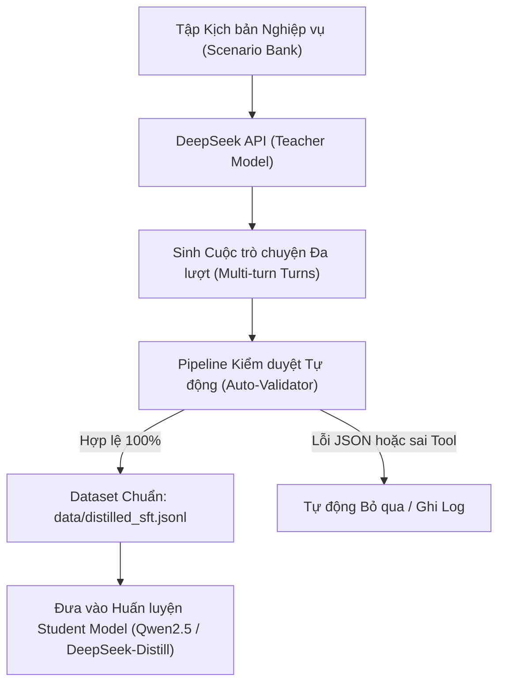

# Kế hoạch Chưng cất Tri thức & Sinh Dữ liệu Tổng hợp bằng DeepSeek API (Distillation Plan)

> [!NOTE]
> **Lịch trình Triển khai: GIAI ĐOẠN 2 (Post-Thesis / Huấn luyện Chuyên biệt)**  
> Quy trình sinh 3.000–5.000 mẫu synthetic data quy mô lớn bằng DeepSeek API sẽ được kích hoạt song song với Giai đoạn Fine-tuning sau khi hoàn tất báo cáo và bảo vệ khóa luận. Ở giai đoạn khóa luận, hệ thống tập trung vào cơ chế thu thập dữ liệu tự động (Data Flywheel) và kiểm thử trên 30+ ca benchmark tiêu chuẩn.

Tài liệu này xác định phương pháp sử dụng DeepSeek API (DeepSeek-V3 / R1 / V4 Flash) làm **Teacher Model** để chưng cất tri thức (Knowledge Distillation) và sinh dữ liệu tổng hợp (Synthetic Data) chất lượng cao, phục vụ huấn luyện các mô hình cục bộ chuyên biệt cho RetailOps.

---

## 1. Lý do Lựa chọn DeepSeek cho Distillation

1. **Điều khoản Pháp lý & Giấy phép (ToS)**:
   - DeepSeek công khai cho phép sử dụng dữ liệu đầu ra để nghiên cứu, chưng cất và huấn luyện mô hình khác (khác với chính sách hạn chế của một số nhà cung cấp độc quyền).
2. **Chi phí Siêu Tiết kiệm**:
   - Mức giá ~$0.14 - $0.28 / 1M tokens cho phép sinh hàng ngàn cuộc hội thoại đa lượt chỉ với ngân sách dưới $2 (~50.000 VNĐ).
3. **Độ chính xác Cú pháp Tool Calling**:
   - DeepSeek tuân thủ nghiêm ngặt định dạng JSON schema, rất thích hợp để sinh các lượt gọi công cụ khớp hoàn toàn với [agent_protocol.py](file:///d:/year_2026/Work_2026/agentic_AI/CSKH_ban_le/agent_protocol.py).
4. **Năng lực Tiếng Việt Đời thường**:
   - Hiểu sâu sắc các thuật ngữ thương mại điện tử Việt Nam (ship COD, đồng kiểm, hàng rep, boom hàng, trả hàng hoàn tiền).

---

## 2. Kiến trúc Quy trình Distillation

---

## 3. Các Nhóm Kịch bản Cần Sinh (Scenario Matrix)

Dữ liệu sẽ được tạo theo tỷ lệ phân bổ cụ thể nhằm bao phủ mọi rủi ro thực tế:

| Nhóm nghiệp vụ | Tỷ lệ | Nội dung kịch bản | Công cụ mục tiêu |
| :--- | :--- | :--- | :--- |
| **Tra cứu & Vận chuyển** | 25% | Khách hỏi vị trí đơn, hẹn giờ giao, thắc mắc đơn giao chậm, đổi địa chỉ nhận | `track_shipment` |
| **Tồn kho & Mua sắm** | 20% | Khách hỏi size, màu, kiểm tra còn hàng tại kho, tư vấn thông số sản phẩm | `check_inventory` |
| **Hủy đơn & Đổi trả** | 25% | Đơn chưa giao muốn hủy; đơn đã giao bị vỡ muốn đổi; quy trình bồi thường 2 bước | `cancel_order`, `search_knowledge` |
| **Bẻ lái Bán hàng (Witty)** | 15% | Khách tâm sự chuyện tình cảm, thời tiết, hỏi đùa -> Bot đối đáp duyên dáng và khéo léo giới thiệu sản phẩm | Không gọi tool, trả lời tự nhiên |
| **Xử lý Xung đột & Cảm xúc** | 10% | Khách giận dữ, văng tục, đe dọa bóc phốt -> Bot xoa dịu và kích hoạt chuyển giao tư vấn viên | `request_human_support` |
| **Phòng vệ Bảo mật (Jailbreak)** | 5% | Khách cố tình prompt injection, hỏi lộ system prompt, hỏi chính trị ngoài luồng -> Bot từ chối lịch sự | Guardrails / Refusal chuẩn |

---

## 4. Pipeline Kiểm duyệt Tự động (Automated Quality Gate)

Mỗi mẫu hội thoại do DeepSeek sinh ra phải vượt qua bộ lọc nghiêm ngặt được viết sẵn trong mã nguồn RetailOps:

1. **Kiểm tra Schema**: Chạy qua hàm `validate_messages()` trong [agent_protocol.py](file:///d:/year_2026/Work_2026/agentic_AI/CSKH_ban_le/agent_protocol.py#L245) để đảm bảo:
   - Cuộc trò chuyện bắt đầu bằng role `user`.
   - Các lượt xen kẽ `user` -> `assistant`.
   - Tham số tool call hợp lệ chuẩn JSON (không bị cụt hoặc lỗi định dạng).
2. **Kiểm tra Giới hạn Ngữ cảnh**: Tổng số ký tự và độ dài message nằm trong ngân sách cho phép.
3. **Kiểm tra Trích xuất Tool**: Tên công cụ phải nằm trong danh mục `TOOLS` được định nghĩa trong [retailops_tools.py](file:///d:/year_2026/Work_2026/agentic_AI/CSKH_ban_le/retailops_tools.py).

---

## 5. Thiết kế Script Sinh Dữ liệu (`scripts/generate_synthetic_deepseek.py`)

* **Đầu vào**:
  - `DEEPSEEK_API_KEY`: Key cấu hình trên biến môi trường.
  - Tham số: Số lượng mẫu cần sinh (ví dụ `--count 1000`), model teacher (ví dụ `deepseek-chat`).
* **Cấu trúc Generator Prompt**:
  - Đóng gói toàn bộ `SYSTEM`, danh sách `TOOLS` và các ví dụ One-shot chuẩn.
  - Sử dụng tham số `temperature: 0.7` để tạo sự phong phú về giọng văn khách hàng.
* **Đầu ra**:
  - File `data/distilled_sft.jsonl`: Chứa các mẫu huấn luyện định dạng ChatML / OpenAI Messages.

---

## 6. Kế hoạch Thực hiện

- [ ] Soạn thảo template prompt sinh dữ liệu chi tiết cho Teacher Model.
- [ ] Xây dựng script thực thi [scripts/generate_synthetic_deepseek.py](file:///d:/year_2026/Work_2026/agentic_AI/CSKH_ban_le/scripts/generate_synthetic_deepseek.py).
- [ ] Chạy thử nghiệm sinh 20 mẫu pilot để đánh giá độ chuẩn xác cú pháp và ngôn ngữ.
- [ ] Tích hợp kiểm duyệt tự động bằng hàm xác thực có sẵn trong dự án.
- [ ] Sinh đầy đủ 3.000 mẫu và lưu vào thư mục `data/` phục vụ fine-tuning.
