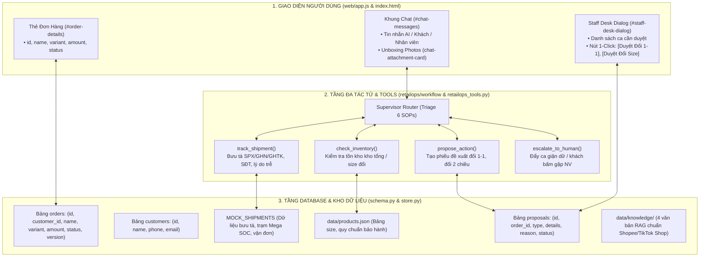

# KẾ HOẠCH CHIẾN LƯỢC TOÀN DIỆN: MODULE 1 — HỆ THỐNG AI ĐA TÁC TỬ CSKH, BẢO HÀNH & XỬ LÝ KHỦNG HOẢNG THƯƠNG MẠI ĐIỆN TỬ (E-COMMERCE OPS COPILOT 2026)

> **Tài liệu Kế hoạch Kỹ thuật Chi tiết cho MODULE 1 trong Master Roadmap 2026**  
> **Phiên bản**: 2.1 (Khớp nối 100% Database Constraints, Giao diện UI & 6 SOP Thực chiến)  
> **Ngành mục tiêu**: Thương Mại Điện Tử (Shopee, TikTok Shop, D2C Brands)  
> **Mục tiêu cốt lõi**: Tự động hóa 80% tác vụ CSKH lặp lại, xử lý 6 kịch bản vận hành thực chiến (SOP 1 - 6), hỗ trợ nhân viên phê duyệt 1-Click và duy trì 260+ tests xanh.

---

## PHẦN 1: BỐI CẢNH NĂM 2026 & VỊ TRÍ TRONG MASTER ROADMAP

Trong chiến lược tổng thể 6 Module của dự án (xem tại [PLAN_ROADMAP_INDEX.md](file:///d:/year_2026/Work_2026/agentic_AI/CSKH_ban_le/docs/PLAN_ROADMAP_INDEX.md)), **MODULE 1** là **Nền tảng Lõi Bắt Buộc** phải hoàn thiện trước tiên:

```
[MODULE 1: HỆ THỐNG LÕI TMĐT 2026] (ĐANG TRIỂN KHAI)
      ↓
[MODULE 2: ĐO BASELINE BENCHMARK]
      ↓
[MODULE 3: WEBHOOK MESSENGER] ➔ [MODULE 4: QUÉT MÃ QR DEMO]
      ↓ (nếu kịp)
[MODULE 5: DEEPSEEK & LORA QWEN] ➔ [MODULE 6: EVALUATION SO SÁNH]
```

---

## PHẦN 2: BẢN ĐỒ KHỚP NỐI KIẾN TRÚC 3 LỚP (ARCHITECTURE MAPPING)

Nhằm đảm bảo dữ liệu sinh ra **khớp hoàn hảo với Database và Giao diện UI**, hệ thống được thiết kế phân tách rõ ràng 3 tầng:



### 2.1. Ràng Buộc Kỹ Thuật Trọng Yếu (Critical Architectural Rules)
1. **Ràng buộc Database `orders.status`**:
   - Trong `retailops/business/schema.py` và `retailops/storage/pg_schema.py`, cột `status` của bảng `orders` bị ràng buộc:
     `CHECK(status IN ('pending', 'delivered', 'cancelled'))`.
   - **Quy tắc**: Tuyệt đối không lưu các trạng thái mở rộng như `in_transit`, `delayed` vào bảng `orders`. Chi tiết logistics sâu sẽ thuộc về đối tượng **Shipment Telemetry** mà công cụ `track_shipment` trả về.
2. **Ràng buộc Giao diện `web/app.js` (`renderOrder`)**:
   - Hàm `renderOrder(order)` yêu cầu đủ 5 trường: `order.id`, `order.name`, `order.variant`, `order.amount`, `order.status`.
3. **Bảo toàn Dữ liệu Kiểm Thử Hồi Quy (Zero Regression Policy)**:
   - Khách `C-001` (chỉ có 2 đơn `O-101`, `O-102`) và sản phẩm `P-101`, `P-102`, `P-202` (chứa `material: null, stock: null`) được giữ nguyên vẹn để 260+ tests có sẵn luôn luôn PASS.
   - Các kịch bản TMĐT mới sẽ chạy trên khách `C-003`, `C-004`, đơn hàng `O-103` đến `O-106`, và sản phẩm `P-103` đến `P-402`.

---

## PHẦN 3: CHI TIẾT 6 QUY TRÌNH VẬN HÀNH CHUẨN THỰC CHIẾN (SOP 1 - 6)

| SOP | Tên Quy Trình | Kịch Bản & Triggers | Cơ Chế Xử Lý Cốt Lõi | Thẩm Quyền |
| :--- | :--- | :--- | :--- | :--- |
| **SOP 1** | Bưu tá "Cập nhật ảo" không giao | Bưu tá báo "không liên lạc được" dù khách ở nhà | Tra cứu bưu tá phụ trách (Tên, SĐT), tự động kích hoạt khiếu nại bưu cục yêu cầu giao lại trong ngày | **AI Tự Động 100%** |
| **SOP 2** | Hàng lỗi / Kẹt khóa / Bung chỉ | Khách nhận hàng lỗi do vận chuyển, gửi ảnh unboxing | Nhận ảnh, kiểm tra hạn bảo hành sản phẩm, tạo **Phiếu Đề Xuất Đổi Mới 1-1 Tận Nhà** đẩy sang Staff Desk | **Nhân viên 1-Click Duyệt** |
| **SOP 3** | Đổi size nhanh tận nhà | Khách mặc không vừa, muốn đổi size | Gọi `check_inventory` kiểm kho, tạo **Phiếu Đổi Size 2 Chiều Tận Nhà** đẩy sang Staff Desk | **Nhân viên 1-Click Duyệt** |
| **SOP 4** | Nghẽn kho phân loại Mega Sale (>48h) | Đơn hàng đứng yên tại trạm Mega SOC > 48h | Giải thích nguyên nhân ùn ứ, tự động cấp **Voucher 50K / Freeship** xoa dịu khách | **AI Tự Động 100%** |
| **SOP 5** | Khách giận dữ cực độ, dọa bóc phốt | Khách chửi bới, dọa đăng TikTok / Facebook | Strict Mode (không đôi co), bắn cảnh báo đỏ, đưa vào hàng đợi ưu tiên cao nhất | **Quản lý / Người Thật Tiếp Quản** |
| **SOP 6** | Khách bấm [🙋 Gặp nhân viên tư vấn] | Khách yêu cầu người thật hoặc click nút UI | Chuyển ngay cho nhân viên nếu rảnh hoặc xếp vào hàng đợi trực tuyến (Queue) | **Nhân viên Tiếp Quản** |

---

## PHẦN 4: KHUÔN MẪU DỮ LIỆU CHUẨN (DATA BLUEPRINT CONTRACTS)

### 4.1. Khách Hàng & Đơn Hàng Mẫu (Store Seed Data)
```json
{
  "customers": [
    { "id": "C-003", "name": "Trần Thị Mai", "phone": "0912345678", "email": "mai.tran@gmail.com" },
    { "id": "C-004", "name": "Lê Hoàng Nam", "phone": "0988776655", "email": "nam.le@gmail.com" }
  ],
  "orders": [
    { "id": "O-103", "customer_id": "C-003", "name": "Áo Sơ Mi Oxford Dài Tay", "variant": "Trắng / Size M", "amount": 350000, "status": "pending", "version": 1 },
    { "id": "O-104", "customer_id": "C-003", "name": "Áo Khoác Gió Bomber 2 Lớp", "variant": "Đen / Size L", "amount": 550000, "status": "delivered", "version": 1 },
    { "id": "O-105", "customer_id": "C-004", "name": "Giày Sneaker Chạy Bộ Ultra", "variant": "Xám / Size 41", "amount": 890000, "status": "delivered", "version": 1 },
    { "id": "O-106", "customer_id": "C-004", "name": "Bộ Nồi Inox 3 Đáy Cao Cấp", "variant": "Bạc / Bộ 3 món", "amount": 1250000, "status": "pending", "version": 1 }
  ]
}
```

### 4.2. Dữ Liệu Vận Đơn Bưu Cục (`retailops_tools.py`)
```python
MOCK_SHIPMENTS = {
    "O-103": {
        "tracking_code": "SPX-VN-992811",
        "carrier": "SPX Express",
        "status": "delivery_failed_virtual",
        "driver": {"name": "Nguyễn Văn Tuấn", "phone": "0934112233", "hub": "Bưu cục Cầu Giấy 2"},
        "last_attempt": "14:30 17/09/2026",
        "system_note": "Khách không nghe máy (Tổng đài ghi nhận không có lịch sử gọi ra)",
        "can_reassign_today": True
    },
    "O-106": {
        "tracking_code": "GHN-HCM-882199",
        "carrier": "GHN",
        "status": "sorting_delayed",
        "current_hub": "Kho Tổng BN Mega SOC",
        "delayed_hours": 54,
        "reason": "Quá tải phân loại Mega Sale 9.9",
        "estimated_delivery": "20/09/2026",
        "eligible_voucher": "VOUCHER_50K_COMPENSATION"
    }
}
```

---

## PHẦN 5: LỘ TRÌNH THỰC THI 4 BƯỚC CỦA MODULE 1

```
[BƯỚC 1: NỀN TẢNG DỮ LIỆU & TOOL GROUNDING] (Ưu tiên số 1)
  ├── 1.1. Bổ sung sản phẩm mới P-103 đến P-402 vào data/products.json (giữ nguyên P-101, P-102, P-202)
  ├── 1.2. Mở rộng 6 kịch bản vận đơn bưu cục O-101 đến O-106 trong retailops_tools.py
  ├── 1.3. Cập nhật seed data khách hàng C-003, C-004 trong retailops/business/store.py
  └── 1.4. Đóng gói 4 văn bản chính sách RAG chuẩn TMĐT vào data/knowledge/
  => Kết quả: Dữ liệu chuẩn được nạp đầy đủ, Agent có thông tin để đọc, 100% test cũ vẫn PASS.

[BƯỚC 2: BỘ NÃO ĐA TÁC TỬ & ĐIỀU PHỐI LANGGRAPH] (Ưu tiên số 2)
  ├── 2.1. Cập nhật từ khóa nhận diện SOP 1, 2, 3, 5, 6 vào retailops/workflow/supervisor.py
  ├── 2.2. Nâng cấp subagents/dispute_agent.py tạo đề xuất cho SOP 2 (đổi 1-1) & SOP 3 (đổi size)
  ├── 2.3. Nâng cấp subagents/order_agent.py kết nối công cụ track_shipment (SOP 1 & SOP 4)
  └── 2.4. Kiểm tra luồng Strict Mode khi phát hiện khách giận dữ (SOP 5)
  => Kết quả: AI Agent nhận diện chính xác 6 kịch bản và phản hồi đúng nghiệp vụ.

[BƯỚC 3: BÀN LÀM VIỆC NHÂN VIÊN & PHÊ DUYỆT 1-CLICK] (Ưu tiên số 3)
  ├── 3.1. Nối đề xuất đổi mới/đổi size từ AI sang màn hình Staff Desk qua /api/staff/proposals
  ├── 3.2. Bổ sung các nút bấm 1-Click: [Duyệt Đổi Mới 1-1], [Duyệt Đổi Size] trên web/app.js
  └── 3.3. Hoàn thiện hàng đợi chờ (Queue) khi khách bấm [🙋 Gặp nhân viên tư vấn] (SOP 6)
  => Kết quả: Nhân viên thao tác 1 chạm, quy trình Human-in-the-Loop hoàn tất trơn tru.

[BƯỚC 4: BỘ KIỂM THỬ TOÀN DIỆN & KỊCH BẢN DEMO ĐỒ ÁN] (Ưu tiên số 4)
  ├── 4.1. Viết bộ kiểm thử tests/test_ecommerce_ops.py bao phủ 6 SOP
  ├── 4.2. Chạy toàn bộ test suite (discover -s tests) bảo đảm 260+ tests xanh 100%
  └── 4.3. Đóng gói kịch bản demo 6 bước chi tiết phục vụ báo cáo và bảo vệ đồ án
  => Kết quả: Hệ thống hoàn chỉnh, sẵn sàng đem đi demo và bảo vệ đạt điểm tối đa.
```
