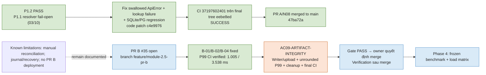

# Bàn giao triển khai Module 2.5 — GPT 6 Astra

Ngày cập nhật trạng thái: **06/10/2026 — Asia/Bangkok**.
Trạng thái hiện tại: PR A/N08 merged `47ba72a`; PR #35 HEAD `8ba66c8`. **AC-09 VERIFIED — P99 & ARTIFACT-INTEGRITY GATES PASSED**. Artifact CI [run 37415015592](https://github.com/tuteemovaixlong/CSKH_ban_le/actions/runs/37415015592), ID `11390129084`: 10 batch × 100 mẫu/endpoint, nearest-rank unrounded P99 `/healthz` **0.999ms**, `/api/session` **3.468ms**, đều $\le 50$ms; 60 chat HTTP 200, mọi batch có tool hook và saturation 1+5; bước kiểm tra độc lập `Validate headroom P99 measurement artifact integrity` PASS; 5/5 check-runs completed/success; dừng trước merge/deploy, sẵn sàng bàn giao owner review merge.
Working snapshot: `feature/module-2.5-pr-b`, candidate `8ba66c8cedafe849ff8377323779366d7b559eff` (`8ba66c8`). Hai workflow CI `37415015592` và Ops Console `37415015585` đều trả `completed/success`. Check/job API có 5/5 `completed/success` (`portable windows-latest`, `portable ubuntu-24.04`, `offline`, `postgres`, `colab-python313`).
Quỹ đạo: PR A/N08 merged → AC09-ARTIFACT-INTEGRITY (DONE) → owner quyết định merge PR #35 → verification sau merge trên main → Phase 4.
Nguồn review hiện hành: <a href="review%20gpt%206%20astra.md">review gpt 6 astra.md</a>; gate còn mở: không còn gate mở (đã đóng [§12.2](#122-trigger-ac09-artifact-integrity)). [N08_STOPPING_CONDITIONS.md](N08_STOPPING_CONDITIONS.md) là hồ sơ lịch sử PR A đã merge.

## 1. Mục đích và ranh giới trạng thái

Mốc **14/14 mục R01–R14** chỉ xác nhận đặc tả tài liệu tại thời điểm trước, không thay thế kiểm chứng runtime. Bằng chứng N08 đã nghiệm thu được lưu tại N08_STOPPING_CONDITIONS.md; phần còn mở hiện tại là AC-09 của PR B.

| Mốc | Trạng thái lúc bàn giao | Điều kiện chuyển |
| --- | --- | --- |
| PLAN_READY_TO_IMPLEMENT | **ĐẠT — mốc lịch sử 01/10/2026** | Các đặc tả A/B đã sẵn sàng tại baseline lúc đó |
| N08_P1_GATES | **VERIFIED** | Local 429 PASS / 50 SKIP; CI 37196429628 trên code patch `c4e9976` (lịch sử) và CI 37197602401 trên final tree `eebe8ed` đều SUCCESS. Run trên fe25f67 là historical. |
| PR_A_ACCEPTED | **MERGED** | PR #34 vào main tại merge commit 47ba72a; CI của candidate PR A xanh |
| PR_B | **AC-09 VERIFIED — READY FOR OWNER MERGE REVIEW** | #35 HEAD `8ba66c8`; CI P99 0.999/3.468ms và artifact integrity đã verified. Check-runs 5/5 completed/success. Dừng trước merge/deploy. |
| IMPLEMENTATION_VERIFIED | Pending | A/B có đủ evidence theo acceptance và backend được hỗ trợ |
| SCIENTIFIC_EVALUATION_COMPLETE | Pending | Có kết quả frozen benchmark và load matrix Phase 4 |

READY chỉ áp dụng cho **Module 2.5 PR A/B**. Các plan nghiên cứu, post-thesis hoặc superseded không được coi là cùng đạt READY chỉ vì file bàn giao này tồn tại.

> **Phân định kế hoạch và thực thi:** Các bằng chứng N08/PR A ở phần này là lịch sử và đã dẫn tới merge PR #34 tại 47ba72a. PR B hiện có implementation candidate trong PR #35; không đánh dấu AC hoàn tất chỉ dựa trên CI xanh nếu test chưa kiểm đúng hợp đồng. Chi tiết review hiện tại ở <a href="review%20gpt%206%20astra.md">review gpt 6 astra.md</a>.

## 2. Baseline đặc tả lịch sử — không phải snapshot candidate hiện tại

- Commit repository tại thời điểm review: **d01f729**.
- Audit basis của mã nguồn trong các plan: **c30ff1d**; các thay đổi PLAN được duyệt vẫn nằm trong working tree, chưa được commit bởi reviewer.
- Do đó, chỉ checkout d01f729 sẽ không tái tạo đầy đủ bản tài liệu vừa được nghiệm thu.
- Trước triển khai, giữ nguyên các sửa hiện có và ghi lại commit/snapshot tài liệu được dùng. Không reset working tree về bản PLAN cũ.
- Bảng dưới là SHA-256 LF-normalized tại mốc duyệt đặc tả trước triển khai, giữ làm hồ sơ lịch sử; không đại diện nội dung docs ngày 05/10/2026, runtime hoặc CI candidate hiện tại.

| Plan nguồn | SHA-256 LF-normalized |
| --- | --- |
| [PLAN_MODULE_2_5_HARDENING_VERIFICATION.md](PLAN_MODULE_2_5_HARDENING_VERIFICATION.md) | `a1b75aa20831415e0618ff8a5f8e20c73af746e280dddff543d9e5b22ddcb1c7` |
| [PLAN_PR_A_CONTEXT_CACHE_DISPUTE.md](PLAN_PR_A_CONTEXT_CACHE_DISPUTE.md) | `3e81ef4ca1d7a4a1eb1a04b63a22d2711b13625224ed4f2c440c70def9e20311` |
| [PLAN_CONCURRENCY_RELATIONAL_KNOWLEDGE_SPRINT.md](PLAN_CONCURRENCY_RELATIONAL_KNOWLEDGE_SPRINT.md) | `635c72dab6ded794811e72c479cbd5c4292ab9c483ef7aefdc78063cc591edcf` |
| [PLAN_RUNTIME_EFFICIENCY_CONCURRENCY.md](PLAN_RUNTIME_EFFICIENCY_CONCURRENCY.md) | `015ea07717a3910c7b41677144587fa28fa86a9b41f22c368c5ae23a29a92aa5` |
| [PLAN_RBAC_GOOGLE_AUTH.md](PLAN_RBAC_GOOGLE_AUTH.md) | Chưa ghi hash trong baseline này |
| [PLAN_ROADMAP_INDEX.md](PLAN_ROADMAP_INDEX.md) | `68fedff82e255dd12d29f222937ecb8eca5a4ca5896caf87673dde9a983a74be` |

Nếu một plan nguồn thay đổi về hợp đồng, cập nhật phạm vi review của thay đổi đó; không tiếp tục gắn READY cho một phiên bản khác mà chưa kiểm tra. Những chỉnh câu chữ không đổi hợp đồng phải được ghi nhận rõ để phân biệt với snapshot trên.

## 3. Tài liệu dùng khi triển khai

| Nội dung | Nguồn áp dụng |
| --- | --- |
| Correctness, cache/provenance, dispute, truthful wording | [PR A](PLAN_PR_A_CONTEXT_CACHE_DISPUTE.md) |
| Acceptance tổng Module 2.5 | [Hardening & Verification](PLAN_MODULE_2_5_HARDENING_VERIFICATION.md) |
| Runtime, admission, gate và telemetry | [Runtime](PLAN_RUNTIME_EFFICIENCY_CONCURRENCY.md), [Sprint](PLAN_CONCURRENCY_RELATIONAL_KNOWLEDGE_SPRINT.md) |
| OAuth/RBAC | [RBAC Google Auth](PLAN_RBAC_GOOGLE_AUTH.md) |
| DB history so với prompt/UI transcript | [FIX04](PLAN_FIX_UI_04_CHAT_HISTORY_RESUME.md) |
| Thứ tự giai đoạn | [Roadmap](PLAN_ROADMAP_INDEX.md) |
| Frozen benchmark | [Evaluation Framework](PLAN_DEEPSEEK_EVAL_FRAMEWORK.md) |

Các tài liệu có nhãn superseded/post-thesis chỉ làm bối cảnh. Câu headroom cũ tại Production Scaling:26 không được dùng thay đặc tả admission hiện hành. Ghi chú P3 đó có thể dọn riêng mà không đổi kiến trúc A/B.

## 4. Phạm vi 13 hạng mục và trách nhiệm PR

| PR | Mã | Kết quả cần đạt |
| --- | --- | --- |
| A | F01 | Cache fail-closed theo query, context, lịch sử và provenance |
| A | F02 | Replay/snapshot/cache commit được serialize đúng |
| A | F03 | Lỗi hạ tầng được chuẩn hóa và propagate, không biến thành thành công giả |
| A | F04 | Proposal hủy chỉ được tạo khi đơn và eligibility hợp lệ |
| A | F05 | Đơn explicit mới quyết định product context |
| A | F06 | Xử lý chính xác size/color và bốn trạng thái tồn kho |
| A | F08a | Bot/UI không tuyên bố đã thực hiện giao dịch chưa tồn tại |
| A | F11 | Catalog thiếu category không làm crash tìm kiếm |
| B | F07 | Admission HTTP, conv_lock và InferenceGate đúng vai trò |
| B | F09 | Telemetry thật xuyên gateway → Application → Ops importer |
| B | F12 | Giữ lịch sử DB vượt 6 lượt, prompt vẫn bounded |
| B | F13 | Shared ToolCache theo tenant/customer, invalidation epoch/CAS |
| B | SEC-01 | OAuth browser binding, atomic consume, cleanup/error headers |

**Ngoài scope:** PR C/product_policy_links, migration DDL mới, durable exchange F08b, transcript pagination Phase 5–6, ASGI, horizontal scaling, GraphRAG production và fine-tuning. Giữ SQLite Business v3 / PostgreSQL Business v4.

## 5. PR A/N08 — trạng thái nghiệm thu

Bản vá (code patch `c4e9976`) xử lý hai đường fail-open trong IdentityStore.resolve(): ApiError được re-raise, lỗi truy vấn safety được log nội bộ và trả 503 collision_unresolved. Local full suite xác nhận 479 tests: 429 PASS, 50 SKIP, 0 FAIL/ERROR (50 tests SKIP gồm 36 test_postgres, 11 test_rag_chat, 2 test_knowledge, 1 test_public_web do thiếu PostgreSQL local DSN/Waitress).

Role regression đã bao phủ toàn bộ staff, manager và viewer trong shared harness; SQLite có bằng chứng local pass (56/56 PR A). Bằng chứng CI:

- **Final tree:** CI run 37197602401, head_sha `eebe8ed` (eebe8edefd52abb1af86e9e8bdf2173413c25fd1), SUCCESS — host suite 479/479 PASS (0 SKIP); container suite 478 PASS / 1 SKIP (`test_colab_agent_notebook_sync` bỏ qua do không có `scripts/build_agent_notebook.py` trong image).
- **Code patch (lịch sử):** CI run 37196429628 trên `c4e9976`, SUCCESS với cùng test counts.

**PR A/N08 merged `47ba72a`.** PR #35 HEAD `8ba66c8`; **AC-09 VERIFIED — P99 & ARTIFACT-INTEGRITY GATES PASSED**. Artifact CI [run 37415015592](https://github.com/tuteemovaixlong/CSKH_ban_le/actions/runs/37415015592), ID `11390129084`: 10 batch × 100 mẫu/endpoint, nearest-rank P99 unrounded float đạt SLO $\le 50$ms; 60 chat HTTP 200, mọi batch có tool hook và saturation 1+5; bước kiểm tra độc lập `Validate headroom P99 measurement artifact integrity` PASS; 5/5 check-runs completed/success. Trigger §12.2 đã hoàn tất; dừng trước merge/deploy, sẵn sàng bàn giao owner review merge.

### Các hợp đồng PR A phải giữ

- FAQ dùng fullmatch; có attachment, context động, lịch sử cũ hoặc dữ liệu lịch sử chưa xác minh thì bypass.
- Helper `has_turns(customer, cid)` là thay đổi dự kiến; phải đọc dữ liệu thật với đúng customer/conversation scope dưới lock.
- Ghi `eligibility_before_turn` một lần trước thực thi, dùng cho lookup và store; không tính lại bằng cách đếm cả turn vừa commit.
- Provenance counter thuộc PR A, tính cả read tools/tool-cache hits/human-support; thiếu trace không được hiểu là zero tool.
- Replay #1 read-only; Replay #2 và reload snapshot dưới conv_lock; cache-hit finish_turn cũng dưới lock.
- Request thua conv_lock không commit; retry có context/revision đổi trả 409 theo checkpoint contract.
- HTTP 429 và lỗi hạ tầng từ tool/worker phải đi ra đúng boundary, không trở thành “đã ghi nhận” hoặc “không tìm thấy” giả.
- F04/F05/F06 dựa trên kết quả tool và bản ghi đơn thực; giữ variant_not_found/stock_unknown/zero/positive riêng.
- F08a chỉ sửa hành vi/ngôn từ phù hợp backend có thật; không ngầm triển khai F08b.
- F11 tìm kiếm an toàn khi category thiếu/null.

**Điều kiện xong A:** Các scenario và regression liên quan đạt, không sửa frozen benchmark, có diff và log chứng minh hành vi mới. Không gọi A hoàn tất chỉ vì file test đã được tạo.

## 6. PR B: Triển khai trên kết quả A đã kiểm chứng

### 6.1. Admission, lock và gate

- Admission chung cho các provider đặt trước body/session/DB ở PublicWeb; max 6 chat được nhận trên một tiến trình Waitress 8 workers.
- Non-blocking acquire; token tồn tại suốt handler và release trong finally, kể cả lỗi/early return.
- conv_lock bảo vệ từng conversation; InferenceGate chỉ giữ permit trong lúc gọi model thực.
- Dọn agent_lock ở Application và session backends sau khi các cơ chế thay thế được kiểm tra.
- K=1/Q=5, queue timeout 10 giây; model/tool loops không giữ GPU permit khi chỉ chạy tool.

| Trường hợp kiểm thử | Kết quả bắt buộc |
| --- | --- |
| HTTP admission đã nhận 6 chat | Request tiếp theo nhận 429 server_busy, không vào DB/session |
| Cùng conversation đang xử lý | 429 model_busy, không tạo thêm turn commit |
| Model queue đủ 1 active + 5 waiters | Gate từ chối thêm bằng 429 model_busy |
| Queue chờ quá hạn | 429 queue_timeout, không rò slot |
| Handler/model/tool phát sinh lỗi | Lock/token/permit được trả đúng phạm vi |

Kiểm tra Retry-After: 5 trên HTTP response theo hợp đồng overload. Gate overflow có thể kiểm tra trực tiếp ở cấp gate; HTTP admission có thể chặn request trước khi nó tới gate.

**Load test headroom:** Chạy Waitress thật với 8 workers, 6 chat được giữ bằng barrier và mô phỏng DB/tools/model chậm. Ghi vị trí client, số mẫu, thời lượng, cấu hình và trạng thái DB/tài nguyên. Đo P99 health/session ≤50 ms trong điều kiện kế hoạch; không coi đó là bảo đảm dưới flood reject hoặc khóa DB toàn cục.

### 6.2. History và cache consistency

- Bỏ prune cứng agent_turns theo LIMIT 6; giữ transcript/feedback liên quan.
- Prompt vẫn dùng cửa sổ lịch sử bounded qua store.history; pagination chưa thuộc B.
- ToolCache/epoch được chia sẻ ở session layer theo tenant, không mỗi Application một cache riêng.
- Key có tenant/customer/tool/arguments; chụp epoch trước read, compare-and-set khi ghi dưới khóa.
- Mutation order status hoặc confirm cancellation bump epoch/invalidate sau commit thành công.
- Test hai tenant trùng customer ID, nhiều Application cùng tenant và stale in-flight write sau invalidation.
- Bảo đảm phạm vi một tiến trình; không tự suy ra cache nhất quán giữa nhiều pod.

### 6.3. OAuth

- TTL 600s; cookie transient đúng Path=/auth/google, Secure, HttpOnly, SameSite=Lax.
- Verify chữ ký/TTL → browser binding → atomic consume → exchange → issue session/cleanup.
- Hai callback đồng thời chỉ một request consume/exchange; callback sai browser không burn state hợp lệ.
- Test A login → B login → callback hủy muộn của A → callback B; cookie B không bị xóa bởi callback A.
- Test HTTP response Set-Cookie trên lỗi/cleanup, không chỉ kiểm tra trạng thái bên trong.
- Tuple response phải giữ headers; body/mime phù hợp PublicWeb serializer.
- Không đổi ma trận RBAC hoặc owner scope ngoài đặc tả đã chốt.

### 6.4. Telemetry

- Đo bằng clock monotonic; tách queue_wait_ms, provider_inference_ms và E2E latency.
- Tổng hợp N model calls thực tế; không mặc định mọi turn có một hoặc hai call.
- Cache-hit/no model có inference time 0.0; giá trị chưa đo hoặc provider thiếu usage giữ null/Unknown.
- Ops importer không dùng phép fallback làm 0.0 biến thành latency tổng.
- Test timeout, provider error, cache hit và nhiều vòng tool/model; kiểm tra cả producer lẫn importer.

## 7. Lệnh kiểm tra và bằng chứng

Các lệnh dưới đây phục vụ lượt implementation; **chưa chạy toàn bộ trong đợt review plan này**. Chạy với cấu hình test phù hợp repository, DB kiểm thử riêng và ghi rõ backend.

```powershell
python -B -X utf8 scripts/check_docs_contract.py
python -B -X utf8 scripts/check_eval_dataset.py
python -B -X utf8 scripts/build_agent_notebook.py --check
python -B -X utf8 scripts/check_deployment_contract.py
python -B -m unittest discover -s tests -v
git diff --check
```

Sau khi tạo suite A:

```powershell
python -B -m unittest discover -s tests -p "test_pr_a_correctness.py" -v
```

Theo [CI hiện có](../.github/workflows/ci.yml), cần kiểm tra cả môi trường và integration backend được repository hỗ trợ. Nếu test PostgreSQL skip do thiếu RETAILOPS_TEST_DATABASE_URL, ghi rõ **SKIPPED / INTEGRATION PENDING**; không quy thành PASS PostgreSQL.

Mỗi PR lưu:

| Trường evidence | Nội dung |
| --- | --- |
| Baseline và candidate | Commit SHA và snapshot plan áp dụng |
| Phạm vi | Finding/acceptance nào được kiểm chứng |
| Môi trường | Python, backend, worker/gate settings; phiên bản provider/model nếu dùng |
| Thực thi | Lệnh, thời điểm, run ID hoặc đường dẫn log |
| Kết quả | Passed/failed/skipped, lý do skip; không chỉ số tổng |
| Race/concurrency | Cách điều khiển barrier, mã lỗi/header, trạng thái DB/cache sau race |
| Telemetry/benchmark | Cấu hình, raw results, metric definition, trạng thái cold/warm cache |

**353** là kết quả lịch sử được tài liệu repo báo cáo; **415+** là target dự kiến. Không dùng hai số này làm bằng chứng candidate đã PASS, và không viết test chỉ để đạt số lượng.

## 8. Điều kiện nghiệm thu implementation và chuyển Phase 4

Chỉ ghi IMPLEMENTATION_VERIFIED khi:

- 13 hạng mục có mapping tới thay đổi, test và kết quả thực thi.
- Suite A và acceptance B bắt buộc đạt; regression/CI không có lỗi chưa xử lý trong phạm vi thay đổi.
- Có bằng chứng SQLite và PostgreSQL phù hợp với backend được tuyên bố hỗ trợ; những phần chưa chạy được ghi pending, không nâng nhãn.
- Không còn lỗi truthfulness, race/cache isolation hoặc OAuth theo các ca đã đặc tả.
- Docs/contracts/notebook đồng bộ; frozen hashes không đổi.
- Changelog/evidence ghi rõ hạn chế và deferred scope.

Sau đó chuyển Phase 4:

1. Đánh giá frozen 250 ca theo [Evaluation Framework](PLAN_DEEPSEEK_EVAL_FRAMEWORK.md).
2. Chạy load matrix concurrency 1/2/4/8/16; đo latency/throughput/429/fairness theo thiết kế.
3. Cố định model/provider/config, tách cold/warm cache và lưu raw results trước khi viết bảng số liệu luận văn.
4. Mọi dataset candidate mới đi ra tệp khác; không sửa master hoặc benchmark mirror để tăng điểm.

Hash LF-normalized của cả hai bộ frozen:
`36fa8c7a52a60323bb4f04d11f1e677106ddfe6a35e0ccac3266784c7c6e4411`.

## 9. Sau khi hoàn thành A/B và các giai đoạn tiếp theo

- Nếu A/B đã có evidence nhưng benchmark chưa chạy, báo rõ implementation đã kiểm chứng, scientific evaluation còn pending.
- Khi Phase 4 hoàn thành, tổng hợp kết quả thực nghiệm và giới hạn; chuyển Phase 5 Omnichannel/demo theo roadmap.
- Phase 6, PR C và F08b cần scope/ADR riêng trước khi thực hiện; không tự thêm vào PR A/B.
- Khi kết thúc một giai đoạn, cập nhật trạng thái bằng commit/run và kết quả có thật, không thay nhãn hàng loạt dựa vào lời báo cáo.
- File này là bàn giao tại mốc kết thúc sửa plan. Báo cáo hoàn thành implementation sau này phải được bổ sung bằng bằng chứng của lần triển khai thực.

## 10. Việc nên làm ngay

1. PR A/N08 đã merged vào main tại 47ba72a.
2. PR #35 đang mở trên nhánh `feature/module-2.5-pr-b`.
3. Review candidate `8ba66c8`: Artifact CI [run 37415015592](https://github.com/tuteemovaixlong/CSKH_ban_le/actions/runs/37415015592), ID `11390129084`: 10 batch × 100 mẫu/endpoint, nearest-rank P99 unrounded float `/healthz` **0.999ms**, `/api/session` **3.468ms**, đều $\le 50$ms; 60 chat HTTP 200, mọi batch có tool hook và saturation 1+5. Artifact mang synthetic merge SHA `2ac01ee9ac73974ec7f6cd2a9970efa5266c2a58`, có parents `47ba72a` và `8ba66c8`, Git tree trùng khớp 100% với candidate `8ba66c8`. Local focused suite 6 PASS / 0 SKIP / 0 FAIL / 0 ERROR (18.5s).
4. **AC-09 VERIFIED — P99 & ARTIFACT-INTEGRITY GATES PASSED**. Runtime timeout **10s**, fixture **30s**. Lỗi fail-open artifact writer/uploader, assertion làm tròn và setup cleanup đã được đóng dứt điểm với 3 regression tests.
5. Trigger [§12.2](#122-trigger-ac09-artifact-integrity) đã hoàn thành, CI và artifact integrity candidate cuối đã verified 5/5 check runs xanh. Sẵn sàng bàn giao owner quyết định merge PR #35 → verification sau merge → Phase 4; dừng trước merge/deploy, không mở rộng audit.
## 11. Sơ đồ Mermaid tổng thể: request, cache, concurrency và OAuth

### 11.1. Tình hình dự án hiện tại

Trạng thái trên `feature/module-2.5-pr-b`: PR A/N08 merged; PR B/#35 **AC-09 VERIFIED — P99 & ARTIFACT-INTEGRITY GATES PASSED**. N08_STOPPING_CONDITIONS.md là hồ sơ PR A, không phải gate PR B.



### 11.2. Kiến trúc đích sau khi tích hợp PR A và PR B

Màu xanh lá biểu thị phần PR A/N08 đã merge; xanh dương là PR B đang được review; màu cam là điểm ghép; màu đỏ là fail-closed hoặc lỗi HTTP. Sơ đồ thể hiện kiến trúc candidate, không thay thế bằng chứng nghiệm thu.


~~~mermaid
flowchart LR
    Client["Client / Browser"] --> HTTP["HTTP request"]
    HTTP --> Admission["Tier 1 — HTTP Admission<br/>max 6 accepted chat / Waitress 8"]
    Admission -->|"full: 429 server_busy<br/>Retry-After: 5"| EAdmission["Reject early<br/>no DB / session"]
    Admission -->|"admitted"| Session["Session resolve<br/>customer / tenant binding"]
    Session --> ConvLock["Tier 2 — conv_lock<br/>per conversation, non-blocking"]
    ConvLock -->|"busy: 429 model_busy"| EConv["Reject turn<br/>no commit"]
    ConvLock --> Replay["Replay #2 under lock"]
    Replay -->|"hit"| Response["HTTP response"]
    Replay -->|"miss"| Snapshot["Reload snapshot + verify history<br/>under conv_lock"]
    Snapshot --> Eligibility{"Fail-closed cache eligibility"}
    Eligibility -->|"false: context / history unknown / attachment / non-FAQ"| Workflow["Workflow checkpoint"]
    Eligibility -->|"true: static FAQ + empty history verified"| Semantic["Semantic Cache<br/>lookup under conv_lock<br/>epoch/CAS: GAP in plans"]
    Semantic -->|"hit"| SemanticCommit["finish_turn under conv_lock"]
    SemanticCommit --> Response
    Semantic -->|"miss"| Workflow
    Workflow --> Gate["Tier 3 — InferenceGate<br/>K=1, Q=5"]
    Gate -->|"queue full: 429 model_busy<br/>Retry-After: 5"| EGate["Reject / release permit"]
    Gate -->|"wait > 10s: 429 queue_timeout<br/>Retry-After: 5"| ETimeout["Timeout / release permit"]
    Gate -->|"permit"| Model["Model call<br/>provider_inference_ms"]
    Model --> ToolExec["Tool execution<br/>zero GPU permit while tools run"]
    ToolExec --> ToolCache["ToolCache<br/>tenant + customer scoped"]
    ToolCache -->|"hit"| ToolResult["Tool result"]
    ToolCache -->|"miss"| ToolCall["Read tool / DB call"]
    ToolCall --> ToolResult
    ToolResult -->|"next model call, if any"| Gate
    ToolResult --> Provenance{"Response provenance"}
    Provenance -->|"unknown trace / tool / RAG / source / dynamic context"| NoStore["Fail-closed<br/>do not store Semantic Cache"]
    Provenance -->|"verified zero tools, zero RAG, zero sources"| Finish["finish_turn + telemetry"]
    NoStore --> Finish
    Finish --> Response

    Manager["Manager mutation route<br/>update-status / cancellation confirm"] --> Epoch["Increment cache_epoch<br/>after DB commit"]
    Epoch --> ToolCache
    Epoch -. "stale in-flight write discarded by CAS" .-> NoStore

    subgraph OAuth["OAuth Login CSRF protection — SEC-01 / PR B"]
        OAuthLogin["/auth/google/login<br/>nonce + transient cookie"] --> Verify["Verify HMAC + TTL 600s"]
        Verify -->|"invalid / expired: 403 invalid_oauth_state"| OVerifyErr["Fail closed"]
        Verify --> Binding["Verify browser cookie binding"]
        Binding -->|"missing / mismatch: 403 invalid_oauth_state"| OBindingErr["Fail closed"]
        Binding --> Consume["Atomic single-use consume"]
        Consume -->|"replay / race loser: 403 invalid_oauth_state"| OConsumeErr["Fail closed"]
        Consume --> Exchange["Exchange code with Google"]
        Exchange -->|"upstream failure: 502 oauth_exchange_failed"| OExchangeErr["Cleanup Set-Cookie"]
        Exchange --> Issue["Issue session + cleanup transient cookie"]
        Issue --> Session
    end

    classDef prA fill:#e8f5e9,stroke:#2e7d32,stroke-width:2px,color:#1b5e20;
    classDef prB fill:#e3f2fd,stroke:#1565c0,stroke-width:2px,color:#0d47a1;
    classDef cross fill:#fff3e0,stroke:#ef6c00,stroke-width:2px,color:#e65100;
    classDef cache fill:#f3e5f5,stroke:#6a1b9a,stroke-width:2px,color:#4a148c;
    classDef fail fill:#fff8e1,stroke:#f9a825,stroke-width:2px,color:#6d4c00;
    classDef error fill:#ffebee,stroke:#c62828,stroke-width:2px,color:#b71c1c;
    classDef oauth fill:#e0f7fa,stroke:#00838f,stroke-width:2px,color:#006064;

    class HTTP,Admission,EAdmission,Gate,EGate,ETimeout,ToolCache,ToolCall,Manager,Epoch prB;
    class ConvLock,Session,Model,Response,Finish cross;
    class Replay,Snapshot,Eligibility,Workflow,Provenance,SemanticCommit,NoStore prA;
    class Semantic,ToolResult cache;
    class OAuthLogin,Verify,Binding,Consume,Exchange,Issue oauth;
    class OVerifyErr,OBindingErr,OConsumeErr,OExchangeErr fail;
    class EConv error;
~~~

### 11.3. Đối chiếu với từng plan

| Plan | Phần khớp trong sơ đồ | Kết quả đối chiếu |
| --- | --- | --- |
| [PLAN_PR_A_CONTEXT_CACHE_DISPUTE.md](PLAN_PR_A_CONTEXT_CACHE_DISPUTE.md) | Replay #1/#2, conv_lock, snapshot revalidation, static-FAQ allowlist, history fail-closed, Semantic Cache lookup/store, provenance guard, workflow và F03 propagation. | **Khớp.** PR A mô tả cache-hit commit dưới conv_lock, bypass 100% khi không đủ điều kiện và không lưu khi provenance thiếu. |
| [PLAN_RUNTIME_EFFICIENCY_CONCURRENCY.md](PLAN_RUNTIME_EFFICIENCY_CONCURRENCY.md) | Admission trước session/DB, max 6, conv_lock, InferenceGate K=1/Q=5, server_busy, model_busy, queue_timeout, release trong finally, cache miss vào workflow. | **Khớp.** SLO P99 chỉ là mục tiêu dưới tải kiểm soát; sơ đồ không diễn giải 8−6 thành pool hai worker riêng. |
| [PLAN_CONCURRENCY_RELATIONAL_KNOWLEDGE_SPRINT.md](PLAN_CONCURRENCY_RELATIONAL_KNOWLEDGE_SPRINT.md) | Ba tầng concurrency, ToolCache tenant/customer scope, cache_epoch và CAS discard, OAuth verify → binding → atomic consume → exchange → session, F12 history. | **Khớp với một giới hạn cần ghi chú:** epoch/CAS được đặc tả cho **ToolCache**, không phải Semantic Cache. |
B-01/B-04 đã sửa và kiểm tra WSGI trên PR #35; follow-up P3 về cleanup consumed-state token xem trong review.

### 11.4. Mâu thuẫn và khoảng trống được phát hiện

1. **Semantic Cache epoch/CAS chưa có đặc tả.** Các plan chỉ quy định cache_epoch + compare-and-set cho **ToolCache** trong F13. Semantic Cache chỉ có điều kiện fail-closed, lookup/store dưới conv_lock và provenance guard. Vì vậy node Semantic Cache được đánh dấu epoch/CAS: GAP in plans; không được triển khai epoch/CAS cho Semantic Cache chỉ dựa trên sơ đồ này.
2. **OAuth TTL:** PR B bắt buộc state bốn phần có browser binding, TTL 600 giây; B-01/B-04 đã được sửa và kiểm chứng theo review hiện tại.
3. **Trạng thái OAuth:** SEC-01 có test WSGI cho state thiếu cookie và exchange failure status/cleanup; không nhầm điều này với việc nghiệm thu AC-09.
4. **Ranh giới agent_lock được chia theo giai đoạn.** PR A giữ kiểm tra tạm thời để bảo vệ flow cache/turn; PR B mới dọn hoàn toàn agent_lock và thay bằng admission + conv_lock + InferenceGate. Sơ đồ gán conv_lock cho vùng giao nhau và admission/gate cho PR B để phản ánh thứ tự này.
5. **Error 429 chỉ áp dụng cho concurrency gates.** Fail-closed của Semantic Cache, provenance hoặc OAuth trả về bypass/không lưu hoặc lỗi 403/502; chúng không phải 429. Các mã 429 trong sơ đồ chỉ thuộc Tier 1 admission, Tier 2 conversation lock và Tier 3 model gate.
6. **OAuth cleanup trên lỗi:** WSGI test xác nhận 502 và Set-Cookie Max-Age=0 khi exchange thất bại.
7. **Lịch sử N08:** fix resolver đã được kiểm chứng và PR #34 merged tại 47ba72a. PR B bắt đầu sau đó trên PR #35; trạng thái hiện tại và findings xem mục 12.

## 12. Gate PR B — Review độc lập ngày 05/10/2026

- PR #34 đã merge tại 47ba72a.
- PR #35 mở, HEAD `8ba66c8cedafe849ff8377323779366d7b559eff` (`8ba66c8`), mergeable_state clean; chưa merge/deploy. Cả hai workflow CI [run 37415015592](https://github.com/tuteemovaixlong/CSKH_ban_le/actions/runs/37415015592) và Ops Console [run 37415015585](https://github.com/tuteemovaixlong/CSKH_ban_le/actions/runs/37415015585) đều trả `completed/success`. Check/job API có 5/5 `completed/success` (`portable windows-latest`, `portable ubuntu-24.04`, `offline`, `postgres`, `colab-python313`).
- K=1/Q=5, tool hook và saturation 1+5 qua hai endpoint đã verified trong protocol CI 10×100.
- **AC-09 measurement:** Artifact CI [run 37415015592](https://github.com/tuteemovaixlong/CSKH_ban_le/actions/runs/37415015592), ID `11390129084`: 10 batch × 100 mẫu/endpoint, nearest-rank P99 unrounded float `/healthz` **0.999ms**, `/api/session` **3.468ms**, đều $\le 50$ms; 60 chat HTTP 200, mọi batch có tool hook và saturation 1+5.
- **Artifact provenance:** Artifact mang synthetic merge SHA `2ac01ee9ac73974ec7f6cd2a9970efa5266c2a58`, có parents `47ba72a` và `8ba66c8`, Git tree trùng khớp 100% với candidate `8ba66c8`. Đây là provenance hợp lệ cho candidate. Bước kiểm tra độc lập `Validate headroom P99 measurement artifact integrity` đã xác nhận tính toàn vẹn mẫu và metadata.
- Local suite trên candidate hiện tại: **6 tests = 6 PASS / 0 SKIP / 0 FAIL / 0 ERROR** (18.5s). Docs contract, deployment, dataset, live-E2E, notebook sync và diff check PASS.
- **AC-09 VERIFIED — P99 & ARTIFACT-INTEGRITY GATES PASSED**. Findings P2 và P3 đã đóng hoàn toàn. Sẵn sàng bàn giao chủ dự án review merge PR #35; dừng trước merge/deploy, không mở audit mới.

### 12.1. Trigger AC09-P99-EVIDENCE

**Mục tiêu và điều kiện dừng:** giữ SLO gốc: P99 của cả `/healthz` và `/api/session` không quá 50ms trong tải kiểm soát. Chỉ đóng AC-09 khi có đủ dữ liệu theo protocol này và CI xanh trên SHA candidate cuối. Nếu test/tải/artifact thất bại, báo nguyên nhân cụ thể rồi dừng; không tự hạ SLO, kéo dài deadline hoặc mở rộng audit. Việc chủ dự án chấp nhận worst-of-25 với limitation phải được ghi thành quyết định đổi tiêu chí riêng; hiện chưa có quyết định đó.

**Phạm vi coder:** đọc mục này → Runtime §2.1 → Hardening AC-09 → test hiện có. Chỉ sửa `tests/test_http_headroom.py`; cho phép `.github/workflows/ci.yml` để upload artifact của phép đo nếu cần; cập nhật review, Current, Hardening, Roadmap, Sprint và handoff theo bằng chứng. Giữ runtime `retailops/inference_gate.py` mặc định 10s, các API/schema/cache/RBAC và Frozen Master Benchmark nguyên trạng. Notebook chỉ regenerate nếu source-sync check yêu cầu.

**Protocol có giới hạn để thực thi một vòng:**

1. Chạy qua socket loopback thật, một tiến trình Waitress 8 workers, K=1/Q=5, sáu chat khác session. Giữ tool `get_order` thực thi và assertion hook; giữ 1 active + 5 queued bằng barrier. Fixture timeout 30s là override kiểm thử, không phải runtime timeout.
2. Thu **1.000 quan sát thành công cho mỗi endpoint**, chia **10 batch × 100 mẫu/endpoint**. Mỗi batch dùng fixture độc lập: `GuestSessions`, `PublicWeb`, thư mục DB tạm và Waitress server mới; cleanup server, threads, DB và restore hooks trong `finally` trước batch kế tiếp. Tạo sáu chat sessions và **hai probe sessions** (8 logins, dưới giới hạn login 15/phút của mỗi fixture; capacity ít nhất 8). `/healthz` không gửi cookie; 100 mẫu `/api/session` chia đều 50 mẫu/cookie. Warm-up 5 request/endpoint không tính vào mẫu; session warm-up chia 3/2 nên mỗi cookie tối đa 53 calls, dưới quota 60/phút. Không tái sử dụng một cookie cho 100 calls, không disable limiter hoặc sửa quota runtime. Sau warm-up, assert tải trước đo, sau mỗi endpoint và trước release. Mỗi batch đo tối đa 20s; barrier mất tải, worker lỗi/429 hoặc deadline hết đều làm vòng kiểm thử FAIL, không bỏ mẫu lỗi để tạo kết quả đẹp.
3. Đo bằng monotonic/perf_counter từ lúc gửi tới hết response body; HTTP 200 và nội dung đúng ở cả hai endpoint. Cách đo headers-only/worst-of-25 của snapshot cũ không dùng làm P99 evidence.
4. P99 nearest-rank: sort mỗi endpoint, index `ceil(0.99*N)-1`, N=1.000 →989. Assert float chưa round; round chỉ để hiển thị, giữ raw samples đủ precision. Báo N/P50/P95/P99/max; đây là SLO tải kiểm soát, không phải production/flood/DB-lock guarantee.
5. Lưu raw samples và metadata làm CI artifact: SHA, OS/Python/Waitress, worker/gate/timeout, thời lượng, trạng thái saturation, counts/status của sáu chats, latency từng request và cách tính percentile. Hai file benchmark đóng băng không đổi. Pipeline hiện đã cài Waitress; test socket không được SKIP ở CI.
6. Chạy focused suite, contracts, notebook check và CI trên candidate cuối; báo số PASS/SKIP/FAIL/ERROR có thật, run URL và artifact. Một review hẹp xác nhận protocol/SHA đủ → bàn giao merge. Không deploy/EC2 ở bước này; sau merge chạy verification rồi sang Phase 4 load matrix 1/2/4/8/16 và frozen benchmark.

**Kết quả thực thi đã reviewer xác minh (05/10/2026):**

- Artifact CI [run 37326589577](https://github.com/tuteemovaixlong/CSKH_ban_le/actions/runs/37326589577), ID `11351818526`: 10 batch × 100 mẫu/endpoint, nearest-rank P99 `/healthz` **1.005ms**, `/api/session` **3.538ms**, đều dưới 50ms; 60 chat HTTP 200, mọi batch có tool hook và saturation 1+5.
- Artifact mang synthetic merge SHA `3b30fed4572969b2815dd99506bd265ac19d9f83`, có parent candidate `24ec244d4adf7f8983401f4023ff9fc08d58963f` và cùng Git tree. Đây là provenance hợp lệ cho candidate; không yêu cầu SHA merge thử bằng PR head.
- Raw samples tính lại khớp summary; hai workflow run completed/success nhưng một record job/check Ubuntu chưa nhất quán. Không gọi 5/5 completed từ record này.
- Measurement đạt; toàn gate AC-09 còn PARTIAL vì lỗi writer/upload và harness tại §12.2.

### 12.2. Trigger AC09-ARTIFACT-INTEGRITY

**Mục tiêu:** đóng một vòng hẹp sau phép đo đã verified; không kéo dài review bằng việc yêu cầu thêm sample/batch hoặc mở lại N08.

**Thứ tự đọc:** review hiện hành → mục này → protocol §12.1 → Runtime §2.1 → Hardening AC-09. Plan còn lại dùng để đồng bộ trạng thái.

| Phạm vi | File được phép sửa | Hợp đồng cần giữ |
| --- | --- | --- |
| Harness | `tests/test_http_headroom.py` | 10×100 samples mỗi endpoint, tool thật, saturation 1+5, body đầy đủ; runtime 10s/fixture 30s; giữ hỗ trợ source Colab read-only. |
| CI evidence | `.github/workflows/ci.yml` | Output mới, writer/uploader cùng đường, thiếu hoặc sai artifact làm gate fail; CI socket test không SKIP. |
| Docs | `review gpt 6 astra.md`, `CURRENT_PROJECT_STATUS.md`, Runtime, Sprint, Hardening, Roadmap, handoff hiện có | Current candidate/run/measurement thống nhất; lịch sử cô đọng, không thay frozen benchmarks. |

**Thực hiện:**

1. Chỉ định artifact output mới ở vị trí writable (`RUNNER_TEMP`/temp, Colab `/data` hoặc cấu hình tương đương). Không dùng file JSON tracked làm kết quả CI. Nếu có fallback, log rõ đường thực tế và uploader đọc đúng đường; hết đường ghi thì test FAIL, không `pass`.
2. CI validate output tồn tại, JSON parse được, `commit_sha == GITHUB_SHA`, đủ 1.000 samples/endpoint, 10 batch đúng counts/status/saturation/tool metadata. PR workflow dùng synthetic merge SHA là bình thường: đối chiếu run head/parents/tree với candidate khi nghiệm thu. Không yêu cầu commit artifact vào cùng commit nó đang chứng minh.
3. Dùng P99 float gốc cho assertion và `slo_50ms_met`; samples giữ precision để tính lại. Kiểm tra case 50.0004ms phải FAIL; không đổi ngưỡng 50ms.
4. Bao phủ setup/hooks/server/threads bằng cleanup kể cả setup lỗi; chỉ cleanup tài nguyên đã tồn tại. Kiểm tra writer failure, missing/stale artifact, rounding boundary và setup failure theo đúng phần sửa, không thêm full-system audit.
5. Commit/push branch hiện tại để CI tự chạy; giữ API/schema/RBAC/cache/model/frozen datasets nguyên trạng. Chạy focused tests, contracts và notebook sync. Tải artifact CI candidate cuối, xác minh SHA/protocol/raw statistics, kiểm checks `completed/success`; báo PASS/SKIP/FAIL/ERROR thực tế và links. Đồng bộ docs theo evidence đó.

**Điều kiện dừng:** các mục 1–5 đạt, không còn findings trong phạm vi sửa, docs/contracts khớp; bàn giao owner merge PR #35. Nếu không đạt, báo chính xác gate lỗi, dừng trước merge/deploy và không mở scope mới. Sau merge: verification trên main → Phase 4 frozen benchmark/load matrix 1/2/4/8/16. Không cần EC2 cho vòng CI này.

**Báo cáo thực thi Trigger AC09-ARTIFACT-INTEGRITY (06/10/2026):**

1. **Harness headroom (`tests/test_http_headroom.py`):**
   - Chỉ định lưu artifact theo thứ tự ưu tiên: `RETAILOPS_HEADROOM_ARTIFACT_PATH` -> `RUNNER_TEMP` -> `/data` (Colab) -> `tempfile.gettempdir()`. Không ghi đè hoặc phụ thuộc vào JSON tracked trong git repo.
   - Hàm `save_headroom_artifact` thực thi fail-closed: raise `RuntimeError` khi không thể ghi vào bất kỳ candidate path nào (loại bỏ hoàn toàn `pass` nuốt lỗi). Đã bổ sung regression test `test_artifact_writer_failure_fails_closed`.
   - Hàm `calc_headroom_percentiles` lưu trữ float P99 thô (`p99_raw_ms`) phục vụ assertion và tính `slo_50ms_met`; chỉ làm tròn 3 chữ số khi hiển thị (`p99_ms`). Giữ nguyên độ chính xác float trong `raw_samples`. Đã bổ sung regression test `test_percentile_unrounded_boundary_fails_slo` xác nhận case 50.0004ms bị từ chối SLO.
   - `_run_waitress_batch` bọc toàn bộ khối setup và execution trong `try ... finally` an toàn: bảo đảm restore hooks (`conversation`, `replay`, `BoundTools.__call__`), shutdown server/dispatcher, join threads và cleanup thư mục tạm kể cả khi setup phát sinh exception. Đã bổ sung regression test `test_waitress_batch_setup_failure_cleanup`.
   - Toàn bộ 6 test cases trong `tests.test_http_headroom` chạy PASS 100% tại môi trường cục bộ.

2. **Cấu hình CI (`.github/workflows/ci.yml`):**
   - Đặt `RETAILOPS_HEADROOM_ARTIFACT_PATH: ${{ runner.temp }}/headroom_p99_artifact.json` và xóa file cũ trước khi chạy test.
   - Thêm bước kiểm tra toàn vẹn độc lập `Validate headroom P99 measurement artifact integrity`: kiểm tra file tồn tại, định dạng JSON, `commit_sha == GITHUB_SHA`, đủ 10 batches × 100 mẫu/endpoint (tổng 1.000 mẫu), 6 workers HTTP 200, tool hook và saturation xác nhận; tính lại nearest-rank P99 unrounded từ `raw_samples` và assert $\le 50.0$ms.
   - Bước `Save headroom P99 measurement artifact`: trỏ trực tiếp `${{ runner.temp }}/headroom_p99_artifact.json`, bỏ `if: always()` và đặt `if-no-files-found: error` để fail-closed nếu thiếu artifact.

3. **Đồng bộ Notebook & Hợp đồng:**
   - Đã biên dịch lại `notebooks/colab_agent.ipynb` qua `python scripts/build_agent_notebook.py`.
   - Đạt 4/4 cổng hợp đồng: `check_docs_contract.py`, `check_deployment_contract.py`, `check_eval_dataset.py`, `build_agent_notebook.py --check`.

4. **Kết quả CI trên candidate cuối (`8ba66c8`):**
   - CI [run 37415015592](https://github.com/tuteemovaixlong/CSKH_ban_le/actions/runs/37415015592) (CI) và Ops Console [run 37415015585](https://github.com/tuteemovaixlong/CSKH_ban_le/actions/runs/37415015585) đều `completed/success`.
   - Toàn bộ 5/5 check runs API đều `completed/success` (`portable windows-latest`, `portable ubuntu-24.04`, `offline`, `postgres`, `colab-python313`).
   - Artifact CI: ID `11390129084`, tên `headroom-p99-artifact-2ac01ee9ac73974ec7f6cd2a9970efa5266c2a58`. Bước kiểm tra tính toàn vẹn artifact chạy độc lập trên runner và PASS 100%.
   - Provenance: Synthetic merge SHA `2ac01ee9ac73974ec7f6cd2a9970efa5266c2a58` có parents `47ba72a` và `8ba66c8`, Git tree hoàn toàn trùng khớp với commit `8ba66c8`.

5. **Kết luận & Chuyển giao:**
   - Hoàn thành trọn vẹn trigger `AC09-ARTIFACT-INTEGRITY`.
   - Trạng thái: **AC-09 VERIFIED — READY FOR OWNER MERGE REVIEW**.
   - Dừng trước merge/deploy; sẵn sàng bàn giao chủ dự án thực hiện merge PR #35 → verification sau merge trên main → Phase 4.

