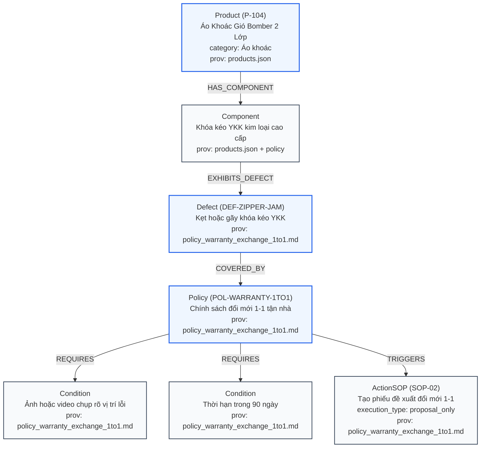

# Kế Hoạch Kỹ Thuật (v6.2): GraphRAG Apache AGE trên PostgreSQL 16

> **Mục tiêu:** Nâng cấp hệ thống Cơ sở Tri thức RetailOps từ **deterministic hybrid lexical + feature-hash vector RAG baseline** hiện tại lên kiến trúc **Đồ thị tri thức (Knowledge Graph - GraphRAG)** sử dụng **Apache AGE (openCypher)** tích hợp trực tiếp trên PostgreSQL 16.
> **Cam kết kỹ thuật & Nghiên cứu:** Hỗ trợ suy luận quan hệ bắc cầu đa bước (*Multi-hop relational reasoning*) cho các SOPs nghiệp vụ TMĐT, giảm thiểu phát biểu không có cơ sở (*reduce unsupported claims*) và cải thiện khả năng truy vết nguồn gốc (*improve provenance*).
> **Snapshot đối chiếu:** Commit `fd24e36` trên nhánh `main` (toàn bộ 340 regression tests, cổng tài liệu 4/4 và hợp đồng triển khai đều đang PASS).
> **Audit basis / Documentation baseline reviewed:** `b93eb5a` · **Application verified:** `fd24e36`
> **Phiên bản v6.2:** Tách bạch provenance thực thể/quan hệ, sửa lỗi cache request_mode, chuẩn hóa link tương đối (cấm URL file cục bộ), ranh giới an toàn với Catalog SSOT (FIX02) và candidate restriction không gây Cartesian mismatch.

---

## 1. Ranh Giới Kiến Trúc & Quy Tắc Bất Biến (Strict Invariants)

> [!IMPORTANT]
> **Quy trình Phát triển & Triển khai An Toàn Khi EC2 Đang TẮT:**
> - Máy chủ EC2 `retailops-dev` (`i-0fd116d8927d0e412`) hiện tại đang ở trạng thái **STOPPED** để tiết kiệm chi phí.
> - Toàn bộ quá trình code, kiểm thử và CI được thực hiện trên nhánh tính năng `feature/graphrag-age`.
> - Workflow `.github/workflows/deploy-ec2.yml` chỉ kích hoạt khi push lên `main` VÀ `RETAILOPS_DEPLOY_ENABLED == 'true'`. Tuyệt đối **không merge vào `main`** và không bật EC2 trong suốt giai đoạn phát triển và kiểm thử tính năng này.
> - Thêm bộ lọc `paths-ignore` (`docs/**`, `*.md`, `evals/**`, `scripts/run_graph_ab_benchmark.py`) vào `deploy-ec2.yml`.

> [!WARNING]
> **Các Bất Biến Cấm Phá Vỡ (Strict Non-Negotiable Invariants):**
> 1. **Model Tool Schema Bất Biến 100%**: Schema exposed cho LLM tuyệt đối giữ nguyên `search_knowledge({"query": str})`. Không bao giờ để lộ Cypher string hay tham số nghiệp vụ cho LLM.
> 2. **Single Citation Authority**: Toàn bộ chuỗi trích dẫn `[KB:<24hex>]` hiển thị trên UI tiếp tục được sinh duy nhất tại `KnowledgeTool.search()` từ tenant chunks thật trong PostgreSQL; Graph Engine chỉ đóng vai trò thu hẹp candidate set (`source_keys`), không tự sinh citation giả định.
> 3. **Không Thay Đổi `retailops_schema`**: Bảng `retailops_schema` của tenant business schema chỉ chứa đúng một row `component = 'business'`. Metadata đồ thị nằm hoàn toàn trong schema độc lập `retailops_graph_admin.graph_meta`.
> 4. **Giữ Nguyên Frozen Master Benchmark**: File `evals/scenarios/master_250_v1.jsonl` (SHA `36fa8c7a...`) là ground-truth chuẩn bất biến của hệ thống, không được sửa đổi. Bộ kịch bản đa bước mới được đặt riêng tại `evals/scenarios/multihop_graph_eval.jsonl`.
> 5. **Ranh Giới Bất Biến Giữa Ontology và Catalog SSOT (FIX02)**: Dữ liệu biến động vận hành (Tồn kho `stock_qty`, Giá `price`, Trạng thái active) tuyệt đối không nằm trong static Graph manifest. Graph chỉ chứa static taxonomy (`id`, `name`, `category`, `components`, `defect_classes`). Khi runtime, `BoundTools` đọc `product_id` từ đơn hàng thông qua Catalog SSOT và inject ngầm vào `KnowledgeTool.search(query, product_id=pid)`.

---

## 2. Bản Đặc Tả Tri Thức & Tách Bạch Nguồn Gốc (Canonical Ontology & Provenance)

Hệ thống lưu trữ provenance độc lập cho từng thực thể, linh kiện và mối quan hệ quy trình:

* **Định danh Sản phẩm (`Product: P-104`) & Linh kiện (`Component`)**:
  - **Nguồn gốc (Provenance)**: [data/products.json](../data/products.json).
  - **Dữ liệu thật**: Mã `P-104`, tên `"Áo Khoác Gió Bomber 2 Lớp"`, danh mục `"Áo khoác"`, mô tả linh kiện `"khóa kéo YKK kim loại cao cấp"`.
  - Tệp chính sách không phải nguồn định danh P-104; [data/products.json](../data/products.json) xác nhận P-104 sở hữu linh kiện khóa kéo YKK.
* **Lớp Lỗi (`DefectClass`), Điều Kiện Bảo Hành & Quy Trình Đổi Mới (`SOP-02`)**:
  - **Nguồn gốc (Provenance)**: [data/knowledge/policy_warranty_exchange_1to1.md](../data/knowledge/policy_warranty_exchange_1to1.md).
  - **Dữ liệu thật**:
    - Lỗi bảo hành: *"kẹt hoặc gãy khóa kéo YKK, bung đường may chỉ, rách vải lót"*.
    - Thời hạn: *"90 ngày kể từ ngày khách hàng ký nhận hàng thành công từ bưu tá"*.
    - Bằng chứng bắt buộc: *"ảnh hoặc video chụp rõ vị trí lỗi (unboxing photo/video)"*.
    - Quy trình hành động: *"tạo Phiếu Đề Xuất Đổi Mới 1-1"* tận nhà, bưu tá giao hàng mới và thu hồi hàng lỗi, *"toàn bộ chi phí vận chuyển 2 chiều do shop chi trả 100%"*.
    - Mã định danh nội bộ: `DEF-ZIPPER-JAM`, `POL-WARRANTY-1TO1`, `SOP-02` là normalized ontology codes đại diện cho các điều khoản văn bản này.



---

## 3. Các Chốt Chặn Kỹ Thuật Bắt Buộc (Implementation Locks v6.2)

### 3.1. Sửa Lỗi SemanticCache `request_mode`
- `snapshot` lấy từ `self.store.conversation(...)` không có trường `request_mode`.
- Trong [retailops/business/application.py](../retailops/business/application.py):
  - Lấy lịch sử hội thoại một lần duy nhất ở đầu turn:
    ```python
    history = self.store.history(customer, snapshot['id'])
    full_messages = history + [{'role': 'user', 'content': text}]
    mode = request_mode(full_messages)
    ```
  - `SemanticCache.lookup(text)` **chỉ được phép chạy khi `mode == 'general'`**, không có attachment và thỏa mãn `is_cacheable_query(text)`.
  - `SemanticCache.store(...)` **chỉ được phép lưu khi `mode == 'general'`**, không gọi `search_knowledge` và không có `sources`.
  - Mọi yêu cầu thuộc `mode == 'retail'` (chính sách, bảo hành, đơn hàng, khiếu nại) **bắt buộc bypass 100% cả `lookup` lẫn `store`**.
- Trong [retailops/business/cache.py](../retailops/business/cache.py): Xóa bỏ hoàn toàn `'search_knowledge'` khỏi `ToolCache.CACHEABLE_TOOLS`.

### 3.2. Inject Server-Side Product Context Trong `BoundTools`
- Trong [retailops_tools.py](../retailops_tools.py):
  - Khởi tạo `self.knowledge = KnowledgeTool(store, catalog=catalog, context_provider=lambda: dict(self.context))`.
  - Khi thực thi `search_knowledge`:
    ```python
    if name == 'search_knowledge':
        return self.knowledge.search(args['query'], product_id=self.context.get('product_id'))
    ```
  - Schema gửi LLM giữ nguyên 100%: `{"query": str}`.

### 3.3. Thu Hẹp Ứng Viên Tri Thức Không Gây Cartesian Mismatch
- `GraphRepository` sau khi duyệt đồ thị cho `(product_id, defect_code)` trả về danh sách `source_keys: List[str]`.
- Trong [retailops/knowledge/repository.py](../retailops/knowledge/repository.py):
  ```python
  def search(self, query, limit=5, *, source_keys=None):
      ...
  ```
  Khi có `source_keys`, câu truy vấn SQL thêm điều kiện: `AND d.source_key = ANY(?)`.
- Thu hẹp theo `source_keys` ở tầng đồ thị; xếp hạng đoạn trích (vector + lexical) và trích xuất bằng chứng giữ nguyên ở tầng PostgreSQL RAG của tenant.

### 3.4. Session Bootstrap Apache AGE & An Toàn Transaction Psycopg
- Upstream Apache AGE 1.5.0 (`0048900f...`): Mỗi kết nối đồ thị cần chạy `LOAD 'age';` và `SET search_path = ag_catalog, pg_catalog;`.
- Trong `retailops/knowledge/graph_ingest.py`:
  - Mở kết nối với `autocommit=True` để thiết lập session không mở implicit transaction dở dang:
    ```python
    conn = psycopg.connect(admin_dsn, autocommit=True)
    conn.execute("CREATE EXTENSION IF NOT EXISTS age;")
    conn.execute("LOAD 'age';")
    conn.execute("SET search_path = ag_catalog, pg_catalog;")

    with conn.transaction():
        conn.execute("SELECT pg_advisory_xact_lock(hashtextextended('retailops_graph_ingest', 0));")
        # Ingest đồ thị mới -> verify -> grants -> activate
    ```

### 3.5. Prepared Cypher Với Tên Đồ Thị Literal Đã Kiểm Định
- Tên đồ thị active được validate bằng regex: `^retailops_knowledge_v[0-9]+$`.
- Câu lệnh Cypher trong `retailops/knowledge/graph_repository.py` sử dụng hằng số chuỗi graph name literal:
  ```sql
  SELECT * FROM ag_catalog.cypher(
      'retailops_knowledge_v1',
      $$ MATCH (p:Product {id: $pid})-[:HAS_COMPONENT]->(c:Component)-[:EXHIBITS_DEFECT]->(d:Defect {code: $defect_code})-[:COVERED_BY]->(pol:Policy)-[:TRIGGERS]->(s:ActionSOP)
         RETURN p.id, c.name, d.code, pol.source_key, pol.chunk_ordinal, s.name, s.execution_type $$,
      %s
  ) AS (product_id agtype, component_name agtype, defect_code agtype, source_key agtype, chunk_ordinal agtype, sop_name agtype, execution_type agtype);
  ```
  Tham số `%s` là chuỗi JSON map agtype chứa `{"pid": "P-104", "defect_code": "DEF-ZIPPER-JAM"}`.

### 3.6. Quy Trình Image Hai Giai Đoạn & `enable-pgvector.sh` Wrapper
- **Phase A**: Xây dựng `deploy/Dockerfile.postgres` (ghim pgvector `8ee86c96...` với `OPTFLAGS=""` và Apache AGE `0048900f...`), đẩy lên registry và lấy digest bất biến.
- **Phase B**: Ghim digest vào [deploy/compose.postgres.yaml](../deploy/compose.postgres.yaml) và [scripts/check_deployment_contract.py](../scripts/check_deployment_contract.py).
- Chuyển đổi [deploy/enable-pgvector.sh](../deploy/enable-pgvector.sh) thành compatibility wrapper chuyển tiếp sang `deploy/enable-age.sh`.

### 3.7. `graph_meta.active DEFAULT 0` & Atomic Flip
- Bảng siêu dữ liệu:
  ```sql
  CREATE TABLE IF NOT EXISTS retailops_graph_admin.graph_meta (
      graph_name TEXT PRIMARY KEY,
      version INTEGER NOT NULL UNIQUE,
      manifest_sha256 TEXT NOT NULL,
      rag_content_checksums JSONB NOT NULL,
      active INTEGER NOT NULL DEFAULT 0 CHECK (active IN (0, 1)),
      updated_at DOUBLE PRECISION NOT NULL
  );
  CREATE UNIQUE INDEX IF NOT EXISTS graph_meta_single_active
  ON retailops_graph_admin.graph_meta ((1)) WHERE active = 1;
  ```
- Đồ thị mới bắt đầu ở `active = 0`. Chỉ sau khi nạp và đếm số nút/cạnh khớp 100% với manifest mới thực thi atomic flip:
  ```sql
  UPDATE retailops_graph_admin.graph_meta SET active = 0 WHERE active = 1;
  UPDATE retailops_graph_admin.graph_meta SET active = 1 WHERE graph_name = %s;
  ```

---

## 4. Kế Hoạch Đo Lường Đối Chứng (A/B Scientific Evaluation)

Triển khai script `scripts/run_graph_ab_benchmark.py` trên 30 kịch bản đa bước trong `evals/scenarios/multihop_graph_eval.jsonl` (tắt toàn bộ cache khi chạy), đo lường 6 chỉ số:
1. **Relational Hop Accuracy (%)**: Tỷ lệ suy luận đúng chuỗi liên kết `Sản phẩm -> Linh kiện -> Lỗi -> Chính sách -> SOP`.
2. **Provenance Precision (%)**: Độ chính xác trích dẫn nguồn văn bản gốc.
3. **Grounded Claim Ratio (%)**: Tỷ lệ câu trả lời dựa trên bằng chứng xác thực từ DB/Graph.
4. **Unsupported Defect Claim Rate (%)**: Tỷ lệ AI tự suy diễn lỗi ngoài phạm vi bảo hành.
5. **Routing Accuracy (%)**: Tỷ lệ định tuyến chính xác worker subagent.
6. **End-to-End Latency (p50/p95)**: Thời gian xử lý trọn vòng đời yêu cầu.
