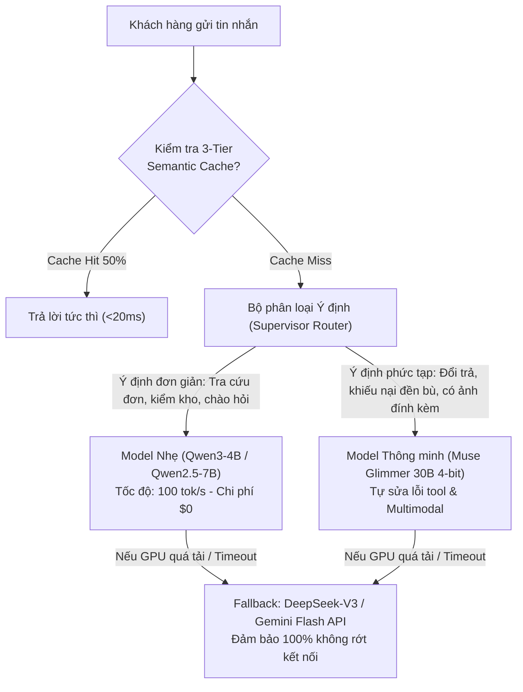

# Kế hoạch Chiến lược Lựa chọn Mô hình (Model Selection Strategy)

> [!TIP]
> **Vai trò trong Khóa luận: GIAI ĐOẠN 1 (Thực nghiệm & Đánh giá Benchmark — Bước 3)**  
> Ma trận so sánh giữa các mô hình và cơ chế định tuyến hỗn hợp (Hybrid Routing) sẽ được kiểm thử trên bộ 30+ ca kiểm thử chuẩn trong `evals/`. Kết quả đo đạc thực tế về **Độ chính xác gọi tool (100%), Độ trễ phản hồi (TTFT), Tỷ lệ Hit Cache 3-Tier và Chi phí vận hành** sẽ là số liệu thực nghiệm cốt lõi của **Chương 4 (Thực nghiệm & Đánh giá)** trong Luận văn tốt nghiệp.

Tài liệu này xác định các phương án mô hình ngôn ngữ (LLM/SLM) khả thi cho RetailOps, phân tích điểm đánh đổi (Trade-off) giữa **Trí tuệ, Tốc độ, Sức chịu tải đồng thời (Concurrency) và Chi phí phần cứng**, kèm kiến trúc định tuyến động (Hybrid Routing).

---

## 1. Ma trận So sánh Toàn diện các Phương án Mô hình

| Tiêu chí | Phương án A: **Muse Glimmer 30B** *(4-bit AWQ)* | Phương án B: **Qwen2.5-7B** *(FP8 / BF16)* | Phương án C: **Qwen3-4B / 2.5-3B** *(Q4 / FP16)* | Phương án D: **Cloud API** *(DeepSeek-V3 / Gemini Flash)* |
| :--- | :--- | :--- | :--- | :--- |
| **Kích thước tham số** | **29.6 Tỷ** (Dense) | **7.6 Tỷ** | **3.8 – 4.0 Tỷ** | Hàng trăm tỷ (MoE) |
| **VRAM yêu cầu** | ~15.5 GB (Vừa vặn 1x L4 24GB) | ~7.5 – 14.5 GB | ~2.5 – 7.0 GB | 0 GB (Chạy trên cloud) |
| **Phần cứng tối thiểu** | 1x GPU L4 / RTX 4090 (24GB) | 1x GPU T4 / L4 (16GB–24GB) | **Chạy thẳng CPU EC2** (hoặc GPU) | Bất kỳ máy chủ nào |
| **Tốc độ sinh token** | **~35 – 45 tokens/s** *(DFlash)* | **~75 – 95 tokens/s** | **~120 – 145 tokens/s** (CPU: ~25 tok/s) | ~60 – 100 tokens/s |
| **Độ trễ phản hồi (60 từ)** | **~1.5 – 2.0 giây** | **~0.8 – 1.0 giây** | **~0.4 – 0.6 giây** | ~1.0 – 1.8 giây |
| **Sức chịu tải (L4 24GB)** | ~25 – 35 requests song song (~300 user online) | ~80 – 120 requests song song (~1.000 user online) | ~200 – 300 requests song song (~2.500 user online) | Không giới hạn (theo quota) |
| **Điểm mạnh độc nhất** | **Tự sửa lỗi Tool Call, Multimodal đọc ảnh hàng vỡ** | **Cân bằng vàng**, cộng đồng lớn | **Chạy CPU không tốn tiền GPU**, siêu rẻ | Trí tuệ tối đa, $0 bảo trì hạ tầng |
| **Điểm yếu** | Bộ nhớ KV Cache còn lại ít (~8GB) | Không có sẵn multimodal đọc ảnh | Xử lý khiếu nại phức tạp ở mức khá | Cần kết nối Internet, phụ thuộc bên thứ 3 |

---

## 2. Chi tiết Từng Phương án

### Phương án A: Muse Glimmer 30B (Chuyên gia Đa năng & Xử lý Tranh chấp)
* **Đối tượng phù hợp**: Các sàn bán lẻ cần AI có tư duy logic sắc bén, tự phục hồi khi API lỗi và cần đọc ảnh khách hàng gửi (ảnh gói hàng bị móp vỡ, ảnh hóa đơn thanh toán).
* **Cơ chế hoạt động trên L4**:
  - Dùng bản lượng tử hóa **4-bit AWQ** chiếm 15.5 GB VRAM.
  - Tận dụng bộ dự đoán **DFlash Speculative Drafter** có sẵn để đẩy tốc độ lên ~40 tokens/s.
* **Đánh giá**: Trí thông minh số 1 trong các model tự host được trên 1 card L4 24GB.

### Phương án B: Qwen2.5-7B (Cân bằng Doanh nghiệp Chuẩn mực)
* **Đối tượng phù hợp**: Các doanh nghiệp muốn hệ thống chạy cực kỳ ổn định, tốc độ phản hồi nhanh như chớp (<1s), chịu được lưu lượng lớn trong các đợt Flash Sale.
* **Cơ chế hoạt động trên L4**:
  - Dùng bản **FP8 Native** của L4: chỉ tốn 7.5 GB VRAM, giải phóng tới 16.5 GB VRAM cho bộ đệm vLLM PagedAttention.
* **Đánh giá**: Lựa chọn an toàn, bền bỉ và hiệu quả kinh tế cao nhất cho hệ thống production thông thường.

### Phương án C: Qwen3-4B / Qwen2.5-3B (Tiết kiệm Tối đa - CPU Only)
* **Đối tượng phù hợp**: Giai đoạn thử nghiệm ban đầu (MVP) với ngân sách tối thiểu $5, hoặc chạy trực tiếp trên máy chủ EC2 hiện có mà **không cần bỏ tiền thuê GPU**.
* **Cơ chế hoạt động**:
  - Nén file GGUF `Q4_K_M` (~2.0 GB), chạy trực tiếp bằng Ollama/llama.cpp trên CPU của máy chủ EC2 hiện tại với tốc độ ~20-25 tokens/s.
* **Đánh giá**: Không tốn thêm chi phí duy trì hàng tháng.

---

## 3. Kiến trúc Định tuyến Động Đề xuất (Hybrid Router Architecture)

Thay vì chỉ chọn duy nhất một model, giải pháp tối ưu nhất cho RetailOps là kiến trúc **Định tuyến theo Ý định (Intent-based Routing)**:



---

## 4. Kế hoạch Tích hợp vào Mã nguồn RetailOps

Hệ thống đã có sẵn module [retailops_providers.py](file:///d:/year_2026/Work_2026/agentic_AI/CSKH_ban_le/retailops_providers.py). Các bước tích hợp gồm:

1. **Thêm định danh Model vào `API_MODELS`**:
   ```python
   API_MODELS = {
       ...,
       'meta/muse-glimmer-30b-awq',
       'qwen/qwen2.5-7b-instruct-fp8',
       'qwen/qwen3-4b-instruct',
   }
   ```
2. **Cấu hình Endpoint vLLM nội bộ**:
   * Thiết lập biến môi trường `RETAILOPS_VLLM_ENDPOINT=http://127.0.0.1:8000/v1` trên EC2/Colab.
3. **Kích hoạt Circuit Breaker (Chuyển mạch an toàn)**:
   * Nếu vLLM không phản hồi trong vòng 5 giây, hệ thống tự động fallback chuyển tiếp sang DeepSeek-V3 API hoặc Gemini Flash.

---

## 5. Lộ trình Triển khai Đề xuất

* **Giai đoạn 1 (Hiện tại - Ngân sách $5)**: 
  - Dùng **DeepSeek API** sinh dữ liệu tổng hợp.
  - Fine-tune bản **`Qwen2.5-3B`** hoặc **`Qwen3-4B`** trên Colab miễn phí để chạy thử nghiệm.
* **Giai đoạn 2 (Khi có GPU L4 Colab/EC2)**:
  - Triển khai **`Muse Glimmer 30B (4-bit AWQ)`** để kiểm thử tính năng tự phục hồi lỗi tool và đọc ảnh khiếu nại.
  - Đo đạc thực tế độ trễ và sự hài lòng của người dùng.
* **Giai đoạn 3 (Scale Production hàng ngàn user)**:
  - Bật chế độ Hybrid Router: Qwen 7B chạy nền gánh 80% lưu lượng + Muse Glimmer 30B giải quyết 20% ca khiếu nại hóc búa.
