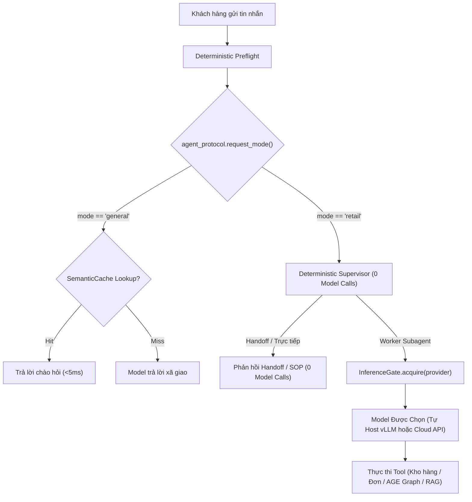

# Kế Hoạch Chiến Lược Lựa Chọn Mô Hình (Model Selection Strategy)

> [!TIP]
> **Vai trò trong Khóa luận: GIAI ĐOẠN 4 (Thực nghiệm & Đánh giá Benchmark Đối chứng)**
> Ma trận so sánh giữa các mô hình và cơ chế định tuyến tĩnh/deterministic được đối chiếu thực nghiệm trên bộ kịch bản kiểm thử chuẩn trong [evals/scenarios/benchmark_250.jsonl](../evals/scenarios/benchmark_250.jsonl). Kết quả đo đạc thực tế về **Độ chính xác gọi tool, Độ trễ phản hồi E2E, Tỷ lệ lỗi 429 và Chi phí token thực tế** sẽ là số liệu thực nghiệm cốt lõi của **Chương 4 (Thực nghiệm & Đánh giá)** trong Luận văn tốt nghiệp.

Tài liệu này xác định các phương án mô hình ngôn ngữ (LLM/SLM) khả thi cho RetailOps, phân tích điểm đánh đổi (Trade-off) giữa **Trí tuệ, Tốc độ, Sức chịu tải đồng thời (Concurrency) và Chi phí phần cứng** (các số liệu trong bảng dưới mang tính ước lượng kế hoạch / Planning Estimates, cần được kiểm chứng bằng benchmark thực tế ở Phase 4).

---

## 1. Ma Trận So Sánh Các Phương Án Mô Hình (Ước Lượng Kế Hoạch / Planning Estimates)

*Lưu ý khoa học*: Các chỉ số tokens/s, độ trễ và số request song song dưới đây là **ước tính kế hoạch lý thuyết** để định hướng cấu hình hạ tầng, không phải cam kết vận hành thực tế. Số liệu chính thức sẽ do bài benchmark ở Phase 4 công bố.

| Tiêu chí | Phương án A: **Gemma-4-12B / Muse 30B** *(Quantized)* | Phương án B: **Qwen2.5-7B** *(FP8 / BF16)* | Phương án C: **Qwen2.5-3B / 4B** *(Q4 / FP16)* | Phương án D: **Cloud API** *(DeepSeek-V3 / OpenRouter)* |
| :--- | :--- | :--- | :--- | :--- |
| **Kích thước tham số** | **12 – 29 Tỷ** (Dense) | **7.6 Tỷ** | **3.0 – 4.0 Tỷ** | Hàng trăm tỷ (MoE) |
| **VRAM yêu cầu** | ~14 – 16 GB (Vừa vặn 1x L4 24GB) | ~7.5 – 14.5 GB | ~2.5 – 7.0 GB | 0 GB (Chạy trên cloud) |
| **Phần cứng tối thiểu** | 1x GPU L4 / RTX 4090 (24GB) | 1x GPU T4 / L4 (16GB–24GB) | **Chạy thẳng CPU EC2** (hoặc GPU) | Bất kỳ máy chủ nào |
| **Tốc độ sinh token (Ước tính)**| ~30 – 45 tokens/s | ~70 – 90 tokens/s | ~100 – 140 tokens/s (CPU: ~20) | ~50 – 90 tokens/s |
| **Độ trễ phản hồi (Ước tính)** | ~1.5 – 2.5 giây | ~1.0 – 1.5 giây | ~0.6 – 1.2 giây | ~1.0 – 2.0 giây |
| **Concurrency ước tính** | Bounded Semaphore 2–4 | Bounded Semaphore 4–8 | Bounded Semaphore 8+ | Bounded Semaphore 4–8 |
| **Điểm mạnh** | **Tool Calling chuẩn, đọc hiểu tiếng Việt tốt** | Cân bằng vàng, cộng đồng lớn | Chạy CPU không tốn tiền GPU | Trí tuệ tối đa, $0 duy trì GPU |
| **Hạn chế** | Cần GPU chuyên dụng | Cần GPU tối thiểu 16GB | Khả năng suy luận nghiệp vụ vừa phải | Phụ thuộc mạng Internet & API quota |

---

## 2. Kiến Trúc Định Tuyến & Ranh Giới Cache Coherence (Routing Architecture)

Kiến trúc định tuyến tuân thủ nghiêm ngặt nguyên tắc **Cache Coherence & Single Citation Authority**:

```mermaid
flowchart TD
    UserQuery["Khách hàng gửi tin nhắn"] --> Preflight["Deterministic Preflight"]

    Preflight --> ModeCheck{"agent_protocol.request_mode()"}

    ModeCheck -->|mode == 'general'| SemCache{"SemanticCache Lookup?"}
    SemCache -->|Hit| InstantReply["Trả lời chào hỏi (<5ms)"]
    SemCache -->|Miss| GenReply["Model trả lời xã giao"]

    ModeCheck -->|mode == 'retail'| Supervisor["Deterministic Supervisor (0 Model Calls)"]

    Supervisor -->|Handoff / Trực tiếp| DirectAnswer["Phản hồi Handoff / SOP (0 Model Calls)"]
    Supervisor -->|Worker Subagent| InferenceGate["InferenceGate.acquire(provider)"]

    InferenceGate --> ActiveModel["Model Được Chọn (Tự Host vLLM hoặc Cloud API)"]
    ActiveModel --> ToolLoop["Thực thi Tool (Kho hàng / Đơn / AGE Graph / RAG)"]
```

> [!WARNING]
> **Quy Tắc Bất Biến Về Semantic Cache:**
> - Toàn bộ các yêu cầu tra cứu chính sách, bảo hành, đơn hàng, đổi trả (`mode == 'retail'`) **hoàn toàn bypass SemanticCache cả ở chiều lookup lẫn store**.
> - Không giả định tỷ lệ "Cache Hit 50%" cho các câu hỏi nghiệp vụ bán lẻ. Mọi bằng chứng chính sách bắt buộc phải được truy xuất tươi từ PostgreSQL RAG / Apache AGE và kiểm định trích dẫn provenance sống.

---

## 3. Tích Hợp Vào Mã Nguồn RetailOps Hiện Tại

Hệ thống quản lý định danh và kết nối mô hình tập trung tại [retailops_providers.py](../retailops_providers.py):

1. **Cấu Hình Provider Runtime**:
   - `custom`: Kết nối vLLM tự host (mô hình `yuxinlu1/gemma-4-12B-agentic-fable5-composer2.5-v2-3.5x-tau2` chạy trên GPU L4 qua ngrok tunnel).
   - `api`: Kết nối dịch vụ Cloud API thương mại (OpenRouter / DeepSeek API).
2. **Không Tự Động Failover Giữa Các Provider**:
   - Hệ thống giữ nguyên lựa chọn provider tường minh theo cấu hình hoặc lựa chọn phiên của người dùng. Không triển khai circuit breaker tự động chuyển vùng nhà cung cấp khi chưa có hợp đồng kiểm thử, tránh rủi ro rò rỉ dữ liệu hoặc sai lệch chi phí.
3. **Đo Đạc Khoa Học Phục Vụ Luận Văn (Phase 4)**:
   - Chạy so sánh thực nghiệm 1-1 giữa mô hình `custom` tự host và `api` DeepSeek trên cùng 250 kịch bản chuẩn trong `evals/scenarios/benchmark_250.jsonl` để thu thập bảng số liệu đối chứng cho Chương 4 Luận văn.
