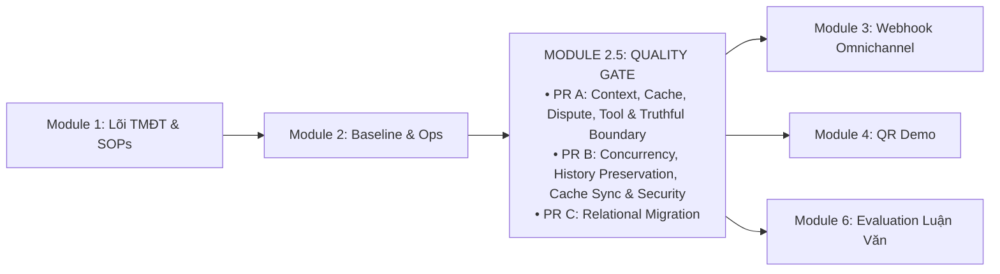

# KẾ HOẠCH MODULE 2.5: SYSTEM HARDENING, CONTEXT INTEGRITY & VERIFICATION QUALITY GATE

> **Mã kế hoạch:** `PLAN_MODULE_2_5_HARDENING_VERIFICATION`  
> **Trạng thái:** ACTIVE IMPLEMENTATION PLAN  
> **Phiên bản:** 1.1 (2026-09-28)  
> **Audit basis / Documentation baseline reviewed:** `11c3048`  
> **Mục tiêu:** Thiết lập chốt chặn kiểm thử & ổn định vận hành thực tế (Quality Gate) giữa Module 2 (Baseline & Ops Console) và Module 3 (Omnichannel Meta Webhook). Khắc phục dứt điểm 10 lỗi kỹ thuật và khoảng trống kiến trúc (F01–F10, F08a) được kiểm chứng độc lập.  
> **Tham chiếu lộ trình:** [PLAN_ROADMAP_INDEX.md](PLAN_ROADMAP_INDEX.md) · [PLAN_CONCURRENCY_RELATIONAL_KNOWLEDGE_SPRINT.md](PLAN_CONCURRENCY_RELATIONAL_KNOWLEDGE_SPRINT.md)

---

## 1. Bối Cảnh & Định Vị Module 2.5

Hệ thống RetailOps 2026 đã hoàn thành các phân hệ nền tảng (Module 1 Lõi TMĐT, Module 2 Baseline 250 ca & Ops Console). Tuy nhiên, qua đợt kiểm toán kỹ thuật chuyên sâu tại commit `1da07f0`, `11c3048` và đợt rà soát kiến trúc độc lập, hệ thống bộc lộ các bẫy lỗi logic, an toàn dữ liệu, bảo mật và điểm nghẽn concurrency cần được xử lý dứt điểm trước khi mở rộng kênh giao tiếp người dùng bên ngoài:
1. **Rò rỉ ngữ cảnh qua Cache (F01 & F02)**: Semantic Cache trả dữ liệu bảo hành của sản phẩm khác (P-603 vs P-602) và ghi turn ngoài `conv_lock`.
2. **Nuốt ngoại lệ hạ tầng (F03)**: `dispute_agent` và `Application.execute()` nuốt lỗi hạ tầng (429/503/timeout) và trả về thành công giả lập.
3. **Đề xuất và ngữ cảnh không trung thực (F04, F05, F06, F08a)**: Tạo đề xuất hủy đơn đã giao (`delivered`); lấy nhầm `product_id` cũ khi đổi đơn mới; bỏ qua màu sắc và tự gán size L khi đổi size; bot và UI staff tuyên bố sai sự thật về trạng thái tạo phiếu, giữ kho và vận đơn.
4. **Crash 500 khi sản phẩm thiếu category (F11)**: Tạo sản phẩm với `category=None` khiến `retailops_tools.py:50` ném `TypeError` sập luồng chat của mọi người dùng khi tìm kiếm sản phẩm.
5. **Mất mát lịch sử chat vĩnh viễn (F12)**: `finish_turn()` thực hiện `DELETE FROM agent_turns ... LIMIT 6` làm mất hoàn toàn lịch sử chat ngoài 6 lượt gần nhất, hỏng tính năng resume và transcript CSKH.
6. **Lệch Tool Cache giữa Manager và Customer (F13)**: Manager đổi trạng thái đơn hàng nhưng chỉ xóa cache trong instance `Application` của Manager, bỏ sót cache của Customer gây xung đột phiên bản.
7. **Lỗ hổng bảo mật OAuth Login CSRF (SEC-01)**: Endpoint `/auth/google/login` tạo state nhưng không ràng buộc với cookie/session trình duyệt khởi tạo, vi phạm RFC 6749 §10.12.
8. **Concurrency chưa bảo vệ headroom HTTP (F07)**: Waitress 8 threads có thể bị chiếm dụng toàn bộ khi GPU bận; thiếu header `Retry-After: 5`.
9. **Thiết kế migration cần tường minh (F10)**: Tránh nhảy cóc version migration giữa SQLite và PostgreSQL; đồng bộ đúng file `pg_schema.py`.

---

## 2. Phân Kỳ 3 Pull Request (PR A, PR B, PR C)

### 2.1. PR A — Context, Cache, Dispute Correctness, Tool Safety & Truthful Boundary (Ưu tiên P1)
* **Phạm vi xử lý:** F01, F02, F03, F04, F05, F06, F08a, F11.
* **Tệp tác động:**
  - `retailops/business/cache.py` & `retailops/business/application.py`:
    - **F01 FIX (An Toàn Cache 3 Yếu Tố — Tri-Factor Cache Safety)**:
      1. *Query Filter*: Từ chối câu hỏi chứa mã đơn/sản phẩm cụ thể hoặc đại từ chỉ định ("món này", "đơn này", "sản phẩm này"). Không áp allowlist text quá hẹp gây phá vỡ test FAQ hiện hữu.
      2. *Context Guard*: Bắt buộc bypass cache khi phiên hội thoại đang có `order_id` hoặc `product_id` trong context snapshot.
      3. *Response Provenance Guard*: Tuyệt đối KHÔNG ghi vào Semantic Cache nếu turn đã gọi BẤT KỲ tool nào (kiểm tra cờ trace/tool-call thực tế `tool_count > 0` hoặc đã thực thi tool calls, kể cả read tools như `get_current_time`), hoặc có tri thức truy xuất RAG (`bound.knowledge.searches`), trích dẫn `sources`, hoặc `bound.versions`/context động.
    - **F02 FIX (Serialization & Snapshot Revalidation cho AI/Cache Turns)**:
      - Đưa toàn bộ luồng kiểm tra cache-hit và ghi turn của Semantic Cache vào bên trong phạm vi kiểm soát của `conv_lock`.
      - Hợp đồng Replay & Snapshot Revalidation: Sau khi acquire `conv_lock`, thực hiện Replay #2 VÀ reload/revalidate snapshot ngữ cảnh hội thoại (`self.store.snapshot(...)`) từ database. Chỉ khi snapshot mới nhất hợp lệ và đủ điều kiện cache mới accept cache-hit và gọi `finish_turn()`, tuyệt đối không commit từ snapshot pre-lock cũ.
    - Sửa `Application.execute()`: Re-raise ngoại lệ hạ tầng (status >= 500 hoặc 429), chỉ chuyển đổi lỗi 4xx nghiệp vụ thành dict tool result.
  - `retailops_tools.py`:
    - **F11 FIX**: Bọc an toàn `p.get('category') or ''` và ép kiểu danh sách aliases chuỗi trong `search_products`. Loại bỏ triệt để nguy cơ `TypeError` khi catalog có sản phẩm mang `category=None`.
  - `retailops/workflow/subagents/dispute_agent.py`:
    - Re-raise lỗi hạ tầng ra tầng HTTP; chuẩn hóa telemetry tối thiểu: `model_calls` (attempt) và `model_responses` (thành công) đồng bộ với `read_worker.py`.
    - Chỉ tạo `action_proposal.cancel_order` khi tool `prepare_cancellation` trả về `eligible=True`.
    - Ưu tiên `product_id` của bản ghi đơn hàng mới tra cứu, không lấy `bound_context.product_id` của đơn cũ.
    - Lấy đúng màu và size từ yêu cầu; phân biệt `variant_not_found`, `stock_unknown` (catalog thiếu data), hết hàng (`stock == 0`) và còn hàng (`stock > 0`).
    - **F08a**: Ngôn từ đổi hàng trung thực: Bot chỉ thông báo tìm thấy phương án phù hợp; KHÔNG nói "đã tạo phiếu đề xuất", "xem trên màn hình" hay "đã gửi chuyên viên CSKH duyệt" khi chưa có UI render và chưa persist ticket.
  - `web/app.js`:
    - Sửa câu chat mô phỏng của nút Staff Desk: Chỉ gửi thông báo CSKH thông thường, KHÔNG tuyên bố tạo vận đơn hay giữ hàng kho.

### 2.2. PR B — Concurrency, History Preservation, Cache Sync & Security (Ưu tiên P1/P2)
* **Phạm vi xử lý:** F07, F09, F12, F13, SEC-01, BUG-01, BUG-04.
* **Tệp tác động:**
  - `retailops/bootstrap.py` & `retailops/inference_gate.py`:
    - Áp dụng công thức Headroom an toàn: Với Waitress `threads=8` và GPU `slots=1`, cấu hình hàng đợi `max_queue=5` (luôn dành ít nhất 2 threads cho `/health`, `/api/session`, và static routes).
  - `retailops/http/public.py` & `retailops/http/private.py`:
    - Bổ sung header `Retry-After: 5` khi trả mã lỗi HTTP 429.
  - `retailops/business/store.py`:
    - **F12 FIX (Bảo toàn lịch sử chat)**: Loại bỏ câu lệnh `DELETE FROM agent_turns ... LIMIT 6` trong `finish_turn()`. Giữ nguyên toàn bộ lịch sử trong database để phục vụ resume chat và transcript CSKH.
    - Chuyển việc giới hạn cửa sổ ngữ cảnh (bounded window 6 turns) sang phạm vi bộ nhớ của hàm `history()` trước khi đưa vào context prompt của LLM.
  - `retailops/http/routes.py` & `retailops/identity/persistent.py`:
    - **F13 FIX (Đồng bộ vô hiệu hóa Cache theo Tenant Scope)**:
      - Trong môi trường multi-tenant (`PersistentSessions`, `PostgresSessions`), `ToolCache` được chia sẻ ở phạm vi **từng Tenant** (`tenant_id`), không dùng global namespace để tránh xung đột `customer_id` giữa các tenant.
      - Khi Manager cập nhật trạng thái đơn hàng qua `POST /api/manager/orders/update-status`, lệnh invalidate áp dụng trên shared `ToolCache` của tenant tương ứng, giúp toàn bộ active sessions nhận ngay dữ liệu mới.
  - `retailops/http/auth_google.py` & `retailops/http/public.py`:
    - **SEC-01 FIX (Chống OAuth Login CSRF)**: Ràng buộc `state` với trình duyệt khởi tạo bằng transient session cookie (`HttpOnly`, `SameSite=Lax`). Kiểm tra khớp cookie ở callback `/auth/google/callback`.
  - **Dọn sạch Legacy `self.agent_lock`**:
    - Mục tiêu kiến trúc concurrency chỉ còn đúng 2 tầng phân định rõ ràng:
      1. Khóa tuần tự hóa theo từng phiên hội thoại (`conv_lock` per conversation, non-blocking, trả 429 `model_busy` khi đua request).
      2. Cổng kiểm soát tài nguyên GPU (`InferenceGate` với FIFO queue và admission timeout).
    - Xóa bỏ hoàn toàn biến `self.agent_lock` ở `Application`, `identity/demo.py`, `persistent.py`, `postgres.py`.
  - `tests/test_schema_migration.py` & `tests/test_providers.py`:
    - Đóng tường minh connection SQLite bằng `contextlib.closing()` hoặc `try/finally db.close()`.
  - `retailops/business/application.py`:
    - Đo đạc thời gian model I/O thực tế tách biệt với queue wait time; không dùng 0.0 giả lập cho độ trễ chưa đo.

### 2.3. PR C — Relational Knowledge & Clean Schema Migration (HOÃN — DEFERRED / FUTURE ADR)
* **Trạng thái:** **DEFERRED / OUT OF SCOPE CHO MODULE 2.5**.
* **Định vị:**
  - Hiện tại, bảng `products` trong cả SQLite và PostgreSQL **đã có sẵn cột `warranty_days`**, kết hợp với module `retailops/business/warranty.py` (đã có sẵn hàm `resolve_warranty_period` ưu tiên thuộc tính sản phẩm trước chính sách chung) **đã đủ giải quyết 100% bài toán bảo hành 180 ngày của sản phẩm P-603**.
  - Do đó, **giữ nguyên Schema Business ở Version 4 (`BUSINESS_SCHEMA_CURRENT = 4`)** trong toàn bộ Module 2.5 (PR A và PR B). Không thực hiện migration v5 ở giai đoạn này để triệt tiêu rủi ro lỗi DDL trên môi trường EC2.
  - Giữ PR C như một tài liệu kiến trúc tham chiếu (Future ADR) cho giai đoạn mở rộng sau này khi cần cấu trúc bảng liên kết đa chiều cho các chính sách đổi hàng, trả hàng, vận chuyển (`return`, `exchange`, `shipping`).

### 2.4. Khoảng Trống Hoãn Triển Khai: F08b Durable Exchange Approval Lifecycle
* **Trạng thái:** **DEFERRED / OUT OF SCOPE FOR MODULE 2.5**.
* **Đặc tả:** Xây dựng bảng lưu trữ bền vững `exchange_requests`, API xác nhận của khách (`POST /api/exchange-proposals`), API phê duyệt của nhân viên (`POST /api/staff/exchange/approve`), queue tự động và state machine 2-stage hoàn chỉnh.
* **Kế hoạch:** Yêu cầu thiết kế kiến trúc và đặc tả kỹ thuật độc lập trong giai đoạn sau Module 2.5, tuyệt đối không gộp vào PR A hay PR B.

---

## 3. Tiêu Chí Nghiệm Thu (Acceptance Criteria)

1. **Cache Isolation**: Hội thoại hỏi P-603 (180 ngày) không bao giờ làm hội thoại P-602 trả về 180 ngày; toàn bộ câu hỏi có context động bypass cache 100%.
2. **Serialization**: Toàn bộ các AI/cache turns trên route `/api/chat` phải được commit an toàn bên dưới `conv_lock`.
3. **No Infrastructure Error Swallowing**: Khi gateway hoặc cơ sở dữ liệu gặp lỗi hạ tầng (5xx, 429, timeout), HTTP trả đúng mã lỗi 503/429 kèm header `Retry-After: 5`; trace ghi nhận chính xác lỗi; không biến thành "không tìm thấy đơn" hay "shop đã ghi nhận".
4. **Truthful Proposals**: Đơn hàng đã giao (`delivered`) không thể tạo đề xuất hủy và không thông báo mở bảng xác nhận hủy.
5. **Order/Product Sync**: Đổi sang đơn mới thì thông tin sản phẩm và bảo hành phải lấy từ đơn mới.
6. **Variant Accuracy**: Đổi size phải kiểm tra đúng màu và size; thiếu thông tin thì hỏi lại, không tự gán mặc định.
7. **Tool Search Safety**: Sản phẩm có `category=None` không gây lỗi `TypeError` trong `search_products`.
8. **Chat History Retention**: Lịch sử hội thoại không bị xóa cứng trong database sau 6 lượt; F5 và transcript CSKH hiển thị trọn vẹn toàn bộ các lượt trước đó.
9. **Cross-App Cache Sync**: Manager cập nhật trạng thái đơn thì phiên chat của khách hàng không bị đọc cache cũ hoặc lỗi CAS conflict.
10. **OAuth CSRF Protection**: Callback Google OAuth từ trình duyệt khác bị từ chối nếu không khớp transient session cookie.
11. **Truthful Exchange Wording**: Không tuyên bố tạo phiếu, giữ kho hay tạo vận đơn khi chưa có backend transaction.
12. **Thread Headroom**: Dưới tải 8 request đồng thời, route `/health` và đọc session vẫn phản hồi trong ngưỡng cho phép.
13. **Clean Schema Upgrade**: Migration nâng cấp thành công từ clean DB, SQLite v3 và PostgreSQL v3/v4; rollback khi có lỗi DDL.
14. **Doc Contract**: 4/4 cổng hợp đồng tài liệu và triển khai đạt PASS 100%.
