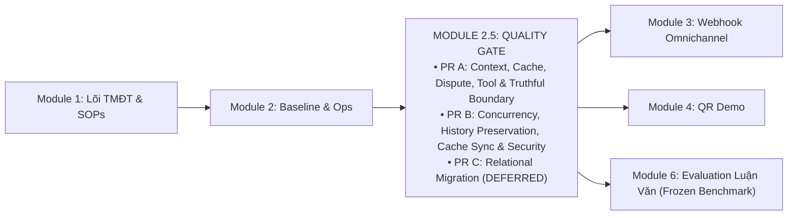

# KẾ HOẠCH MODULE 2.5: SYSTEM HARDENING, CONTEXT INTEGRITY & VERIFICATION QUALITY GATE

> **Mã kế hoạch:** `PLAN_MODULE_2_5_HARDENING_VERIFICATION`
> **Trạng thái:** PR A/N08 MERGED `47ba72a`; PR #35 HEAD `5188dc0`. **AC-09 VERIFIED — P99 & ARTIFACT-INTEGRITY GATES PASSED**. Chưa merge/deploy; sẵn sàng bàn giao chủ dự án review merge. Xem <a href="review%20gpt%206%20astra.md">review hiện hành</a>.
> **Phiên bản:** 1.8 (2026-10-06)
> **Bằng chứng PR B:** Artifact CI [run 37415921867](https://github.com/tuteemovaixlong/CSKH_ban_le/actions/runs/37415921867), ID `11390854372`: 10 batch × 100 mẫu/endpoint, nearest-rank P99 (hiển thị làm tròn) `/healthz` **0.836ms**, `/api/session` **5.764ms**; assertion dùng float gốc, đều $\le 50$ms; 60 chat HTTP 200, mọi batch có tool hook và saturation 1+5; bước kiểm tra độc lập `Validate headroom P99 measurement artifact integrity` PASS; 5/5 check-runs completed/success. Artifact mang synthetic merge SHA `c2d65fffe76bcc9284fedf0072ec4e381f29d95f`, có parents `47ba72a` và `5188dc0`, Git tree trùng khớp 100% với candidate `5188dc0`.
> **Audit basis / Documentation baseline reviewed:** `c30ff1d`
> **Mục tiêu:** Thiết lập chốt chặn kiểm thử & ổn định vận hành thực tế (Quality Gate) giữa Module 2 (Baseline & Ops Console) và Module 3 (Omnichannel Meta Webhook). Khắc phục dứt điểm 13 hạng mục kỹ thuật (F01–F07, F08a, F09, F11–F13, SEC-01) được kiểm chứng độc lập. Mỗi hạng mục chuẩn hóa đầy đủ: tệp/hàm liên quan, hành vi mong đợi, test tương ứng và trạng thái kiểm chứng.
> **Tham chiếu lộ trình:** [PLAN_ROADMAP_INDEX.md](PLAN_ROADMAP_INDEX.md) · [PLAN_CONCURRENCY_RELATIONAL_KNOWLEDGE_SPRINT.md](PLAN_CONCURRENCY_RELATIONAL_KNOWLEDGE_SPRINT.md) · [PLAN_PR_A_CONTEXT_CACHE_DISPUTE.md](PLAN_PR_A_CONTEXT_CACHE_DISPUTE.md)

---

## 1. Bối Cảnh & Định Vị Module 2.5

Hệ thống RetailOps 2026 đã hoàn thành các phân hệ nền tảng (Module 1 Lõi TMĐT, Module 2 Baseline 250 ca & Ops Console). Tuy nhiên, qua đợt kiểm toán kỹ thuật chuyên sâu tại commit `1da07f0`, `11c3048` và đợt rà soát kiến trúc độc lập, hệ thống bộc lộ các bẫy lỗi logic, an toàn dữ liệu, bảo mật và điểm nghẽn concurrency cần được xử lý dứt điểm trước khi mở rộng kênh giao tiếp người dùng bên ngoài:
1. **Rò rỉ ngữ cảnh qua Cache (F01 & F02)**: Semantic Cache trả dữ liệu bảo hành của sản phẩm khác (P-603 vs P-602) và ghi turn ngoài `conv_lock`.
2. **Nuốt ngoại lệ hạ tầng (F03)**: `dispute_agent` và `Application.execute()` nuốt lỗi hạ tầng (429/503/timeout) và trả về thành công giả lập.
3. **Đề xuất và ngữ cảnh không trung thực (F04, F05, F06, F08a)**: Tạo đề xuất hủy đơn đã giao (`delivered`); lấy nhầm `product_id` cũ khi đổi đơn mới; bỏ qua màu sắc và tự gán size L khi đổi size; bot và UI staff tuyên bố sai sự thật về trạng thái tạo phiếu, giữ kho và vận đơn.
4. **Crash 500 khi sản phẩm thiếu category (F11)**: Tạo sản phẩm với `category=None` khiến `retailops_tools.py:50` ném `TypeError` sập luồng chat của mọi người dùng khi tìm kiếm sản phẩm.
5. **Mất mát lịch sử chat vĩnh viễn (F12)**: `finish_turn()` thực hiện `DELETE FROM agent_turns ... LIMIT 6` làm mất hoàn toàn lịch sử chat ngoài 6 lượt gần nhất, hỏng tính năng resume và transcript CSKH.
6. **Lệch Tool Cache & Race Condition khi Invalidate (F13)**: Manager đổi trạng thái đơn hàng nhưng chỉ xóa cache trong instance `Application` của Manager, bỏ sót active sessions của Customer; race condition giữa Manager invalidation và turn chat in-flight.
7. **Lỗ hổng bảo mật OAuth Login CSRF (SEC-01)**: Endpoint `/auth/google/login` tạo state nhưng không ràng buộc với cookie/session trình duyệt khởi tạo, vi phạm RFC 6749 §10.12.
8. **Concurrency chưa bảo vệ headroom HTTP (F07 & F09)**: Waitress 8 threads có thể bị chiếm dụng toàn bộ khi GPU bận; thiếu header `Retry-After: 5`; telemetry ghi nhận `0.0` giả lập thay vì thời gian I/O thực.

---

## 2. Chi Tiết Các Hạng Mục Kỹ Thuật (Itemized Technical Specifications)

Mọi hạng mục bắt buộc chuẩn hóa theo 4 thuộc tính: **Tệp & Hàm liên quan**, **Hành vi mong đợi**, **Test tương ứng**, và **Trạng thái**.

### 2.1. Phân Kỳ PR A — Context, Cache, Dispute Correctness, Tool Safety & Truthful Boundary

#### [F01] An Toàn Cache 3 Yếu Tố (Tri-Factor Cache Safety) `[ĐÃ KIỂM CHỨNG — PR A, CI 37197602401]`
- **Tệp & Hàm liên quan:**
  - `retailops/business/cache.py`: `is_cacheable_query(text)`.
  - `retailops/business/application.py`: `chat()` (dòng kiểm tra Semantic Cache lookup và store).
- **Hành vi mong đợi:**
  1. *Lớp 1 (Query Filter - Cú pháp)*: Từ chối câu hỏi chứa mã đơn cụ thể (`ORDER_PATTERN`), mã sản phẩm (`PRODUCT_PATTERN`), ý định mutation (`MUTATION_PATTERN`), hoặc đại từ chỉ định phụ thuộc ngữ cảnh (`DEICTIC_PATTERN`: "món này", "đơn này", "sản phẩm này", "áo này", "quần này", "này"). Cho phép các câu hỏi FAQ tĩnh/chung chung.
  2. *Lớp 2 (Context Guard - Ngữ cảnh)*: Kiểm tra sau khi nạp bản chụp hội thoại từ DB (`snapshot = self.store.conversation(customer, cid)`). Bắt buộc **bypass cache lookup 100%** nếu có tệp đính kèm, hoặc snapshot đang có `order_id` / `product_id`, hoặc câu hỏi tra cứu chính sách cần RAG.
  3. *Lớp 3 (Response Provenance Guard - Nguồn gốc phản hồi)*: Cờ thực thi công cụ đọc trực tiếp từ `tools_called = answer['trace'].get('tools', [])` và `tool_count = answer['trace'].get('tool_count', len(tools_called))` (hoặc graph state `state.get('tool_count', 0)`). **TUYỆT ĐỐI CẤM LƯU VÀO SEMANTIC CACHE** nếu turn đã gọi bất kỳ tool nào (`len(tools_called) > 0` hoặc `tool_count > 0`, kể cả read tools như `get_current_time`, `get_order`, `search_knowledge`), hoặc có truy vấn tri thức RAG (`bound.knowledge.searches`), trích dẫn `sources`, hoặc `bound.versions`.
- **Test tương ứng:** `tests/test_pr_a_correctness.py::test_f01_cross_product_cache_leak`, `tests/test_pr_a_correctness.py::test_f01_tool_execution_provenance_guard`.

#### [F02] Tuần Tự Hóa & Tái Thẩm Định Snapshot Khi Cache-Hit `[ĐÃ KIỂM CHỨNG — PR A, CI 37197602401]`
- **Tệp & Hàm liên quan:**
  - `retailops/business/application.py`: `chat()`.
  - `retailops/inference_gate.py`: `get_conversation_lock(conv_key)`.
  - `retailops/business/store.py`: `BusinessStore.conversation()`, `BusinessStore.finish_turn()`.
- **Hành vi mong đợi:**
  1. Yêu cầu vào chat $\rightarrow$ Chạy Replay #1 fast-path (read-only, 0 lock, 0 GPU).
  2. Lấy `conv_lock.acquire(blocking=False)`. Thất bại $\rightarrow$ Ném ngay HTTP 429 `model_busy`.
  3. **Dưới `conv_lock`**: Chạy Replay #2 bắt request thắng đua vừa commit.
  4. **Reload & Revalidate Snapshot**: Gọi lại `snapshot = self.store.conversation(customer, cid)` dưới lock để nạp trạng thái mới nhất từ database. Nếu request trước đó đã cập nhật `order_id`/`product_id`, snapshot mới phản ánh ngay lập tức.
  5. **Bảo vệ Cache Fail-Closed & Provenance**:
     - Bước lookup kiểm tra qua predicate `is_cache_eligible_for_lookup(text, snapshot, attachment)`: Chỉ chấp nhận cache hit khi snapshot đã revalidate dưới lock, không có attachment, không có context động (`order_id`/`product_id` is None), query thỏa mãn cú pháp `is_cacheable_query(text)` VÀ thỏa mãn predicate `is_static_faq_query(text)` (thuộc allowlist FAQ tĩnh: giờ mở cửa, địa chỉ; mọi câu hỏi chính sách/RAG hoặc mơ hồ đều BYPASS lookup 100%). Không dùng `tool_count` của lượt chưa chạy để quyết định lookup.
     - Bước store tuân thủ Response Provenance Guard: Trong codebase hiện tại, `run_multiagent` (`graph.py:164`) không trả về `tool_count` mặc định và luồng `human-support` (`graph.py:154`) nằm ngoài trace thông thường; PR A/B dự kiến bổ sung đếm tool tại biên thực thi `Application.execute()`. Áp dụng nguyên tắc fail-closed: nếu trace thiếu hoặc chưa xác thực, tuyệt đối không coi là 0 tool $\rightarrow$ từ chối lưu cache.
- **Test tương ứng:** `tests/test_pr_a_correctness.py::test_f02_cache_hit_under_lock`, `tests/test_pr_a_correctness.py::test_f02_snapshot_revalidation_under_lock`.

#### [F03] Chuẩn Hóa Ranh Giới Lỗi Hạ Tầng & Re-raise Ngoại Lệ `[ĐÃ KIỂM CHỨNG — PR A, CI 37197602401]`
- **Tệp & Hàm liên quan:**
  - `retailops/business/application.py`: `execute(name, arguments)`.
  - `retailops/workflow/subagents/dispute_agent.py`: `run_dispute_agent()`.
  - `retailops/business/store.py`: `connection()`.
- **Hành vi mong đợi:**
  1. Trong `Application.execute()`: Kiểm tra `exc.status`. Nếu `exc.status == 429` hoặc `exc.status >= 500` (lỗi hạ tầng, DB timeout, vLLM rớt kết nối) $\rightarrow$ **Re-raise** ra ngoài để fail turn. Chỉ lỗi 4xx nghiệp vụ mới chuyển thành dict tool result.
  2. Trong `dispute_agent.py`: Xóa bỏ các khối broad `except Exception` nuốt lỗi; lỗi hạ tầng nổi lên HTTP trả mã 503/429 chuẩn xác, không biến thành "không tìm thấy đơn" hay "shop đã ghi nhận".
  3. Trong `store.py:connection()`: Bọc `sqlite3.OperationalError` thành `ApiError(503, 'database_unavailable')`.
- **Test tương ứng:** `tests/test_pr_a_correctness.py::test_f03_infrastructure_error_execute`, `tests/test_pr_a_correctness.py::test_f03_db_outage_storage_boundary`.

#### [F04] Kiểm Tra Toàn Diện Kết Quả Tool Hủy Đơn `[ĐÃ KIỂM CHỨNG — PR A, CI 37197602401]`
- **Tệp & Hàm liên quan:**
  - `retailops/workflow/subagents/dispute_agent.py`: Khối xử lý `prepare_cancellation`.
  - `retailops_tools.py`: `prepare_cancellation(order_id)`.
- **Hành vi mong đợi:**
  - Kiểm tra toàn diện kết quả: `isinstance(result, dict) and not result.get("error") and result.get("eligible") is True and result.get("order", {}).get("id") == chosen_oid`.
  - Với đơn hàng đã giao (`delivered`), tool trả `eligible=False` $\rightarrow$ Tuyệt đối KHÔNG tạo `action_proposal.cancel_order`; giải thích trung thực đơn đã giao không thể hủy.
- **Test tương ứng:** `tests/test_pr_a_correctness.py::test_f04_cancellation_delivered_order_rejected`.

#### [F05] Phân Giải Thứ Tự Ưu Tiên Đơn Hàng Mới `[ĐÃ KIỂM CHỨNG — PR A, CI 37197602401]`
- **Tệp & Hàm liên quan:**
  - `retailops/workflow/subagents/dispute_agent.py`: Khối trích xuất mã đơn và sản phẩm.
- **Hành vi mong đợi:**
  - Khi khách đang xem đơn O-101 và chat đề cập đơn O-102: Mã đơn explicit trong tin nhắn hiện tại thắng tuyệt đối $\rightarrow$ Gọi `get_order('O-102')` và trích xuất `product_id` từ đơn mới này; không dùng `bound_context.product_id` của đơn O-101 cũ.
- **Test tương ứng:** `tests/test_pr_a_correctness.py::test_f05_new_explicit_order_beats_stale_focus`.

#### [F06] Phân Loại Tồn Kho Biến Thể Chính Xác `[ĐÃ KIỂM CHỨNG — PR A, CI 37197602401]`
- **Tệp & Hàm liên quan:**
  - `retailops/workflow/subagents/dispute_agent.py`: Khối xử lý đổi size / check inventory.
- **Hành vi mong đợi:**
  - Trích xuất màu và size từ yêu cầu, giữ nguyên màu đơn gốc nếu không nêu màu mới; hỏi lại nếu mơ hồ, không tự ép size L hay color="Tiêu chuẩn".
  - Phân biệt rõ 4 trạng thái: (1) `variant_not_found` (biến thể không có trong catalog), (2) `stock_unknown` (catalog có hàng nhưng trường `stock=None`), (3) `stock == 0` (hết hàng), (4) `stock > 0` (còn hàng).
- **Test tương ứng:** `tests/test_pr_a_correctness.py::test_f06_variant_not_found`, `tests/test_pr_a_correctness.py::test_f06_stock_unknown`.

#### [F08a] Ranh Giới Ngôn Từ Đổi Hàng Trung Thực (Truthful Wording) `[ĐÃ KIỂM CHỨNG — PR A, CI 37197602401]`
- **Tệp & Hàm liên quan:**
  - `retailops/workflow/subagents/dispute_agent.py`.
  - `web/app.js`: `approveExchange1to1()`, `approveExchangeSize()`.
  - `web/index.html`: Nhãn nút Staff Desk.
- **Hành vi mong đợi:**
  - Bot AI: Chỉ thông báo "đã xác định được phương án phù hợp"; KHÔNG nói "đã tạo phiếu", "xem đề xuất trên màn hình" hay "chuyển chuyên viên CSKH duyệt" khi chưa có UI render proposal và chưa persist ticket.
  - Staff Desk: Đổi nhãn nút sang "Xác nhận tiếp nhận Đổi hàng"; gửi phản hồi tiếp nhận qua chat; KHÔNG tuyên bố duyệt thành công, giữ kho tổng hay tạo vận đơn bưu cục.
- **Test tương ứng:** `tests/test_pr_a_correctness.py::test_f08a_truthful_ai_wording`, `tests/test_pr_a_correctness.py::test_f08a_staff_button_wording`.

#### [F11] An Toàn Duyệt Catalog Khi Thiếu Category `[ĐÃ KIỂM CHỨNG — PR A, CI 37197602401]`
- **Tệp & Hàm liên quan:**
  - `retailops_tools.py`: `search_products(query)`.
- **Hành vi mong đợi:**
  - Bọc `cat = p.get('category') or ''` và ép kiểu danh sách `aliases` chuỗi trước khi nối chuỗi tìm kiếm.
  - Loại bỏ triệt để nguy cơ `TypeError` sập luồng chat khi Manager tạo sản phẩm mang `category=None`.
- **Test tương ứng:** `tests/test_pr_a_correctness.py::test_f11_null_category_safe_search`.

---

### 2.2. Phân Kỳ PR B — Concurrency, History Preservation, Cache Sync & Security

#### [F07] Bảo Vệ Headroom HTTP Waitress & Admission Toàn Request [VERIFIED — AC-09]
- **Tệp & Hàm liên quan:**
  - `retailops/bootstrap.py`: Cấu hình tham số khởi chạy.
  - `retailops/inference_gate.py`: `InferenceGate.__init__()`, `enter()`, `exit()`.
  - `retailops/http/public.py`: Tuyến điều phối `PublicWeb.route()`, `PublicWeb.__call__()`, và `GET /healthz`.
  - `retailops/http/routes.py`: Tuyến `POST /api/chat`.
- **Hành vi mong đợi:**
  - **Full-Request Chat Admission Gate (Tier 1 Concurrency)**: `InferenceGate` ($K=1, Q=5$) chỉ kiểm soát biên gọi model I/O. Các request chat đang thao tác DB hoặc tool ngoài gate vẫn chiếm worker thread của Waitress. Do đó, bổ sung một Chat Admission Limiter tại tầng HTTP adapter (`PublicWeb.route()` / `PublicWeb.__call__()`) **TRƯỚC** khi gọi `sessions.resolve(req)` và trước DB preflight, giới hạn tối đa 6 concurrent chat request threads (tổng ngân sách chung qua các provider):
    $$\text{MAX\_INFLIGHT\_CHAT} \le \text{WAITRESS\_THREADS (8)} - \text{RESERVED\_THREADS (2)} = 6$$
  - Token request được acquire không chặn (`blocking=False`) ở đầu adapter; nếu đã có 6 chat requests đang chiếm luồng, request thứ 7 bị từ chối ngay lập tức với HTTP 429 canonical error `server_busy` (kèm header `Retry-After: 5`) mà không động tới DB hay session store, giải phóng token trong khối `finally` của `PublicWeb`.
  - **Admission giới hạn tối đa 6 chat được nhận xử lý đồng thời trên Waitress 8 workers, giảm nguy cơ chat chiếm hết worker; không bảo đảm luôn có hai worker rảnh hoặc một pool riêng.**
  - **Mục tiêu nghiệm thu có điều kiện (Conditional Acceptance SLO)**: Đo cả `/healthz` và `/api/session` qua Waitress 8 workers khi sáu chat còn in-flight, P99 ≤50ms. Artifact CI [run 37415921867](https://github.com/tuteemovaixlong/CSKH_ban_le/actions/runs/37415921867), ID `11390854372`: 10 batch × 100 mẫu/endpoint, nearest-rank P99 (hiển thị làm tròn) `/healthz` **0.836ms**, `/api/session` **5.764ms**; assertion dùng float gốc, đều $\le 50$ms; 60 chat HTTP 200, mọi batch có tool hook và saturation 1+5; bước kiểm tra độc lập `Validate headroom P99 measurement artifact integrity` PASS; 5/5 check-runs completed/success. **AC-09 VERIFIED — P99 & ARTIFACT-INTEGRITY GATES PASSED**: đã hoàn tất [trigger §12.2](PLAN_EXECUTION_HANDOFF_GPT6_ASTRA.md#122-trigger-ac09-artifact-integrity) trước bàn giao merge.
  - Trong tầng dưới: Tier 2 (`conv_lock` per-conversation bảo vệ replay, snapshot và cache), và Tier 3 (`InferenceGate` duy trì $K=1, Q=5$, hàng đợi đầy $\rightarrow$ HTTP 429 `model_busy`, chờ quá hạn mặc định **10s** $\rightarrow$ HTTP 429 canonical `queue_timeout`, kèm `Retry-After: 5`). Headroom test dùng override `queue_timeout=30.0` để giữ tải kiểm soát; không thay đổi timeout runtime và không thay thế test timeout của gate.
- **Test tương ứng:** `tests/test_inference_gate.py::test_inference_queue_overflow_429`, `tests/test_http_headroom.py::test_waitress_real_http_chat_saturation_headroom`; tool hook `BoundTools.__call__`, barrier bão hòa 1+5 giữ liên tục qua hai vòng đo, fail nếu mất tải, và đo nearest-rank P99 cho cả hai endpoint qua 1.000 mẫu.

#### [F09] Tách Biệt Đo Đạc Telemetry: Từ Gateway Đến Application & Ops Importer `[ĐÃ KIỂM CHỨNG / VERIFIED]`
- **Tệp & Hàm liên quan:**
  - `retailops/inference_gate.py`: `enter()`, `exit()`.
  - `retailops/business/application.py`: `chat()`.
  - `opsconsole/evaluation.py`: Hàm nhập báo cáo đánh giá benchmark (`import_benchmark:151`, xử lý từng case).
- **Hành vi mong đợi:**
  - Ghi nhận `queue_wait_ms` thực tế từ lúc xếp hàng đến lúc được cấp permit GPU.
  - Đo thời gian I/O mạng model (`provider_inference_ms`) tách biệt hoàn toàn với `queue_wait_ms`, đo ở cả `GatedGateway.chat()` và `chat_scoped()`.
  - Tích lũy tổng thời gian inference qua tất cả các lượt gọi model trong turn ($N \ge 0$ lượt gọi; không gán fallback `provider_inference_ms` về `latency_ms`).
  - Phía Ops Console importer (`opsconsole/evaluation.py:215`): Sửa logic `number(val) or latency_ms` để bảo toàn giá trị `0.0` của cache-hit, không gán đè `latency_ms` tổng; giữ nguyên `null`/Unknown khi chưa đo.
  - Tăng `trace['model_calls']` trước khi gọi gateway và `trace['model_responses']` sau khi nhận kết quả.
- **Test tương ứng:** `tests/test_inference_gate.py::test_telemetry_real_queue_wait_and_latency`, `tests/test_opsconsole_importer.py::test_importer_preserves_zero_inference_latency`.

#### [F12] Bảo Toàn Lịch Sử Chat Trong Database `[ĐÃ KIỂM CHỨNG / VERIFIED]`
- **Tệp & Hàm liên quan:**
  - `retailops/business/store.py`: `BusinessStore.finish_turn()`, `BusinessStore.history()`.
- **Hành vi mong đợi:**
  - Xóa bỏ câu lệnh xóa cứng `DELETE FROM agent_turns ... LIMIT 6` trong `finish_turn()`. Giữ nguyên 100% bản ghi các lượt chat trong DB để phục vụ resume chat trên Web UI và transcript CSKH tại Staff Desk (`GET /api/conversations/{id}/messages`). Endpoint `GET /api/conversations` trả danh sách phiên.
  - Việc giới hạn cửa sổ ngữ cảnh (bounded window 6 turns) được thực thi trong bộ nhớ tại `store.history(customer, cid)` (API dự kiến mở rộng hỗ trợ tham số `limit=6`) trước khi đưa vào context prompt của LLM.
- **Test tương ứng:** `tests/test_conversation_resume.py::test_chat_history_retained_beyond_six_turns`.

#### [F13] Xử Lý Race Condition Khi Invalidate Cache & Multi-Tenant ToolCache `[ĐÃ KIỂM CHỨNG / VERIFIED]`
- **Tệp & Hàm liên quan:**
  - `retailops/business/cache.py`: `ToolCache`.
  - `retailops/http/routes.py`: `POST /api/manager/orders/update-status` (dòng 399–415), `POST /api/cancellation-proposals/{id}/confirm`.
  - `retailops/identity/persistent.py`: `PersistentSessions`.
  - `retailops/identity/postgres.py`: `PostgresSessions`.
- **Phân tích Xung Đột Race Condition:**
  - Khi Manager cập nhật trạng thái đơn hàng qua `POST /api/manager/orders/update-status`, DB cập nhật `orders.status` và gọi invalidate cache.
  - *Nguy cơ 1 (Cross-tenant collision)*: Nếu `ToolCache` dùng chung global namespace, hai tenant có cùng mã khách `C-001` sẽ xóa nhầm hoặc đọc nhầm cache của nhau.
  - *Nguy cơ 2 (In-flight stale write overwrite)*: Khách hàng đang có turn chat in-flight đang gọi tool `get_order`. Ngay sau khi Manager invalidate cache, turn chat của khách ghi đè kết quả tool cũ vào cache, làm tái sinh dữ liệu rác đã lỗi thời.
- **Cơ chế Giải quyết Kỹ thuật:**
  1. *Session-Level Ownership*: `ToolCache` và epoch manager được sở hữu tập trung tại tầng phiên (`PersistentSessions` / `PostgresSessions`), chia sẻ cho các instance `Application` của cùng một tenant (thay vì mỗi `Application` tự tạo instance riêng).
  2. *Tenant-Scoped Key*: Khóa cache bắt buộc có cấu trúc `(tenant_id, customer_id, tool_name, args_hash)` đảm bảo cô lập hoàn toàn giữa các tenant.
  3. *Invalidation Epoch & Compare-and-Set*: Mỗi customer/tenant duy trì một `cache_epoch`. Request đọc chụp lại `current_epoch` trước khi gọi tool. Khi Manager invalidate, `cache_epoch` tăng lên. Khi ghi kết quả tool vào cache, nếu epoch đã thay đổi thì hủy bỏ (discard stale write nguyên tử bên trong `ToolCache._lock`), triệt tiêu race condition.
  4. *Mutation Routes*: Mọi route làm thay đổi trạng thái đơn (`POST /api/manager/orders/update-status` và `POST /api/cancellation-proposals/{id}/confirm`) đều kích hoạt bump epoch và invalidate cache sau khi commit DB thành công.
  5. *Phạm vi*: Đóng gói an toàn trong tiến trình đơn máy chủ (in-process single-node WSGI).
- **Test tương ứng:** `tests/test_business_api.py::test_manager_update_status_invalidates_tenant_cache`, `tests/test_tool_cache_concurrency.py::test_tool_cache_invalidation_race_discard`.

#### [SEC-01] Ràng Buộc State Chống OAuth Login CSRF `[ĐÃ KIỂM CHỨNG / VERIFIED]`
- **Tệp & Hàm liên quan:**
  - `retailops/http/public.py`: Tuyến điều hướng `/auth/google/login` và `/auth/google/callback` trong `PublicWeb.route()`.
  - `retailops/http/auth_google.py`: `create_state()`, `verify_and_consume_state(state)`, `get_google_auth_url(origin, state)`, `exchange_code_for_user_info(code, origin)`.
- **Hành vi mong đợi:**
  - Khi vào `/auth/google/login`: Tạo nonce `oauth_browser_nonce`, gửi cookie `Set-Cookie: retailops_oauth_transient=<nonce>; Path=/auth/google; Secure; HttpOnly; SameSite=Lax; Max-Age=600`, gắn `hashlib.sha256(nonce).hexdigest()[:16]` vào payload `state`.
  - Khi Google chuyển hướng về `/auth/google/callback`: Trích xuất cookie và đối chiếu băm trong `state`. Từ chối ngay lập tức với HTTP 403 `invalid_oauth_state` nếu thiếu hoặc không khớp. Xóa cookie sau khi xác thực (`Max-Age=0`).
- **Test tương ứng:** `tests/test_auth_google.py::test_oauth_csrf_state_binding`.

#### [CONV-CLEANUP] Dọn Dẹp Hoàn Toàn Khóa Tồn Dư `self.agent_lock` `[ĐÃ KIỂM CHỨNG / VERIFIED]`
- **Tệp & Hàm liên quan:**
  - `retailops/business/application.py`, `retailops/identity/demo.py`, `retailops/identity/persistent.py`, `retailops/identity/postgres.py`.
- **Hành vi mong đợi:**
  - Gỡ bỏ hoàn toàn biến `self.agent_lock`. Hệ thống chuyển sang vận hành theo mô hình đồng bộ 3 tầng (3-tier concurrency) chuẩn hóa:
    1. Tầng 1: HTTP Chat Admission Limiter tại `PublicWeb` (max 6 in-flight, non-blocking acquire $\rightarrow$ 429 `server_busy` kèm `Retry-After: 5`).
    2. Tầng 2: Khóa tuần tự hóa theo từng phiên hội thoại (`conv_lock` per conversation, non-blocking per session $\rightarrow$ 429 `model_busy`).
    3. Tầng 3: Cổng kiểm soát tài nguyên GPU (`InferenceGate` $K=1, Q=5$, queue đầy $\rightarrow$ 429 `model_busy`, queue timeout 10s $\rightarrow$ 429 canonical `queue_timeout` theo `retailops/inference_gate.py:125-128`, kèm `Retry-After: 5`).
- **Test tương ứng:** `tests/test_conversation.py::test_conversation_serialization_no_agent_lock`.

---

### 2.3. N08 Account Identity — Handoff Giới Hạn

Trigger N08-P11-RESOLVE-FAIL-CLOSED đã sửa hai nhánh fail-open trong IdentityStore.resolve(): ApiError từ customer-link guard được re-raise; lỗi safety lookup được log nội bộ và ánh xạ thành 503 collision_unresolved. Regression mới trong shared harness chạy local qua SQLite cho customer-link mismatch, fault injection, late takeover, PublicWeb orders không lộ dữ liệu, và toàn bộ role non-customer (staff, manager, viewer).

Bằng chứng local: full suite 479 tests, 429 PASS, 50 SKIP (50 tests SKIP gồm 36 tests `tests/test_postgres.py`, 11 tests `tests/test_rag_chat.py`, 2 tests `tests/test_knowledge.py`, 1 test `tests/test_public_web.py` do thiếu PostgreSQL local DSN và Waitress).

Bằng chứng CI: final tree `eebe8ed` được CI run 37197602401 (head_sha `eebe8ed`) xác nhận SUCCESS: host suite 479/479 PASS (0 SKIP); packaged container suite 478 PASS / 1 SKIP (`test_colab_agent_notebook_sync` bỏ qua do không có `scripts/build_agent_notebook.py` trong image). CI run 37196429628 trên code patch `c4e9976` là bằng chứng lịch sử với cùng test counts.

PR A/N08 merged `47ba72a`. PR B/#35 HEAD `5188dc0`; **AC-09 VERIFIED — P99 & ARTIFACT-INTEGRITY GATES PASSED**. Artifact CI ID `11390854372` đã được xác minh toàn vẹn độc lập; 5/5 check-runs hoàn tất thành công; sẵn sàng bàn giao owner review merge.

Identity schema v4 là version riêng; không nhầm với SQLite Business v3 / PostgreSQL Business v4 ở AC-14.

### 2.4. Các Hạng Mục Hoãn Triển Khai (Deferred / Out of Scope)

#### [PR C] Bảng `product_policy_links` & Schema Migration v5 `[HOÃN — DEFERRED / FUTURE ADR]`
- **Định vị & Lý do:**
  - Phân định rõ phiên bản schema: SQLite Business Schema là **Version 3** (hàm `migrate(db, component, initialize)` tại `retailops/schema.py:4, 11` (với `component == "business"` đặt `target = 3`), kiểm chứng tại `tests/test_schema_migration.py`), PostgreSQL Business Schema là **Version 4** (`BUSINESS_SCHEMA_CURRENT = 4` tại `retailops/storage/postgres.py:8`, kiểm chứng tại `tests/test_postgres.py`).
  - Cả hai backend đều **đã có sẵn cột `warranty_days` trong bảng `products`** (SQLite `migrate_v3`, PostgreSQL DDL), và helper `resolve_warranty_period` trong `retailops/business/warranty.py` xử lý quy tắc ưu tiên 180 ngày của sản phẩm P-603.
  - Do đó, **giữ nguyên SQLite Business v3 và PostgreSQL Business v4** cho cả PR A và PR B. Tuyệt đối không thực hiện thêm migration DDL ở giai đoạn này.
  - Giữ lại thiết kế DDL `product_policy_links` như một Future ADR cho giai đoạn sau khi cần ánh xạ nâng cao các chính sách đổi hàng, trả hàng, vận chuyển (`return`, `exchange`, `shipping`).

#### [F08b] Vòng Đời Duyệt Đổi Hàng Bền Vững (Durable Exchange Approval Lifecycle) `[HOÃN — DEFERRED / FUTURE ADR]`
- **Định vị & Lý do:**
  - Xây dựng bảng lưu trữ bền vững `exchange_requests`, API xác nhận của khách (`POST /api/exchange-proposals`), API phê duyệt của nhân viên (`POST /api/staff/exchange/approve`), queue tự động và state machine 2-stage hoàn chỉnh.
  - Được hoãn lại, yêu cầu thiết kế kiến trúc và đặc tả kỹ thuật độc lập trong giai đoạn sau Module 2.5, tuyệt đối không gộp vào PR A hay PR B.

---

## 3. Bảo Vệ Bộ Benchmark 250 Ca Đã Đóng Băng (Frozen Baseline Protection)

> [!IMPORTANT]
> **Nguyên Tắc Bất Biến Về Dữ Liệu Thực Nghiệm Khoa Học Cho Luận Văn:**
> 1. **Frozen Baseline**: Toàn bộ **250 kịch bản Master Benchmark** (`evals/scenarios/master_250_v1.jsonl` và `evals/scenarios/benchmark_250.jsonl` với SHA-256 đã ghim: `36fa8c7a52a60323bb4f04d11f1e677106ddfe6a35e0ccac3266784c7c6e4411`) là bộ dữ liệu đánh giá **ĐÃ ĐÓNG BĂNG**.
> 2. **Không Thay Đổi Benchmark**: Tuyệt đối KHÔNG thay đổi câu hỏi, không nới lỏng tiêu chí chấm điểm, và không lọc bỏ các ca khó để "làm đẹp" số liệu độ chính xác (Router Accuracy / Resolution Rate).
> 3. **Cơ Sở Đo Lường Đối Chứng Module 6**: Mọi thực nghiệm so sánh khoa học giữa mô hình self-hosted Gemma-4-12B và DeepSeek Cloud API trong Chương 4 Luận văn tốt nghiệp bắt buộc phải chạy trên cùng một bộ 250 kịch bản cố định này để bảo đảm tính khách quan, có thể tái lập (reproducibility) và trung thực học thuật.

---

## 4. Tiêu Chí Nghiệm Thu Toàn Diện (Acceptance Criteria)

| Mã | Nội dung Nghiệm thu | Hành vi Kỳ vọng | File Kiểm thử | Trạng thái |
| :---: | :--- | :--- | :--- | :---: |
| **AC-01** | Cache Context Isolation (F01) | Hội thoại P-603 không làm rò rỉ cache sang P-602; câu hỏi có context động bypass cache 100%; turn gọi bất kỳ tool nào không được ghi cache. | `tests/test_pr_a_correctness.py` | `PASS` — CI 37197602401 (`eebe8ed`) |
| **AC-02** | Serialization & Snapshot Reval (F02) | Turn AI/cache trên `/api/chat` commit an toàn dưới `conv_lock`; dưới lock reload snapshot DB (`store.conversation`) trước khi accept cache hit; loser nhận HTTP 429. | `tests/test_pr_a_correctness.py` | `PASS` — CI 37197602401 (`eebe8ed`) |
| **AC-03** | No Error Swallowing (F03) | Lỗi hạ tầng (5xx, 429, timeout) được re-raise thành HTTP 503/429; không nuốt thành "không tìm thấy đơn" hay "shop đã ghi nhận". | `tests/test_pr_a_correctness.py` | `PASS` — CI 37197602401 (`eebe8ed`) |
| **AC-04** | Truthful Proposals (F04) | Đơn hàng `delivered` không thể tạo đề xuất hủy và không mở bảng xác nhận hủy trên giao diện. | `tests/test_pr_a_correctness.py` | `PASS` — CI 37197602401 (`eebe8ed`) |
| **AC-05** | Order/Product Precedence (F05) | Đổi sang đơn mới trong hội thoại thì thông tin sản phẩm và bảo hành trích xuất từ đơn mới. | `tests/test_pr_a_correctness.py` | `PASS` — CI 37197602401 (`eebe8ed`) |
| **AC-06** | Variant Accuracy (F06) | Đổi size kiểm tra đúng màu và size; phân biệt `variant_not_found`, `stock_unknown`, hết hàng và còn hàng; không tự gán mặc định. | `tests/test_pr_a_correctness.py` | `PASS` — CI 37197602401 (`eebe8ed`) |
| **AC-07** | Tool Search Safety (F11) | Catalog chứa sản phẩm `category=None` không gây lỗi `TypeError` khi gọi `search_products`. | `tests/test_pr_a_correctness.py` | `PASS` — CI 37197602401 (`eebe8ed`) |
| **AC-08** | Truthful Exchange Wording (F08a) | AI không nói "đã tạo phiếu"; nút Staff Desk không tuyên bố duyệt giữ hàng kho hay tạo vận đơn khi chưa có backend transaction. | `tests/test_pr_a_correctness.py` | `PASS` — CI 37197602401 (`eebe8ed`) |
| **AC-09** | Thread Headroom & 429 (F07) | Admission max 6, 429 server_busy; InferenceGate K=1/Q=5; P99 cả health/session ≤50ms với sáu chat đang giữ worker. | tests/test_inference_gate.py; tests/test_http_headroom.py | **PASS** — CI run 37415921867 (`5188dc0`), Artifact ID 11390854372: 10×100 mẫu/endpoint, P99 ≤50ms unrounded float, fail-closed validation & artifact upload PASS, 5/5 check-runs xanh; sẵn sàng bàn giao owner merge. |
| **AC-10** | Real Telemetry & Latency (F09) | Ghi nhận tách biệt `queue_wait_ms` và `provider_inference_ms`; không dùng `0.0` giả lập; Ops importer giữ `null` cho telemetry thiếu, chỉ giữ `0.0` khi có số đo tường minh. | `tests/test_inference_gate.py` `tests/test_opsconsole_importer.py` | `PASS` — verified local & CI (missing telemetry preserves `null`, explicit `0.0` preserved) |
| **AC-11** | Chat History Retention (F12) | Lịch sử chat không bị xóa cứng LIMIT 6 trong DB; F5 và API `GET /api/conversations/{id}/messages` trả về đầy đủ toàn bộ các lượt chat transcript; store.history bounded window cho prompt. | `tests/test_conversation_resume.py` | `PASS` — verified local (9 turns retained) |
| **AC-12** | Multi-tenant Cache Sync & Race (F13) | Manager đổi đơn qua `POST /api/manager/orders/update-status` $\rightarrow$ invalidate shared `ToolCache` theo tenant; discard stale writes in-flight qua epoch CAS. | `tests/test_business_api.py` `tests/test_tool_cache_concurrency.py` | `PASS` — verified local (multi-tenant isolated, stale write discarded) |
| **AC-13** | OAuth CSRF Protection (SEC-01) | Callback Google OAuth thiếu hoặc không khớp transient cookie (`Secure; HttpOnly; SameSite=Lax`) hoặc mang state legacy không có browser nonce bị từ chối HTTP 403 `invalid_oauth_state`; lỗi exchange upstream trả HTTP 502 `oauth_exchange_failed` và xóa transient cookie (`Max-Age=0`). | `tests/test_auth_google.py` | `PASS` — verified WSGI response status 403/502 & Set-Cookie cleanup |
| **AC-14** | Business Schema Backend SSOT | Giữ SQLite Business v3 và PostgreSQL Business v4; bảo vệ `warranty_days` của P-603; không thêm Business migration v5 trong PR A/B. Identity schema v4 là version độc lập, theo mục 2.3/N08. | `tests/test_schema_migration.py` (SQLite) `tests/test_postgres.py` (PostgreSQL) | `PASS` — CI run 37197602401 trên final tree `eebe8ed` (host 479/479 PASS, 0 SKIP; PostgreSQL tests chạy thật). |
| **AC-15** | Doc Contract Integrity | 4 script gates (docs contract, eval dataset, deployment, notebook sync) và 1 kiểm tra git diff đạt PASS 100% (tổng cộng 5 bước kiểm tra). | `scripts/check_docs_contract.py` | `PASS` — 4 script gates + git diff check xanh. |
