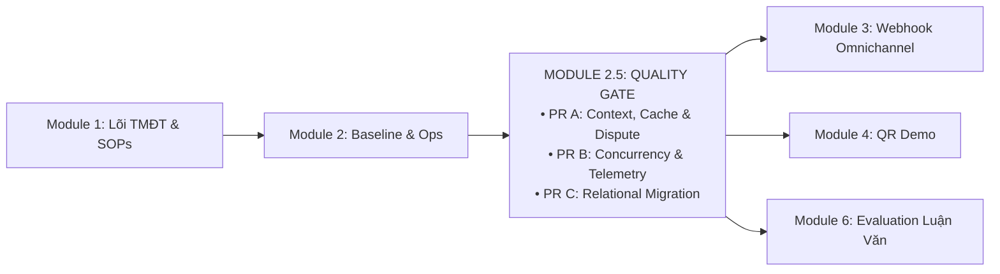

# KẾ HOẠCH MODULE 2.5: SYSTEM HARDENING, CONTEXT INTEGRITY & VERIFICATION QUALITY GATE

> **Mã kế hoạch:** `PLAN_MODULE_2_5_HARDENING_VERIFICATION`  
> **Trạng thái:** ACTIVE IMPLEMENTATION PLAN  
> **Phiên bản:** 1.0 (2026-09-28)  
> **Audit basis / Documentation baseline reviewed:** `b93eb5a`  
> **Mục tiêu:** Thiết lập chốt chặn kiểm thử & ổn định vận hành thực tế (Quality Gate) giữa Module 2 (Baseline & Ops Console) và Module 3 (Omnichannel Meta Webhook). Khắc phục dứt điểm 10 lỗi kỹ thuật và khoảng trống kiến trúc (F01–F10) được kiểm chứng độc lập.  
> **Tham chiếu lộ trình:** [PLAN_ROADMAP_INDEX.md](PLAN_ROADMAP_INDEX.md) · [PLAN_CONCURRENCY_RELATIONAL_KNOWLEDGE_SPRINT.md](PLAN_CONCURRENCY_RELATIONAL_KNOWLEDGE_SPRINT.md)

---

## 1. Bối Cảnh & Định Vị Module 2.5

Hệ thống RetailOps 2026 đã hoàn thành các phân hệ nền tảng (Module 1 Lõi TMĐT, Module 2 Baseline 250 ca & Ops Console). Tuy nhiên, qua đợt kiểm toán kỹ thuật chuyên sâu tại commit `1da07f0`, hệ thống bộc lộ các bẫy lỗi logic và điểm nghẽn concurrency cần được xử lý dứt điểm trước khi mở rộng kênh giao tiếp người dùng bên ngoài:
1. **Rò rỉ ngữ cảnh qua Cache (F01 & F02)**: Semantic Cache trả dữ liệu bảo hành của sản phẩm khác (P-603 vs P-602) và ghi turn ngoài `conv_lock`.
2. **Nuốt ngoại lệ hạ tầng (F03)**: `dispute_agent` nuốt `ApiError(429/503)` và trả về thành công giả lập.
3. **Đề xuất và ngữ cảnh không trung thực (F04, F05, F06)**: Tạo đề xuất hủy đơn đã giao (`delivered`); lấy nhầm `product_id` cũ khi đổi đơn mới; bỏ qua màu sắc và tự gán size L khi đổi size.
4. **Concurrency chưa bảo vệ headroom HTTP (F07)**: Waitress 8 threads có thể bị chiếm dụng toàn bộ khi GPU bận; thiếu header `Retry-After: 5`.
5. **Thiết kế migration cần tường minh (F10)**: Tránh nhảy cóc version migration giữa SQLite và PostgreSQL; đồng bộ đúng file `pg_schema.py`.

---

## 2. Phân Kỳ 3 Pull Request (PR A, PR B, PR C)

### 2.1. PR A — Context, Cache & Dispute Correctness (Ưu tiên P1)
* **Phạm vi xử lý:** F01, F02, F03, F04, F05, F06.
* **Tệp tác động:**
  - `retailops/business/cache.py`:
    - Hàm `is_cacheable_query(text)` chỉ chấp nhận các câu hỏi FAQ độc lập ngữ cảnh; cấm cache khi phiên chat đang có `product_id` hoặc `order_id`.
    - Bảo toàn và khôi phục đầy đủ `sources` hợp lệ khi cache-hit.
  - `retailops/business/application.py`:
    - Đưa luồng ghi turn của Semantic Cache vào bên trong phạm vi kiểm soát của `conv_lock`.
  - `retailops/workflow/subagents/dispute_agent.py`:
    - Bắt riêng lỗi parse; re-raise `ApiError(429/503/504)` ra tầng HTTP.
    - Chỉ tạo `action_proposal.cancel_order` khi tool `prepare_cancellation` trả về `eligible=True`.
    - Ưu tiên `product_id` của bản ghi đơn hàng mới tra cứu, không lấy `bound_context.product_id` của đơn cũ.
    - Lấy đúng màu và size từ yêu cầu; không tự động mặc định `color='Tiêu chuẩn'` gây cộng dồn tồn kho sai lệch.

### 2.2. PR B — Concurrency, Headroom & Truthful Telemetry (Ưu tiên P1/P2)
* **Phạm vi xử lý:** F07, F09, BUG-01, BUG-04.
* **Tệp tác động:**
  - `retailops/bootstrap.py` & `retailops/inference_gate.py`:
    - Áp dụng công thức Headroom an toàn: Với Waitress `threads=8` và GPU `slots=1`, cấu hình hàng đợi `max_queue=5` (luôn dành ít nhất 2 threads cho `/health`, `/api/session`, và static routes).
  - `retailops/http/public.py` & `retailops/http/private.py`:
    - Bổ sung header `Retry-After: 5` khi trả mã lỗi HTTP 429.
  - Dọn sạch `self.agent_lock` đồng bộ ở cả `Application`, `identity/demo.py`, `persistent.py`, `postgres.py` và cập nhật các unit test trong `tests/test_conversation.py`.
  - `tests/test_schema_migration.py` & `tests/test_providers.py`:
    - Đóng tường minh connection SQLite bằng `contextlib.closing()` hoặc `try/finally db.close()`.
  - `retailops/business/application.py`:
    - Đo đạc thời gian model I/O thực tế tách biệt với queue wait time; không dùng 0.0 giả lập cho độ trễ chưa đo.

### 2.3. PR C — Relational Knowledge & Clean Schema Migration (Ưu tiên P2)
* **Phạm vi xử lý:** F10, ADR AGE vs SQL Relational.
* **Tệp tác động:**
  - `retailops/storage/pg_schema.py`:
    - Phân tách bước migration từ v3 -> v4 (Catalog) và từ v4 -> v5 (`product_policy_links`).
  - `retailops/schema.py` & `retailops/business/schema.py`:
    - Thiết kế migration tương ứng trên SQLite nâng schema tuần tự.
  - `retailops/business/store.py`:
    - Seed dữ liệu chuẩn xác cho `product_policy_links`: `P-603` (Giày lười da bò cao cấp) liên kết chính sách bảo hành 180 ngày.
    - Chuẩn hóa tên sản phẩm: `P-601` (Áo sơ mi lụa công sở), `P-602` (Quần tây ống đứng), `P-603` (Giày lười da bò).
  - Cập nhật tài liệu: Ghi nhận rõ ADR hoãn Apache AGE trên EC2 production, chính thức thay thế bằng SQL Relational Knowledge Linkage.

---

## 3. Tiêu Chí Nghiệm Thu (Acceptance Criteria)

1. **Cache Isolation**: Hội thoại hỏi P-603 (180 ngày) không bao giờ làm hội thoại P-602 trả về 180 ngày khi hỏi cùng câu gián tiếp.
2. **Serialization**: Không có turn nào được ghi vào DB ngoài khóa `conv_lock`.
3. **No Infrastructure Error Swallowing**: Khi gateway gặp 429/503, HTTP trả đúng mã 429/503 kèm header `Retry-After: 5`; trace ghi nhận chính xác lỗi.
4. **Truthful Proposals**: Đơn hàng đã giao (`delivered`) không thể tạo đề xuất hủy và không thông báo mở bảng xác nhận hủy.
5. **Order/Product Sync**: Đổi sang đơn mới thì thông tin sản phẩm và bảo hành phải lấy từ đơn mới.
6. **Variant Accuracy**: Đổi size phải kiểm tra đúng màu và size; thiếu thông tin thì hỏi lại, không tự gán mặc định.
7. **Thread Headroom**: Dưới tải 8 request đồng thời, route `/health` và đọc session vẫn phản hồi trong ngưỡng cho phép.
8. **Clean Schema Upgrade**: Migration nâng cấp thành công từ clean DB, SQLite v3 và PostgreSQL v3/v4; rollback khi có lỗi DDL.
9. **Doc Contract**: 4/4 cổng hợp đồng tài liệu và triển khai đạt PASS 100%.
