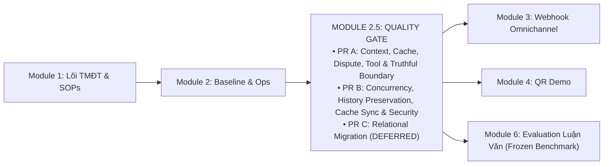

# KẾ HOẠCH MODULE 2.5: SYSTEM HARDENING, CONTEXT INTEGRITY & VERIFICATION QUALITY GATE

> **Mã kế hoạch:** `PLAN_MODULE_2_5_HARDENING_VERIFICATION`  
> **Trạng thái:** ACTIVE IMPLEMENTATION PLAN  
> **Phiên bản:** 1.2 (2026-10-01)  
> **Audit basis / Documentation baseline reviewed:** `c30ff1d`  
> **Mục tiêu:** Thiết lập chốt chặn kiểm thử & ổn định vận hành thực tế (Quality Gate) giữa Module 2 (Baseline & Ops Console) và Module 3 (Omnichannel Meta Webhook). Khắc phục dứt điểm 11 lỗi kỹ thuật và khoảng trống kiến trúc (F01–F07, F08a, F09, F11–F13, SEC-01) được kiểm chứng độc lập. Mỗi hạng mục chuẩn hóa đầy đủ: tệp/hàm liên quan, hành vi mong đợi, test tương ứng và trạng thái kiểm chứng.  
> **Tham chiếu lộ trình:** [PLAN_ROADMAP_INDEX.md](PLAN_ROADMAP_INDEX.md) · [PLAN_CONCURRENCY_RELATIONAL_KNOWLEDGE_SPRINT.md](PLAN_CONCURRENCY_RELATIONAL_KNOWLEDGE_SPRINT.md) · [PLAN_PR_A_CONTEXT_CACHE_DISPUTE.md](PLAN_PR_A_CONTEXT_CACHE_DISPUTE.md)

---

## 1. Bối Cảnh & Định Vị Module 2.5

Hệ thống RetailOps 2026 đã hoàn thành các phân hệ nền tảng (Module 1 Lõi TMĐT, Module 2 Baseline 250 ca & Ops Console). Tuy nhiên, qua đợt kiểm toán kỹ thuật chuyên sâu tại commit `1da07f0`, `11c3048` và đợt rà soát kiến trúc độc lập, hệ thống bộc lộ các bẫy lỗi logic, an toàn dữ liệu, bảo mật và điểm nghẽn concurrency cần được xử lý dứt điểm trước khi mở rộng kênh giao tiếp người dùng bên ngoài:
1. **Rò rỉ ngữ cảnh qua Cache (F01 & F02)**: Semantic Cache trả dữ liệu bảo hành của sản phẩm khác (P-603 vs P-602) và ghi turn ngoài `conv_lock`.
2. **Nuốt ngoại lệ hạ tầng (F03)**: `dispute_agent` và `Application.execute()` nuốt lỗi hạ tầng (429/503/timeout) và trả về thành công giả lập.
3. **Đề xuất và ngữ cảnh không trung thực (F04, F05, F06, F08a)**: Tạo đề xuất hủy đơn đã giao (`delivered`); lấy nhầm `product_id` cũ khi đổi đơn mới; bỏ qua màu sắc và tự gán size L khi đổi size; bot và UI staff tuyên bố sai sự thật về trạng thái tạo phiếu, giữ kho và vận đơn.
4. **Crash 500 khi sản phẩm thiếu category (F11)**: Tạo sản phẩm với `category=None` khiến `retailops_tools.py:50` ném `TypeError` sập luồng chat của mọi người dùng khi tìm kiếm sản phẩm.
5. **Mất mát lịch sử chat vĩnh viễn (F12)**: `finish_turn()` thực hiện `DELETE FROM agent_turns ... LIMIT 6` làm mất hoàn toàn lịch sử chat ngoài 6 lượt gần nhất, hỏng tính năng resume và transcript CSKH.
6. **Lệch Tool Cache & Race Condition khi Invalidate (F13)**: Manager đổi trạng thái đơn hàng nhưng chỉ xóa cache trong instance `Application` của Manager, bỏ sót active sessions của Customer; race condition giữa Manager invalidation và turn chat in-flight.
7. **Lỗ hổng bảo mật OAuth Login CSRF (SEC-01)**: Endpoint `/auth/google/login` tạo state nhưng không ràng buộc với cookie/session trình duyệt khởi tạo, vi phạm RFC 6749 §10.12.
8. **Concurrency chưa bảo vệ headroom HTTP (F07 & F09)**: Waitress 8 threads có thể bị chiếm dụng toàn bộ khi GPU bận; thiếu header `Retry-After: 5`; telemetry ghi nhận `0.0` giả lập thay vì thời gian I/O thực.

---

## 2. Chi Tiết Các Hạng Mục Kỹ Thuật (Itemized Technical Specifications)

Mọi hạng mục bắt buộc chuẩn hóa theo 4 thuộc tính: **Tệp & Hàm liên quan**, **Hành vi mong đợi**, **Test tương ứng**, và **Trạng thái**.

### 2.1. Phân Kỳ PR A — Context, Cache, Dispute Correctness, Tool Safety & Truthful Boundary

#### [F01] An Toàn Cache 3 Yếu Tố (Tri-Factor Cache Safety) `[CHƯA KIỂM CHỨNG / PENDING TEST]`
- **Tệp & Hàm liên quan:**
  - `retailops/business/cache.py`: `is_cacheable_query(text, context=None)`.
  - `retailops/business/application.py`: `chat()` (dòng kiểm tra Semantic Cache lookup và store).
- **Hành vi mong đợi:**
  1. *Lớp 1 (Query Filter)*: Từ chối câu hỏi chứa mã đơn cụ thể (`ORDER_PATTERN`), mã sản phẩm (`PRODUCT_PATTERN`), ý định mutation (`MUTATION_PATTERN`), hoặc đại từ chỉ định phụ thuộc ngữ cảnh ("món này", "đơn này", "sản phẩm này", "áo này", "quần này", "này").
  2. *Lớp 2 (Context Guard)*: Bắt buộc bypass cache 100% nếu snapshot hội thoại đang có `order_id` hoặc `product_id`.
  3. *Lớp 3 (Response Provenance Guard)*: **TUYỆT ĐỐI KHÔNG GHI VÀO SEMANTIC CACHE** nếu turn đã gọi **BẤT KỲ tool nào** (`trace.get('tool_count', 0) > 0` hoặc danh sách tool executed, kể cả read tools như `get_current_time`), hoặc có tri thức truy xuất RAG (`bound.knowledge.searches`), trích dẫn `sources`, hoặc `bound.versions`.
- **Test tương ứng:** `tests/test_pr_a_correctness.py::test_f01_cross_product_cache_leak`, `tests/test_pr_a_correctness.py::test_f01_tool_execution_provenance_guard`.

#### [F02] Tuần Tự Hóa & Tái Thẩm Định Snapshot Khi Cache-Hit `[CHƯA KIỂM CHỨNG / PENDING TEST]`
- **Tệp & Hàm liên quan:**
  - `retailops/business/application.py`: `chat()`.
  - `retailops/inference_gate.py`: `get_conversation_lock(conv_key)`.
- **Hành vi mong đợi:**
  1. Yêu cầu vào chat $\rightarrow$ Chạy Replay #1 fast-path (read-only, 0 lock, 0 GPU).
  2. Lấy `conv_lock.acquire(blocking=False)`. Thất bại $\rightarrow$ Ném ngay HTTP 429 `model_busy`.
  3. **Dưới `conv_lock`**: Chạy Replay #2 bắt request thắng đua vừa commit.
  4. **Reload & Revalidate Snapshot**: Gọi lại `snapshot = self.store.snapshot(customer, cid)` dưới lock để nạp trạng thái mới nhất từ database. Nếu request trước đó đã cập nhật `order_id`/`product_id`, snapshot mới phản ánh ngay lập tức.
  5. Chỉ khi snapshot mới nhất hợp lệ và đủ điều kiện mới accept cache hit và gọi `self.store.finish_turn(...)` an toàn dưới `conv_lock`. Tuyệt đối không commit từ snapshot pre-lock cũ.
- **Test tương ứng:** `tests/test_pr_a_correctness.py::test_f02_cache_hit_under_lock`, `tests/test_pr_a_correctness.py::test_f02_snapshot_revalidation_under_lock`.

#### [F03] Chuẩn Hóa Ranh Giới Lỗi Hạ Tầng & Re-raise Ngoại Lệ `[CHƯA KIỂM CHỨNG / PENDING TEST]`
- **Tệp & Hàm liên quan:**
  - `retailops/business/application.py`: `execute(name, arguments)`.
  - `retailops/workflow/subagents/dispute_agent.py`: `run_dispute_agent()`.
  - `retailops/business/store.py`: `connection()`.
- **Hành vi mong đợi:**
  1. Trong `Application.execute()`: Kiểm tra `exc.status`. Nếu `exc.status == 429` hoặc `exc.status >= 500` (lỗi hạ tầng, DB timeout, vLLM rớt kết nối) $\rightarrow$ **Re-raise** ra ngoài để fail turn. Chỉ lỗi 4xx nghiệp vụ mới chuyển thành dict tool result.
  2. Trong `dispute_agent.py`: Xóa bỏ các khối broad `except Exception` nuốt lỗi; lỗi hạ tầng nổi lên HTTP trả mã 503/429 chuẩn xác, không biến thành "không tìm thấy đơn" hay "shop đã ghi nhận".
  3. Trong `store.py:connection()`: Bọc `sqlite3.OperationalError` thành `ApiError(503, 'database_unavailable')`.
- **Test tương ứng:** `tests/test_pr_a_correctness.py::test_f03_infrastructure_error_execute`, `tests/test_pr_a_correctness.py::test_f03_db_outage_storage_boundary`.

#### [F04] Kiểm Tra Toàn Diện Kết Quả Tool Hủy Đơn `[CHƯA KIỂM CHỨNG / PENDING TEST]`
- **Tệp & Hàm liên quan:**
  - `retailops/workflow/subagents/dispute_agent.py`: Khối xử lý `prepare_cancellation`.
  - `retailops_tools.py`: `prepare_cancellation(order_id)`.
- **Hành vi mong đợi:**
  - Kiểm tra toàn diện kết quả: `isinstance(result, dict) and not result.get("error") and result.get("eligible") is True and result.get("order", {}).get("id") == chosen_oid`.
  - Với đơn hàng đã giao (`delivered`), tool trả `eligible=False` $\rightarrow$ Tuyệt đối KHÔNG tạo `action_proposal.cancel_order`; giải thích trung thực đơn đã giao không thể hủy.
- **Test tương ứng:** `tests/test_pr_a_correctness.py::test_f04_cancellation_delivered_order_rejected`.

#### [F05] Phân Giải Thứ Tự Ưu Tiên Đơn Hàng Mới `[CHƯA KIỂM CHỨNG / PENDING TEST]`
- **Tệp & Hàm liên quan:**
  - `retailops/workflow/subagents/dispute_agent.py`: Khối trích xuất mã đơn và sản phẩm.
- **Hành vi mong đợi:**
  - Khi khách đang xem đơn O-101 và chat đề cập đơn O-102: Mã đơn explicit trong tin nhắn hiện tại thắng tuyệt đối $\rightarrow$ Gọi `get_order('O-102')` và trích xuất `product_id` từ đơn mới này; không dùng `bound_context.product_id` của đơn O-101 cũ.
- **Test tương ứng:** `tests/test_pr_a_correctness.py::test_f05_new_explicit_order_beats_stale_focus`.

#### [F06] Phân Loại Tồn Kho Biến Thể Chính Xác `[CHƯA KIỂM CHỨNG / PENDING TEST]`
- **Tệp & Hàm liên quan:**
  - `retailops/workflow/subagents/dispute_agent.py`: Khối xử lý đổi size / check inventory.
- **Hành vi mong đợi:**
  - Trích xuất màu và size từ yêu cầu, giữ nguyên màu đơn gốc nếu không nêu màu mới; hỏi lại nếu mơ hồ, không tự ép size L hay color="Tiêu chuẩn".
  - Phân biệt rõ 4 trạng thái: (1) `variant_not_found` (biến thể không có trong catalog), (2) `stock_unknown` (catalog có hàng nhưng trường `stock=None`), (3) `stock == 0` (hết hàng), (4) `stock > 0` (còn hàng).
- **Test tương ứng:** `tests/test_pr_a_correctness.py::test_f06_variant_not_found`, `tests/test_pr_a_correctness.py::test_f06_stock_unknown`.

#### [F08a] Ranh Giới Ngôn Từ Đổi Hàng Trung Thực (Truthful Wording) `[CHƯA KIỂM CHỨNG / PENDING TEST]`
- **Tệp & Hàm liên quan:**
  - `retailops/workflow/subagents/dispute_agent.py`.
  - `web/app.js`: `approveExchange1to1()`, `approveExchangeSize()`.
  - `web/index.html`: Nhãn nút Staff Desk.
- **Hành vi mong đợi:**
  - Bot AI: Chỉ thông báo "đã xác định được phương án phù hợp"; KHÔNG nói "đã tạo phiếu", "xem đề xuất trên màn hình" hay "chuyển chuyên viên CSKH duyệt" khi chưa có UI render proposal và chưa persist ticket.
  - Staff Desk: Đổi nhãn nút sang "Xác nhận tiếp nhận Đổi hàng"; gửi phản hồi tiếp nhận qua chat; KHÔNG tuyên bố duyệt thành công, giữ kho tổng hay tạo vận đơn bưu cục.
- **Test tương ứng:** `tests/test_pr_a_correctness.py::test_f08a_truthful_ai_wording`, `tests/test_pr_a_correctness.py::test_f08a_staff_button_wording`.

#### [F11] An Toàn Duyệt Catalog Khi Thiếu Category `[CHƯA KIỂM CHỨNG / PENDING TEST]`
- **Tệp & Hàm liên quan:**
  - `retailops_tools.py`: `search_products(query)`.
- **Hành vi mong đợi:**
  - Bọc `cat = p.get('category') or ''` và ép kiểu danh sách `aliases` chuỗi trước khi nối chuỗi tìm kiếm.
  - Loại bỏ triệt để nguy cơ `TypeError` sập luồng chat khi Manager tạo sản phẩm mang `category=None`.
- **Test tương ứng:** `tests/test_pr_a_correctness.py::test_f11_null_category_safe_search`.

---

### 2.2. Phân Kỳ PR B — Concurrency, History Preservation, Cache Sync & Security

#### [F07] Bảo Vệ Headroom HTTP Waitress & Backpressure `[CHƯA KIỂM CHỨNG / PENDING TEST]`
- **Tệp & Hàm liên quan:**
  - `retailops/bootstrap.py`: Cấu hình tham số khởi chạy.
  - `retailops/inference_gate.py`: `InferenceGate.__init__()`, `enter()`.
  - `retailops/http/public.py`, `retailops/http/private.py`: Trả lỗi 429.
- **Hành vi mong đợi:**
  - Áp dụng công thức Headroom an toàn: Với Waitress `threads=8` và GPU `slots=1`, cấu hình hàng đợi `max_queue=5` (luôn bảo lưu ít nhất 2 threads cho `/health`, `/api/session`, và static assets).
  - Quá tải hàng đợi hoặc timeout (> 10s) $\rightarrow$ Trả về HTTP 429 `model_busy` kèm header `Retry-After: 5`.
- **Test tương ứng:** `tests/test_inference_gate.py::test_inference_queue_overflow_429`.

#### [F09] Tách Biệt Đo Đạc Telemetry & Độ Trễ Model Thật `[CHƯA KIỂM CHỨNG / PENDING TEST]`
- **Tệp & Hàm liên quan:**
  - `retailops/inference_gate.py`: `enter()`, `exit()`.
  - `retailops/business/application.py`: `chat()`.
- **Hành vi mong đợi:**
  - Ghi nhận `queue_wait_ms` thực tế từ lúc xếp hàng đến lúc được cấp permit GPU.
  - Đo thời gian I/O mạng model (`model_latency_ms`) tách biệt hoàn toàn với `queue_wait_ms`.
  - Tăng `trace['model_calls']` trước khi gọi gateway và `trace['model_responses']` sau khi nhận kết quả. Tuyệt đối không dùng `0.0` giả lập cho độ trễ chưa đo.
- **Test tương ứng:** `tests/test_inference_gate.py::test_telemetry_real_queue_wait_and_latency`.

#### [F12] Bảo Toàn Lịch Sử Chat Trong Database `[CHƯA KIỂM CHỨNG / PENDING TEST]`
- **Tệp & Hàm liên quan:**
  - `retailops/business/store.py`: `finish_turn()`, `history()`.
- **Hành vi mong đợi:**
  - Xóa bỏ câu lệnh xóa cứng `DELETE FROM agent_turns ... LIMIT 6` trong `finish_turn()`. Giữ nguyên 100% bản ghi các lượt chat trong DB để phục vụ resume chat trên Web UI và transcript CSKH tại Staff Desk.
  - Việc giới hạn cửa sổ ngữ cảnh (bounded window 6 turns) được thực thi trong bộ nhớ tại `store.history(customer, conversation_id, limit=6)` trước khi đưa vào context prompt của LLM.
- **Test tương ứng:** `tests/test_conversation_resume.py::test_chat_history_retained_beyond_six_turns`.

#### [F13] Xử Lý Race Condition Khi Invalidate Cache & Multi-Tenant ToolCache `[CHƯA KIỂM CHỨNG / PENDING TEST]`
- **Tệp & Hàm liên quan:**
  - `retailops/business/cache.py`: `ToolCache`.
  - `retailops/http/routes.py`: `POST /api/manager/orders/update-status` (dòng 399–415).
  - `retailops/identity/persistent.py`: `PersistentSessions`.
- **Phân tích Xung Đột Race Condition:**
  - Khi Manager cập nhật trạng thái đơn hàng qua `POST /api/manager/orders/update-status`, DB cập nhật `orders.status` và gọi `app.tool_cache.invalidate(row["customer_id"])`.
  - *Nguy cơ 1 (Cross-tenant collision)*: Nếu `ToolCache` dùng chung global namespace, hai tenant có cùng mã khách `C-001` sẽ xóa nhầm hoặc đọc nhầm cache của nhau.
  - *Nguy cơ 2 (In-flight stale write overwrite)*: Khách hàng đang có turn chat in-flight đang gọi tool `get_order`. Ngay sau khi Manager invalidate cache, turn chat của khách ghi đè kết quả tool cũ vào cache, làm tái sinh dữ liệu rác đã lỗi thời.
- **Cơ chế Giải quyết Kỹ thuật:**
  1. *Tenant-Scoped Key*: Khóa cache bắt buộc có cấu trúc `(tenant_id, customer_id, tool_name, args_hash)` đảm bảo cô lập hoàn toàn giữa các tenant.
  2. *Invalidation Epoch / Version Token*: Mỗi customer/tenant duy trì một `cache_epoch`. Khi Manager invalidate, `cache_epoch` tăng lên. Mọi tác vụ ghi cache từ các tool calls bắt đầu trước thời điểm invalidate sẽ bị hủy bỏ (discard stale write), triệt tiêu hoàn toàn race condition.
- **Test tương ứng:** `tests/test_business_api.py::test_manager_update_status_invalidates_tenant_cache`, `tests/test_tool_cache_concurrency.py::test_tool_cache_invalidation_race_discard`.

#### [SEC-01] Ràng Buộc State Chống OAuth Login CSRF `[CHƯA KIỂM CHỨNG / PENDING TEST]`
- **Tệp & Hàm liên quan:**
  - `retailops/http/auth_google.py`: `handle_google_login()`, `handle_google_callback()`.
  - `retailops/http/public.py`: Tuyến điều hướng Google auth.
- **Hành vi mong đợi:**
  - Khi vào `/auth/google/login`: Tạo nonce `oauth_browser_nonce`, gửi cookie `retailops_oauth_transient` (`HttpOnly`, `SameSite=Lax`, `Path=/auth/google`, `Max-Age=600`), gắn `hashlib.sha256(nonce).hexdigest()[:16]` vào payload `state`.
  - Khi Google chuyển hướng về `/auth/google/callback`: Kiểm tra cookie và băm trong `state`. Từ chối ngay HTTP 403 `oauth_state_invalid` nếu thiếu hoặc không khớp. Xóa cookie sau khi đăng nhập thành công.
- **Test tương ứng:** `tests/test_auth_google.py::test_oauth_csrf_state_binding`.

#### [CONV-CLEANUP] Dọn Dẹp Hoàn Toàn Khóa Tồn Dư `self.agent_lock` `[CHƯA KIỂM CHỨNG / PENDING TEST]`
- **Tệp & Hàm liên quan:**
  - `retailops/business/application.py`, `retailops/identity/demo.py`, `retailops/identity/persistent.py`, `retailops/identity/postgres.py`.
- **Hành vi mong đợi:**
  - Gỡ bỏ hoàn toàn biến `self.agent_lock`. Hệ thống chỉ còn duy nhất 2 tầng đồng bộ:
    1. Khóa tuần tự hóa theo từng phiên hội thoại (`conv_lock` per conversation, non-blocking, trả 429 `model_busy` khi đua request).
    2. Cổng kiểm soát tài nguyên GPU (`InferenceGate` với FIFO queue và admission timeout).
- **Test tương ứng:** `tests/test_conversation.py::test_conversation_serialization_no_agent_lock`.

---

### 2.3. Các Hạng Mục Hoãn Triển Khai (Deferred / Out of Scope)

#### [PR C] Bảng `product_policy_links` & Schema Migration v5 `[HOÃN — DEFERRED / FUTURE ADR]`
- **Định vị & Lý do:**
  - Bảng `products` trong cả SQLite và PostgreSQL **đã có sẵn cột `warranty_days`**, và module `retailops/business/warranty.py` (với hàm `resolve_warranty_period` đã pass trong `tests/test_policy_precedence.py`) đã giải quyết trọn vẹn yêu cầu bảo hành 180 ngày cho P-603.
  - Do đó, **giữ nguyên Schema Business ở Version 4 (`BUSINESS_SCHEMA_CURRENT = 4`)** cho cả PR A và PR B. Không thực hiện migration v5 ở giai đoạn này để triệt tiêu rủi ro lỗi DDL trên máy chủ EC2.
  - Giữ lại thiết kế DDL `product_policy_links` như một Future ADR cho giai đoạn sau khi cần ánh xạ nâng cao các chính sách đổi hàng, trả hàng, vận chuyển (`return`, `exchange`, `shipping`).

#### [F08b] Vòng Đời Duyệt Đổi Hàng Bền Vững (Durable Exchange Approval Lifecycle) `[HOÃN — DEFERRED / FUTURE ADR]`
- **Định vị & Lý do:**
  - Xây dựng bảng lưu trữ bền vững `exchange_requests`, API xác nhận của khách (`POST /api/exchange-proposals`), API phê duyệt của nhân viên (`POST /api/staff/exchange/approve`), queue tự động và state machine 2-stage hoàn chỉnh.
  - Được hoãn lại, yêu cầu thiết kế kiến trúc và đặc tả kỹ thuật độc lập trong giai đoạn sau Module 2.5, tuyệt đối không gộp vào PR A hay PR B.

---

## 3. Bảo Vệ Bộ Benchmark 250 Ca Đã Đóng Băng (Frozen Baseline Protection)

> [!IMPORTANT]
> **Nguyên Tắc Bất Biến Về Dữ Liệu Thực Nghiệm Khoa Học Cho Luận Văn:**
> 1. **Frozen Baseline**: Toàn bộ **250 kịch bản Master Benchmark** (phân bổ qua các nhóm nghiệp vụ Tra cứu đơn, Hủy đơn, Đổi hàng, Bảo hành, Khiếu nại, Out-of-scope) là bộ dữ liệu đánh giá **ĐÃ ĐÓNG BĂNG**.
> 2. **Không Thay Đổi Benchmark**: Tuyệt đối KHÔNG thay đổi câu hỏi, không nới lỏng tiêu chí chấm điểm, và không lọc bỏ các ca khó để "làm đẹp" số liệu độ chính xác (Router Accuracy / Resolution Rate).
> 3. **Cơ Sở Đo Lường Đối Chứng Module 6**: Mọi thực nghiệm so sánh khoa học giữa mô hình self-hosted Gemma-4-12B và DeepSeek Cloud API trong Chương 4 Luận văn tốt nghiệp bắt buộc phải chạy trên cùng một bộ 250 kịch bản cố định này để bảo đảm tính khách quan, có thể tái lập (reproducibility) và trung thực học thuật.

---

## 4. Tiêu Chí Nghiệm Thu Toàn Diện (Acceptance Criteria)

| Mã | Nội dung Nghiệm thu | Hành vi Kỳ vọng | File Kiểm thử | Trạng thái |
| :---: | :--- | :--- | :--- | :---: |
| **AC-01** | Cache Context Isolation (F01) | Hội thoại P-603 không làm rò rỉ cache sang P-602; câu hỏi có context động bypass cache 100%; turn gọi bất kỳ tool nào không được ghi cache. | `tests/test_pr_a_correctness.py` | `PENDING TEST` |
| **AC-02** | Serialization & Snapshot Reval (F02) | Turn AI/cache trên `/api/chat` commit an toàn dưới `conv_lock`; dưới lock reload snapshot DB trước khi accept cache hit; loser nhận HTTP 429. | `tests/test_pr_a_correctness.py` | `PENDING TEST` |
| **AC-03** | No Error Swallowing (F03) | Lỗi hạ tầng (5xx, 429, timeout) được re-raise thành HTTP 503/429; không nuốt thành "không tìm thấy đơn" hay "shop đã ghi nhận". | `tests/test_pr_a_correctness.py` | `PENDING TEST` |
| **AC-04** | Truthful Proposals (F04) | Đơn hàng `delivered` không thể tạo đề xuất hủy và không mở bảng xác nhận hủy trên giao diện. | `tests/test_pr_a_correctness.py` | `PENDING TEST` |
| **AC-05** | Order/Product Precedence (F05) | Đổi sang đơn mới trong hội thoại thì thông tin sản phẩm và bảo hành trích xuất từ đơn mới. | `tests/test_pr_a_correctness.py` | `PENDING TEST` |
| **AC-06** | Variant Accuracy (F06) | Đổi size kiểm tra đúng màu và size; phân biệt `variant_not_found`, `stock_unknown`, hết hàng và còn hàng; không tự gán mặc định. | `tests/test_pr_a_correctness.py` | `PENDING TEST` |
| **AC-07** | Tool Search Safety (F11) | Catalog chứa sản phẩm `category=None` không gây lỗi `TypeError` khi gọi `search_products`. | `tests/test_pr_a_correctness.py` | `PENDING TEST` |
| **AC-08** | Truthful Exchange Wording (F08a) | AI không nói "đã tạo phiếu"; nút Staff Desk không tuyên bố duyệt giữ hàng kho hay tạo vận đơn khi chưa có backend transaction. | `tests/test_pr_a_correctness.py` | `PENDING TEST` |
| **AC-09** | Thread Headroom & 429 (F07) | Waitress 8 threads bảo lưu ít nhất 2 threads cho static/health; hàng đợi tối đa 5 requests; trả 429 kèm `Retry-After: 5`. | `tests/test_inference_gate.py` | `PENDING TEST` |
| **AC-10** | Real Telemetry & Latency (F09) | Ghi nhận tách biệt `queue_wait_ms` và `model_latency_ms`; không dùng `0.0` giả lập. | `tests/test_inference_gate.py` | `PENDING TEST` |
| **AC-11** | Chat History Retention (F12) | Lịch sử chat không bị xóa cứng LIMIT 6 trong DB; F5 và API `/api/conversations` trả về đầy đủ toàn bộ các lượt chat. | `tests/test_conversation_resume.py` | `PENDING TEST` |
| **AC-12** | Multi-tenant Cache Sync & Race (F13) | Manager đổi đơn qua `POST /api/manager/orders/update-status` $\rightarrow$ invalidate shared `ToolCache` theo tenant; discard stale writes in-flight. | `tests/test_business_api.py` | `PENDING TEST` |
| **AC-13** | OAuth CSRF Protection (SEC-01) | Callback Google OAuth thiếu hoặc không khớp transient session cookie bị từ chối HTTP 403 `oauth_state_invalid`. | `tests/test_auth_google.py` | `PENDING TEST` |
| **AC-14** | Schema v4 SSOT Integrity | Duy trì Schema v4 (`BUSINESS_SCHEMA_CURRENT = 4`); bảo vệ thuộc tính `warranty_days` = 180 cho P-603; không chạy migration v5. | `tests/test_policy_precedence.py` | `VERIFIED PASS` |
| **AC-15** | Doc Contract Integrity | 4/4 cổng hợp đồng tài liệu và triển khai đạt PASS 100%. | `scripts/check_docs_contract.py` | `VERIFIED PASS` |

