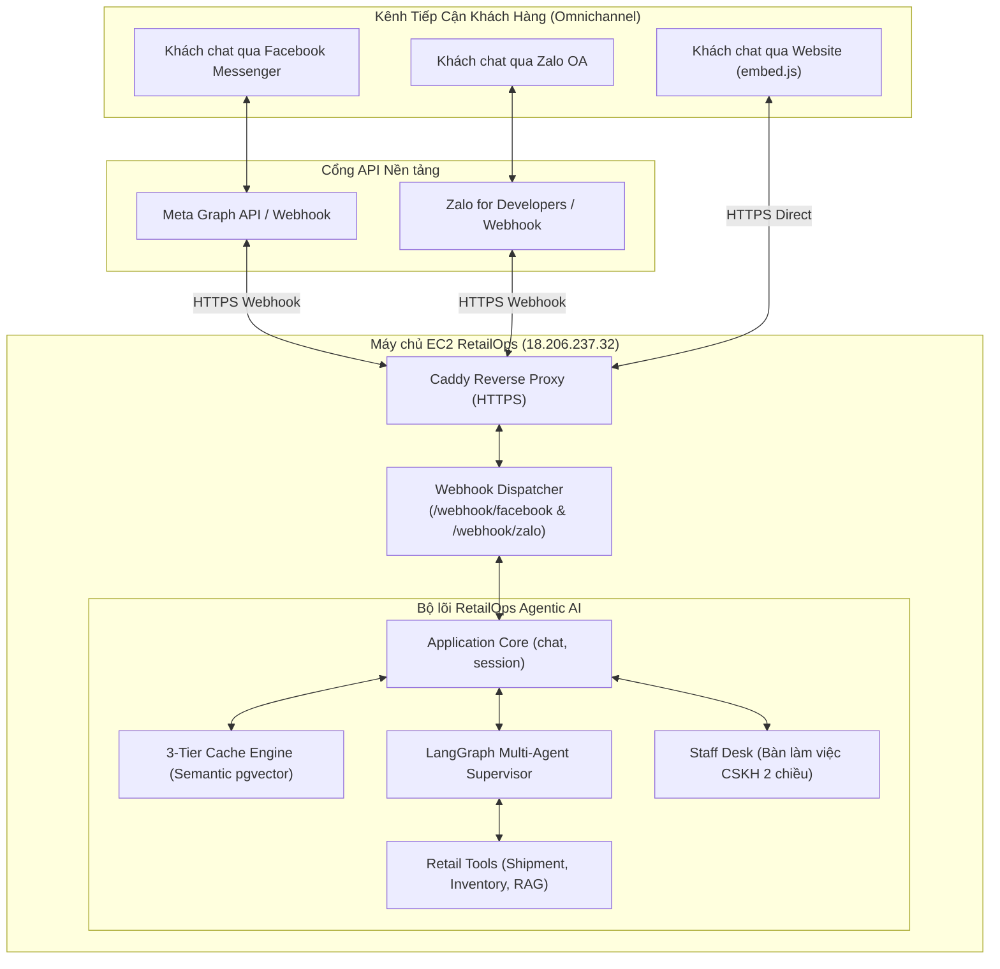

# Kế hoạch Tích hợp Đa kênh Mạng Xã hội (Omnichannel: Facebook Fanpage & Zalo OA)

> [!IMPORTANT]
> **Ưu tiên Triển khai: GIAI ĐOẠN 1 (Phục vụ Kịch bản Demo Live Khóa luận Tốt nghiệp)**  
> Tính năng này biến RetailOps từ ứng dụng web đơn lẻ thành **Hệ thống CSKH Đa kênh (Omnichannel AI Agent)** hoàn chỉnh. Đây là điểm nhấn đột phá nhất trong buổi bảo vệ khóa luận: Hội đồng chấm thi có thể **dùng chính điện thoại cá nhân quét mã QR để chat trực tiếp với AI Agent qua Facebook Messenger hoặc Zalo OA** ngay tại hội trường.

Tài liệu này xác định kiến trúc, quy trình kỹ thuật và lộ trình tích hợp hai kênh mạng xã hội phổ biến nhất tại Việt Nam (**Facebook Fanpage Messenger** và **Zalo Official Account**) vào hệ sinh thái RetailOps.

---

## 1. Mục tiêu & Giá trị Thực tiễn

1. **Khả năng triển khai thực tế (Production Readiness)**:
   - Chứng minh kiến trúc **Headless API** của RetailOps: Tách biệt hoàn toàn tầng AI Agent & Nghiệp vụ với tầng giao diện người dùng, cho phép cắm vào bất kỳ kênh giao tiếp nào.
2. **Định danh khách hàng tự động (Zero-friction Identity)**:
   - Không bắt khách hàng phải nhập mã demo hay đăng nhập thủ công.
   - Tự động ánh xạ `sender_id` (Facebook PSID) hoặc `user_id_by_app` (Zalo) thành `customer_id` riêng biệt, cách ly hoàn toàn dữ liệu giữa các khách hàng.
3. **Kịch bản Demo Live ấn tượng cho Khóa luận**:
   - Trực quan 100%: Chiếu mã QR trên slide thuyết trình. Thầy cô quét mã và chat thử trên điện thoại.
   - Kiểm thử đa kênh tức thì: Khách nhắn trên Messenger/Zalo $\to$ Nhân viên xem và trả lời trên web **Bàn làm việc CSKH (Staff Desk)**.

---

## 2. Kiến trúc Tổng thể Hệ thống Đa kênh



---

## 3. Thiết kế Kỹ thuật Chi tiết

### 3.1. Kênh Facebook Messenger (Meta Graph API)

#### A. Thiết lập trên Meta for Developers
1. Tạo 1 Fanpage Facebook (ví dụ: *RetailOps Smart Store Demo*).
2. Tạo Ứng dụng tại [developers.facebook.com](https://developers.facebook.com/) (loại Business, thêm sản phẩm **Messenger**).
3. Đăng ký Webhook:
   * **Callback URL**: `https://retailops.18-206-237-32.sslip.io/webhook/facebook`
   * **Verify Token**: Chuỗi bảo mật tự đặt trong file môi trường (`FB_VERIFY_TOKEN`).
   * **Subscription Fields**: `messages`, `messaging_postbacks`.
4. Cấp quyền ứng dụng và tạo **Page Access Token** (`FB_PAGE_ACCESS_TOKEN`).

#### B. Xử lý trong Backend RetailOps
* **Xác thực Webhook (`GET /webhook/facebook`)**:
  ```python
  def verify_facebook_webhook(query_params):
      mode = query_params.get("hub.mode")
      token = query_params.get("hub.verify_token")
      challenge = query_params.get("hub.challenge")
      if mode == "subscribe" and token == os.getenv("FB_VERIFY_TOKEN"):
          return 200, challenge
      return 403, "Verification failed"
  ```
* **Tiếp nhận Tin nhắn (`POST /webhook/facebook`)**:
  1. Trích xuất `sender_id = entry['messaging'][0]['sender']['id']`.
  2. Lấy nội dung tin nhắn `text = message['text']`.
  3. Ánh xạ `sender_id` thành `customer_id = f"FB_{sender_id}"`.
  4. Gọi luồng xử lý `app.chat(customer_id, {"text": text, ...})`.
  5. Gửi câu trả lời về Messenger qua Meta API:
     ```bash
     POST https://graph.facebook.com/v19.0/me/messages
     Authorization: Bearer <FB_PAGE_ACCESS_TOKEN>
     {
       "recipient": {"id": sender_id},
       "message": {"text": ai_reply}
     }
     ```

#### C. Tích hợp Meta Handover Protocol (Chuyển quyền cho Meta Business Suite)
* Khi AI phát hiện khách cần gặp người thật (escalation) hoặc công cụ `request_human_support` được gọi:
  1. Backend RetailOps gọi API bàn giao luồng (`pass_thread_control`) của Meta:
     ```bash
     POST https://graph.facebook.com/v19.0/me/pass_thread_control
     Authorization: Bearer <FB_PAGE_ACCESS_TOKEN>
     {
       "recipient": {"id": sender_id},
       "target_app_id": "263902037430900",  # Page Inbox app ID mặc định của Meta
       "metadata": "Khách hàng yêu cầu hỗ trợ người thật từ RetailOps"
     }
     ```
  2. **Trải nghiệm Nhân viên**: Ứng dụng **Meta Business Suite** trên điện thoại nhân viên rung chuông báo tin nhắn mới $\to$ Nhân viên có thể chat trực tiếp với khách bằng app di động mà không cần bật máy tính.
  3. Khi nhân viên xử lý xong và bấm Hoàn tất trên Meta Business Suite (hoặc trên RetailOps Staff Desk), quyền điều khiển được thu hồi lại cho AI (`take_thread_control`).

---

### 3.2. Kênh Zalo Official Account (Zalo OA)

#### A. Thiết lập trên Zalo for Developers
1. Tạo tài khoản Zalo OA tại [oa.zalo.me](https://oa.zalo.me/).
2. Đăng ký Ứng dụng tại [developers.zalo.me](https://developers.zalo.me/) liên kết với OA.
3. Cấu hình Webhook URL: `https://retailops.18-206-237-32.sslip.io/webhook/zalo`.
4. Đăng ký nhận sự kiện: `user_send_text` (Khách gửi tin nhắn văn bản).

#### B. Xử lý trong Backend RetailOps
* **Tiếp nhận Webhook (`POST /webhook/zalo`)**:
  1. Kiểm tra chữ ký MAC từ header `X-ZEvent-Signature` với `ZALO_APP_SECRET`.
  2. Bắt sự kiện `event_name == "user_send_text"`.
  3. Trích xuất `user_id = body['sender']['id']` và `text = body['message']['text']`.
  4. Ánh xạ thành `customer_id = f"ZALO_{user_id}"`.
  5. Gửi qua Agent $\to$ Lấy kết quả $\to$ Gửi lại khách qua Zalo Open API:
     ```bash
     POST https://openapi.zalo.me/v3.0/oa/message/cs
     access_token: <ZALO_ACCESS_TOKEN>
     {
       "recipient": {"user_id": user_id},
       "message": {"text": ai_reply}
     }
     ```

---

### 3.3. Tích hợp Bàn làm việc Tư vấn viên CSKH 2 chiều (Staff Desk)

Hệ thống đã có sẵn module Staff Desk tại [`retailops/http/routes.py`](file:///d:/year_2026/Work_2026/agentic_AI/CSKH_ban_le/retailops/http/routes.py) và [`web/app.js`](file:///d:/year_2026/Work_2026/agentic_AI/CSKH_ban_le/web/app.js):

1. **Khách yêu cầu gặp người thật trên Messenger/Zalo**:
   - Khi khách gõ: *"Cho tôi gặp nhân viên"* hoặc gửi phản hồi giận dữ, AI Agent kích hoạt công cụ `request_human_support`.
   - Phiên chat tự động chuyển cờ `human_handoff = true`.
   - Một thông báo đẩy vào hàng đợi chờ xử lý (`/api/staff/escalations`) trên giao diện web EC2.
2. **Nhân viên tiếp nhận và trả lời trên Web**:
   - Nhân viên CSKH mở giao diện **🎧 Bàn làm việc CSKH**, bấm chọn ca của khách.
   - Khi nhân viên gõ câu trả lời và bấm gửi (`POST /api/staff/reply`), hệ thống tự động nhận diện kênh của khách:
     - Nếu khách đến từ Facebook $\to$ Gửi tin nhắn qua Meta Graph API tới Messenger của khách.
     - Nếu khách đến từ Zalo $\to$ Gửi tin nhắn qua Zalo Open API tới Zalo của khách.
   - Khi giải quyết xong, nhân viên bấm **"✓ Hoàn tất ca"** để kích hoạt lại AI Agent.

---

## 4. Kế hoạch Triển khai (Checklist 5 Bước)

- [ ] **Bước 1**: Tạo file `retailops/http/webhooks.py` chứa router xử lý webhook cho Facebook và Zalo.
- [ ] **Bước 2**: Bổ sung biến môi trường cấu hình trong `/opt/retailops/api.env`:
  - `FB_PAGE_ACCESS_TOKEN`, `FB_VERIFY_TOKEN`
  - `ZALO_OA_ACCESS_TOKEN`, `ZALO_APP_SECRET`
- [ ] **Bước 3**: Viết adapter gửi tin nhắn đi (`retailops/http/social_messenger.py`) hỗ trợ gọi API Meta và Zalo.
- [ ] **Bước 4**: Tạo Fanpage Facebook thử nghiệm và cấu hình Webhook URL trên Meta for Developers.
- [ ] **Bước 5**: Viết unit test giả lập webhook payload (`tests/test_webhooks.py`) và tạo mã QR Demo đưa vào Slide Luận văn.

---

## 5. Giá trị Học thuật & Trình diễn cho Khóa luận

1. **Chương 3 (Thiết kế Kiến trúc Hệ thống)**:
   - Minh chứng tính đa kênh (**Omnichannel Architecture**) và năng lực tích hợp mở của giải pháp Agentic AI so với các giải pháp chatbot truyền thống đơn kênh.
2. **Chương 4 (Thực nghiệm & Đánh giá)**:
   - Bổ sung số liệu thực nghiệm về **độ trễ phản hồi qua webhook mạng xã hội** so với web trực tiếp (thường chỉ chênh lệch 100–200ms do mạng).
3. **Kịch bản Bảo vệ trước Hội đồng**:
   - Chiếu Slide có mã QR.
   - Thầy cô quét mã bằng Messenger/Zalo trên điện thoại cá nhân và trò chuyện trực tiếp $\to$ Trải nghiệm thực tế 100%, tạo ấn tượng vượt trội.
