# KẾ HOẠCH TRIỂN KHAI PR A: CONTEXT, CACHE, DISPUTE & TRUTHFUL BOUNDARY

> **Mã kế hoạch:** `PLAN_PR_A_CONTEXT_CACHE_DISPUTE`  
> **Trạng thái:** ACTIVE IMPLEMENTATION PLAN (DEMO REVISION v1.1)  
> **Phiên bản:** 1.1 (2026-09-28)  
> **Audit basis / Documentation baseline reviewed:** `11c3048`  
> **Thuộc phân hệ:** Module 2.5 — System Hardening & Quality Gate  
> **Mục tiêu:** Khắc phục dứt điểm 6 lỗi logic trọng yếu (F01–F06) và thiết lập ranh giới ngôn từ trung thực (F08a) liên quan đến rò rỉ ngữ cảnh cache, vi phạm serialization phiên chat, nuốt lỗi hạ tầng trong tool execution, đề xuất hủy đơn sai lệch và ngộ nhận trạng thái phê duyệt đổi hàng.  
> **Tài liệu tham chiếu:** [PLAN_MODULE_2_5_HARDENING_VERIFICATION.md](PLAN_MODULE_2_5_HARDENING_VERIFICATION.md) · [PLAN_ROADMAP_INDEX.md](PLAN_ROADMAP_INDEX.md)

---

## 1. Danh Mục Lỗi & Bằng Chứng Tái Hiện (Root Cause Analysis)

| Mã | Tên Lỗi | Vị Trí Code Nguồn | Nguyên Nhân Kỹ Thuật Gốc | Hậu Quả Vận Hành |
| :---: | :--- | :--- | :--- | :--- |
| **F01** | Cache trả bảo hành của sản phẩm khác / Rò rỉ context | `retailops/business/cache.py:22-38`<br/>`retailops/business/application.py:130,159,296-300` | `is_cacheable_query(text)` chỉ dùng blacklist regex trên text thô rồi mặc định `return True`. Không có kiểm tra context và không thể biết trước câu hỏi có cần RAG/citations hay không. Khi cache-hit, dòng 159 gán đè context của snapshot hiện tại vào câu trả lời cũ. | Khách đang xem áo khoác P-102 (90 ngày) hỏi *"Áo này bảo hành bao lâu?"* nhận nhầm câu trả lời cache của áo thun P-101. Rò rỉ thông tin chéo giữa các phiên chat. |
| **F02** | Cache-hit commit ngoài `conv_lock` | `retailops/business/application.py:130-167` | Dòng 166 gọi `self.store.finish_turn()` ghi vào DB trước khi `conv_lock.acquire()` được gọi ở dòng 178. | Hai request đến cùng lúc (1 cache-hit, 1 chat thường) gây race condition, CAS conflict (`conversation_changed`), và thứ tự commit bất định giữa các phiên chat. |
| **F03** | Nuốt lỗi hạ tầng (429/503/timeout) trong tool và worker | `retailops/business/application.py:235-242,302-316`<br/>`retailops/workflow/subagents/dispute_agent.py:100-111,163-174,241-245`<br/>`retailops/business/store.py:68-84` | - Tại `Application.execute()` (dòng 237), mọi `ApiError` đều bị bắt và chuyển đổi thành dict `{'error': exc.code}` (kể cả lỗi hạ tầng 5xx/429/DB timeout).<br/>- Dispute worker bắt broad `except Exception` biến thành `is_order_ok = False` ("không tìm thấy đơn") hoặc trả *"Shop đã ghi nhận"* với `complete=True`.<br/>- `Application.chat()` thực hiện preflight (load snapshot, replay) trước `try` chính, nếu SQLite DB locked (`sqlite3.OperationalError`) sẽ không được chuẩn hóa thành 503. | Che giấu sự cố hạ tầng, client không nhận được mã HTTP 503/429 để retry, vi phạm hợp đồng trung thực (truthfulness) và làm sai lệch telemetry. |
| **F04** | Tạo proposal hủy cho đơn delivered | `retailops/workflow/subagents/dispute_agent.py:82-91,232-237`<br/>`retailops_tools.py:71-79` | Dòng 82 chỉ kiểm tra `if name == "prepare_cancellation" and extracted_oid:`, không kiểm tra `result.get('eligible')`. Tool `prepare_cancellation` trả `eligible: False` cho đơn đã giao (không có key `error`), nhưng worker vẫn sinh `action_proposal`. | Đơn đã giao `O-102` (`delivered`) vẫn bị tạo proposal hủy và bot hiển thị hướng dẫn khách bấm *"Xác nhận hủy"* trên màn hình. |
| **F05** | Đổi đơn mới dùng product_id của đơn cũ | `retailops/workflow/subagents/dispute_agent.py:120-127,183-190` | Dòng 120 và 183 ưu tiên `pid = bound_context.get("product_id")` cũ trước khi kiểm tra dữ liệu từ bản ghi đơn hàng mới tra cứu. | Đang xem đơn O-101 (áo P-101), khách nói *"Đơn O-102 bị rách chỉ"*, worker đọc đơn O-102 nhưng lại tra cứu bảo hành của áo P-101. |
| **F06** | Collapse trạng thái tồn kho & Hardcode size/color | `retailops/workflow/subagents/dispute_agent.py:196-207`<br/>`data/products.json:13-18` | Dòng 196 tự gán mặc định size `"L"`. Dòng 200 hardcode `color="Tiêu chuẩn"`. Dòng 204 dùng `stock_res.get("stock") or 0` gộp `None` thành hết hàng (`stock == 0`). Catalog P-101 chỉ có màu Trắng nhưng hỏi màu Đen bị coi là hết hàng. | Đổi size bị sai lệch hoàn toàn; không phân biệt được biến thể không tồn tại (`variant_not_found`), dữ liệu chưa có (`stock_unknown`) và hết hàng (`stock == 0`). |
| **F08a** | Ngôn từ không trung thực & Hổng UI/Queue Đổi hàng | `retailops/workflow/subagents/dispute_agent.py:147,219`<br/>`web/app.js:1022,1721-1757`<br/>`web/index.html:209-210`<br/>`retailops/business/store.py:771-782` | - Frontend (`web/app.js:1022`) hoàn toàn KHÔNG render proposal card hay nút xác nhận cho `action_proposal` đổi hàng.<br/>- Store `escalations()` chỉ lấy `feedback_type='human_handoff'`, exchange proposal không tự vào queue CSKH.<br/>- Bot tự nói *"Em đã ghi nhận đề xuất trên màn hình"* / *"chuyển chuyên viên CSKH duyệt"*.<br/>- Nút Staff Desk gọi `/api/staff/reply` chỉ là chat text nhưng nút và alert tuyên bố *"Duyệt Đổi Mới 1-1"*, *"Đã tạo vận đơn bưu cục, kho tổng đã xuất giữ hàng"*. | Vi phạm nghiêm trọng tính trung thực trong trải nghiệm người dùng (Truthful UX); ngộ nhận trạng thái xử lý khi chưa có backend transaction bền vững. |
| **F11** | Crash 500 khi sản phẩm thiếu category | `retailops_tools.py:49-50`<br/>`retailops/http/routes.py:290` | `search_products` nối chuỗi trực tiếp `' '.join([p['id'], p['name'], p['category']] + p['aliases'])`. Khi Manager tạo sản phẩm không nhập category (`category=None`), hàm ném `TypeError` sập luồng chat 500 của mọi khách hàng khi duyệt catalog. | Bất kỳ yêu cầu tìm kiếm sản phẩm nào cũng có nguy cơ sập HTTP 500 nếu catalog chứa sản phẩm có `category=None`. |

> [!NOTE]
> **Phân định ranh giới F08:**
> - **F08a (Thuộc phạm vi PR A — Truthful Wording Boundary)**: Sửa toàn bộ ngôn từ của Bot AI và UI Staff Desk đảm bảo trung thực tuyệt đối: Bot chỉ thông báo *"đã xác định được phương án phù hợp"*; KHÔNG nói "đã tạo phiếu", "xem đề xuất trên màn hình", hay "đã gửi chuyên viên CSKH duyệt" khi chưa có UI render và chưa persist ticket. Nút Staff Desk và alert chuyển từ "Duyệt đổi thành công" sang "Xác nhận đã tiếp nhận / Đã gửi phản hồi cho khách", KHÔNG tuyên bố giữ kho hay tạo vận đơn bưu cục.
> - **F08b (Khoảng trống hoãn triển khai — DEFERRED / OUT OF SCOPE FOR MODULE 2.5)**: Việc xây dựng bảng lưu trữ bền vững `exchange_requests`, API xác nhận của khách, API phê duyệt của nhân viên và state machine 2-stage hoàn chỉnh sẽ được thiết kế riêng biệt trong giai đoạn sau Module 2.5, tuyệt đối không gộp vào PR A, PR B hay PR C.

---

## 2. Thiết Kế Kiến Trúc & Sơ Đồ Hệ Thống Duy Nhất

Sơ đồ Mermaid dưới đây mô tả chính xác sự chuyển đổi từ **Hiện trạng tại HEAD (BEFORE)** sang **Kiến trúc mục tiêu của PR A (AFTER)**:

```mermaid
flowchart TB
    %% ==========================================
    %% SUBGRAPH 1: BEFORE — CURRENT HEAD
    %% ==========================================
    subgraph BEFORE["BEFORE — Current HEAD (Race Conditions, Context Leaks & Heuristic Vulnerabilities)"]
        direction TB
        
        B_Req["1. Khách gửi tin nhắn chat<br/>(text, request_id, conversation_id)"] --> B_Snap["2. Load Conversation Snapshot<br/>(Lấy context hiện tại: order_id, product_id)"]
        
        B_Snap --> B_Rep1{"3. Replay #1 Check<br/>(store.replay)"}
        B_Rep1 -- "Hit" --> B_RepRet["Return Replayed Turn<br/>(Fast Path read-only)"]
        
        B_Rep1 -- "Miss" --> B_CacheLookup{"4. Semantic Cache Lookup<br/>(Chỉ regex text thô, MÙ ngữ cảnh)"}
        
        %% BUG F01 & F02 Detail
        B_CacheLookup -- "Hit" --> B_F01["⚠️ BUG F01: Context Leak (Rò rỉ dữ liệu)<br/>- is_cacheable_query() mặc định return True<br/>- Gán đè order_id/product_id của snapshot khách này vào câu trả lời cũ<br/>- Khách hỏi P-102 nhận nhầm thông số của P-101!"]
        
        B_F01 --> B_F02["💥 BUG F02: Race Condition / Vi phạm Serialization<br/>- finish_turn() bị gọi NGOÀI conv_lock!<br/>- 2 request cùng lúc gây CAS conflict, conversation_changed<br/>- Thứ tự commit bất định giữa các phiên chat!"]
        
        B_F02 --> B_CacheRet["Trả về kết quả Cache Hit cho khách"]
        
        B_CacheLookup -- "Miss" --> B_Lock["5. Kiểm tra agent_lock & Acquire conv_lock"]
        B_Lock --> B_Wf["6. Khởi tạo Workflow Checkpoint"]
        B_Wf --> B_Rep2{"7. Replay #2 Check<br/>(Bắt request thắng đua lock)"}
        B_Rep2 -- "Hit" --> B_Rep2Ret["Return Replay"]
        
        B_Rep2 -- "Miss" --> B_Dispute["8. Chạy Subagent: run_dispute_agent()"]
        
        %% Dispute Bugs Detail
        B_Dispute --> B_CancelCall["Khách yêu cầu hủy đơn<br/>Gọi execute('prepare_cancellation')"]
        B_CancelCall --> B_F04["❌ BUG F04: Tạo Proposal BẤT CHẤP Tool Result<br/>- Không kiểm tra result.eligible (đơn delivered O-102 trả eligible=False)!<br/>- Worker vẫn sinh action_proposal.cancel_order<br/>- Bot nói dối: 'Em đã mở bảng xem lại đề xuất hủy...'"]
        
        B_Dispute --> B_InnerTool["Gọi execute('get_order') / 'get_product'"]
        B_InnerTool --> B_F03_In["❌ BUG F03: Nuốt lỗi Hạ tầng<br/>- Application.execute() convert ApiError 5xx thành tool error dict<br/>- Dispute worker try/except Exception nuốt thành is_order_ok=False<br/>- Bot nói dối khách: 'Không tìm thấy đơn hàng'"]
        
        B_Dispute --> B_F05["❌ BUG F05: Stale Context lấn át Đơn mới<br/>- Ưu tiên bound_context.product_id CŨ trước<br/>- Khách đang chat O-101, nói sang O-102<br/>- Bot vẫn lấy product_id của O-101 để tra bảo hành!"]
        
        B_Dispute --> B_SizeCall["Khách đổi size<br/>Gọi execute('check_inventory')"]
        B_SizeCall --> B_F06["❌ BUG F06: Collapse dữ liệu & Hardcode sai<br/>- Hardcode color='Tiêu chuẩn', mặc định size='L'<br/>- stock_res.get('stock') or 0 biến None thành 0<br/>- P-101 chỉ có màu Trắng, hỏi màu Đen bị coi là hết hàng thay vì variant_not_found!"]
        
        B_Dispute --> B_F03_Out["❌ BUG F03 (Outer): Nuốt ngoại lệ toàn cục<br/>- except Exception ngoài cùng nuốt sạch ApiError/429/503<br/>- Gán 'Shop đã ghi nhận' và hoàn thành turn complete=True giả mạo!"]
        
        B_Dispute --> B_F08_Before["❌ BUG F08: Ngôn từ sai sự thật & Hổng Queue nhân viên<br/>- Bot nhận: 'Đã tạo phiếu gửi CSKH duyệt' (thực tế chưa persist, không vào queue)<br/>- UI khách: Không hề render proposal card đổi hàng<br/>- Nút Staff Duyệt: Gọi /api/staff/reply chat text nhưng nhận 'Đã tạo vận đơn, kho đã giữ hàng'!"]
    end

    %% ==========================================
    %% SUBGRAPH 2: AFTER — PR A TARGET
    %% ==========================================
    subgraph AFTER["AFTER — PR A Target (Strict Serialization, Fail-Closed Cache & Truthful Recommendations)"]
        direction TB
        
        A_Req["1. Khách gửi tin nhắn chat<br/>(text, request_id, conversation_id)"] --> A_Snap["2. Load Conversation Snapshot<br/>(Chuẩn hóa SQLite OperationalError -> ApiError 503 tại storage boundary)"]
        A_Snap --> A_Digest["3. Tính toán SHA256 Request Digest"]
        
        A_Digest --> A_Rep1{"4. Replay #1 Fast Path<br/>(Read-only, 0 Lock, 0 GPU)"}
        A_Rep1 -- "Đã commit trước đó" --> A_Rep1Ret["⚡ Trả ngay kết quả Replay cũ<br/>(Không tốn lock, không tốn quota/GPU)"]
        
        A_Rep1 -- "Turn mới" --> A_Lock["5. Kiểm tra agent_lock & Acquire conv_lock non-blocking<br/>(Giữ agent_lock move-only; cleanup triệt để thuộc PR B)"]
        A_Lock -- "Đang bận xử lý" --> A_429["Trả về HTTP 429: model_busy<br/>(Loser nhận 429 ngay, 0 DB commit, 0 model call)"]
        
        A_Lock -- "Đã giữ Lock" --> A_Rep2{"6. Replay #2 (Dưới Lock)<br/>(Bắt concurrent request vừa commit xong)"}
        A_Rep2 -- "Đã commit" --> A_Rep2Ret["Trả kết quả Replay & Release Lock"]
        
        A_Rep2 -- "Turn mới" --> A_CacheElig{"7. Điều kiện Cache Fail-Closed (F01 FIX):<br/>- Không order/product context?<br/>- Không attachment, không deictic words?<br/>- Khớp Allowlist FAQ tĩnh (giờ mở cửa, địa chỉ)?<br/>(Query không rõ ràng -> return False; chính sách/RAG -> bypass)"}
        
        A_CacheElig -- "Thỏa mãn (Allowlist FAQ tĩnh)" --> A_CacheLook{"8. Semantic Cache Lookup"}
        A_CacheElig -- "Không thỏa mãn / RAG / Bối cảnh động" --> A_Bypass["Bypass Cache 100%<br/>(Chuyển sang luồng Workflow)"]
        
        %% Cache hit serialization
        A_CacheLook -- "Hit" --> A_FinLock["✅ F02 FIX: finish_turn() DƯỚI conv_lock<br/>- Commit turn /api/chat an toàn tuyệt đối<br/>- Giải phóng conv_lock trong ExitStack callback<br/>- Không CAS conflict, không rò rỉ dữ liệu"]
        A_FinLock --> A_CacheDone["Trả kết quả Cache Hit cho khách"]
        
        A_CacheLook -- "Miss" --> A_Bypass
        
        A_Bypass --> A_ModelWf["9. Khởi tạo Workflow & Cấp Permit Model<br/>(Chỉ cấp GPU permit khi thực sự gọi model)"]
        A_ModelWf --> A_DispAgent["10. Chạy Dispute Subagent Chuẩn hóa"]
        
        %% Dispute Target Fixes
        A_DispAgent --> A_OrderRes["✅ F05 FIX: Phân giải Thứ tự Ưu tiên Đơn hàng<br/>- Mã đơn explicit trong tin nhắn hiện tại THẮNG TUYỆT ĐỐI<br/>- Gọi get_order(new_id) để lấy dữ liệu mới nhất<br/>- Trích xuất product_id từ chính đơn mới này"]
        
        A_OrderRes --> A_Taxonomy{"✅ F03 FIX: Phân loại Lỗi & Chuẩn hóa Telemetry"}
        
        A_Taxonomy -- "Lỗi Hạ tầng (exc.status >= 500 hoặc == 429)" --> A_Propagate["Propagate / Re-raise Error ra ngoài<br/>- Application.execute() re-raise ApiError hạ tầng<br/>- Ghi model_calls attempt, không nuốt lỗi<br/>- Client nhận đúng HTTP 503/429/500"]
        
        A_Taxonomy -- "Lỗi Nghiệp vụ 4xx (not_found, denied)" --> A_TruthBiz["Giải thích trung thực cho khách<br/>(Ví dụ: Đơn O-999 không thuộc tài khoản của bạn)"]
        
        A_Taxonomy -- "Đơn hàng hợp lệ" --> A_ActionType{"Phân loại Nghiệp vụ"}
        
        %% Hủy đơn (1-stage direct)
        A_ActionType -- "Yêu cầu Hủy đơn" --> A_PrepCancel["Gọi execute('prepare_cancellation')"]
        A_PrepCancel --> A_F04{"✅ F04 FIX: Kiểm tra Toàn diện Tool Result<br/>- result không chứa key error?<br/>- result.eligible is True?<br/>- result.order.id khớp chính xác mã đơn?"}
        A_F04 -- "Đủ điều kiện (Pending)" --> A_MakeProp["Tạo action_proposal & Hiển thị Dialog xác nhận"]
        A_F04 -- "Không đủ điều kiện (Delivered)" --> A_NoProp["TUYỆT ĐỐI KHÔNG TẠO PROPOSAL<br/>Giải thích trung thực: Đơn đã giao không thể hủy"]
        
        %% Đổi hàng / Đổi size
        A_ActionType -- "Đổi size / Đổi hàng" --> A_InvResolve["✅ F06 FIX: Xác định Biến thể Chính xác<br/>- Giữ màu từ đơn gốc nếu khách không nêu màu mới<br/>- Hỏi lại nếu mơ hồ, không tự ép 'Tiêu chuẩn' hay size 'L'"]
        A_InvResolve --> A_StockCheck["Gọi execute('check_inventory', pid, size, color)"]
        A_StockCheck --> A_StockClass{"Phân loại Trạng thái Kho"}
        A_StockClass -- "variant_not_found" --> A_VarNotFound["Báo biến thể không tồn tại trong danh mục<br/>(P-101 không có màu Đen)"]
        A_StockClass -- "stock_unknown" --> A_StockUnk["Báo tồn kho chưa xác định (catalog stock=NULL)"]
        A_StockClass -- "stock == 0" --> A_OutStock["Báo hết hàng chính xác, gợi ý tư vấn mẫu khác"]
        A_StockClass -- "stock > 0" --> A_SizeProp["✅ F08a FIX: Ngôn từ Đổi hàng Trung thực (PR A Boundary)<br/>- AI: 'Size L màu Đen còn hàng. Em đã xác định được một phương án đổi phù hợp này...' (KHÔNG nói 'đã tạo phiếu', KHÔNG nói 'xem trên màn hình')<br/>- UI Staff: Đổi nút thành 'Xác nhận đã tiếp nhận', KHÔNG tuyên bố 'Duyệt đổi thành công', giữ kho hay tạo vận đơn"]
    end

    %% Ghi chú hoãn F08b
    subgraph DEFERRED_NOTE["Ghi chú: F08b Durable Exchange Lifecycle — DEFERRED (Ngoài phạm vi Module 2.5)"]
        direction TB
        F_Note["Vòng đời 2-stage hoàn chỉnh (Khách bấm Xác nhận gửi -> Lưu DB exchange_requests -> Queue Staff Desk -> Nhân viên duyệt/từ chối transaction) được hoãn lại, yêu cầu thiết kế riêng biệt trong giai đoạn sau."]
    end

    A_SizeProp -.->|Hoãn triển khai F08b| DEFERRED_NOTE

    %% ==========================================
    %% STYLING
    %% ==========================================
    classDef bug fill:#ffebee,stroke:#c62828,stroke-width:2px,color:#b71c1c;
    classDef fix fill:#e8f5e9,stroke:#2e7d32,stroke-width:2px,color:#1b5e20;
    classDef fast fill:#e3f2fd,stroke:#1565c0,stroke-width:2px,color:#0d47a1;
    classDef warn fill:#fff3e0,stroke:#ef6c00,stroke-width:2px,color:#e65100;
    classDef note fill:#f5f5f5,stroke:#9e9e9e,stroke-width:1px,stroke-dasharray: 4 4,color:#424242;

    class B_F01,B_F02,B_F04,B_F03_In,B_F05,B_F06,B_F03_Out,B_F08_Before bug;
    class A_FinLock,A_CacheElig,A_OrderRes,A_Taxonomy,A_F04,A_InvResolve,A_SizeProp fix;
    class A_Rep1Ret,B_RepRet fast;
    class A_429,A_Propagate,A_NoProp,A_VarNotFound,A_StockUnk warn;
    class F_Note note;
```



---

## 3. Thiết Kế Kỹ Thuật Chi Tiết Từng Tệp Mã Nguồn

### 3.1. Tệp `retailops/business/cache.py` & `retailops/business/application.py`
1. **Kiến Trúc An Toàn Cache 3 Yếu Tố (Tri-Factor Cache Safety)**:
   Để khắc phục triệt để lỗi F01 mà không làm gãy các unit test hiện hữu trong `tests/test_cache_engineering.py`, an toàn Semantic Cache được kiểm soát chặt chẽ qua 3 lớp phòng vệ độc lập:
   - **Lớp 1: Bộ Lọc Truy Vấn (Query Filter - `is_cacheable_query`)**:
     * Loại bỏ câu hỏi chứa mã đơn cụ thể (`ORDER_PATTERN`), mã sản phẩm (`PRODUCT_PATTERN`), hoặc ý định mutation đổi trả/hủy đơn (`MUTATION_PATTERN`).
     * Loại bỏ câu hỏi chứa đại từ chỉ định phụ thuộc ngữ cảnh ("nó", "món này", "cái này", "sản phẩm này", "đơn này", "áo này", "quần này", "này").
     * Bảo toàn khả năng cacheable cho các câu hỏi chính sách/FAQ chung khi không có context phụ thuộc (đảm bảo tương thích 100% với `tests/test_cache_engineering.py:38-41`).
     ```python
     DEICTIC_PATTERN = re.compile(r'\b(nó|món này|cái này|sản phẩm này|đơn này|áo này|quần này|đây|này)\b', re.IGNORECASE)

     def is_cacheable_query(text: str, context: Optional[dict] = None) -> bool:
         # 1. Bắt buộc từ chối nếu phiên hội thoại đang có context động
         if context and (context.get('product_id') or context.get('order_id')):
             return False
         if not isinstance(text, str):
             return False
         cleaned = text.strip()
         if len(cleaned) < 2 or len(cleaned) > 1000:
             return False
         if ORDER_PATTERN.search(cleaned) or PRODUCT_PATTERN.search(cleaned) or MUTATION_PATTERN.search(cleaned):
             return False
         if DEICTIC_PATTERN.search(cleaned):
             return False
         return True
     ```
   - **Lớp 2: Bảo Vệ Ngữ Cảnh Hội Thoại (Context Guard)**:
     * Tại cả hai chặng `lookup` (đọc) và `store` (ghi), nếu `snapshot` hoặc `bound.context` đang có `product_id` hoặc `order_id` $\rightarrow$ **Bắt buộc bypass cache 100%**.
     * Triệt tiêu hoàn toàn khả năng một câu hỏi "bảo hành bao lâu" khi đang xem giày P-603 bị trả về câu trả lời cache của áo P-101.
   - **Lớp 3: Kiểm Chứng Nguồn Gốc Phản Hồi (Response Provenance Guard tại `application.py:296-300`)**:
     * Tuyệt đối KHÔNG ghi vào Semantic Cache nếu phản hồi được tạo ra có sử dụng tri thức động:
       1. `bound.knowledge.searches`: Đã gọi công cụ tìm kiếm tri thức RAG.
       2. `result.get('sources')`: Phản hồi có trích dẫn nguồn văn bản chính sách/vận chuyển.
       3. `bound.versions`: Đã đọc bản ghi có phiên bản (đơn hàng, tồn kho).
       4. `bound.context.get('product_id')` hoặc `bound.context.get('order_id')`.
     * Chỉ những phản hồi thuần túy mang tính thông tin tĩnh chung (generic answer) mới được phép ghi vào cache.

### 3.2. Tệp `retailops/business/store.py` (Chuẩn hóa Storage Boundary)
1. **Chuẩn hóa Ngoại lệ Cơ sở Dữ liệu tại Storage Boundary**:
   - Do `Application.chat()` thực hiện các thao tác preflight (nạp snapshot, Replay #1, catalog rev) trước khối `try` chính, việc chuẩn hóa ngoại lệ SQLite phải được bọc tại boundary `BusinessStore.connection` hoặc một boundary bao trùm toàn bộ preflight:
     ```python
     # Trong BusinessStore.connection
     except sqlite3.OperationalError as exc:
         db.rollback()
         raise ApiError(503, 'database_unavailable', 'Cơ sở dữ liệu tạm thời gián đoạn. Vui lòng thử lại sau ít phút.') from exc
     ```
   - Đảm bảo mọi lỗi rớt kết nối hoặc lock database ở bất kỳ chặng nào (preflight hay runtime) đều trở thành HTTP 503 chuẩn xác.

### 3.3. Tệp `retailops/business/application.py`
1. **Hợp đồng Tuần tự hóa & Replay 2 Chặng cho AI/Cache Turns**:
   - **Chặng 1 (Replay #1 Fast Path)**: Chạy `store.replay(customer, cid, request_id, digest)` ngay ở đầu hàm `chat()` (0 lock wait, 0 GPU permit). Nếu đã commit trước đó $\rightarrow$ Trả kết quả ngay lập tức.
   - **Chặng 2 (Acquire Lock non-blocking & agent_lock)**:
     - Giữ nguyên kiểm tra `self.agent_lock` (chỉ di chuyển vị trí nếu cần bảo vệ cache serialization; việc dọn dẹp và xóa bỏ hoàn toàn `agent_lock` vẫn thuộc sở hữu của PR B).
     - Lấy `conv_lock = self.inference_gate.get_conversation_lock(conv_key)`. Gọi `conv_lock.acquire(blocking=False)`.
     - Nếu thất bại $\rightarrow$ Ném ngay `ApiError(429, 'model_busy')`. Request thua lock nhận 429 ngay, không commit DB, không tốn inference.
     - Đăng ký `conv_lock.release` qua `ExitStack`.
   - **Chặng 3 (Replay #2 Under Lock)**: Kiểm tra lại `store.replay` dưới lock để bắt kịp request thắng đua vừa commit xong.
   - **Chặng 4 (Cache Lookup & Commit Under Lock)**: Chỉ lookup khi thỏa mãn `is_cacheable_query(text, context=snapshot)`. Khi cache hit, gọi `self.store.finish_turn(...)` **bên trong phạm vi bảo vệ của `conv_lock`**.
   - **Chặng 5 (Workflow Execution)**: Đi tiếp vào workflow multi-agent, chỉ xin inference permit khi thực sự gọi model.
2. **Sửa `Application.execute()` — Chặn nuốt lỗi hạ tầng (F03 Tool Contract)**:
   - Sửa chính xác theo thuộc tính `exc.status` (HTTP status number int) thay vì so sánh nhầm `exc.code`:
     ```python
     try:
         res = bound(name, arguments)
     except ApiError as exc:
         # Ngoại lệ hạ tầng (HTTP status == 429 hoặc >= 500) BẮT BUỘC re-raise để fail turn
         if exc.status == 429 or exc.status >= 500:
             raise
         # Chỉ các lỗi nghiệp vụ 4xx (404 not found, 403 denied) mới chuyển thành dict tool result
         if name in ('get_order', 'get_context', 'track_shipment', 'prepare_cancellation'):
             bound.context = {'order_id': None, 'product_id': None}
             bound.cancel_order = None
             bound.shipment = None
         return {'error': exc.code, 'message': exc.message}
     ```

### 3.4. Tệp `retailops/workflow/subagents/dispute_agent.py`
1. **Phân loại Lỗi Hạ tầng vs Nghiệp vụ (F03 Taxonomy)**:
   - Xóa bỏ các khối broad `except Exception` nuốt lỗi quanh `get_order` và toàn worker.
   - Ngoại lệ hạ tầng (`ApiError` có `exc.status == 429` hoặc `exc.status >= 500`): Bắt buộc **re-raise** ra ngoài để fail turn và trả mã HTTP tương ứng.
   - Lỗi nghiệp vụ (`order_not_found`, `permission_denied`): Trả lời trung thực lý do từ chối hỗ trợ.
2. **Chuẩn hóa Telemetry Tối thiểu (Không kéo PR B vào PR A)**:
   - Tăng `trace['model_calls']` TRƯỚC khi gọi `gateway.chat(...)` để ghi nhận lượt attempt.
   - Tăng `trace['model_responses']` SAU KHI nhận phản hồi hợp lệ từ model.
3. **Kiểm tra Toàn diện Kết quả Tool Hủy đơn (F04)**:
   - Hợp đồng thực tế của `retailops_tools.py`: Khi đơn ở trạng thái `delivered`, tool trả về `{"order": order, "eligible": False, "transaction_performed": False, ...}` (không có key `error`).
   - Guard condition:
     ```python
     is_eligible = (
         isinstance(result, dict)
         and not result.get("error")
         and result.get("eligible") is True
         and result.get("order", {}).get("id") == chosen_oid
     )
     ```
   - Chỉ tạo `action_proposal` khi `is_eligible is True`. Nếu `False`, phản hồi trung thực: *"Đơn hàng O-xxx hiện ở trạng thái 'delivered', shop không thể hỗ trợ hủy đơn..."* (Không mở dialog xác nhận hủy).
4. **Thứ tự Ưu tiên Đơn hàng Mới (F05 Precedence)**:
   - `Mã đơn explicit trong tin nhắn` $\rightarrow$ `Dữ liệu order từ get_order(new_id)` $\rightarrow$ `product_id trích xuất từ đơn mới này` $\rightarrow$ Chỉ fallback về `bound_context.product_id` cũ nếu tiếp tục xử lý cùng một đơn hàng cũ.
5. **Ngữ nghĩa Biến thể Chính xác (F06 Exact Inventory)**:
   - Trích xuất màu và size từ yêu cầu hoặc giữ nguyên biến thể đơn gốc nếu khách muốn đổi size cùng màu. Hỏi lại khách nếu mơ hồ, không tự ý gán size L hay color="Tiêu chuẩn".
   - Phân biệt rõ 4 trạng thái:
     1. `variant_not_found`: Biến thể không tồn tại trong catalog (ví dụ: P-101 màu Đen).
     2. `stock_unknown`: Catalog có sản phẩm nhưng trường `stock` là `None`/chưa xác định (dữ liệu thiếu, khác với lỗi DB 503).
     3. `stock == 0`: Hết hàng trong kho.
     4. `stock > 0`: Còn hàng sẵn sàng đổi.
6. **Ranh giới Ngôn từ Đổi hàng Trung thực (F08a Truthful Wording)**:
   - Sửa câu chữ thành: *"Dạ em đã kiểm tra kho cho đơn {oid}: Size {target_size} hiện còn {stock_qty} sản phẩm. Em đã xác định được một phương án đổi phù hợp này; nếu anh/chị muốn tiếp tục, hệ thống cần ghi nhận yêu cầu để CSKH xem xét hỗ trợ ạ."*
   - Tuyệt đối KHÔNG nói: *"Em đã tạo phiếu đề xuất"*, *"xem đề xuất trên màn hình"*, hay *"đã gửi chuyên viên CSKH duyệt"*.

### 3.5. Tệp `web/app.js` và `web/index.html`
1. **Sửa Ngôn từ Giao diện Nút Bấm và Alert của Nhân viên (F08a)**:
   - Trong `web/index.html`:
     - Sửa nút `btn-approve-exchange-1to1`: Đổi nhãn từ `✅ Duyệt Đổi Mới 1-1` $\rightarrow$ `📩 Xác nhận tiếp nhận Đổi 1-1`.
     - Sửa nút `btn-approve-exchange-size`: Đổi nhãn từ `✅ Duyệt Đổi Size 2 Chiều` $\rightarrow$ `📩 Xác nhận tiếp nhận Đổi Size`.
   - Trong `web/app.js`:
     - Trong `approveExchange1to1()` và `approveExchangeSize()`: Do nút này chỉ gửi tin nhắn qua `/api/staff/reply`, sửa câu chat gửi cho khách thành:
       *"Dạ chuyên viên CSKH đã tiếp nhận thông tin yêu cầu đổi hàng của đơn {oid}. Shop sẽ liên hệ xác nhận chi tiết hỗ trợ mình sớm nhất ạ."*
     - Sửa alert thông báo: Đổi từ `Đã duyệt thành công! Kho tổng đã ghi nhận giữ hàng` $\rightarrow$ `Đã gửi phản hồi tiếp nhận cho khách hàng qua chat.`
     - Xóa bỏ các tuyên bố sai sự thật: *"Hệ thống đã kết nối bưu cục tạo vận đơn thu hồi..."* và *"Kho tổng đã xuất giữ sản phẩm..."*.

### 3.6. Tệp `retailops_tools.py` — An Toàn Tìm Kiếm Sản Phẩm (F11 Tool Safety)
1. **Xử lý An toàn Khi Duyệt Catalog (`category=None` và `aliases`)**:
   - Trong `search_products`:
     ```python
     query = normalize(args['query']).strip()
     products = []
     for p in self.catalog.products.values():
         cat = p.get('category') or ''
         aliases = [str(a) for a in p.get('aliases', []) if a]
         searchable = normalize(' '.join([str(p.get('id', '')), str(p.get('name', '')), cat] + aliases))
         if query in searchable:
             products.append(p)
     ```
   - Chống văng ngoại lệ `TypeError: sequence item 2: expected str instance, NoneType found` khi catalog chứa sản phẩm tạo từ Manager thiếu danh mục.

---

## 4. Ma Trận Kiểm Thử Hồi Quy (Test Regression Matrix — 26 Scenarios)

| Finding | Kịch bản Kiểm thử (Scenario) | Điều kiện Đầu vào / Kích hoạt | Kỳ vọng Kết quả (Expected Output) | Trạng thái Commit DB? | Tiêu tốn Model Call? |
|---|---|---|---|:---:|:---:|
| **F01** | Cross-product context cache leak | Hội thoại focus `P-102` hỏi "áo này bảo hành bao lâu" | Bypass cache 100% (không dùng cache của P-101); gọi model tra cứu đúng P-102 | Có (sau workflow) | Có (`calls=1, resp=1`) |
| **F01** | Deictic / Context-dependent query | Query chứa "món này", "cái này" | Bypass cache 100% | Có | Có (`calls=1, resp=1`) |
| **F01** | True context-free static FAQ hit | Hội thoại mới KHÔNG có `order_id`/`product_id` hỏi "shop mở cửa mấy giờ" | Cache hit thành công; trả lời FAQ tĩnh | Có (`finish_turn` dưới lock) | **Không (0 call)** |
| **F01** | Policy / Shipping RAG query safety | Query chính sách bảo hành / phí ship không thuộc allowlist tĩnh | Bypass semantic cache trong PR A (`is_cacheable_query -> False`) | Có | Có (`calls=1, resp=1`) |
| **F02** | Same `request_id` replay | Gửi lại cùng `request_id` và cùng `digest` sau khi turn đã commit | Replay #1 hit trả kết quả ngay tức thì; không acquire lock | Không đổi | **Không (0 call)** |
| **F02** | Different `request_id` race | Hai request khác `request_id` gửi đồng thời trên cùng conversation | Request A thắng lock thực thi; Request B nhận **HTTP 429 `model_busy` ngay** | Request A: Có<br/>Request B: Không | Request A: 1 call<br/>Request B: 0 call |
| **F02** | Cache-hit vs Chat race | 1 request cache-hit đua với 1 chat request cùng conversation | Request thắng giữ lock thực thi; request thua nhận **HTTP 429** | 1 turn commit | 0 hoặc 1 call |
| **F02** | Lock release after fatal failure | Request bị lỗi 500 hoặc ngoại lệ giữa chừng khi đang giữ lock | `conv_lock` bắt buộc được release trong ExitStack; request tiếp theo chạy bình thường | Không commit lỗi | `calls=0, resp=0` (nếu preflight) hoặc `calls=1, resp=0` (nếu gateway) |
| **F03** | Infrastructure error in execute() | `bound('get_order')` ném `ApiError(503)` | `execute()` re-raise ra ngoài; KHÔNG nuốt thành dict error | Không commit | `calls=1, resp=1` (tool chạy sau model) |
| **F03** | DB Outage during preflight | Mock DB raise `sqlite3.OperationalError` tại storage boundary | Chuẩn hóa / Re-raise `ApiError(503, 'database_unavailable')` ra ngoài | Không commit | `calls=0, resp=0` (chưa gọi model) |
| **F03** | Model Overload 429 | Gateway trả về 429 trước response | Propagate HTTP 429 ra client; KHÔNG nuốt thành "shop đã ghi nhận" | Không commit | `calls=1, resp=0` |
| **F03** | Business not found | Khách nhập mã đơn không tồn tại (`O-999`) | Trả lời trung thực: "không tìm thấy đơn O-999 trong hệ thống" | Có | Có (`calls=1, resp=1`) |
| **F04** | Cancellation on Delivered order (`O-102`) | Khách yêu cầu hủy đơn đã giao `O-102` | Tool trả `eligible=False` $\rightarrow$ KHÔNG tạo proposal; giải thích đơn đã giao không thể hủy | Có | Có (`calls=1, resp=1`) |
| **F04** | Cancellation on Pending order (`O-101`) | Khách yêu cầu hủy đơn đang chờ `O-101` | Tool trả `eligible=True` $\rightarrow$ Tạo `action_proposal` hợp lệ | Có | Có (`calls=1, resp=1`) |
| **F04** | Cancellation order ID mismatch | Tool trả về mã đơn không khớp với tin nhắn khách gửi | KHÔNG tạo `action_proposal` | Có | Có (`calls=1, resp=1`) |
| **F05** | New explicit order vs Stale focus | Đang focus `O-101` (`P-101`), khách chat: "Đơn O-102 bị bung chỉ" | Gọi `get_order(O-102)` và `get_product(P-102)` (assert gọi đúng P-102) | Có | Có (`calls=1, resp=1`) |
| **F06** | Variant not found | Khách muốn đổi `P-101` sang size L màu Đen | Trả về `variant_not_found` (vì P-101 chỉ có màu Trắng); hướng dẫn chọn màu có sẵn | Có | Có (`calls=1, resp=1`) |
| **F06** | Catalog stock unknown | Khách đổi sản phẩm có `stock = NULL` trong catalog | Trả về `stock_unknown` trung thực, không đồng nhất với lỗi 503 | Có | Có (`calls=1, resp=1`) |
| **F06** | Variant out of stock | Khách đổi sang biến thể có thật nhưng tồn kho bằng 0 | Trả về thông báo hết hàng chính xác (`stock == 0`), đề xuất tư vấn | Có | Có (`calls=1, resp=1`) |
| **F06** | Variant in stock | Khách đổi sang biến thể có hàng (`stock > 0`) | Thông báo còn hàng và xác định phương án đổi trung thực | Có | Có (`calls=1, resp=1`) |
| **F06** | Missing size / color clarification | Khách chỉ chat "tôi muốn đổi size" | Hỏi lại khách cụ thể size và màu; KHÔNG tự ép size L hay màu "Tiêu chuẩn" | Có | Có (`calls=1, resp=1`) |
| **F08a-1** | Exchange valid option AI wording | AI tìm thấy size còn hàng (`stock > 0`) | Bot nói trung thực "đã xác định được phương án"; KHÔNG nói "đã tạo phiếu", KHÔNG nói "đã gửi chuyên viên CSKH duyệt" | Có | Có (`calls=1, resp=1`) |
| **F08a-2** | Customer UI rendering check | API trả về exchange option | Khách không thấy card xác nhận trên màn hình $\rightarrow$ Bot KHÔNG bảo khách "xem đề xuất trên màn hình" | Có | Có (`calls=1, resp=1`) |
| **F08a-3** | Staff button simulation wording | Nhân viên bấm Xác nhận tiếp nhận trên Staff Desk | Gửi phản hồi tiếp nhận CSKH; KHÔNG tuyên bố duyệt thành công, tạo vận đơn hay giữ kho | Có | Không (chat text) |
| **F08a-4** | No automatic queue insertion | AI tìm thấy phương án đổi hàng | Khẳng định `conversation_feedback` không bị chèn bản ghi rác khi chưa có human handoff | Có | Có (`calls=1, resp=1`) |
| **F11** | Null category in catalog | Catalog chứa sản phẩm `P-999` có `category=None`, gọi `search_products` | Tìm kiếm an toàn, không ném `TypeError`, trả về kết quả tìm kiếm bình thường | Không (read tool) | Có (`calls=1, resp=1`) |

---

## 5. Tiêu Chí Nghiệm Thu (Acceptance Criteria)

1. **Test Suite PR A PASS 100%**: File `tests/test_pr_a_correctness.py` bao phủ toàn bộ 26 kịch bản ma trận kiểm thử F01–F06, F08a và F11 đạt kết quả PASS.
2. **Không phá vỡ Regression**: Toàn bộ các test suite hiện hữu (`test_audit_remediation.py`, `test_manager_crud.py`, `test_conversation.py`, `test_system_foundation.py`) tiếp tục PASS.
3. **Docs Contract PASS**: Chạy `python scripts/check_docs_contract.py` đạt 4/4 cổng kiểm định toàn vẹn.
4. **Cô lập Ngữ cảnh Triệt để**: Không có hiện tượng rò rỉ dữ liệu bảo hành/sản phẩm qua Semantic Cache; query không thuộc allowlist tĩnh bị từ chối cache.
5. **Serialization Đúng Đắn**: Toàn bộ các turn AI/cache trên route `/api/chat` phải được commit an toàn bên dưới `conv_lock`; request thua lock nhận HTTP 429 ngay lập tức.
6. **Trung thực Vận hành**: Lỗi hạ tầng trong tool execution không bị nuốt; đề xuất hủy chỉ tạo khi đủ điều kiện; ngôn từ đổi hàng không ngộ nhận trạng thái backend; nút Staff Desk không tuyên bố duyệt giao dịch ảo.
7. **Tool Search Safety**: Sản phẩm có `category=None` không gây lỗi `TypeError` trong `search_products`.

---

## 6. Trình Tự Thực Thi

1. **Bước 1**: Tạo file kiểm thử `tests/test_pr_a_correctness.py` chứa các kịch bản ma trận kiểm thử (Red baseline).
2. **Bước 2**: Chỉnh sửa [`retailops/business/store.py`](../retailops/business/store.py) (storage boundary normalization), [`retailops/business/cache.py`](../retailops/business/cache.py), [`retailops_tools.py`](../retailops_tools.py) (F11 safe category search) và [`retailops/business/application.py`](../retailops/business/application.py) để giải quyết F01, F02, F03, F11.
3. **Bước 3**: Chỉnh sửa [`retailops/workflow/subagents/dispute_agent.py`](../retailops/workflow/subagents/dispute_agent.py), [`web/index.html`](../web/index.html) và [`web/app.js`](../web/app.js) để giải quyết F03 (worker level), F04, F05, F06, F08a.
4. **Bước 4**: Chạy test `tests/test_pr_a_correctness.py` xác nhận chuyển sang Green.
5. **Bước 5**: Chạy toàn bộ regression test suite và chạy kiểm tra hợp đồng tài liệu `check_docs_contract.py`.
