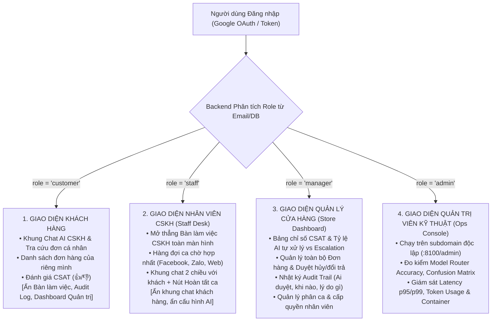
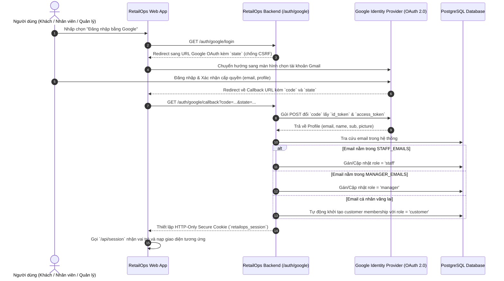

# Kế hoạch Tích hợp Google OAuth 2.0 (SSO) & Phân quyền Giao diện Đa Vai trò (Role-Based UI Isolation)

> [!IMPORTANT]
> **Ưu tiên Triển khai: GIAI ĐOẠN 1 (Phục vụ Chuẩn hóa Trải nghiệm & Demo Khóa luận)**  
> Tính năng này nâng cấp RetailOps từ ứng dụng demo nhập mã token thủ công thành **Nền tảng Quản trị Doanh nghiệp chuẩn mực (Enterprise SaaS)**. Tích hợp Đăng nhập một chạm bằng Google (Sign in with Google) và phân tách giao diện độc lập theo đúng thẩm quyền: Khách hàng, Nhân viên CSKH, Quản lý Cửa hàng, và Quản trị viên Kỹ thuật.

Tài liệu này xác định kiến trúc, quy trình xác thực SSO và giải pháp phân tách giao diện người dùng (Role-Based Access Control - RBAC UI) trong hệ sinh thái RetailOps.

---

## 1. Mục tiêu & Giá trị Chiến lược

1. **Trải nghiệm Đăng nhập Không Ma sát (Zero-friction SSO)**:
   - Thay thế việc sao chép/dán mã token 43 ký tự dài dòng bằng nút **"Đăng nhập bằng Google" (Sign in with Google)**.
   - Hội đồng chấm thi, nhân viên hoặc khách hàng có thể dùng chính tài khoản Gmail cá nhân để đăng nhập chỉ bằng một cú nhấp chuột.
2. **Giao diện Chuyên biệt hóa Tuyệt đối (Role-Based UI Isolation)**:
   - Mỗi người dùng khi đăng nhập chỉ thấy **đúng các tính năng thuộc quyền hạn của mình**.
   - Ẩn hoàn toàn các nút chức năng hoặc thông tin thừa thãi gây rối mắt.
3. **Minh chứng Học thuật & Thực tiễn cho Khóa luận**:
   - Đưa mô hình **Xác thực Phân tán & Kiểm soát Truy cập Dựa trên Vai trò (RBAC + OAuth 2.0 / OIDC)** vào **Chương 3 (Kiến trúc Hệ thống)**.
   - Tạo kịch bản demo bảo vệ ấn tượng: Thầy/Cô đăng nhập Gmail đóng vai Khách hàng; sinh viên đăng nhập Gmail nhân viên mở thẳng Bàn làm việc để trả lời Thầy/Cô.

---

## 2. Mô hình Ma trận Phân quyền 4 Vai trò (RBAC Matrix)



### Bảng Ma trận Quyền hạn Chi tiết

| Chức năng | Khách hàng (`customer`) | Nhân viên CSKH (`staff`) | Quản lý Shop (`manager`) | Quản trị viên (`admin`) |
| :--- | :---: | :---: | :---: | :---: |
| **Chat tư vấn với AI Agent** | ✅ | ❌ *(Ẩn)* | ❌ *(Ẩn)* | ❌ *(Ẩn)* |
| **Xem đơn hàng cá nhân** | ✅ *(Chỉ đơn của mình)* | ❌ *(Ẩn)* | ❌ *(Ẩn)* | ❌ *(Ẩn)* |
| **Đánh giá CSAT (👍/👎)** | ✅ | ❌ *(Ẩn)* | ❌ *(Ẩn)* | ❌ *(Ẩn)* |
| **Bàn làm việc CSKH (Hàng đợi & Chat 2 chiều)** | ❌ *(Ẩn nút)* | ✅ *(Màn hình chính)* | ✅ *(Có thể xem)* | ❌ *(Ẩn)* |
| **Quản lý toàn bộ đơn hàng của Shop** | ❌ *(Bị từ chối)* | ❌ *(Chỉ xem qua ca)* | ✅ | ❌ *(Không can thiệp)* |
| **Nhật ký can thiệp đơn (Audit Trail)** | ❌ *(Bị từ chối)* | ❌ *(Bị từ chối)* | ✅ | ❌ *(Không can thiệp)* |
| **Báo cáo CSAT & Tỷ lệ giải quyết ca** | ❌ *(Bị từ chối)* | ❌ *(Bị từ chối)* | ✅ | ❌ *(Không can thiệp)* |
| **Đo kiểm Router, Latency, Token (Ops Console)** | ❌ *(Bị từ chối)* | ❌ *(Bị từ chối)* | ❌ *(Bị từ chối)* | ✅ *(Độc quyền)* |

---

## 3. Thiết kế Kỹ thuật: Google OAuth 2.0 (SSO)

### 3.1. Luồng Xác thực (Authentication Sequence)



### 3.2. Cấu hình Tham số Google Cloud Console

* **Project**: `RetailOps-CSKH`
* **Application Type**: `Web application`
* **Name**: `RetailOps Web Client`
* **Authorized JavaScript origins**:
  ```text
  https://retailops.18-206-237-32.sslip.io
  ```
* **Authorized redirect URIs**:
  ```text
  https://retailops.18-206-237-32.sslip.io/auth/google/callback
  ```

### 3.3. Quy tắc Ánh xạ Vai trò Tự động (Smart Role Mapping)

Trong file môi trường `/opt/retailops/api.env`, cấu hình danh sách phân quyền:

```ini
# Khóa định danh từ Google Cloud Console
GOOGLE_CLIENT_ID="xxxxxx.apps.googleusercontent.com"
GOOGLE_CLIENT_SECRET="GOCSPX-xxxxxx"

# Danh sách phân vai trò theo email
STAFF_EMAILS="maianh.cskh@gmail.com,nv1@gmail.com"
MANAGER_EMAILS="chushop@gmail.com,admin@gmail.com"
DEFAULT_ROLE="customer"
```

Khi một email đăng nhập:
1. Nếu email khớp với `STAFF_EMAILS` $\to$ Cấp quyền `staff`.
2. Nếu email khớp với `MANAGER_EMAILS` $\to$ Cấp quyền `manager`.
3. Mọi email khác $\to$ Tự động cấp quyền `customer` và cấp mã khách hàng mới (ví dụ `C-GOOGLE-xxxx`).

---

## 4. Thiết kế Giao diện Frontend theo Vai trò

Frontend sử dụng cơ chế thuộc tính dữ liệu toàn cục:
```javascript
// Sau khi gọi /api/session
document.body.dataset.role = session.role; // 'customer' | 'staff' | 'manager' | 'admin'
```

### 4.1. Giao diện Khách hàng (`customer`)
- Giữ nguyên bố cục chat hiện tại.
- Ẩn nút `🎧 Bàn làm việc CSKH` trên topbar:
  ```css
  body[data-role="customer"] #toggle-staff-desk { display: none !important; }
  ```

### 4.2. Giao diện Nhân viên CSKH (`staff`)
- Khi đăng nhập thành công, giao diện tự động ẩn khung chat khách và mở thẳng **Bàn làm việc CSKH (Staff Desk)** ra toàn màn hình.
- Nhân viên có toàn bộ không gian để làm việc:
  - Xem danh sách hàng đợi (Queue) các ca cần người thật từ Facebook, Zalo OA, Website.
  - Chat trực tiếp 2 chiều với khách hàng.
  - Bấm nút **"✓ Hoàn tất ca"** để chuyển lại cho AI Agent.

### 4.3. Giao diện Quản lý Cửa hàng (`manager`)
- Bổ sung tab **📊 Báo cáo Vận hành CSKH (Manager Dashboard)**:
  - **Tỷ lệ tự động hóa (Automation Rate)**: Số ca AI tự giải quyết thành công (%).
  - **Tỷ lệ chuyển giao (Escalation Rate)**: Số ca phải chuyển cho nhân viên xử lý (%).
  - **Điểm CSAT trung bình**: Điểm đánh giá sao và tỷ lệ Like/Dislike từ khách hàng.
  - **Quản lý Đơn hàng & Audit**: Xem danh sách toàn bộ đơn hàng của cửa hàng và nhật ký kiểm toán hành vi nhân viên.

---

## 5. Kế hoạch Triển khai (Checklist 5 Bước)

- [ ] **Bước 1**: Điền thông tin trên Google Cloud Console (Authorized Origins & Redirect URIs) và lấy Client ID / Client Secret.
- [ ] **Bước 2**: Viết module xác thực Google OAuth (`retailops/http/auth_google.py`) xử lý `/auth/google/login` và `/auth/google/callback`.
- [ ] **Bước 3**: Cập nhật cơ chế phiên (`retailops/identity/store.py`) hỗ trợ ánh xạ `email` và mở rộng enum vai trò `('customer', 'viewer', 'staff', 'manager')`.
- [ ] **Bước 4**: Thêm nút **"Đăng nhập bằng Google"** trên form đăng nhập `web/index.html`.
- [ ] **Bước 5**: Tối ưu hóa CSS/JS phân quyền giao diện: `customer` chỉ thấy chat đơn của mình, `staff` mở thẳng Bàn làm việc, `manager` xem Dashboard CSAT.
