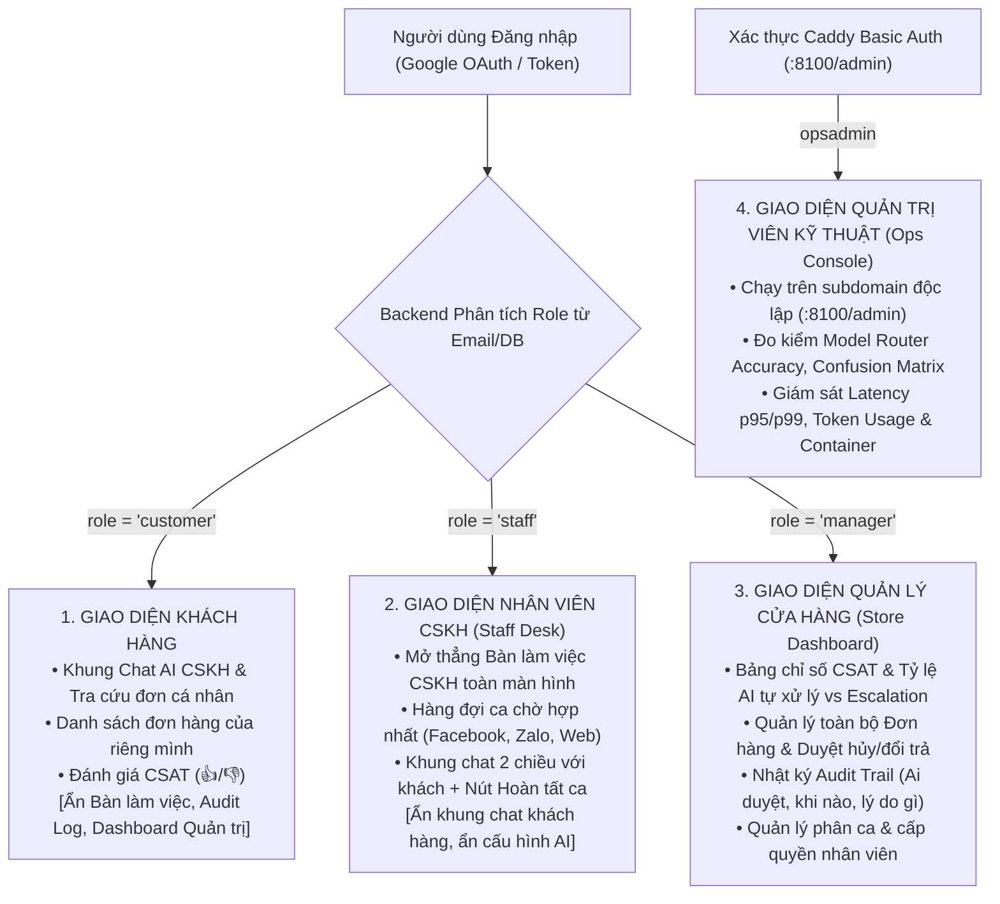
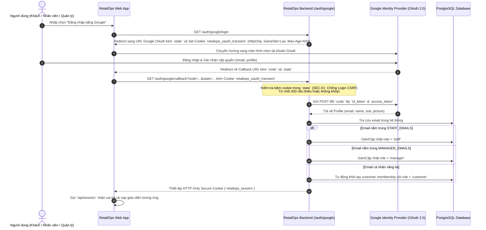

# Kế hoạch Tích hợp Google OAuth 2.0 (SSO) & Phân quyền Giao diện Đa Vai trò (Role-Based UI Isolation)

> **Trạng thái:** IMPLEMENTED & ACTIVE (Core Code & UI Hoàn Tất; Cấu hình Redirect URI phụ thuộc Runtime EC2)
> **Mức độ minh chứng (Evidence):** L1 Automated Tests (`test_public_session.js`, OAuth E2E) · L3 Live Deployed (Commit `281e5b6`)
> **Audit basis / Documentation baseline reviewed:** `b93eb5a` · **Application verified:** `d3ca3a6`
> **Ngày rà soát:** 2026-09-21
> **Ghi chú vận hành:** Bước 1 (Authorized Redirect URI) là cấu hình runtime trên Google Cloud Console, cần revalidate mỗi khi EC2 Stop/Start đổi IP (không dùng Elastic IP cố định).
> **Tổng quan:** Tích hợp Đăng nhập một chạm bằng Google (Sign in with Google) và phân tách giao diện độc lập theo đúng thẩm quyền: Khách hàng, Nhân viên CSKH, Quản lý Cửa hàng. Quản trị viên Kỹ thuật (Ops Admin) chạy trên subdomain riêng qua Caddy Basic Auth.

---

## 1. Mục tiêu & Giá trị Chiến lược

1. **Trải nghiệm Đăng nhập Không Ma sát (Zero-friction SSO)**:
   - Thay thế việc sao chép/dán mã token 43 ký tự dài dòng bằng nút **"Đăng nhập bằng Google" (Sign in with Google)**.
   - Hội đồng chấm thi, nhân viên hoặc khách hàng có thể dùng chính tài khoản Gmail cá nhân để đăng nhập chỉ bằng một cú nhấp chuột.
2. **Giao diện Chuyên biệt hóa Tuyệt đối (Role-Based UI Isolation)**:
   - Mỗi người dùng khi đăng nhập chỉ thấy **đúng các tính năng thuộc quyền hạn của mình**.
   - Ẩn hoàn toàn các nút chức năng hoặc thông tin thừa thãi gây rối mắt.
3. **Minh chứng Học thuật & Thực tiễn cho Khóa luận**:
   - Đưa mô hình **Xác thực Phân tán & Kiểm soát Truy cập Dựa trên Vai trò (RBAC + OAuth 2.0 / OIDC)** vào **Chương 3 (Kiến trúc Hệ thống)**.
   - Tạo kịch bản demo bảo vệ ấn tượng: Thầy/Cô đăng nhập Gmail đóng vai Khách hàng; sinh viên đăng nhập Gmail nhân viên mở thẳng Bàn làm việc để trả lời Thầy/Cô.

---

## 2. Mô hình Ma trận Phân quyền 4 Vai trò (RBAC Matrix)


```mermaid
flowchart TD
    Login["Người dùng Đăng nhập (Google OAuth / Token)"] --> AuthEngine{"Backend Phân tích Role từ Email/DB"}

    AuthEngine -->|role = 'customer'| ViewCustomer["1. GIAO DIỆN KHÁCH HÀNG\n• Khung Chat AI CSKH & Tra cứu đơn cá nhân\n• Danh sách đơn hàng của riêng mình\n• Đánh giá CSAT (👍/👎)\n[Ẩn Bàn làm việc, Audit Log, Dashboard Quản trị]"]

    AuthEngine -->|role = 'staff'| ViewStaff["2. GIAO DIỆN NHÂN VIÊN CSKH (Staff Desk)\n• Mở thẳng Bàn làm việc CSKH toàn màn hình\n• Hàng đợi ca chờ hợp nhất (Facebook, Zalo, Web)\n• Khung chat 2 chiều với khách + Nút Hoàn tất ca\n[Ẩn khung chat khách hàng, ẩn cấu hình AI]"]

    AuthEngine -->|role = 'manager'| ViewManager["3. GIAO DIỆN QUẢN LÝ CỬA HÀNG (Store Dashboard)\n• Bảng chỉ số CSAT & Tỷ lệ AI tự xử lý vs Escalation\n• Quản lý toàn bộ Đơn hàng & Duyệt hủy/đổi trả\n• Nhật ký Audit Trail (Ai duyệt, khi nào, lý do gì)\n• Quản lý phân ca & cấp quyền nhân viên"]

    CaddyAuth["Xác thực Caddy Basic Auth (:8100/admin)"] -->|opsadmin| ViewAdmin["4. GIAO DIỆN QUẢN TRỊ VIÊN KỸ THUẬT (Ops Console)\n• Chạy trên subdomain độc lập (:8100/admin)\n• Đo kiểm Model Router Accuracy, Confusion Matrix\n• Giám sát Latency p95/p99, Token Usage & Container"]
```

### Bảng Ma trận Quyền hạn Chi tiết (RBAC Matrix)

Hệ thống phân biệt rõ 3 tầng thông tin: **(1) Trạng thái hiển thị giao diện UI**, **(2) Quyền API được cấp (`ROLE_PERMISSIONS`)**, và **(3) Phạm vi sở hữu dữ liệu (`store.owned()`)**:

| Chức năng / Thao tác | Khách hàng (`customer`) | Khách chỉ xem (`viewer`) | Nhân viên CSKH (`staff`) | Quản lý Shop (`manager`) | Quản trị Kỹ thuật (`opsadmin`)* |
| :--- | :---: | :---: | :---: | :---: | :---: |
| **Chat tư vấn với AI Agent** | ✅ *(Giao diện chính, API cho phép)* | ✅ *(Giao diện và API đều cho phép chat; CSS chỉ ẩn Staff Desk & Inspector)* | ⚠️ *(UI tập trung Staff Desk; API chat vẫn dùng được)* | ⚠️ *(UI tập trung Manager; API chat vẫn dùng được)* | ❌ *(Không can thiệp)* |
| **Xem đơn cá nhân (`/api/orders/{id}`)** | ✅ *(Đơn của session customer)* | ✅ *(Đơn của session customer)* | ✅ *(Có quyền `read`; xem được đơn gắn với session customer của mình, KHÔNG xem được đơn khách khác)* | ✅ *(Có quyền `read`; xem được đơn gắn với session customer của mình; xem toàn shop qua route Manager)* | ❌ *(Không can thiệp)* |
| **Hủy đơn cá nhân (`orders:cancel`)** | ✅ *(Đơn của mình)* | ❌ *(403 not permitted)* | ⚠️ *(Đơn của phiên staff; KHÔNG thể hủy đơn khách khác do `store.owned()`)* | ✅ *(Có thể hủy đơn phiên mình; toàn shop dùng Manager API)* | ❌ *(Không can thiệp)* |
| **Đánh giá CSAT (`POST /api/feedback`)** | ✅ *(Hiển thị trên chat)* | ⚠️ *(API không role guard; UI không chủ động mở)* | ⚠️ *(API không role guard; UI không chủ động mở)* | ⚠️ *(API không role guard; UI không chủ động mở)* | ❌ *(Không can thiệp)* |
| **Bàn làm việc CSKH (`staff:desk`)** | ❌ *(403 denied)* | ❌ *(403 denied)* | ✅ *(Truy cập đầy đủ)* | ✅ *(Truy cập đầy đủ)* | ❌ *(Không can thiệp)* |
| **Cập nhật đơn toàn shop (`store:manage`)** | ❌ *(403 denied)* | ❌ *(403 denied)* | ❌ *(403 denied)* | ✅ *(`POST /api/manager/orders/update-status`)* | ❌ *(Không can thiệp)* |
| **CRUD Sản phẩm / Danh mục** | ❌ *(403 denied)* | ❌ *(403 denied)* | ❌ *(403 denied)* | ✅ *(Đầy đủ Create/Update/Delete)* | ❌ *(Không can thiệp)* |
| **Nhật ký Audit Trail toàn shop** | ❌ *(Chỉ xem `/api/events` mình)* | ❌ *(Chỉ xem `/api/events` mình)* | ❌ *(Chỉ xem `/api/events` mình)* | ✅ *(Xem toàn shop `/api/manager/events`)* | ❌ *(Không can thiệp)* |
| **Báo cáo CSAT & KPIs Cửa hàng** | ❌ *(403 denied)* | ❌ *(403 denied)* | ❌ *(403 denied)* | ✅ *(KPIs & Báo cáo store)* | ❌ *(Không can thiệp)* |
| **Ops Console Router / Telemetry** | ❌ *(Bị từ chối)* | ❌ *(Bị từ chối)* | ❌ *(Bị từ chối)* | ❌ *(Bị từ chối)* | ✅ *(Độc quyền :8100/admin)* |

> `*` Ghi chú: `opsadmin` chạy trên cổng quản trị kỹ thuật độc lập (`:8100/admin`), được bảo vệ bằng Caddy Basic Auth và không dùng chung database session của web bán lẻ. Cơ sở thẩm quyền mã nguồn: `retailops/business/permissions.py:ROLE_PERMISSIONS`.

---

## 3. Thiết kế Kỹ thuật: Google OAuth 2.0 (SSO)

### 3.1. Luồng Xác thực (Authentication Sequence)


```mermaid
sequenceDiagram
    autonumber
    actor User as Người dùng (Khách / Nhân viên / Quản lý)
    participant Web as RetailOps Web App
    participant Backend as RetailOps Backend (/auth/google)
    participant Google as Google Identity Provider (OAuth 2.0)
    participant DB as PostgreSQL Database

    User->>Web: Nhấp chọn "Đăng nhập bằng Google"
    Web->>Backend: GET /auth/google/login
    Backend-->>Web: Redirect sang URL Google OAuth kèm `state` và Set-Cookie `retailops_oauth_transient` (HttpOnly, SameSite=Lax, Max-Age=600)
    Web->>Google: Chuyển hướng sang màn hình chọn tài khoản Gmail
    User->>Google: Đăng nhập & Xác nhận cấp quyền (email, profile)
    Google-->>Web: Redirect về Callback URL kèm `code` và `state`
    Web->>Backend: GET /auth/google/callback?code=...&state=... kèm Cookie `retailops_oauth_transient`
    Note over Backend: Kiểm tra băm cookie trong `state` (SEC-01: Chống Login CSRF)<br/>Từ chối 403 nếu thiếu hoặc không khớp!
    Backend->>Google: Gửi POST đổi `code` lấy `id_token` & `access_token`
    Google-->>Backend: Trả về Profile (email, name, sub, picture)

    Backend->>DB: Tra cứu email trong hệ thống
    alt Email nằm trong STAFF_EMAILS
        Backend->>DB: Gán/Cập nhật role = 'staff'
    else Email nằm trong MANAGER_EMAILS
        Backend->>DB: Gán/Cập nhật role = 'manager'
    else Email cá nhân vãng lai
        Backend->>DB: Tự động khởi tạo customer membership với role = 'customer'
    end

    Backend-->>Web: Thiết lập HTTP-Only Secure Cookie (`retailops_session`)
    Web->>Web: Gọi `/api/session` nhận vai trò và nạp giao diện tương ứng
```

### 3.2. Cấu hình Tham số Google Cloud Console

* **Project**: `RetailOps-CSKH`
* **Application Type**: `Web application`
* **Name**: `RetailOps Web Client`
* **Authorized JavaScript origins**:
  ```text
  https://<RETAILOPS_PUBLIC_HOST>
  ```
  *(Ví dụ với IP hiện tại: `https://retailops.98-84-139-124.sslip.io`)*
* **Authorized redirect URIs**:
  ```text
  https://<RETAILOPS_PUBLIC_HOST>/auth/google/callback
  ```
  *(Ví dụ với IP hiện tại: `https://retailops.98-84-139-124.sslip.io/auth/google/callback`)*

### 3.3. Quy tắc Ánh xạ Vai trò Tự động (Smart Role Mapping)

Trong file môi trường `/opt/retailops/api.env`, cấu hình danh sách phân quyền:

```ini
# Khóa định danh từ Google Cloud Console
GOOGLE_CLIENT_ID="xxxxxx.apps.googleusercontent.com"
GOOGLE_CLIENT_SECRET="GOCSPX-xxxxxx"

# Danh sách phân vai trò theo email
STAFF_EMAILS="maianh.cskh@gmail.com,nv1@gmail.com"
MANAGER_EMAILS="chushop@gmail.com,admin@gmail.com"
DEFAULT_ROLE="customer"
```

Khi một email đăng nhập:
1. Nếu email khớp với `STAFF_EMAILS` $\to$ Cấp quyền `staff`.
2. Nếu email khớp với `MANAGER_EMAILS` $\to$ Cấp quyền `manager`.
3. Mọi email khác $\to$ Tự động cấp quyền `customer` và cấp mã khách hàng mới (ví dụ `C-GOOGLE-xxxx`).

### 3.4. Chống Tấn Công OAuth Login CSRF (Hạng mục SEC-01) [CHƯA KIỂM CHỨNG / PENDING TEST]

- **Vấn đề bảo mật**: Kẻ tấn công có thể khởi tạo luồng OAuth từ trình duyệt của mình, lấy URL callback chứa `code` và `state` của kẻ tấn công, rồi lừa nạn nhân truy cập liên kết đó. Trình duyệt nạn nhân sẽ hoàn tất đăng nhập bằng danh tính của kẻ tấn công, dẫn đến rò rỉ dữ liệu hoặc chiếm quyền kiểm soát phiên (RFC 6749 §10.12).
- **Tệp & Hàm liên quan**:
  - `retailops/http/public.py`: Tuyến điều hướng `/auth/google/login` và `/auth/google/callback` trong `PublicWeb.route()`.
  - `retailops/http/auth_google.py`: `create_state()`, `verify_and_consume_state(state)`, `get_google_auth_url(origin, state)`, `exchange_code_for_user_info(code, origin)` (các helper `handle_google_login / handle_google_callback` là hàm đóng gói dự kiến `[ADD / PLANNED]`).
- **Hợp đồng Vòng đời State & Thứ tự Xác minh 5 Bước Bắt Buộc**:
  1. *Khởi tạo (`/auth/google/login`)*:
     - Backend sinh một chuỗi ngẫu nhiên cryptographically secure `oauth_browser_nonce` (32 bytes hex).
     - Thiết lập cookie: `Set-Cookie: retailops_oauth_transient=<nonce>; Path=/auth/google; Secure; HttpOnly; SameSite=Lax; Max-Age=600`.
     - Tính `nonce_hash = hashlib.sha256(oauth_browser_nonce.encode()).hexdigest()[:16]` và nhúng vào payload `state` (được ký HMAC SHA256 kèm timestamp phát hành).
     - *Nhiều phiên đăng nhập đồng thời*: Nếu người dùng mở nhiều tab hoặc bấm đăng nhập nhiều lần, lần đăng nhập mới nhất sẽ ghi đè cookie transient trước đó (latest login replaces prior); mỗi state độc lập mang `nonce_hash` tương ứng.
  2. *Thứ tự Xác minh Nghiêm ngặt tại Callback (`/auth/google/callback`)*:
     - **Bước 1 (Xác minh Chữ ký & Thời hạn)**: Kiểm tra tính toàn vẹn chữ ký HMAC và thời hạn của `state` (hết hạn sau 600 giây). Nếu state bị sửa đổi hoặc hết hạn $\to$ Trả ngay HTTP 403 `invalid_oauth_state` (tuyệt đối KHÔNG gọi consume).
     - **Bước 2 (Xác minh Ràng buộc Trình duyệt - Browser Binding)**: Trích xuất cookie `retailops_oauth_transient` từ request, tính `sha256(cookie).hexdigest()[:16]` và so khớp với `nonce_hash` trong state. Nếu thiếu cookie hoặc hash không khớp $\to$ Trả ngay HTTP 403 `invalid_oauth_state`. Nhờ kiểm tra này trước, một callback từ trình duyệt khác không thể làm mất (burn) state hợp lệ của nạn nhân.
     - **Bước 3 (Single-Use Atomic Consume State)**: Gọi `consume_state(state)` nguyên tử (atomic single-use token / CAS pattern). Nếu hai callback đồng thời gửi cùng state, chỉ một request consume thành công đầu tiên được đi tiếp; request thứ hai nhận ngay HTTP 403 `invalid_oauth_state` (chống replay race).
     - **Bước 4 (Exchange Token với Google)**: Gửi mã `code` lên Google để lấy token và thông tin người dùng. Nếu Google trả lỗi hoặc mạng gián đoạn $\to$ Xóa transient cookie (`Max-Age=0; Path=/auth/google; Secure; HttpOnly; SameSite=Lax`), trả HTTP 502 `oauth_exchange_failed`.
     - **Bước 5 (Cấp Phiên & Xóa Cookie)**: Tạo phiên người dùng theo email và xóa transient cookie (`Set-Cookie: retailops_oauth_transient=; Path=/auth/google; Secure; HttpOnly; SameSite=Lax; Max-Age=0`).
  3. *Xử lý Hủy Bỏ, Thiếu Tham Số & Hợp Đồng Header Phục Vụ Set-Cookie*:
     - **Bảo toàn cookie phiên mới nhất (Multi-Tab Safe)**: Nếu Google trả về `error=access_denied` (người dùng từ chối cấp quyền) hoặc callback thiếu tham số: Chỉ xóa transient cookie (`Max-Age=0`) khi tham số `state` gửi kèm khớp với cookie hiện tại trong trình duyệt (hoặc cookie đã hết hạn). Nếu người dùng mở Tab A rồi Tab B (cookie đang là B), một callback hủy muộn từ Tab A tuyệt đối KHÔNG được xóa cookie của B!
     - **Cơ chế Gửi Set-Cookie Trên Phản Hồi Lỗi**: Trong `retailops/http/public.py:20–35` (`PublicWeb.__call__`), để cookie cleanup thực sự được gửi tới trình duyệt trên các luồng lỗi (thay vì bị mất do raise ApiError), tuyến callback trả về tuple phản hồi chuẩn 4 phần tử: `(status, error_body, "text/html; charset=utf-8", [("Set-Cookie", "retailops_oauth_transient=; Path=/auth/google; Max-Age=0; Secure; HttpOnly; SameSite=Lax")])`.
     - **Ánh xạ Mã Lỗi Chuẩn Xác**: HTTP 400 `invalid_request` cho lỗi thiếu tham số `code`/`state`; HTTP 403 `invalid_oauth_state` cho state sai chữ ký, hết hạn hoặc mismatch cookie; HTTP 502 `oauth_exchange_failed` cho lỗi trao đổi upstream với Google IDP. Tuyệt đối không redirect mù quáng khi gặp vi phạm bảo mật.
- **Ma trận Test tương ứng (`tests/test_auth_google.py`)**:
  - `test_oauth_csrf_state_binding`: Callback có cookie và state khớp $\to$ PASS.
  - `test_oauth_callback_missing_transient_cookie`: Thiếu cookie $\to$ 403 `invalid_oauth_state`.
  - `test_oauth_wrong_browser_nonce_mismatch`: Sai cookie $\to$ 403 `invalid_oauth_state`, state không bị consume.
  - `test_oauth_tampered_state_rejected`: State bị sửa HMAC $\to$ 403 `invalid_oauth_state`.
  - `test_oauth_expired_state_rejected`: State quá 600s $\to$ 403 `invalid_oauth_state`.
  - `test_oauth_replay_consumed_state_rejected`: State đã dùng gọi lại $\to$ 403 `invalid_oauth_state`.
  - `test_oauth_exchange_failure_cleans_cookie`: Lỗi exchange $\to$ cookie bị xóa `Max-Age=0`.
  - `test_oauth_user_cancel_cleans_cookie`: Người dùng hủy $\to$ cookie bị xóa `Max-Age=0`.

---

## 4. Thiết kế Giao diện Frontend theo Vai trò

Frontend sử dụng cơ chế thuộc tính dữ liệu toàn cục:
```javascript
// Sau khi gọi /api/session
document.body.dataset.role = session.role; // 'customer' | 'staff' | 'manager' | 'admin'
```

### 4.1. Giao diện Khách hàng (`customer`)
- Giữ nguyên bố cục chat hiện tại.
- Ẩn nút `🎧 Bàn làm việc CSKH` trên topbar:
  ```css
  body[data-role="customer"] #toggle-staff-desk { display: none !important; }
  ```

### 4.2. Giao diện Nhân viên CSKH (`staff`)
- Khi đăng nhập thành công, giao diện tự động ẩn khung chat khách và mở thẳng **Bàn làm việc CSKH (Staff Desk)** ra toàn màn hình.
- Nhân viên có toàn bộ không gian để làm việc:
  - Xem danh sách hàng đợi (Queue) các ca cần người thật từ Facebook, Zalo OA, Website.
  - Chat trực tiếp 2 chiều với khách hàng.
  - Bấm nút **"✓ Hoàn tất ca"** để chuyển lại cho AI Agent.

### 4.3. Giao diện Quản lý Cửa hàng (`manager`)
- Bổ sung tab **📊 Báo cáo Vận hành CSKH (Manager Dashboard)**:
  - **Tỷ lệ tự động hóa (Automation Rate)**: Số ca AI tự giải quyết thành công (%).
  - **Tỷ lệ chuyển giao (Escalation Rate)**: Số ca phải chuyển cho nhân viên xử lý (%).
  - **Điểm CSAT trung bình**: Điểm đánh giá sao và tỷ lệ Like/Dislike từ khách hàng.
  - **Quản lý Đơn hàng & Audit**: Xem danh sách toàn bộ đơn hàng của cửa hàng và nhật ký kiểm toán hành vi nhân viên.

---

## 5. Kế hoạch Triển khai (Checklist 5 Bước)

- [~] **Bước 1**: Cấu hình trên Google Cloud Console (Authorized Origins & Redirect URIs): Phụ thuộc vào IP/Domain hiện tại của EC2 sau mỗi lần Stop/Start.
- [x] **Bước 2**: Viết module xác thực Google OAuth (`retailops/http/auth_google.py`) xử lý `/auth/google/login` và `/auth/google/callback` kèm mã hóa CSRF state qua HMAC.
- [x] **Bước 3**: Cập nhật cơ chế phiên (`retailops/identity/store.py`) hỗ trợ ánh xạ `email` và mở rộng enum vai trò `('customer', 'viewer', 'staff', 'manager')`.
- [x] **Bước 4**: Thêm nút **"Đăng nhập bằng Google"** trên form đăng nhập `web/index.html`.
- [x] **Bước 5**: Tối ưu hóa CSS/JS phân quyền giao diện: `customer` chỉ thấy chat đơn của mình, `staff` mở thẳng Bàn làm việc, `manager` xem Dashboard CSAT; cô lập máy trạng thái auth và bổ sung bộ test E2E (Commit `281e5b6`).
