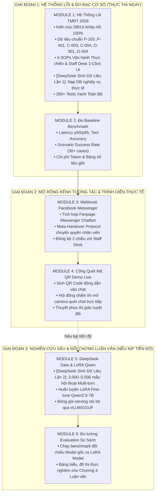

# TỔNG HỢP KẾ HOẠCH CHIẾN LƯỢC: LỘ TRÌNH KHÓA LUẬN TỐT NGHIỆP & HỆ THỐNG RETAILOPS 2026

> **Master Roadmap Index 2026**  
> **Báo cáo tiến độ mới nhất**: Xem tại [CURRENT_PROJECT_STATUS.md](file:///d:/year_2026/Work_2026/agentic_AI/CSKH_ban_le/docs/CURRENT_PROJECT_STATUS.md) (Cập nhật ngày 2026-09-17 23:15)

---

## 1. Sơ Đồ Phân Kỳ 6 Module Phát Triển Toàn Diện

---

## 2. Chi Tiết Từng Module & Phân Bổ Giá Trị

### 🟢 MODULE 1: Hệ Thống Lõi TMĐT 2026 (Khung Kiến Trúc, Dữ Liệu Chuẩn, 6 SOPs, Staff Desk 1-Click)
- **Tài liệu chi tiết**: [PLAN_ECOMMERCE_OPS_COPILOT.md](file:///d:/year_2026/Work_2026/agentic_AI/CSKH_ban_le/docs/PLAN_ECOMMERCE_OPS_COPILOT.md)
- **Mục tiêu**:
  - Khớp nối toàn vẹn ràng buộc Database (`orders.status IN ('pending', 'delivered', 'cancelled')`) và Giao diện UI (`renderOrder` với 5 trường bắt buộc).
  - Bảo toàn 100% dữ liệu hồi quy (`C-001`, `P-101`, `P-102`) để 260+ bài kiểm thử hiện có luôn xanh.
  - Nạp dữ liệu sản phẩm mới (`P-103` đến `P-401`), khách mới (`C-003`, `C-004`), đơn hàng mới (`O-301` đến `O-304`).
  - **Sinh Dữ Liệu Thực Tế Lần 1 (DeepSeek Operational Business Seed Data)**: Dùng DeepSeek API sinh kho dữ liệu kinh doanh TMĐT thực tế (sản phẩm, đơn hàng, khách hàng, bưu tá vận chuyển, kho bãi) nạp thẳng vào database/store để hệ thống có dữ liệu sống động chạy thử nghiệm thực tế trên Web App/EC2 và chuẩn bị cho Module 2.
  - Xử lý 6 SOPs thực chiến:
    1. **SOP 1**: Bưu tá ảo SPX không giao -> Tra cứu bưu tá Nguyễn Văn Tuấn (0934112233), khiếu nại giao lại trong ngày.
    2. **SOP 2**: Hàng lỗi bung chỉ / kẹt khóa -> Nhận ảnh unboxing, kiểm tra hạn bảo hành 90 ngày, tạo đề xuất đổi mới 1-1 tận nhà.
    3. **SOP 3**: Đổi size nhanh -> Kiểm kho `check_inventory`, tạo đơn thu hồi đổi trả 2 chiều.
    4. **SOP 4**: Nghẽn kho phân loại Mega Sale (>48h) -> Giải thích và tự động cấp Voucher 50K / Freeship.
    5. **SOP 5**: Khách giận dữ cực độ -> Strict Mode xoa dịu, cảnh báo đỏ quản lý, xếp hàng đợi VIP.
    6. **SOP 6**: Bấm nút `[🙋 Gặp nhân viên tư vấn]` -> Chuyển giao tiếp quản trực tiếp hoặc xếp hàng đợi (Queue).
  - Bổ sung nút bấm 1-Click trên Staff Desk: `[✅ Duyệt Đổi Mới 1-1 Tận Nhà]`, `[✅ Duyệt Đổi Size 2 Chiều]`.

---

### 🔵 MODULE 2: Đo Baseline Benchmark & Đánh Giá Mô Hình Nền (Model Evaluation Baseline)
- **Tài liệu chi tiết**: [PLAN_MODEL_SELECTION_STRATEGY.md](file:///d:/year_2026/Work_2026/agentic_AI/CSKH_ban_le/docs/PLAN_MODEL_SELECTION_STRATEGY.md)
- **Mục tiêu**:
  - Chạy bộ benchmark 30+ ca kiểm thử chuẩn trong `evals/`.
  - Đo đạc thông số gốc: **Tool Accuracy, Latency p50/p95, Tỷ lệ hoàn thành nghiệp vụ, Chi phí Token**.
  - Lập bảng số liệu thực nghiệm cơ sở (Baseline) phục vụ Chương 4 của Khóa luận.

---

### 🟣 MODULE 3: Tích Hợp Webhook Facebook Messenger (Omnichannel Social Gateway)
- **Tài liệu chi tiết**: [PLAN_OMNICHANNEL_INTEGRATION.md](file:///d:/year_2026/Work_2026/agentic_AI/CSKH_ban_le/docs/PLAN_OMNICHANNEL_INTEGRATION.md)
- **Mục tiêu**:
  - Xây dựng Webhook endpoint nhận và gửi tin nhắn từ Facebook Fanpage (Messenger).
  - Tích hợp **Meta Handover Protocol** để chuyển quyền chat sang ứng dụng Meta Business Suite trên điện thoại cho nhân viên.
  - Đồng bộ 2 chiều lịch sử chat và ảnh khách gửi về bàn làm việc **Staff Desk**.

---

### 🟡 MODULE 4: Cổng Quét Mã QR Trải Nghiệm Trực Tiếp (Mobile QR Demo Gateway)
- **Mục tiêu**:
  - Sinh mã **QR Code động** dẫn thẳng tới hệ thống Web App hoặc Messenger Chatbot.
  - Phục vụ buổi bảo vệ Khóa luận: Thầy cô trong Hội đồng chỉ cần mở camera điện thoại quét mã là trải nghiệm live trực tiếp.
  - Thuyết phục tuyệt đối về tính ứng dụng thực tế và mức độ hoàn thiện của sản phẩm.

---

### 🟠 MODULE 5: Sinh Dữ Liệu Hội Thoại Lần 2 Bằng DeepSeek (3.000–5.000 Mẫu SFT) & LoRA Fine-Tune Qwen (Nếu kịp tiến độ)
- **Tài liệu chi tiết**: [PLAN_DEEPSEEK_DISTILLATION.md](file:///d:/year_2026/Work_2026/agentic_AI/CSKH_ban_le/docs/PLAN_DEEPSEEK_DISTILLATION.md) & [PLAN_FINE_TUNING_SERVING.md](file:///d:/year_2026/Work_2026/agentic_AI/CSKH_ban_le/docs/PLAN_FINE_TUNING_SERVING.md)
- **Mục tiêu**:
  - **Sinh Dữ Liệu Lần 2**: Gọi DeepSeek API tự động sinh 3.000–5.000 mẫu hội thoại đa lượt (ChatML format kèm Tool Calling & CoT reasoning) chuẩn nghiệp vụ TMĐT Việt Nam.
  - Huấn luyện LoRA Fine-tuning cho mô hình nền `Qwen2.5-7B` bằng Unsloth trên Colab / Server riêng.
  - Đóng gói serving qua vLLM / GGUF.

---

### 🔴 MODULE 6: Đo Lường Evaluation So Sánh (Comparative Evaluation & Thesis Metrics)
- **Mục tiêu**:
  - Chạy lại bộ benchmark chuẩn ở Module 2 trên mô hình sau khi Fine-tune.
  - Lập bảng so sánh đối chứng (Ablation Study): **Model Gốc vs. Model LoRA Fine-tuned**.
  - Đưa ra đồ thị so sánh độ chính xác công cụ, tốc độ sinh phản hồi và tỷ lệ tiết kiệm chi phí làm trọng tâm cho Chương 4 Khóa luận.

---

## 3. Khớp Nối 6 Module Vào 5 Chương Luận Văn Tốt Nghiệp

| Chương Luận Văn | Nội dung Học thuật | Module Đảm Nhiệm & Minh Chứng |
| :--- | :--- | :--- |
| **Chương 1: Mở đầu & Bối cảnh** | Thực trạng quá tải TMĐT 2026, áp lực FRR < 15 phút, tỷ lệ hủy đơn do bưu cục. | Phân tích bài toán thực tiễn của ngành TMĐT. |
| **Chương 2: Cơ sở Lý thuyết** | Kiến trúc Multi-Agent, RAG đa tầng, Meta Handover, DeepSeek Distillation, LoRA. | Khung lý thuyết hỗ trợ toàn bộ 6 module. |
| **Chương 3: Phân tích & Thiết kế** | Kiến trúc 3 tầng, sơ đồ LangGraph StateGraph, quy trình 6 SOPs, Webhook Messenger. | **Module 1, Module 3, Module 4**. |
| **Chương 4: Thực nghiệm & Đánh giá** | Bảng số liệu Benchmark cơ sở, kết quả sinh dữ liệu, đồ thị so sánh trước & sau Fine-tune. | **Module 2, Module 5, Module 6**. |
| **Chương 5: Kết luận & Hướng phát triển** | Tổng kết hiệu quả tiết kiệm 75% chi phí CSKH, khả năng triển khai thương mại quy mô lớn. | Đánh giá tổng thể hệ thống. |
