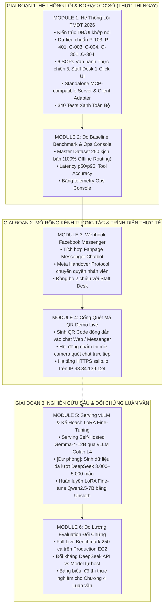

# TỔNG HỢP KẾ HOẠCH CHIẾN LƯỢC: LỘ TRÌNH KHÓA LUẬN TỐT NGHIỆP & HỆ THỐNG RETAILOPS 2026

> **Trạng thái:** ACTIVE STRATEGIC ROADMAP  
> **Mức độ minh chứng (Evidence):** L3 Live System Architecture Reference  
> **Audit basis / Documentation baseline reviewed:** `b93eb5a` · **Application verified:** `d3ca3a6`  
> **Ngày rà soát:** 2026-09-21  
> **Báo cáo tiến độ vận hành mới nhất:** Xem tại [CURRENT_PROJECT_STATUS.md](CURRENT_PROJECT_STATUS.md)

---

## 1. Sơ Đồ Phân Kỳ 6 Module Phát Triển Toàn Diện

```mermaid
flowchart TD
    subgraph PHASE_1["GIAI ĐOẠN 1: HỆ THỐNG LÕI & ĐO ĐẠC CƠ SỞ (THỰC THI NGAY)"]
        M1["MODULE 1: Hệ Thống Lõi TMĐT 2026<br/>• Kiến trúc DB/UI khớp nối<br/>• Dữ liệu chuẩn P-103..P-401, C-003, C-004, O-301..O-304<br/>• 6 SOPs Vận hành Thực chiến & Staff Desk 1-Click UI<br/>• Standalone MCP-compatible Server & Client Adapter<br/>• 340 Tests Xanh Toàn Bộ"]
        M2["MODULE 2: Đo Baseline Benchmark & Ops Console<br/>• Master Dataset 250 kịch bản (100% Offline Routing)<br/>• Latency p50/p95, Tool Accuracy<br/>• Bảng telemetry Ops Console"]
        M1 --> M2
    end

    subgraph PHASE_2["GIAI ĐOẠN 2: MỞ RỘNG KÊNH TƯƠNG TÁC & TRÌNH DIỄN THỰC TẾ"]
        M3["MODULE 3: Webhook Facebook Messenger<br/>• Tích hợp Fanpage Messenger Chatbot<br/>• Meta Handover Protocol chuyển quyền nhân viên<br/>• Đồng bộ 2 chiều với Staff Desk"]
        M4["MODULE 4: Cổng Quét Mã QR Demo Live<br/>• Sinh QR Code động dẫn vào chat Web / Messenger<br/>• Hội đồng chấm thi mở camera quét chat trực tiếp<br/>• Hạ tầng HTTPS sslip.io trên IP 98.84.139.124"]
        M2 --> M3
        M3 --> M4
    end

    subgraph PHASE_3["GIAI ĐOẠN 3: NGHIÊN CỨU SÂU & ĐỐI CHỨNG LUẬN VĂN"]
        M5["MODULE 5: Serving vLLM & Kế Hoạch LoRA Fine-Tuning<br/>• Serving Self-Hosted Gemma-4-12B qua vLLM Colab L4<br/>• [Dự phòng]: Sinh dữ liệu đa lượt DeepSeek 3.000–5.000 mẫu<br/>• Huấn luyện LoRA Fine-tune Qwen2.5-7B bằng Unsloth"]
        M6["MODULE 6: Đo Lường Evaluation Đối Chứng<br/>• Full Live Benchmark 250 ca trên Production EC2<br/>• Đối kháng DeepSeek API vs Model tự host<br/>• Bảng biểu, đồ thị thực nghiệm cho Chương 4 Luận văn"]
        M4 -.-> M5
        M5 --> M6
    end
```

---

## 2. Chi Tiết Từng Module & Phân Bổ Giá Trị

### 🟢 MODULE 1: Hệ Thống Lõi TMĐT 2026 (Khung Kiến Trúc, Dữ Liệu Chuẩn, 6 SOPs, Staff Desk 1-Click & Giao Thức MCP)
- **Tài liệu chi tiết**: [PLAN_ECOMMERCE_OPS_COPILOT.md](PLAN_ECOMMERCE_OPS_COPILOT.md) & [PLAN_MCP_INTEGRATION.md](PLAN_MCP_INTEGRATION.md)
- **Mục tiêu**:
  - Khớp nối toàn vẹn ràng buộc Database (`orders.status IN ('pending', 'delivered', 'cancelled')`) và Giao diện UI (`renderOrder` với 5 trường bắt buộc).
  - Bảo toàn 100% dữ liệu hồi quy (`C-001`, `P-101`, `P-102`) để toàn bộ test suite luôn xanh.
  - Nạp dữ liệu sản phẩm mới (`P-103` đến `P-401`), khách mới (`C-003`, `C-004`), đơn hàng mới (`O-301` đến `O-304`).
  - **Chuẩn hóa Giao thức MCP (Model Context Protocol)**: Triển khai standalone `RetailOps MCP Server` (FastMCP / JSON-RPC fallback qua stdio và SSE port 8002) tách rời các công cụ nghiệp vụ (`track_shipment`, `check_inventory`, `search_knowledge`, `cancel_order`, `request_human_support`) thành microservices độc lập kèm adapter `mcp_client.py`.
  - **Xử lý 6 SOPs thực chiến**:
    1. **SOP 1**: Bưu tá ảo SPX không giao -> Tra cứu bưu tá Nguyễn Văn Tuấn (0934112233), khiếu nại giao lại trong ngày.
    2. **SOP 2**: Hàng lỗi bung chỉ / kẹt khóa -> Nhận ảnh unboxing, kiểm tra hạn bảo hành 90 ngày, tạo đề xuất đổi mới 1-1 tận nhà.
    3. **SOP 3**: Đổi size nhanh -> Kiểm kho `check_inventory`, tạo đề xuất đổi size 2 chiều tận nhà.
    4. **SOP 4**: Nghẽn kho phân loại Mega Sale (>48h) -> Giải thích và tự động cấp Voucher 50K đền bù.
    5. **SOP 5**: Khách giận dữ cực độ -> Strict Mode xoa dịu, cảnh báo đỏ quản lý, xếp hàng đợi VIP.
    6. **SOP 6**: Yêu cầu gặp nhân viên tư vấn -> Chuyển giao tiếp quản trực tiếp hoặc xếp hàng đợi (Queue).
  - Nút bấm 1-Click trên Staff Desk: `[✅ Duyệt Đổi Mới 1-1 Tận Nhà]`, `[✅ Duyệt Đổi Size 2 Chiều]`.
  - Nghiệp vụ Hủy đơn hàng an toàn (CORE-01) duy trì quy trình 2 bước và bảo vệ máy trạng thái.

---

### 🔵 MODULE 2: Đo Baseline Benchmark & Đánh Giá Mô Hình Nền (Model Evaluation Baseline)
- **Tài liệu chi tiết**: [PLAN_MODEL_SELECTION_STRATEGY.md](PLAN_MODEL_SELECTION_STRATEGY.md) & [PLAN_FIX_UI_03_OPSCONSOLE_INTEGRITY.md](PLAN_FIX_UI_03_OPSCONSOLE_INTEGRITY.md)
- **Mục tiêu**:
  - Chạy bộ Master Benchmark 250 kịch bản chuẩn trong `evals/scenarios/benchmark_250.jsonl`.
  - Đo đạc thông số gốc: **Tool Accuracy, Latency p50/p95, Tỷ lệ hoàn thành nghiệp vụ, Chi phí Token thực tế**.
  - Chuẩn hóa đường ống Ops Console theo tiêu chuẩn Truthful Telemetry (loại bỏ token/cost giả lập).

---

### 🟣 MODULE 3: Tích Hợp Webhook Facebook Messenger (Omnichannel Social Gateway)
- **Tài liệu chi tiết**: [PLAN_OMNICHANNEL_INTEGRATION.md](PLAN_OMNICHANNEL_INTEGRATION.md)
- **Mục tiêu**:
  - Xây dựng Webhook endpoint nhận và gửi tin nhắn từ Facebook Fanpage (Messenger).
  - Tích hợp **Meta Handover Protocol** để chuyển quyền chat sang ứng dụng Meta Business Suite trên điện thoại cho nhân viên.
  - Đồng bộ 2 chiều lịch sử chat và ảnh khách gửi về bàn làm việc **Staff Desk**.

---

### 🟡 MODULE 4: Cổng Quét Mã QR Trải Nghiệm Trực Tiếp (Mobile QR Demo Gateway)
- **Mục tiêu**:
  - Sinh mã **QR Code động** dẫn thẳng tới hệ thống Web App hoặc Messenger Chatbot.
  - Phục vụ buổi bảo vệ Khóa luận: Thầy cô trong Hội đồng chỉ cần mở camera điện thoại quét mã là trải nghiệm live trực tiếp qua domain HTTPS sslip.io trên IP EC2 `98.84.139.124`.
  - Thuyết phục tuyệt đối về tính ứng dụng thực tế và mức độ hoàn thiện của sản phẩm.

---

### 🟠 MODULE 5: Serving vLLM Tự Host (Gemma-4) & Kế Hoạch LoRA Fine-Tuning
- **Tài liệu chi tiết**: [PLAN_DEEPSEEK_DISTILLATION.md](PLAN_DEEPSEEK_DISTILLATION.md) & [PLAN_FINE_TUNING_SERVING.md](PLAN_FINE_TUNING_SERVING.md)
- **Mục tiêu**:
  - Vận hành cụm Self-Hosted vLLM phục vụ mô hình `yuxinlu1/gemma-4-12B-agentic-fable5-composer2.5-v2-3.5x-tau2` qua GPU Colab L4 kết nối ngrok tunnel.
  - Kế hoạch mở rộng: Gọi DeepSeek API tự động sinh 3.000–5.000 mẫu hội thoại đa lượt (ChatML format kèm Tool Calling & CoT reasoning) chuẩn nghiệp vụ TMĐT Việt Nam.
  - Huấn luyện LoRA Fine-tuning cho mô hình nền bằng Unsloth trên Colab / Server riêng và đóng gói serving.

---

### 🔴 MODULE 6: Đo Lường Evaluation Đối Chứng (Comparative Evaluation & Thesis Metrics)
- **Tài liệu chi tiết**: [PLAN_DEEPSEEK_EVAL_FRAMEWORK.md](PLAN_DEEPSEEK_EVAL_FRAMEWORK.md)
- **Mục tiêu**:
  - Chạy toàn bộ 250 kịch bản Master Benchmark trên Production EC2 thật.
  - Lập bảng so sánh đối chứng (Ablation Study): Model tự host (Gemma-4-12B) vs. Mô hình thương mại (DeepSeek-V3/R1).
  - Đưa ra đồ thị so sánh độ chính xác công cụ, tốc độ sinh phản hồi và tỷ lệ tiết kiệm chi phí làm trọng tâm cho Chương 4 Khóa luận.

---

## 3. Khớp Nối 6 Module Vào 5 Chương Luận Văn Tốt Nghiệp

| Chương Luận Văn | Nội dung Học thuật | Module Đảm Nhiệm & Minh Chứng |
| :--- | :--- | :--- |
| **Chương 1: Mở đầu & Bối cảnh** | Thực trạng quá tải TMĐT 2026, áp lực FRR < 15 phút, tỷ lệ hủy đơn do bưu cục. | Phân tích bài toán thực tiễn của ngành TMĐT. |
| **Chương 2: Cơ sở Lý thuyết** | Kiến trúc Multi-Agent, RAG đa tầng, Meta Handover, MCP Protocol, Distillation & LoRA. | Khung lý thuyết hỗ trợ toàn bộ 6 module. |
| **Chương 3: Phân tích & Thiết kế** | Kiến trúc 3 tầng, sơ đồ LangGraph StateGraph, quy trình 6 SOPs, Webhook Messenger. | **Module 1, Module 3, Module 4**. |
| **Chương 4: Thực nghiệm & Đánh giá** | Bảng số liệu Benchmark cơ sở, kết quả đo lường trực tiếp, đồ thị so sánh thực nghiệm. | **Module 2, Module 5, Module 6**. |
| **Chương 5: Kết luận & Hướng phát triển** | Tổng kết hiệu quả tiết kiệm chi phí CSKH, khả năng thương mại hóa và mở rộng quy mô. | Đánh giá tổng thể hệ thống. |
