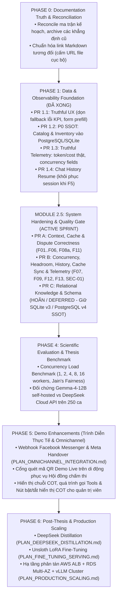

# TỔNG HỢP KẾ HOẠCH CHIẾN LƯỢC: LỘ TRÌNH KHÓA LUẬN TỐT NGHIỆP & HỆ THỐNG RETAILOPS 2026

> **Trạng thái:** ACTIVE STRATEGIC ROADMAP
> **Mức độ minh chứng (Evidence):** L3 Live System Architecture Reference
> **Audit basis / Documentation baseline reviewed:** `c30ff1d` · **Application verified:** `c30ff1d`
> **Ngày rà soát & đồng bộ:** 2026-10-01
> **Báo cáo tiến độ vận hành mới nhất:** Xem tại [CURRENT_PROJECT_STATUS.md](CURRENT_PROJECT_STATUS.md)

---

## 1. Sơ Đồ Phân Kỳ Các Giai Đoạn Theo Dependency Kỹ Thuật

```mermaid
flowchart TD
    P0["PHASE 0: Documentation Truth & Reconciliation<br/>• Reconcile ma trận kế hoạch, archive các khẳng định cũ<br/>• Chuẩn hóa link Markdown tương đối (cấm URL file cục bộ)"]

    P1["PHASE 1: Data & Observability Foundation (ĐÃ XONG)<br/>• PR 1.1: Truthful UX (dọn fallback lỗi KPI, form prefill)<br/>• PR 1.2: P0 SSOT: Catalog & Inventory vào PostgreSQL/SQLite<br/>• PR 1.3: Truthful Telemetry: token/cost thật, concurrency fields<br/>• PR 1.4: Chat History Resume (khôi phục session khi F5)"]

    M25["MODULE 2.5: System Hardening & Quality Gate (ACTIVE SPRINT)<br/>• PR A: Context, Cache & Dispute Correctness (F01..F06, F08a, F11)<br/>• PR B: Concurrency, Headroom, History, Cache Sync & Telemetry (F07, F09, F12, F13, SEC-01)<br/>• PR C: Relational Knowledge & Schema (HOÃN / DEFERRED - Giữ SQLite v3 / PostgreSQL v4 SSOT)"]

    P4["PHASE 4: Scientific Evaluation & Thesis Benchmark<br/>• Concurrency Load Benchmark (1, 2, 4, 8, 16 workers, Jain's Fairness)<br/>• Đối chứng Gemma-4-12B self-hosted vs DeepSeek Cloud API trên 250 ca"]

    P5["PHASE 5: Demo Enhancements (Trình Diễn Thực Tế & Omnichannel)<br/>• Webhook Facebook Messenger & Meta Handover (PLAN_OMNICHANNEL_INTEGRATION.md)<br/>• Cổng quét mã QR Demo Live trên di động phục vụ Hội đồng chấm thi<br/>• Hiển thị chuỗi COT, quá trình gọi Tools & Nút bật/tắt hiển thị COT cho quản trị viên"]

    P6["PHASE 6: Post-Thesis & Production Scaling<br/>• DeepSeek Distillation (PLAN_DEEPSEEK_DISTILLATION.md)<br/>• Unsloth LoRA Fine-Tuning (PLAN_FINE_TUNING_SERVING.md)<br/>• Hạ tầng phân tán AWS ALB + RDS Multi-AZ + vLLM Cluster (PLAN_PRODUCTION_SCALING.md)"]

    P0 --> P1
    P1 --> M25
    M25 --> P4
    P4 --> P5
    P5 --> P6
```

---

## 2. Ma Trận Trạng Thái Kỹ Thuật (18 Kế Hoạch Hiện Hữu + 2 Kế Hoạch Đề Xuất)

Bảng đối chiếu toàn diện giữa tài liệu thiết kế và hiện trạng mã nguồn thực tế tại snapshot baseline `d01f729` / `c30ff1d` (các mốc FIX01..04 ghi nhận lịch sử tại `fd24e36`):

| Mã Kế Hoạch | Tên Kế Hoạch / Module | Trạng Thái Trong Repo | Trạng Thái Kỹ Thuật Thật | Hiện Trạng Đối Chiếu Code Thật (`d01f729`) |
| :--- | :--- | :--- | :--- | :--- |
| **[PLAN_FIX_UI_04](PLAN_FIX_UI_04_CHAT_HISTORY_RESUME.md)** | Chat History Auto-Resume & Session Memory | IMPLEMENTED | **IMPLEMENTED (Resume Complete / Retention >6 Turns Pending F12)** | **Hoàn tất Resume:** Backend `GET /api/conversations`, client auto-resume khi F5 trong `web/app.js`, sidebar history, dialog, test `tests/test_conversation_resume.py` (4/4 PASS cho resume $\le 6$ turns). Không prune theo cửa sổ 6 lượt trong DB chờ F12 trong PR B. |
| **[PLAN_DATA_COLLECTION_FLYWHEEL](PLAN_DATA_COLLECTION_FLYWHEEL.md)** | Thu Thập Dữ Liệu Hội Thoại & Phản Hồi | IMPLEMENTED (Core Complete) | **IMPLEMENTED (Core Complete) / MAINTENANCE** | **Hoàn tất core:** Bảng `conversation_feedback`, route `POST /api/feedback`, UI Like/Dislike, CSAT popup, script `scripts/export_tuning_dataset.py`, test `tests/test_feedback.py` (6/6 PASS). |
| **[PLAN_REMEDIATION_GPT6_AUDIT](PLAN_REMEDIATION_GPT6_AUDIT.md)** | Khắc Phục Sau Đợt Rà Soát GPT-6 | Pending (Section 3) | **SUPERSEDED / HISTORICAL AUDIT** | **Kiểm toán lịch sử:** State machine guard (`routes.py:249`), băm Base64 ảnh F11 (`application.py:111`), ticket handoff F06, cache freshness F04, KPI động đã xong trong `tests/test_audit_remediation.py`. Catalog DB persistence chuyển duy nhất sang FIX02. |
| **[PLAN_ADMIN_REMEDIATION_MASTER](PLAN_ADMIN_REMEDIATION_MASTER.md)** | Master Remediation Giao Diện Quản Trị & Dữ Liệu | PARTIALLY IMPLEMENTED | **HISTORICAL PHASE 1 BASELINE (FIX01..FIX04 COMPLETE)** | Tài liệu điều phối tổng thể Phase 1: Toàn bộ FIX01 (Truthful UX), FIX02 (Catalog DB SSOT `a6ec080`), FIX03 (Telemetry Integrity `d7ce461`) và FIX04 (History Resume) đã hoàn tất và tích hợp vào baseline `main`. |
| **[PLAN_ECOMMERCE_OPS_COPILOT](PLAN_ECOMMERCE_OPS_COPILOT.md)** | Lõi TMĐT 2026, 6 SOPs & Staff Desk 1-Click | PARTIALLY IMPLEMENTED | **PARTIALLY IMPLEMENTED (Catalog SSOT Integrated / Durable Exchange Pending F08b)** | 6 SOP subagents, Staff Desk UI, cancellation state machine, và Catalog/Inventory DB SSOT (từ FIX02) đã hoàn tất; hành động duyệt đổi hàng bền vững (Durable Exchange Approval) được hoãn lại làm Future ADR (F08b). |
| **[PLAN_MULTIMODAL_ATTACHMENTS](PLAN_MULTIMODAL_ATTACHMENTS.md)** | Đính Kèm Ảnh Đa Phương Thức Cho Trợ Lý AI | PARTIALLY IMPLEMENTED | **PARTIAL** | Upload ảnh, thumbnail preview, băm sha256 chống trùng [F11] đã xong. *Tồn đọng:* Trích xuất Document/PDF chưa có engine OCR/parser thật và chưa có dedicated E2E test. |
| **[PLAN_FIX_UI_01](PLAN_FIX_UI_01_TRUTHFUL_UX.md)** | Truthful UX, Safe Fallbacks & Role Boundary | IMPLEMENTED & VERIFIED | **IMPLEMENTED & VERIFIED** | **Hoàn tất 100%:** Đã xóa số cứng 83.5%, 4.8; gán nhãn `[Mô phỏng]` SOP 1..5; ẩn Tool Inspector; thẻ KPI fallback `—` khi lỗi; bỏ tự gán `Tiêu chuẩn` và dọn modal prefill. (Code snapshot commit `56fda06`). |
| **[PLAN_FIX_UI_02](PLAN_FIX_UI_02_MANAGER_PERSISTENCE.md)** | Store Manager Persistence & Shared Inventory (P0) | MERGED TO MAIN & VERIFIED | **MERGED TO MAIN & VERIFIED** | **Hoàn tất 100%:** Catalog/Inventory SSOT đưa vào DB (SQLite v3 / Postgres v4), CatalogMapping proxy realtime, check_inventory & dispute_agent đọc variant stock & warranty thực, audit toàn shop GET /api/manager/events, sửa DOM ID nút manager. Đã merge vào `main` tại `a6ec080`, khắc phục tương thích PostgreSQL/Docker tại `d7ce461` (353/353 tests PASS, CI 100% green). |
| **[PLAN_FIX_UI_03](PLAN_FIX_UI_03_OPSCONSOLE_INTEGRITY.md)** | Ops Console Telemetry Integrity (P1) | COMPLETED & VERIFIED | **COMPLETED & VERIFIED** | **Hoàn tất 100%:** Loại bỏ ước lượng token `len // 3` và cost `$0.0`; chuẩn hóa nhãn E2E Request Latency; bỏ fallback copy cứng trong `admin.js`; bổ sung feedback & manager events vào Usage allowlist; tích hợp concurrency telemetry (`queue_wait_ms`, `in_flight_inferences`, `overload_429_count`). (19/19 ops console tests OK, 353/353 unit tests OK). |
| **[PLAN_MCP_INTEGRATION](PLAN_MCP_INTEGRATION.md)** | Standalone FastMCP Server & Client Adapter | IMPLEMENTED | **STANDALONE IMPLEMENTED / PRODUCTION WIRING PENDING** | Code thật: server nằm tại `retailops_mcp_server.py`, client adapter tại `retailops/workflow/mcp_client.py`, kiểm thử tại `tests/test_mcp_protocol.py` (100% tests PASS). |
| **[PLAN_RBAC_GOOGLE_AUTH](PLAN_RBAC_GOOGLE_AUTH.md)** | Phân Quyền Vai Trò & Google OAuth2 | IMPLEMENTED | **IMPLEMENTED / MAINTENANCE** | Runtime sử dụng server-side session cookie an toàn (không dùng JWT cho chat session); Ops Admin bảo vệ bằng Caddy Basic Auth; kiểm thử tại `tests/test_auth_google.py`, `tests/test_persistent_identity.py`, `tests/test_postgres.py`, `tests/test_public_web.py`. |
| **[PLAN_MODEL_SELECTION_STRATEGY](PLAN_MODEL_SELECTION_STRATEGY.md)** | Chiến Lược Lựa Chọn & Định Tuyến Model | PLANNED | **SUPERSEDED / NEEDS UPDATE** | Cập nhật: Xóa bỏ khẳng định "Semantic Cache Hit 50% cho retail queries"; chuyển số liệu tok/s và concurrency thành Planning Estimates; quyết định model dựa trên benchmark thực tế. |
| **[PLAN_PRODUCTION_SCALING](PLAN_PRODUCTION_SCALING.md)** | Mở Rộng Hạ Tầng Phân Tán (RDS/ALB/vLLM) | PLANNED (Sau Khóa luận) | **SUPERSEDED / NEEDS UPDATE** | Cập nhật: Xóa mục "Semantic Cache hit 60% cho policy/retail"; thay bằng deterministic routing, bounded concurrency, connection pooling; xác nhận thuộc phạm vi Post-thesis. |
| **[PLAN_DEEPSEEK_EVAL_FRAMEWORK](PLAN_DEEPSEEK_EVAL_FRAMEWORK.md)** | Khung Đánh Giá Đối Kháng Gemma-4 vs DeepSeek | PLANNED | **PLANNED LATER (Phase 4 Evaluation)** | Thiết kế benchmark đối chứng khoa học phục vụ Chương 4 Khóa luận. |
| **[PLAN_OMNICHANNEL_INTEGRATION](PLAN_OMNICHANNEL_INTEGRATION.md)** | Webhook Facebook Messenger & Meta Handover | PLANNED | **PLANNED LATER (Phase 5 Demo)** | Mở rộng kênh tương tác thực tế sau khi hoàn thành đo đạc khoa học. |
| **[PLAN_DEEPSEEK_DISTILLATION](PLAN_DEEPSEEK_DISTILLATION.md)** | Sinh Dữ Liệu Tổng Hợp Đa Lượt & ChatML | PLANNED | **PLANNED LATER (Phase 6 Post-thesis)** | Pipeline sinh dữ liệu distillation phục vụ fine-tuning. |
| **[PLAN_FINE_TUNING_SERVING](PLAN_FINE_TUNING_SERVING.md)** | Huấn Luyện LoRA Unsloth & Serving vLLM | PLANNED | **PLANNED LATER (Phase 6 Post-thesis)** | Đóng gói mô hình chuyên biệt cho môi trường tự host. |
| **[PLAN_MODULE_2_5_HARDENING_VERIFICATION](PLAN_MODULE_2_5_HARDENING_VERIFICATION.md)** | Quality Gate: System Hardening & Context Integrity | Active | **PR A/N08 CI PASS trên code SHA `fe25f67` (CI Run ID `37137791788`)** | P1.1 (session safety fail-closed) và P1.2 đã đóng triệt để. Pre-existing session fail-closed 503 khi takeover, không rò rỉ dữ liệu, retry hoàn tất an toàn. Sẵn sàng nghiệm thu PR A; PR B chưa bắt đầu. |
| **[PLAN_GRAPHRAG_AGE](PLAN_GRAPHRAG_AGE.md)** | GraphRAG Apache AGE trên PostgreSQL 16 (v6.2) | Research Only | **ACADEMIC RESEARCH / OFFLINE CONTAINER** | **ADR Quyết định:** Hoãn cài extension C Apache AGE trên EC2 production để tránh rủi ro sập host đơn; chuyển sang lưu trữ phục vụ nghiên cứu độc lập và benchmark container A/B offline. Production sử dụng SQL Relational Linkage. |
| **[PLAN_RUNTIME_EFFICIENCY_CONCURRENCY](PLAN_RUNTIME_EFFICIENCY_CONCURRENCY.md)** | Runtime Efficiency & Bounded Concurrency | Active Target | **INTEGRATED INTO MODULE 2.5 PR B** | Tích hợp vào Module 2.5 PR B: InferenceGate, Headroom Waitress $Q \le 5$, header Retry-After: 5, dọn lock tàn dư. |
| **[PLAN_CONCURRENCY_RELATIONAL_KNOWLEDGE_SPRINT](PLAN_CONCURRENCY_RELATIONAL_KNOWLEDGE_SPRINT.md)** | Kế Hoạch Sprint Gộp Concurrency & Relational | Active | **CANONICAL SPRINT SPEC** | Đặc tả kỹ thuật chi tiết của Module 2.5 PR B (triển khai tuần tự sau PR A; PR C hoãn làm Future ADR trên nền SQLite v3 / PostgreSQL v4). |
| **[PLAN_ACCOUNT_IDENTITY_IMPORT_SPECIFICATION](PLAN_ACCOUNT_IDENTITY_IMPORT_SPECIFICATION.md)** | Đặc Tả Kiến Trúc Định Danh, RBAC & Hợp Đồng Import Đơn Hàng | PLANNED (Module 2.5+) | **TARGET ARCHITECTURE SPEC (SSOT)** | **Nguồn đặc tả chuẩn:** Chuỗi định danh OIDC $\rightarrow$ Principal $\rightarrow$ Membership $\rightarrow$ Verified Customer Link; UUIDv4 opaque IDs; DB-backed RBAC SSOT; Ingestion contract (dry-run/commit) cho JSONL/XLSX bán lẻ thực tế. |
| **[PLAN_GOOGLE_ACCOUNT_RBAC_PRODUCTION](PLAN_GOOGLE_ACCOUNT_RBAC_PRODUCTION.md)** | Lộ Trình Triển Khai Chuyển Đổi Google SSO & RBAC | PLANNED (Module 2.5+) | **PHASING ROADMAP / OVERVIEW** | Lộ trình phân kỳ 4 giai đoạn triển khai hạ tầng Google Cloud Console, cấu hình EC2, tách biệt môi trường demo vs khách thật. Tham chiếu đặc tả chuẩn tại PLAN_ACCOUNT_IDENTITY_IMPORT_SPECIFICATION.md. |

---

## 3. Trình Tự Triển Khai Chi Tiết Các Giai Đoạn

### Giai Đoạn 0: Cập Nhật Tài Liệu & Đồng Bộ Kiến Trúc (Documentation Truth)
- Hoàn thiện toàn bộ các file tài liệu thiết kế.
- Kiểm tra cổng kiểm định: `python scripts/check_docs_contract.py` đạt kết quả SUCCESS (0 lỗi).

### Giai Đoạn 1: Nền Tảng Dữ Liệu & Khả Năng Quan Sát (Data & Observability Foundation)
- ĐÃ HOÀN TẤT VÀ MERGE VÀO MAIN (PR 1.1, PR 1.2, PR 1.3, PR 1.4).

### Module 2.5: Chốt Chặn Kiểm Thử & Ổn Định Vận Hành Thực Tế (Quality Gate)
- Xem chi tiết tại [PLAN_MODULE_2_5_HARDENING_VERIFICATION.md](PLAN_MODULE_2_5_HARDENING_VERIFICATION.md).
- Triển khai theo thứ tự tuần tự: **PR A trước**, sau đó tích hợp **PR B** (do cả hai cùng chạm vào `retailops/business/application.py` và cơ chế cache); **PR C được hoãn lại** làm Future ADR:
  1. **PR A (Context, Cache & Dispute Correctness + N08)**: Toàn bộ blocker P1.1 và P1.2 đã được giải quyết và kiểm chứng PASS trong CI Run `37137791788` trên code SHA `fe25f67`. Session cũ fail-closed 503 `collision_unresolved` khi membership hoặc customer đích chưa giải quyết xong, ngăn ngừa rò rỉ dữ liệu sau late takeover. Sẵn sàng nghiệm thu PR A; chưa merge `main`, chưa deploy EC2, chưa bắt đầu PR B. Xem [N08_STOPPING_CONDITIONS.md](N08_STOPPING_CONDITIONS.md).
  2. **PR B (Concurrency, Headroom, History, Cache Sync & Telemetry)**: Bắt đầu sau khi PR A/N08 được review và merge; chưa coi là đã triển khai. Thiết lập Chat Admission Limiter kết hợp `InferenceGate` ($K=1, Q=5$): admission giới hạn tối đa 6 chat được nhận xử lý đồng thời trên Waitress 8 workers, giảm nguy cơ chat chiếm hết worker (không bảo đảm luôn có 2 worker rảnh hoặc một pool riêng); mục tiêu có điều kiện P99 $\le 50\text{ms}$ cho `/healthz` dưới tải bão hòa 6 chat kiểm soát; header `Retry-After: 5`, dọn sạch `agent_lock`, đo telemetry thật F09 (`provider_inference_ms`) đến Ops importer, bảo toàn lịch sử chat F12, xử lý race condition invalidate ToolCache F13, và chống OAuth Login CSRF SEC-01.
  3. **PR C (Relational Linkage & Clean Migration - HOÃN / DEFERRED)**: Hoãn triển khai trong Module 2.5; giữ SQLite Business v3 (hàm `migrate(db, component, initialize)` tại `retailops/schema.py:4, 11` với `component == "business"` đặt `target = 3`) và PostgreSQL Business v4 (`BUSINESS_SCHEMA_CURRENT = 4`). Cột `warranty_days` trong bảng `products` của cả hai backend đã có sẵn (P-603 180 ngày). Giữ thiết kế DDL `product_policy_links` làm Future ADR cho giai đoạn sau.

### Giai Đoạn 4: Đo Lường Thực Nghiệm Khoa Học Cho Luận Văn (Scientific Evaluation)
- Chạy benchmark tải đồng thời (`concurrency = 1, 2, 4, 8, 16`) đo lường độ trễ E2E, throughput, 429 rate, Jain's Fairness Index và wait-time dispersion.
- Chạy đối chứng 250 kịch bản Master Benchmark: Gemma-4-12B self-hosted vs. DeepSeek Cloud API.
- Lập bảng số liệu và biểu đồ thực nghiệm đưa vào Chương 4 Luận văn tốt nghiệp.

### Giai Đoạn 5: Mở Rộng Trình Diễn Thực Tế (Demo Enhancements & Omnichannel)
- Tích hợp Facebook Messenger Webhook & Meta Handover Protocol ([PLAN_OMNICHANNEL_INTEGRATION.md](PLAN_OMNICHANNEL_INTEGRATION.md)) qua Meta Developer API (miễn phí).
- Tạo cổng sinh mã QR Demo Live trên di động phục vụ Hội đồng chấm thi quét mã và trải nghiệm trực tiếp.
- Hiển thị chuỗi COT (Reasoning Chain) & Timeline quá trình gọi Tools trên giao diện Web UI/Mobile.
- Tích hợp nút bật/tắt (Toggle Switch) trong Store Manager Console cho phép Quản trị viên chủ động quyết định hiển thị hoặc ẩn chuỗi COT/Tool Trace đối với khách hàng (cả trên Web và tin nhắn Messenger).

### Giai Đoạn 6: Nghiên Cứu Sau Khóa Luận & Mở Rộng Thương Mại (Post-Thesis)
- Triển khai pipeline Distillation và Unsloth LoRA Fine-Tuning.
- Chuyển đổi kiến trúc phân tán AWS ALB + RDS Multi-AZ + vLLM Cluster ([PLAN_PRODUCTION_SCALING.md](PLAN_PRODUCTION_SCALING.md)).
