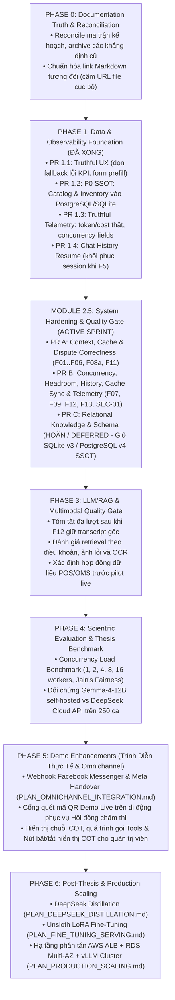

# TỔNG HỢP KẾ HOẠCH CHIẾN LƯỢC: LỘ TRÌNH KHÓA LUẬN TỐT NGHIỆP & HỆ THỐNG RETAILOPS 2026

> **Current execution snapshot (2026-10-10):** G2 PASS trên `8868c5c498b1c64241bc791eb0166d82415cfeb0`; Phase 5 P5-A smoke isolation và G4 controlled smoke PASS trên merged `dd0947aad3a2dc8884710c8f6c609f42b67417bd`; Phase 5 P5-B Google test identity & tenant isolation hoàn thành trên [PR #38](https://github.com/tuteemovaixlong/CSKH_ban_le/pull/38) (candidate `682e982459a5abfad4459707d729d2fd8f1f28a5`, offline tests & full CI PASSED, chờ owner review). Bước kế tiếp là P5-C sales simulator và import contract (`external_customer_id` mapping), rồi P5-D complaint E2E theo [phase5/PHASE_5_PLAN.md](phase5/PHASE_5_PLAN.md). Chưa có G5 measurement readiness; Messenger/QR vẫn để sau.

> **Trạng thái:** ACTIVE STRATEGIC ROADMAP
> **Phân biệt gate:** smoke PASS theo log owner là operational smoke, chưa gọi Google OAuth/model; G4 per-lane real-model/DB/KB và G5 vẫn cần evidence riêng. Sơ đồ phân kỳ bên dưới là roadmap tổng thể lịch sử; workstream kế tiếp lấy từ current snapshot/P5-B ở trên.
> **Mức độ minh chứng (Evidence):** Roadmap và CI snapshot; không phải xác nhận production readiness.
> **Đồng bộ Module 2.5:** PR #34 merged `47ba72a`; PR #35 (PR B) merged tại `b3a0ccd72c1d025b3af567486943123bf3e05526`. **PR B MERGED & POSTMERGE VERIFIED**. CI main run 37418383578 PASS, Artifact ID 11392265139 đã verified tính toàn vẹn mẫu và unrounded P99 $\le 50$ms; 5/5 CI check-runs xanh; Ops Console run 37418383604 PASS; Module 2.5 hoàn tất, chuyển giao Phase 4.
> **Phạm vi đồng bộ:** kiểm tra trạng thái PR và các code path liên quan đến góp ý LLM/RAG; không phải audit toàn hệ thống hoặc đánh giá chất lượng model live.
> **Ngày rà soát & đồng bộ:** 2026-10-06
> **Merge SHA đã xác minh:** `b3a0ccd72c1d025b3af567486943123bf3e05526` trên main. Hoàn tất trigger PRB-MERGE-POSTVERIFY.
> **Báo cáo tiến độ vận hành mới nhất:** Xem tại [CURRENT_PROJECT_STATUS.md](CURRENT_PROJECT_STATUS.md)

---

## 1. Sơ Đồ Phân Kỳ Các Giai Đoạn Theo Dependency Kỹ Thuật

```mermaid
flowchart TD
    P0["PHASE 0: Documentation Truth & Reconciliation<br/>• Reconcile ma trận kế hoạch, archive các khẳng định cũ<br/>• Chuẩn hóa link Markdown tương đối (cấm URL file cục bộ)"]

    P1["PHASE 1: Data & Observability Foundation (ĐÃ XONG)<br/>• PR 1.1: Truthful UX (dọn fallback lỗi KPI, form prefill)<br/>• PR 1.2: P0 SSOT: Catalog & Inventory vào PostgreSQL/SQLite<br/>• PR 1.3: Truthful Telemetry: token/cost thật, concurrency fields<br/>• PR 1.4: Chat History Resume (khôi phục session khi F5)"]

    M25["MODULE 2.5: System Hardening & Quality Gate (ACTIVE SPRINT)<br/>• PR A: Context, Cache & Dispute Correctness (F01..F06, F08a, F11)<br/>• PR B: Concurrency, Headroom, History, Cache Sync & Telemetry (F07, F09, F12, F13, SEC-01)<br/>• PR C: Relational Knowledge & Schema (HOÃN / DEFERRED - Giữ SQLite v3 / PostgreSQL v4 SSOT)"]

    P3["PHASE 3: LLM/RAG & Multimodal Quality Gate<br/>• Tóm tắt đa lượt sau khi F12 giữ transcript gốc<br/>• Đánh giá retrieval theo điều khoản, ảnh lỗi và OCR<br/>• Xác định hợp đồng dữ liệu POS/OMS trước pilot live"]

    P4["PHASE 4: Scientific Evaluation & Thesis Benchmark<br/>• Concurrency Load Benchmark (1, 2, 4, 8, 16 workers, Jain's Fairness)<br/>• Đối chứng Gemma-4-12B self-hosted vs DeepSeek Cloud API trên 250 ca"]

    P5["PHASE 5: Demo Enhancements (Trình Diễn Thực Tế & Omnichannel)<br/>• Webhook Facebook Messenger & Meta Handover (PLAN_OMNICHANNEL_INTEGRATION.md)<br/>• Cổng quét mã QR Demo Live trên di động phục vụ Hội đồng chấm thi<br/>• Hiển thị chuỗi COT, quá trình gọi Tools & Nút bật/tắt hiển thị COT cho quản trị viên"]

    P6["PHASE 6: Post-Thesis & Production Scaling<br/>• DeepSeek Distillation (PLAN_DEEPSEEK_DISTILLATION.md)<br/>• Unsloth LoRA Fine-Tuning (PLAN_FINE_TUNING_SERVING.md)<br/>• Hạ tầng phân tán AWS ALB + RDS Multi-AZ + vLLM Cluster (PLAN_PRODUCTION_SCALING.md)"]

    P0 --> P1
    P1 --> M25
    M25 --> P3
    P3 --> P4
    P4 --> P5
    P5 --> P6
```

---

## 2. Ma Trận Trạng Thái Kỹ Thuật (18 Kế Hoạch Hiện Hữu + 2 Kế Hoạch Đề Xuất)

Bảng dưới giữ các mốc baseline lịch sử `d01f729` / `c30ff1d`; hàng Module 2.5 và những mục được nêu rõ PR B candidate đã cập nhật theo snapshot `5188dc0`. Không gán trạng thái candidate thành đã deploy.

| Mã Kế Hoạch | Tên Kế Hoạch / Module | Trạng Thái Trong Repo | Trạng Thái Kỹ Thuật Thật | Hiện Trạng Đối Chiếu Code Thật (`d01f729`) |
| :--- | :--- | :--- | :--- | :--- |
| **[PLAN_FIX_UI_04](PLAN_FIX_UI_04_CHAT_HISTORY_RESUME.md)** | Chat History Auto-Resume & Session Memory | IMPLEMENTED | **RESUME COMPLETE / F12 VERIFIED IN PR B CANDIDATE** | Resume đã có trong main. Candidate PR #35 triển khai retention >6 turns, AC-11 VERIFIED; prompt vẫn bounded 6 lượt. Không gọi retention đã merged/deployed trước khi PR #35 được tích hợp. |
| **[PLAN_DATA_COLLECTION_FLYWHEEL](PLAN_DATA_COLLECTION_FLYWHEEL.md)** | Thu Thập Dữ Liệu Hội Thoại & Phản Hồi | IMPLEMENTED (Core Complete) | **IMPLEMENTED (Core Complete) / MAINTENANCE** | **Hoàn tất core:** Bảng `conversation_feedback`, route `POST /api/feedback`, UI Like/Dislike, CSAT popup, script `scripts/export_tuning_dataset.py`, test `tests/test_feedback.py` (6/6 PASS). |
| **[PLAN_REMEDIATION_GPT6_AUDIT](PLAN_REMEDIATION_GPT6_AUDIT.md)** | Khắc Phục Sau Đợt Rà Soát GPT-6 | Pending (Section 3) | **SUPERSEDED / HISTORICAL AUDIT** | **Kiểm toán lịch sử:** State machine guard (`routes.py:249`), băm Base64 ảnh F11 (`application.py:111`), ticket handoff F06, cache freshness F04, KPI động đã xong trong `tests/test_audit_remediation.py`. Catalog DB persistence chuyển duy nhất sang FIX02. |
| **[PLAN_ADMIN_REMEDIATION_MASTER](PLAN_ADMIN_REMEDIATION_MASTER.md)** | Master Remediation Giao Diện Quản Trị & Dữ Liệu | PARTIALLY IMPLEMENTED | **HISTORICAL PHASE 1 BASELINE (FIX01..FIX04 COMPLETE)** | Tài liệu điều phối tổng thể Phase 1: Toàn bộ FIX01 (Truthful UX), FIX02 (Catalog DB SSOT `a6ec080`), FIX03 (Telemetry Integrity `d7ce461`) và FIX04 (History Resume) đã hoàn tất và tích hợp vào baseline `main`. |
| **[PLAN_ECOMMERCE_OPS_COPILOT](PLAN_ECOMMERCE_OPS_COPILOT.md)** | Lõi TMĐT 2026, 6 SOPs & Staff Desk 1-Click | PARTIALLY IMPLEMENTED | **PARTIALLY IMPLEMENTED (Catalog SSOT Integrated / Durable Exchange Pending F08b)** | 6 SOP subagents, Staff Desk UI, cancellation state machine, và Catalog/Inventory DB SSOT (từ FIX02) đã hoàn tất; hành động duyệt đổi hàng bền vững (Durable Exchange Approval) được hoãn lại làm Future ADR (F08b). |
| **[PLAN_MULTIMODAL_ATTACHMENTS](PLAN_MULTIMODAL_ATTACHMENTS.md)** | Đính Kèm Ảnh Đa Phương Thức Cho Trợ Lý AI | PARTIALLY IMPLEMENTED | **PARTIAL** | Upload ảnh, thumbnail preview, băm sha256 chống trùng [F11] đã xong. *Tồn đọng:* Trích xuất Document/PDF chưa có engine OCR/parser thật và chưa có dedicated E2E test. |
| **[PLAN_FIX_UI_01](PLAN_FIX_UI_01_TRUTHFUL_UX.md)** | Truthful UX, Safe Fallbacks & Role Boundary | IMPLEMENTED & VERIFIED | **IMPLEMENTED & VERIFIED** | **Hoàn tất 100%:** Đã xóa số cứng 83.5%, 4.8; gán nhãn `[Mô phỏng]` SOP 1..5; ẩn Tool Inspector; thẻ KPI fallback `—` khi lỗi; bỏ tự gán `Tiêu chuẩn` và dọn modal prefill. (Code snapshot commit `56fda06`). |
| **[PLAN_FIX_UI_02](PLAN_FIX_UI_02_MANAGER_PERSISTENCE.md)** | Store Manager Persistence & Shared Inventory (P0) | MERGED TO MAIN & VERIFIED | **MERGED TO MAIN & VERIFIED** | **Hoàn tất 100%:** Catalog/Inventory SSOT đưa vào DB (SQLite v3 / Postgres v4), CatalogMapping proxy realtime, check_inventory & dispute_agent đọc variant stock & warranty thực, audit toàn shop GET /api/manager/events, sửa DOM ID nút manager. Đã merge vào `main` tại `a6ec080`, khắc phục tương thích PostgreSQL/Docker tại `d7ce461` (353/353 tests PASS, CI 100% green). |
| **[PLAN_FIX_UI_03](PLAN_FIX_UI_03_OPSCONSOLE_INTEGRITY.md)** | Ops Console Telemetry Integrity (P1) | COMPLETED & VERIFIED | **COMPLETED & VERIFIED** | **Hoàn tất 100%:** Loại bỏ ước lượng token `len // 3` và cost `$0.0`; chuẩn hóa nhãn E2E Request Latency; bỏ fallback copy cứng trong `admin.js`; bổ sung feedback & manager events vào Usage allowlist; tích hợp concurrency telemetry (`queue_wait_ms`, `in_flight_inferences`, `overload_429_count`). (19/19 ops console tests OK, 353/353 unit tests OK). |
| **[PLAN_MCP_INTEGRATION](PLAN_MCP_INTEGRATION.md)** | Standalone FastMCP Server & Client Adapter | IMPLEMENTED | **STANDALONE IMPLEMENTED / PRODUCTION WIRING PENDING** | Code thật: server nằm tại `retailops_mcp_server.py`, client adapter tại `retailops/workflow/mcp_client.py`, kiểm thử tại `tests/test_mcp_protocol.py` (100% tests PASS). |
| **[PLAN_RBAC_GOOGLE_AUTH](PLAN_RBAC_GOOGLE_AUTH.md)** | Phân Quyền Vai Trò & Google OAuth2 | IMPLEMENTED | **IMPLEMENTED / MAINTENANCE** | Runtime sử dụng server-side session cookie an toàn (không dùng JWT cho chat session); Ops Admin bảo vệ bằng Caddy Basic Auth; kiểm thử tại `tests/test_auth_google.py`, `tests/test_persistent_identity.py`, `tests/test_postgres.py`, `tests/test_public_web.py`. |
| **[PLAN_MODEL_SELECTION_STRATEGY](PLAN_MODEL_SELECTION_STRATEGY.md)** | Chiến Lược Lựa Chọn & Định Tuyến Model | PLANNED | **SUPERSEDED / NEEDS UPDATE** | Cập nhật: Xóa bỏ khẳng định "Semantic Cache Hit 50% cho retail queries"; chuyển số liệu tok/s và concurrency thành Planning Estimates; quyết định model dựa trên benchmark thực tế. |
| **[PLAN_PRODUCTION_SCALING](PLAN_PRODUCTION_SCALING.md)** | Mở Rộng Hạ Tầng Phân Tán (RDS/ALB/vLLM) | PLANNED (Sau Khóa luận) | **SUPERSEDED / NEEDS UPDATE** | Cập nhật: Xóa mục "Semantic Cache hit 60% cho policy/retail"; thay bằng deterministic routing, bounded concurrency, connection pooling; xác nhận thuộc phạm vi Post-thesis. |
| **[PLAN_DEEPSEEK_EVAL_FRAMEWORK](PLAN_DEEPSEEK_EVAL_FRAMEWORK.md)** | Khung Đánh Giá Đối Kháng Gemma-4 vs DeepSeek | PLANNED | **PLANNED LATER (Phase 4 Evaluation)** | Thiết kế benchmark đối chứng khoa học phục vụ Chương 4 Khóa luận. |
| **[PLAN_OMNICHANNEL_INTEGRATION](PLAN_OMNICHANNEL_INTEGRATION.md)** | Webhook Facebook Messenger & Meta Handover | PLANNED | **PLANNED LATER (Phase 5 Demo)** | Mở rộng kênh tương tác thực tế sau khi hoàn thành đo đạc khoa học. |
| **[PLAN_DEEPSEEK_DISTILLATION](PLAN_DEEPSEEK_DISTILLATION.md)** | Sinh Dữ Liệu Tổng Hợp Đa Lượt & ChatML | PLANNED | **PLANNED LATER (Phase 6 Post-thesis)** | Pipeline sinh dữ liệu distillation phục vụ fine-tuning. |
| **[PLAN_FINE_TUNING_SERVING](PLAN_FINE_TUNING_SERVING.md)** | Huấn Luyện LoRA Unsloth & Serving vLLM | PLANNED | **PLANNED LATER (Phase 6 Post-thesis)** | Đóng gói mô hình chuyên biệt cho môi trường tự host. |
| **[PLAN_MODULE_2_5_HARDENING_VERIFICATION](PLAN_MODULE_2_5_HARDENING_VERIFICATION.md)** | Quality Gate: System Hardening & Context Integrity | Completed | **PR B MERGED & POSTMERGE VERIFIED** | PR A/N08 merged; PR B/#35 merged tại `b3a0ccd`. Protocol CI 10×100 samples/endpoint có unrounded P99 $\le 50$ms verified; CI main run 37418383578 PASS, artifact 11392265139 integrity PASS; 5/5 check-runs xanh. Hoàn thành Module 2.5; bàn giao Phase 4. |
| **[PLAN_GRAPHRAG_AGE](PLAN_GRAPHRAG_AGE.md)** | GraphRAG Apache AGE trên PostgreSQL 16 (v6.2) | Research Only | **ACADEMIC RESEARCH / OFFLINE CONTAINER** | **ADR Quyết định:** Hoãn cài extension C Apache AGE trên EC2 production để tránh rủi ro sập host đơn; chuyển sang lưu trữ phục vụ nghiên cứu độc lập và benchmark container A/B offline. Production sử dụng SQL Relational Linkage. |
| **[PLAN_RUNTIME_EFFICIENCY_CONCURRENCY](PLAN_RUNTIME_EFFICIENCY_CONCURRENCY.md)** | Runtime Efficiency & Bounded Concurrency | Active Target | **INTEGRATED INTO MODULE 2.5 PR B** | Tích hợp vào Module 2.5 PR B: InferenceGate, Headroom Waitress $Q \le 5$, header Retry-After: 5, dọn lock tàn dư. |
| **[PLAN_CONCURRENCY_RELATIONAL_KNOWLEDGE_SPRINT](PLAN_CONCURRENCY_RELATIONAL_KNOWLEDGE_SPRINT.md)** | Kế Hoạch Sprint Gộp Concurrency & Relational | Active | **CANONICAL SPRINT SPEC** | Đặc tả kỹ thuật chi tiết của Module 2.5 PR B (triển khai tuần tự sau PR A; PR C hoãn làm Future ADR trên nền SQLite v3 / PostgreSQL v4). |
| **[PLAN_ACCOUNT_IDENTITY_IMPORT_SPECIFICATION](PLAN_ACCOUNT_IDENTITY_IMPORT_SPECIFICATION.md)** | Đặc Tả Kiến Trúc Định Danh, RBAC & Hợp Đồng Import Đơn Hàng | PLANNED (Module 2.5+) | **TARGET ARCHITECTURE SPEC (SSOT)** | **Nguồn đặc tả chuẩn:** Chuỗi định danh OIDC $\rightarrow$ Principal $\rightarrow$ Membership $\rightarrow$ Verified Customer Link; UUIDv4 opaque IDs; DB-backed RBAC SSOT; Ingestion contract (dry-run/commit) cho JSONL/XLSX bán lẻ thực tế. |
| **[PLAN_GOOGLE_ACCOUNT_RBAC_PRODUCTION](PLAN_GOOGLE_ACCOUNT_RBAC_PRODUCTION.md)** | Lộ Trình Triển Khai Chuyển Đổi Google SSO & RBAC | PLANNED (Module 2.5+) | **PHASING ROADMAP / OVERVIEW** | Lộ trình phân kỳ 4 giai đoạn triển khai hạ tầng Google Cloud Console, cấu hình EC2, tách biệt môi trường demo vs khách thật. Tham chiếu đặc tả chuẩn tại PLAN_ACCOUNT_IDENTITY_IMPORT_SPECIFICATION.md. |

---

## 3. Trình Tự Triển Khai Chi Tiết Các Giai Đoạn

### Giai Đoạn 0: Cập Nhật Tài Liệu & Đồng Bộ Kiến Trúc (Documentation Truth)
- Hoàn thiện toàn bộ các file tài liệu thiết kế.
- Kiểm tra cổng kiểm định: `python scripts/check_docs_contract.py` đạt kết quả SUCCESS (0 lỗi).

### Giai Đoạn 1: Nền Tảng Dữ Liệu & Khả Năng Quan Sát (Data & Observability Foundation)
- ĐÃ HOÀN TẤT VÀ MERGE VÀO MAIN (PR 1.1, PR 1.2, PR 1.3, PR 1.4).

### Module 2.5: Chốt Chặn Kiểm Thử & Ổn Định Vận Hành Thực Tế (Quality Gate)
- Xem chi tiết tại [PLAN_MODULE_2_5_HARDENING_VERIFICATION.md](PLAN_MODULE_2_5_HARDENING_VERIFICATION.md).
- Triển khai theo thứ tự tuần tự: **PR A trước**, sau đó tích hợp **PR B** (do cả hai cùng chạm vào `retailops/business/application.py` và cơ chế cache); **PR C được hoãn lại** làm Future ADR:
  1. **PR A (Context, Cache & Dispute Correctness + N08)**: PR #34 đã merged vào main tại 47ba72a; CI và PostgreSQL checks xanh. PR #35 (PR B) đang mở trên nhánh `feature/module-2.5-pr-b`.
  2. **PR B (Concurrency, Headroom, History, Cache Sync & Telemetry)**: MERGED tại `b3a0ccd`; **POSTMERGE VERIFIED**. Đã hoàn tất trigger [PRB-MERGE-POSTVERIFY](PLAN_EXECUTION_HANDOFF_GPT6_ASTRA.md#123-trigger-prb-merge-postverify). CI main run 37418383578 PASS, artifact 11392265139 verified, 5/5 check-runs completed/success. Chuyển giao Phase 4.
  3. **PR C (Relational Linkage & Clean Migration - HOÃN / DEFERRED)**: Hoãn triển khai trong Module 2.5; giữ SQLite Business v3 (hàm `migrate(db, component, initialize)` tại `retailops/schema.py:4, 11` với `component == "business"` đặt `target = 3`) và PostgreSQL Business v4 (`BUSINESS_SCHEMA_CURRENT = 4`). Cột `warranty_days` trong bảng `products` của cả hai backend đã có sẵn (P-603 180 ngày). Giữ thiết kế DDL `product_policy_links` làm Future ADR cho giai đoạn sau.

- **Bước kế tiếp:** [PRB-MERGE-POSTVERIFY](PLAN_EXECUTION_HANDOFF_GPT6_ASTRA.md#123-trigger-prb-merge-postverify) đã hoàn thành xuất sắc trên main tại `b3a0ccd`. Bàn giao sang Phase 4: Scientific Evaluation (Khung đánh giá đối kháng Gemma-4 vs DeepSeek API trên 250 ca frozen benchmark).

### Giai Đoạn 3: LLM/RAG & Multimodal Quality Gate (trước pilot hoặc đổi kiến trúc)

- **Mục tiêu:** Đo retrieval/chất lượng câu trả lời bảo hành, khả năng nhận diện dấu hiệu lỗi qua ảnh và OCR chứng từ trên dữ liệu có nhãn; không mặc định rằng đổi embedding, thêm reranker hay OCR sẽ cải thiện kết quả.
- **Thứ tự:** Hoàn tất PR A/N08; triển khai PR B theo kế hoạch; sau đó chạy đánh giá retrieval/workflow trên baseline hiện hành. Không để Phase 3 làm chậm PR B.
- **Tập đánh giá:** Tạo tập riêng có qrels và nhãn claim/outcome cho paraphrase tiếng Việt, điều kiện áp dụng/chính sách ngoại lệ, thiếu bằng chứng, đa lượt, mã đơn/sản phẩm, ảnh lỗi và chứng từ OCR. Giữ nguyên Frozen Master Benchmark 250; không trộn tập này vào benchmark đóng băng.
- **Tóm tắt hội thoại dài hạn (sau F12, ngoài phạm vi PR B):** F12 trước hết phải giữ transcript gốc đầy đủ trong DB; tóm tắt là dữ liệu dẫn xuất để hỗ trợ context dài, không thay hoặc xóa transcript. Thiết kế summary có version/revision và mốc turn đã tóm tắt, liên kết về các turn/evidence nguồn, giữ các mục: ý định, mã đơn/sản phẩm đã xác nhận, dữ kiện do khách cung cấp, kết quả tool, điểm chưa chắc chắn và câu hỏi còn mở. Trước hành động hoặc trả lời về trạng thái hiện tại, đọc lại Business DB/policy SSOT; summary không cấp quyền, không xác nhận giao dịch. Kiểm thử sửa sai/đính chính, thông tin mâu thuẫn, retry/restart, cách ly khách hàng, retention/privacy và summary bị prompt injection.
- **Phân biệt đúng/sai trong feedback DeepSeek:**
  - Đúng với baseline trước PR B: `agent_turns` từng prune còn 6 lượt. F12 đã triển khai trong candidate PR #35 và AC-11 VERIFIED: DB giữ transcript đầy đủ, prompt dùng cửa sổ bounded 6 lượt; candidate chưa merge/deploy. Riêng `dispute_agent` dựng prompt từ tin nhắn cuối, không đưa lịch sử/attachment vào prompt chuyên biệt; đây là phạm vi đánh giá LLM/RAG tiếp theo.
  - Cần giới hạn: ảnh được chuyển thành payload cho provider hỗ trợ vision ở các luồng tương thích; provider text-only chỉ nhận ghi chú tên ảnh. PDF/document hiện chỉ đưa tên file, chưa có parser/OCR. Không gộp các năng lực này thành nhận định “toàn hệ thống chỉ thấy tên file”.
  - Cần đo trước khi kết luận: `feature-hash-v1` là baseline deterministic; retrieval hiện kết hợp vector score và PostgreSQL lexical score, chunker giữ ranh giới đoạn trước khi chia đoạn dài theo ký tự. Các số cosine trong feedback không kèm script/dataset và chưa được xác nhận; dùng qrels để đo recall/ranking trước khi đổi embedding, chunking hoặc thêm reranker.
  - Không áp dụng đề xuất “bỏ câu trả lời dựng sẵn” theo diện rộng: giữ kiểm soát xác định cho ownership, quyền, eligibility và side effect; policy answer cần được ràng buộc bởi evidence, có clarify/abstain/handoff khi thiếu nguồn.
  - Dữ liệu đơn hàng/catalog đã có business DB và tool nội bộ; chưa xem đó là bằng chứng đồng bộ live với POS/OMS bên ngoài. Nếu pilot cần nguồn live, xác định riêng system of record, cơ chế cập nhật và freshness SLA.
- **Ứng viên embedding để benchmark, chưa phải quyết định triển khai:** giữ `feature-hash-v1` làm baseline; so sánh với [`sentence-transformers/paraphrase-multilingual-MiniLM-L12-v2`](https://huggingface.co/sentence-transformers/paraphrase-multilingual-MiniLM-L12-v2) và [`intfloat/multilingual-e5-base`](https://huggingface.co/intfloat/multilingual-e5-base) trên cùng qrels tiếng Việt. MiniLM cho vector 384 chiều phù hợp kích thước hiện tại nhưng vẫn phải version hóa và re-embed toàn corpus; E5-base cho vector 768 chiều, trong khi `knowledge_chunks.embedding` hiện là `vector(384)`, nên cần thiết kế lưu/index song song hoặc migration có kế hoạch. Với E5, encode query/document theo prefix `query:` / `passage:`. Pin model revision, tokenizer/runtime và checksum trong benchmark; không trộn vector giữa các model.
- **Chunking và ranking chính sách:** hybrid vector + lexical search hiện đã có; không lập lại như một tính năng mới. Đánh giá chunk theo từng cam kết/điều khoản, giữ cùng chunk hoặc metadata liên kết cho phạm vi áp dụng, điều kiện, ngoại lệ, ngày hiệu lực và nguồn. So với chunker paragraph/character hiện tại bằng qrels; không tách rời ngoại lệ khỏi điều khoản. Chỉ thêm reranker nếu candidate liên quan đã được tìm thấy nhưng xếp hạng top-k chưa tốt; đo Recall trước rerank, nDCG/MRR sau rerank, latency và chi phí.
- **Đánh giá ảnh sản phẩm lỗi:** kiểm tra pipeline end-to-end tới `dispute_agent` (hiện worker này chỉ gửi nội dung tin nhắn cuối, không gửi history/attachment cho model). Tạo bộ ảnh có nhãn lỗi cụ thể, ảnh không lỗi và ca mơ hồ; đo precision/recall theo loại lỗi và false-positive. Đầu ra vision chỉ là mô tả dấu hiệu + mức tin cậy để hỗ trợ phân loại; không tự kết luận đủ điều kiện bảo hành, không tự tạo giao dịch. Đối chiếu đơn, sản phẩm, thời hạn/chính sách bằng nguồn nghiệp vụ; ca thiếu rõ ràng phải hỏi thêm hoặc chuyển nhân viên.
- **Đánh giá OCR/chứng từ:** bổ sung extraction cho hóa đơn, phiếu bảo hành và nhãn/mã vận đơn nếu thuộc phạm vi pilot. Đo exact match/field accuracy (mã đơn, sản phẩm, ngày mua, mã vận đơn) trên scan rõ, mờ, nghiêng và thiếu trường; kiểm tra kết quả OCR với business DB. Lưu provenance/vị trí trích xuất, đặt ngưỡng confidence theo dữ liệu, và clarify/handoff khi thấp; OCR không được trực tiếp cập nhật đơn hàng. Hiện document/PDF chỉ gửi tên file, chưa có OCR/parser thật; ảnh có đường truyền tới vision provider tương thích nhưng chưa phải năng lực defect scanning đã được kiểm chứng. Xem [PLAN_MULTIMODAL_ATTACHMENTS.md](PLAN_MULTIMODAL_ATTACHMENTS.md).
- **Gate đánh giá:** Dùng tiêu chí ban đầu tại [SYSTEM_REVIEW_FOR_LLM.md](SYSTEM_REVIEW_FOR_LLM.md) §8–9 làm ngưỡng nội bộ đề xuất, không gọi là chuẩn ngành. Báo cáo Recall@k và evidence sau giới hạn tool, citation validity/claim support, abstention, outcome nghiệp vụ, latency/cost; phân loại lỗi retrieval, ranking, chunking, context hoặc generation. Lưu SHA code/dataset/KB/model/prompt/grader để tái lập.
- **Dữ liệu đơn hàng/bảo hành live:** hệ thống hiện có Business DB nội bộ, tool tra cứu đơn/sản phẩm và `products.warranty_days`; điều đó chưa chứng minh đã nối với POS/OMS hoặc DB vận hành thật của cửa hàng. Trước pilot live, xác định chủ nguồn dữ liệu (system of record), mapping tenant/customer/order/product, API/webhook hoặc cơ chế đồng bộ, idempotency và xử lý cập nhật/xóa, freshness SLA, audit và hành vi khi nguồn lỗi/stale. Không thay bằng seed/mock data và không gọi dữ liệu là “real-time” nếu chưa đo độ trễ đồng bộ. Liên kết ingestion/import với [PLAN_ACCOUNT_IDENTITY_IMPORT_SPECIFICATION.md](PLAN_ACCOUNT_IDENTITY_IMPORT_SPECIFICATION.md); import JSONL/XLSX không tự động đồng nghĩa với đồng bộ trực tiếp.
- **Điều kiện nâng cấp:** Chỉ A/B neural embedding khi lỗi paraphrase làm Recall@k không đạt; chunking theo điều khoản khi qrels cho thấy điều kiện/ngoại lệ bị cắt hoặc mất applicability; reranker khi candidate đúng nhưng xếp hạng kém; OCR/parser hoặc defect-scanning khi pilot thực sự cần các luồng đó và có bộ dữ liệu được duyệt. Triển khai conversation summary chỉ sau khi F12 bảo toàn transcript gốc và các test chứng minh summary không làm mất/đổi facts quan trọng. Thay từng yếu tố một và so với baseline về chất lượng, latency, chi phí, vận hành, quyền riêng tư và migration.
- **Giới hạn nguồn đánh giá:** [SYSTEM_REVIEW_FOR_LLM.md](SYSTEM_REVIEW_FOR_LLM.md) được viết trên snapshot `376322f`; cập nhật lại các finding sau PR A và PR B trước khi biến chúng thành việc triển khai. [PLAN_MULTIMODAL_ATTACHMENTS.md](PLAN_MULTIMODAL_ATTACHMENTS.md) mô tả giới hạn PDF/OCR; [PLAN_DEEPSEEK_EVAL_FRAMEWORK.md](PLAN_DEEPSEEK_EVAL_FRAMEWORK.md) là benchmark rộng, không thay thế tập retrieval có qrels.

### Giai Đoạn 4: Đo Lường Thực Nghiệm Khoa Học Cho Luận Văn (Scientific Evaluation)
- Chạy benchmark tải đồng thời (`concurrency = 1, 2, 4, 8, 16`) đo lường độ trễ E2E, throughput, 429 rate, Jain's Fairness Index và wait-time dispersion.
- Chạy đối chứng 250 kịch bản Master Benchmark: Gemma-4-12B self-hosted vs. DeepSeek Cloud API.
- Lập bảng số liệu và biểu đồ thực nghiệm đưa vào Chương 4 Luận văn tốt nghiệp.

### Giai Đoạn 5: Mở Rộng Trình Diễn Thực Tế (Demo Enhancements & Omnichannel)
- Tích hợp Facebook Messenger Webhook & Meta Handover Protocol ([PLAN_OMNICHANNEL_INTEGRATION.md](PLAN_OMNICHANNEL_INTEGRATION.md)) qua Meta Developer API (miễn phí).
- Tạo cổng sinh mã QR Demo Live trên di động phục vụ Hội đồng chấm thi quét mã và trải nghiệm trực tiếp.
- Hiển thị chuỗi COT (Reasoning Chain) & Timeline quá trình gọi Tools trên giao diện Web UI/Mobile.
- Tích hợp nút bật/tắt (Toggle Switch) trong Store Manager Console cho phép Quản trị viên chủ động quyết định hiển thị hoặc ẩn chuỗi COT/Tool Trace đối với khách hàng (cả trên Web và tin nhắn Messenger).

### Giai Đoạn 6: Nghiên Cứu Sau Khóa Luận & Mở Rộng Thương Mại (Post-Thesis)
- Triển khai pipeline Distillation và Unsloth LoRA Fine-Tuning.
- Chuyển đổi kiến trúc phân tán AWS ALB + RDS Multi-AZ + vLLM Cluster ([PLAN_PRODUCTION_SCALING.md](PLAN_PRODUCTION_SCALING.md)).
