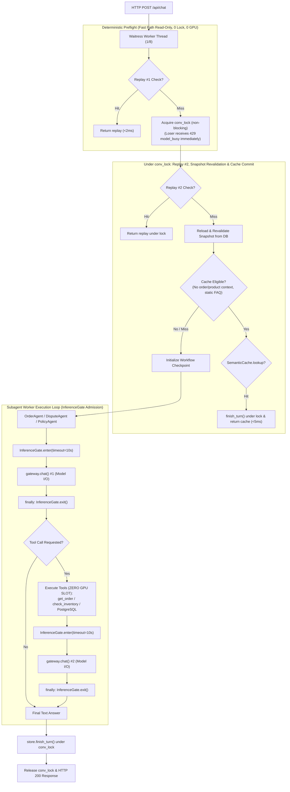

# Kế Hoạch Kỹ Thuật: Tối Ưu Hiệu Năng & Bounded Concurrency (Runtime Efficiency & Concurrency)

> **Mục tiêu:** Giải quyết dứt điểm điểm nghẽn đơn luồng mô hình (*single global model lock bottleneck*) trong hệ thống RetailOps, bảo đảm khả năng phục vụ đồng thời cho nhiều khách hàng trên máy chủ WSGI Waitress (8 threads), kiểm soát áp lực ngược (*backpressure*), công bằng tài nguyên (*fairness*) và thu thập số liệu thực nghiệm khoa học cho Luận văn.  
> **Snapshot đối chiếu:** Commit `fd24e36` trên nhánh `main`.  
> **Audit basis / Documentation baseline reviewed:** `b93eb5a` · **Application verified:** `fd24e36`  
> **Phân kỳ thực thi:** Thuộc **Phase 3** trong Lộ trình Kỹ thuật (triển khai sau khi FIX02 Catalog SSOT và GraphRAG v6.2 hoàn thành).

---

## 1. Điểm Nghẽn Trầm Trọng Đã Xác Minh Trong Codebase Hiện Tại

Trong mã nguồn thực tế tại snapshot `fd24e36`:
1. **Khóa Đơn Luồng Toàn Cục**:
   - `PersistentSessions` ([retailops/identity/persistent.py](../retailops/identity/persistent.py#L30)) và `PostgresSessions` ([retailops/identity/postgres.py](../retailops/identity/postgres.py#L17)) đều định nghĩa:
     ```python
     self.agent_lock = threading.Lock()
     ```
   - Mỗi phiên làm việc đều nhận cùng một khóa: `app.agent_lock = self.agent_lock`.
   - Trong `Application.chat()` ([retailops/business/application.py](../retailops/business/application.py#L155)):
     ```python
     require(self.agent_lock.acquire(blocking=False), 429, 'model_busy',
             'Model đang xử lý một cuộc trò chuyện khác. Bạn thử lại sau nhé.')
     ```
2. **Hệ Quả Thực Tế**:
   - Máy chủ Waitress chạy với `threads=8, connection_limit=100`, nhưng **chỉ duy nhất 1 lượt suy luận mô hình được chạy đồng thời trên toàn bộ khách hàng**.
   - Nếu Khách hàng A gửi tin nhắn làm AI sinh phản hồi (mất 2–3 giây), **bất kỳ yêu cầu chat nào từ Khách hàng B, C... trong khoảng thời gian đó đều bị từ chối ngay lập tức với HTTP 429 `model_busy`**.
   - Khóa hiện tại bao trùm toàn bộ hàm `chat()`: giữ slot trong khi đọc DB, chạy supervisor, truy vấn đồ thị, tìm kiếm vector RAG, thực thi business tools, và ghi dữ liệu vào DB.

---

## 2. Kiến Trúc Điều Phối Đồng Thời 2 Giai Đoạn (Two-Stage Architecture)

### 2.1. STAGE 1: Bounded Concurrency Gate Tại Biên Model I/O (Giữ Nguyên Sync Waitress)

> [!IMPORTANT]
> **Nguyên Tắc Cốt Lõi: Khóa Slot Chỉ Dành Riêng Cho Actual Model Call**  
> Tuyệt đối không giữ inference slot xuyên suốt cả turn của worker subagent. Slot chỉ được `acquire()` ngay trước khi gọi `gateway.chat()` / `gateway.chat_scoped()` và `release()` ngay trong khối `finally`. Các tác vụ đọc DB, truy vấn đồ thị Apache AGE, tìm kiếm vector RAG và thực thi tool hoàn toàn KHÔNG giữ inference slot.



#### Các Yêu Cầu Kỹ Thuật Bắt Buộc Trong Stage 1:

1. **InferenceGate Độc Lập Tại Session Backend**:
   - Sử dụng `threading.BoundedSemaphore` riêng biệt cho từng Provider (`custom` vLLM vs `api` Cloud).
   - Hỗ trợ per-customer fairness: Mỗi `customer_id` tối đa 1 active model call, giải phóng an toàn khi gặp ngoại lệ.
2. **Chặn Trap Nuốt Lỗi Overload Trong `dispute_agent` (Bắt Buộc)**:
   - Trong `retailops/workflow/subagents/dispute_agent.py`, ngoại lệ overload (HTTP status 429) và lỗi hạ tầng (>= 500) bắt buộc phải re-raise ra ngoài để trả HTTP 429/503 cho client, tuyệt đối không nuốt thành phản hồi giả *"Dạ shop đã ghi nhận..."*.
3. **Công Thức Headroom & Backpressure Trên Sync Waitress**:
   - Waitress có 8 worker threads. Blocking semaphore wait cũng chiếm luồng WSGI.
   - Để bảo đảm luôn có ít nhất `RESERVED_NONMODEL_THREADS` (mặc định 2) trống phục vụ `/health`, `/api/session`, `/api/orders`:
     $$\text{MAX\_WAITERS} \le \text{WAITRESS\_THREADS} - \text{RESERVED\_NONMODEL\_THREADS} - \text{MAX\_CONCURRENT\_INFERENCE}$$
   - Cấu hình: `WAITRESS_THREADS = 8`, `GPU_SLOTS = 1`, `MAX_QUEUE = 5`. Quá tải hàng đợi hoặc timeout (> 10s) trả về HTTP 429 kèm header `Retry-After: 5`.
4. **Chuẩn Hóa Fast-Path & Cache Serialization**:
   - `confirm_cancellation` là tuyến giao dịch HTTP độc lập (`POST /api/cancellation-proposals/{proposal_id}/confirm`), vốn dĩ không đi qua luồng chat inference.
   - Idempotency Replay #1 chạy ở fast-path ngoài lock.
   - Replay #2, tái thẩm định snapshot từ DB và Semantic Cache lookup/commit bắt buộc diễn ra **dưới phạm vi bảo vệ của `conv_lock`** (F02 FIX).
   - Tuyệt đối không ghi Semantic Cache nếu turn đã gọi bất kỳ tool nào (`tool_count > 0`, kể cả read tools như `get_current_time`).
5. **Xử Lý Race Condition Khi Invalidate Cache & Multi-Tenant ToolCache**:
   - Khóa cache trong `ToolCache` phân tách tuyệt đối theo `tenant_id` (`(tenant_id, customer_id, tool_name, args_hash)`).
   - Gắn `cache_epoch` theo từng customer/tenant: Khi Manager cập nhật đơn qua `POST /api/manager/orders/update-status`, epoch tăng lên. Các lệnh ghi từ tool calls in-flight bắt đầu trước thời điểm invalidate sẽ bị hủy bỏ (discard stale write), triệt tiêu hoàn toàn race condition.

---

### 2.2. STAGE 2: High-Scale Architecture (Chỉ Triển Khai Khi Benchmark Chứng Minh Stage 1 Chưa Đủ)

* Chỉ xem xét sau khi đã hoàn thành Khóa luận và có nhu cầu thương mại hóa:
  - Chuyển sang ASGI (Uvicorn / FastAPI / Starlette) với HTTP client bất đồng bộ (`httpx.AsyncClient`).
  - Triển khai Server-Sent Events (SSE) để stream token về trình duyệt nhằm giảm perceived latency (phải được chứng minh bằng benchmark thực tế, không claim trước `TTFT < 500ms`).
  - Mở rộng nhiều Web Replicas phía sau Load Balancer.

---

## 3. Quản Lý Kết Nối Cơ Sở Dữ Liệu & Pooling (Connection Pooling Contract)

1. **Nguyên Tắc Benchmark-First Cho Pooling**:
   - Hệ thống hiện tại sử dụng context manager `store.connection()` đóng/mở kết nối an toàn.
   - Chỉ bổ sung `psycopg-pool` vào `requirements.txt` nếu bài đo đạc ở Phase 4 chứng minh chi phí khởi tạo kết nối PostgreSQL > 5ms/turn.
2. **Quy Tắc Quản Lý Kết Nối Apache AGE**:
   - Tuyệt đối không duy trì kết nối AGE không được kiểm soát (*unmanaged connection*) tự do theo worker thread.
   - Nếu kích hoạt pool cho AGE:
     - Sử dụng bounded pool có configure/reset hook: Chạy `LOAD 'age'; SET LOCAL search_path = ag_catalog, pg_catalog;` khi checkout kết nối.
     - Cấu hình quyền read-only cho role `retailops`.
     - Chạy test kiểm tra rò rỉ phiên (session leakage test) trước khi hợp nhất.

---

## 4. Truthful Telemetry (Đo Đạc Chuẩn Xác Từng Thành Phần)

Bổ sung các trường telemetry vào cấu trúc trả về:

* **Per-Request Trace (Ghi vào `trace` của từng turn)**:
  - `queue_wait_ms`: Thời gian thực tế chờ slot trong InferenceGate (đo bằng `time.monotonic()`).
  - `provider_inference_ms`: Thời gian thực tế gọi mạng / suy luận model.
  - `graph_retrieval_ms`: Thời gian thực thi truy vấn Cypher trên Apache AGE.
  - `rag_retrieval_ms`: Thời gian tìm kiếm hybrid vector + lexical trên PostgreSQL.
  - `db_ms`: Tổng thời gian thực thi các truy vấn quan hệ.
  - `model_calls`: Số lượt gọi model thực tế trong turn (0 nếu direct/handoff, 1 cho normal turn, 2 nếu có tool call).
  - `prompt_tokens` & `generated_tokens`: Lấy từ telemetry thực tế của model provider; nếu provider không cung cấp thì gán `None` (Unknown) kèm `token_usage_available = False`, tuyệt đối không chia 3 và không tự gán 0.
  - `reported_cost_usd`: Lấy từ provider nếu có; nếu không thì để `None` (Unknown), không tự gán `$0.0`.
  - `e2e_latency_ms`: Tổng thời gian trọn vòng đời HTTP request đo tại server.
  - `in_flight_inferences`: Số lượng inference đang chạy đồng thời tại thời điểm hoàn thành turn.
  - **Sửa lỗi cache-hit trace**: Thay thế dòng hard-code `latency_ms = 5.0` trong [retailops/business/application.py](../retailops/business/application.py) bằng thời gian đo thực tế từ `time.monotonic()`.
* **Process / Ops Metrics (Chỉ số tổng hợp cấp tiến trình)**:
  - `overload_429_count`: Đếm tổng số lượt request bị từ chối do quá tải (vì request bị 429 không có completed turn để lưu vào DB).

---

## 6. Bảo Vệ Bộ Benchmark 250 Ca Đã Đóng Băng (Frozen Baseline Protection)

> [!IMPORTANT]
> **Nguyên Tắc Bất Biến Về Dữ Liệu Thực Nghiệm Khoa Học Cho Luận Văn:**
> 1. **Frozen Baseline**: Toàn bộ **250 kịch bản Master Benchmark** (phân bổ qua các nhóm nghiệp vụ Tra cứu đơn, Hủy đơn, Đổi hàng, Bảo hành, Khiếu nại, Out-of-scope) là bộ dữ liệu đánh giá **ĐÃ ĐÓNG BĂNG**.
> 2. **Không Thay Đổi Benchmark**: Tuyệt đối KHÔNG thay đổi câu hỏi, không nới lỏng tiêu chí chấm điểm, và không lọc bỏ các ca khó để "làm đẹp" số liệu độ chính xác (Router Accuracy / Resolution Rate).
> 3. **Cơ Sở Đo Lường Đối Chứng Module 6**: Mọi thực nghiệm so sánh khoa học giữa mô hình self-hosted Gemma-4-12B và DeepSeek Cloud API trong Chương 4 Luận văn tốt nghiệp bắt buộc phải chạy trên cùng một bộ 250 kịch bản cố định này để bảo đảm tính khách quan, có thể tái lập (reproducibility) và trung thực học thuật.

