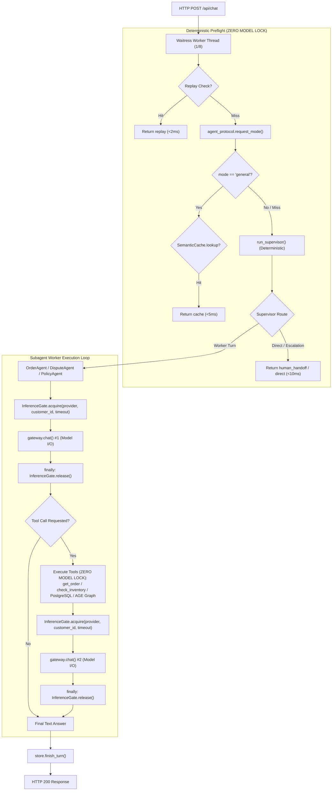

# Kế Hoạch Kỹ Thuật: Tối Ưu Hiệu Năng & Bounded Concurrency (Runtime Efficiency & Concurrency)

> **Mục tiêu:** Giải quyết dứt điểm điểm nghẽn đơn luồng mô hình (*single global model lock bottleneck*) trong hệ thống RetailOps, bảo đảm khả năng phục vụ đồng thời cho nhiều khách hàng trên máy chủ WSGI Waitress (8 threads), kiểm soát áp lực ngược (*backpressure*), công bằng tài nguyên (*fairness*) và thu thập số liệu thực nghiệm khoa học cho Luận văn.  
> **Snapshot đối chiếu:** Commit `fd24e36` trên nhánh `main`.  
> **Audit basis / Documentation baseline reviewed:** `b93eb5a` · **Application verified:** `fd24e36`  
> **Phân kỳ thực thi:** Thuộc **Phase 3** trong Lộ trình Kỹ thuật (triển khai sau khi FIX02 Catalog SSOT và GraphRAG v6.2 hoàn thành).

---

## 1. Điểm Nghẽn Trầm Trọng Đã Xác Minh Trong Codebase Hiện Tại

Trong mã nguồn thực tế tại snapshot `fd24e36`:
1. **Khóa Đơn Luồng Toàn Cục**:
   - `PersistentSessions` ([retailops/identity/persistent.py](../retailops/identity/persistent.py#L30)) và `PostgresSessions` ([retailops/identity/postgres.py](../retailops/identity/postgres.py#L17)) đều định nghĩa:
     ```python
     self.agent_lock = threading.Lock()
     ```
   - Mỗi phiên làm việc đều nhận cùng một khóa: `app.agent_lock = self.agent_lock`.
   - Trong `Application.chat()` ([retailops/business/application.py](../retailops/business/application.py#L155)):
     ```python
     require(self.agent_lock.acquire(blocking=False), 429, 'model_busy',
             'Model đang xử lý một cuộc trò chuyện khác. Bạn thử lại sau nhé.')
     ```
2. **Hệ Quả Thực Tế**:
   - Máy chủ Waitress chạy với `threads=8, connection_limit=100`, nhưng **chỉ duy nhất 1 lượt suy luận mô hình được chạy đồng thời trên toàn bộ khách hàng**.
   - Nếu Khách hàng A gửi tin nhắn làm AI sinh phản hồi (mất 2–3 giây), **bất kỳ yêu cầu chat nào từ Khách hàng B, C... trong khoảng thời gian đó đều bị từ chối ngay lập tức với HTTP 429 `model_busy`**.
   - Khóa hiện tại bao trùm toàn bộ hàm `chat()`: giữ slot trong khi đọc DB, chạy supervisor, truy vấn đồ thị, tìm kiếm vector RAG, thực thi business tools, và ghi dữ liệu vào DB.

---

## 2. Kiến Trúc Điều Phối Đồng Thời 2 Giai Đoạn (Two-Stage Architecture)

### 2.1. STAGE 1: Bounded Concurrency Gate Tại Biên Model I/O (Giữ Nguyên Sync Waitress)

> [!IMPORTANT]
> **Nguyên Tắc Cốt Lõi: Khóa Slot Chỉ Dành Riêng Cho Actual Model Call**  
> Tuyệt đối không giữ inference slot xuyên suốt cả turn của worker subagent. Slot chỉ được `acquire()` ngay trước khi gọi `gateway.chat()` / `gateway.chat_scoped()` và `release()` ngay trong khối `finally`. Các tác vụ đọc DB, truy vấn đồ thị Apache AGE, tìm kiếm vector RAG và thực thi tool hoàn toàn KHÔNG giữ inference slot.



#### Các Yêu Cầu Kỹ Thuật Bắt Buộc Trong Stage 1:

1. **InferenceGate Độc Lập Tại Session Backend**:
   - Sử dụng `threading.BoundedSemaphore` riêng biệt cho từng Provider (`custom` vLLM vs `api` Cloud).
   - Hỗ trợ per-customer fairness: Mỗi `customer_id` tối đa 1 active model call, giải phóng an toàn khi gặp ngoại lệ.
2. **Chặn Trap Nuốt Lỗi Overload Trong `dispute_agent` (Bắt Buộc)**:
   - Trong `retailops/workflow/subagents/dispute_agent.py`, khối `try...except Exception as exc:` hiện tại có nguy cơ nuốt ngoại lệ overload và biến lỗi 429 thành phản hồi giả *"Dạ shop đã ghi nhận..."*.
   - Khóa cứng quy tắc:
     ```python
     except AgentError as exc:
         if exc.code in ('model_busy', 'inference_overloaded'):
             raise
     ```
     Ngoại lệ overload/429 bắt buộc phải nổi lên tầng trên cùng để trả về đúng HTTP 429 cho client, không được biến thành câu trả lời thành công giả.
3. **Công Thức Headroom & Backpressure Trên Sync Waitress**:
   - Waitress có 8 worker threads. Blocking semaphore wait cũng chiếm luồng WSGI.
   - Để bảo đảm luôn có ít nhất `RESERVED_NONMODEL_THREADS` (mặc định 2) trống phục vụ `/healthz`, `/api/session`, `/api/orders`:
     $$\text{MAX\_WAITERS} \le \text{WAITRESS\_THREADS} - \text{RESERVED\_NONMODEL\_THREADS} - \text{MAX\_CONCURRENT\_INFERENCE}$$
   - Các biến cấu hình:
     - `RETAILOPS_HTTP_THREADS` (mặc định: 8)
     - `RETAILOPS_RESERVED_HTTP_THREADS` (mặc định: 2)
     - `RETAILOPS_MAX_CONCURRENT_INFERENCE` (mặc định thận trọng: 1 hoặc 2; các mức CPU=1/2, GPU=2/4, Cloud=4/8 là candidate benchmark)
     - `RETAILOPS_MAX_INFERENCE_WAITERS` (tính động theo công thức trên)
   - Trình khởi động kiểm tra: nếu `capacity + waiters > threads - reserved` thì báo lỗi cấu hình.
4. **Chuẩn Hóa Fast-Path**:
   - `confirm_cancellation` là tuyến giao dịch HTTP độc lập (`POST /api/cancellation-proposals/{proposal_id}/confirm`), vốn dĩ không đi qua luồng chat inference.
   - Idempotency replay và SemanticCache general hit diễn ra trước khi chạm tới InferenceGate.
   - Human escalation / direct supervisor responses được bảo vệ để giữ nguyên 0 model calls (`model_calls = 0`).

---

### 2.2. STAGE 2: High-Scale Architecture (Chỉ Triển Khai Khi Benchmark Chứng Minh Stage 1 Chưa Đủ)

* Chỉ xem xét sau khi đã hoàn thành Khóa luận và có nhu cầu thương mại hóa:
  - Chuyển sang ASGI (Uvicorn / FastAPI / Starlette) với HTTP client bất đồng bộ (`httpx.AsyncClient`).
  - Triển khai Server-Sent Events (SSE) để stream token về trình duyệt nhằm giảm perceived latency (phải được chứng minh bằng benchmark thực tế, không claim trước `TTFT < 500ms`).
  - Mở rộng nhiều Web Replicas phía sau Load Balancer.

---

## 3. Quản Lý Kết Nối Cơ Sở Dữ Liệu & Pooling (Connection Pooling Contract)

1. **Nguyên Tắc Benchmark-First Cho Pooling**:
   - Hệ thống hiện tại sử dụng context manager `store.connection()` đóng/mở kết nối an toàn.
   - Chỉ bổ sung `psycopg-pool` vào `requirements.txt` nếu bài đo đạc ở Phase 4 chứng minh chi phí khởi tạo kết nối PostgreSQL > 5ms/turn.
2. **Quy Tắc Quản Lý Kết Nối Apache AGE**:
   - Tuyệt đối không duy trì kết nối AGE không được kiểm soát (*unmanaged connection*) tự do theo worker thread.
   - Nếu kích hoạt pool cho AGE:
     - Sử dụng bounded pool có configure/reset hook: Chạy `LOAD 'age'; SET LOCAL search_path = ag_catalog, pg_catalog;` khi checkout kết nối.
     - Cấu hình quyền read-only cho role `retailops`.
     - Chạy test kiểm tra rò rỉ phiên (session leakage test) trước khi hợp nhất.

---

## 4. Truthful Telemetry (Đo Đạc Chuẩn Xác Từng Thành Phần)

Bổ sung các trường telemetry vào cấu trúc trả về:

* **Per-Request Trace (Ghi vào `trace` của từng turn)**:
  - `queue_wait_ms`: Thời gian thực tế chờ slot trong InferenceGate (đo bằng `time.monotonic()`).
  - `provider_inference_ms`: Thời gian thực tế gọi mạng / suy luận model.
  - `graph_retrieval_ms`: Thời gian thực thi truy vấn Cypher trên Apache AGE.
  - `rag_retrieval_ms`: Thời gian tìm kiếm hybrid vector + lexical trên PostgreSQL.
  - `db_ms`: Tổng thời gian thực thi các truy vấn quan hệ.
  - `model_calls`: Số lượt gọi model thực tế trong turn (0 nếu direct/handoff, 1 cho normal turn, 2 nếu có tool call).
  - `prompt_tokens` & `generated_tokens`: Lấy từ telemetry thực tế của model provider; nếu provider không cung cấp thì gán `None` (Unknown) kèm `token_usage_available = False`, tuyệt đối không chia 3 và không tự gán 0.
  - `reported_cost_usd`: Lấy từ provider nếu có; nếu không thì để `None` (Unknown), không tự gán `$0.0`.
  - `e2e_latency_ms`: Tổng thời gian trọn vòng đời HTTP request đo tại server.
  - `in_flight_inferences`: Số lượng inference đang chạy đồng thời tại thời điểm hoàn thành turn.
  - **Sửa lỗi cache-hit trace**: Thay thế dòng hard-code `latency_ms = 5.0` trong [retailops/business/application.py](../retailops/business/application.py) bằng thời gian đo thực tế từ `time.monotonic()`.
* **Process / Ops Metrics (Chỉ số tổng hợp cấp tiến trình)**:
  - `overload_429_count`: Đếm tổng số lượt request bị từ chối do quá tải (vì request bị 429 không có completed turn để lưu vào DB).

---

## 5. Phương Án Benchmark Đo Đạc Runtime & Concurrency

Quy trình kiểm thử tải đồng thời phục vụ Chương 4 Khóa luận:

* **Tải Đo Đạc**: `concurrency = 1, 2, 4, 8, 16` luồng đồng thời.
  - *Ghi chú khoa học*: Khi `concurrency > 8` (vượt quá 8 worker threads của Waitress), bài test đo lường cả độ trễ xếp hàng HTTP của WSGI server.
* **Bộ Chỉ Số Thu Thập**:
  1. **Throughput & Latency**: RPS thành công, E2E Latency (p50, p95, p99).
  2. **Thời Gian Xếp Hàng & Xử Lý**: Queue wait (p50, p95), Provider inference time (p50, p95).
  3. **Tỷ Lệ Thành Công & Áp Lực Ngược**: Tỷ lệ hoàn thành nghiệp vụ (Success rate %), Tỷ lệ lỗi 429 quá tải (Overload 429 rate %).
  4. **Hiệu Quả Tài Nguyên & Chi Phí**: `model_calls/request`, `prompt_tokens/request`, `generated_tokens/request`, `cost/1000 successful requests`.
  5. **Tính Công Bằng Giữa Các Khách Hàng**:
     - Sử dụng chỉ số **Jain's Fairness Index** để đánh giá tính công bằng trong phân bổ tài nguyên suy luận.
     - Sử dụng độ phân tán thời gian chờ (**wait-time dispersion / standard deviation**) để đo độ lệch độ trễ giữa các khách hàng.
  6. **Độ Tin Cậy & Cô Lập**: Tool Accuracy %, Citation Validity %, và kiểm tra cô lập dữ liệu tuyệt đối giữa các khách hàng (zero cross-customer leakage).
  7. **Tiêu Thụ Tài Nguyên Hệ Thống**: CPU %, RAM sử dụng, và VRAM peak (khi chạy trên GPU).
