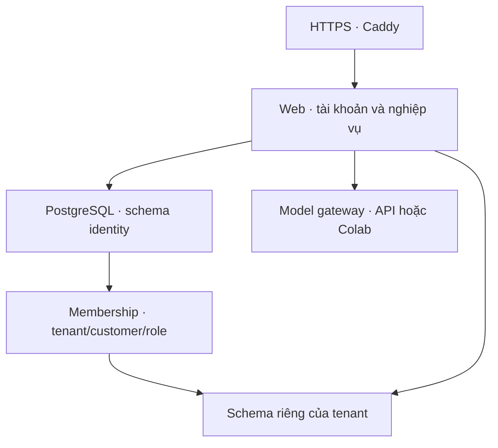

> Bản 0.10 bổ sung pgvector và bộ chuyển đổi có backup/rollback: xem [KNOWLEDGE.md](KNOWLEDGE.md). Dùng hướng dẫn đó cho lần chuyển mới.

> Với image 0.9, business schema là v2. Kho v1 đang chạy cần bước [database migrate](LANGGRAPH.md) trước khi bật web 0.9.

# RetailOps 0.8 — PostgreSQL cho khung hệ thống

PostgreSQL là backend tùy chọn cho `persistent-demo`. SQLite vẫn là mặc định cho demo cũ
và notebook. Cả hai engine dùng chung repository operations và luật nghiệp vụ; adapter
chỉ thay connection/transaction/DDL và cơ chế kiểm tra kho dữ liệu.

## Kiến trúc



- Một database PostgreSQL; schema `retailops_identity` và `tenant_<storage-key>`.
- Storage key được server cấp, không nhận schema/tenant từ HTTP hay model.
- Mọi query vẫn bind parameters; adapter chuyển ký hiệu placeholder từ `?` sang `%s`,
  không nối giá trị người dùng vào SQL. DDL PostgreSQL được viết riêng.
- `search_path` chỉ gồm schema đã chọn và `pg_catalog`, không rơi về `public`.
- Mỗi giao dịch ghi lấy advisory lock theo schema, trong transaction. Cơ chế này giữ
  hành vi ghi tuần tự của SQLite giữa nhiều connection/process; chưa phải tối ưu concurrency.
- Xác nhận hủy vẫn kiểm tra owner/status/version/proposal TTL/idempotency và ghi audit
  trong cùng transaction. PostgreSQL thêm foreign key thật từ order đến customer.
- Runtime không tạo schema hay seed khi nhận request. CLI `database init`, import và
  `identity init-tenant` là các thao tác quản trị tường minh. Provision tenant có thể chạy
  lại để hoàn tất nếu bước tạo schema trước đó thất bại; tài khoản chưa được cấp vào kho thiếu.

Đây là cô lập bằng ứng dụng và schema, **chưa phải PostgreSQL RLS hoặc một DB role riêng
cho mỗi tenant**. Role ứng dụng sở hữu các schema RetailOps và phải được coi là thành phần
đáng tin cậy. Chưa có pgvector, RAG, LangGraph hay MCP trong PR PostgreSQL này.

## Cấu hình

```dotenv
RETAILOPS_DATA_MODE=persistent-demo
RETAILOPS_STORAGE_BACKEND=postgresql
RETAILOPS_DATABASE_URL_FILE=/run/secrets/retailops_database_url
```

Cũng hỗ trợ `RETAILOPS_DATABASE_URL` trong môi trường process; chỉ dùng một nguồn DSN.
Không đưa DSN vào command line, repo, log hay ảnh chụp. `check-config` chỉ parse cấu hình,
không kết nối DB. `database check` kết nối và xác nhận schema version.

Image đóng gói Psycopg 3.3.5 với wheel hash cho CPython 3.11/3.12 Linux x86_64. Colab
không cần driver PostgreSQL để chạy inference hoặc test SQLite; bộ test PostgreSQL chỉ
chạy khi có `RETAILOPS_TEST_DATABASE_URL` cho database thử riêng.

## Chuẩn bị EC2 sau khi PR đã merge và CD có image 0.8

Chưa tạo RDS hay đổi instance. Compose thêm container PostgreSQL 16.15 trên EC2 hiện có,
giới hạn 512 MiB RAM; cần kiểm tra RAM/dung lượng trống trước khi bật. Dịch vụ không publish
cổng 5432 ra host và không cần mở thêm Security Group. Dữ liệu nằm trong named volume.

Trong EC2 Session Manager:

```bash
bash
cd /opt/retailops
retailops_pg_image=$(sudo sed -n 's/^RETAILOPS_IMAGE=//p' deployed.env)
retailops_pg_extract=$(sudo docker create --network none "$retailops_pg_image")
sudo docker cp "$retailops_pg_extract:/app/deploy/compose.postgres.yaml" /opt/retailops/compose.postgres.yaml
sudo docker cp "$retailops_pg_extract:/app/deploy/init-postgres.sh" /opt/retailops/init-postgres.sh
sudo docker cp "$retailops_pg_extract:/app/deploy/configure-postgres.py" /opt/retailops/configure-postgres.py
sudo docker rm "$retailops_pg_extract"
sudo python3 /opt/retailops/configure-postgres.py
```

Generator chỉ tạo secret lần đầu, từ chối ghi đè. Thư mục host mode 0700; file chỉ được
mount vào container cần đọc. Admin password chỉ vào PostgreSQL; web nhận DSN của role
`retailops` **không có superuser, CREATE ROLE hoặc CREATE DATABASE**. Script init role
chạy khi volume PostgreSQL mới trống; đổi file secret không tự đổi mật khẩu trong DB.

Định nghĩa hàm dùng **cả hai** Compose file:

```bash
retailops_pg() {
  sudo docker compose --project-name retailops-web --env-file deployed.env --env-file public.env -f compose.public.yaml -f compose.postgres.yaml "$@"
}
retailops_pg config --quiet
retailops_pg up -d --wait --wait-timeout 90 postgres
```

Không chạy bộ cài HTTPS cũ riêng sau khi cấu hình PostgreSQL: nó sẽ từ chối để tránh bỏ
Compose override rồi vô tình quay về SQLite. Các lần recreate web tiếp theo đều dùng
`retailops_pg`. Không dùng `down --volumes` trên môi trường có dữ liệu cần giữ.

## Chọn khởi tạo mới hoặc chuyển dữ liệu

**Nếu chưa có tài khoản persistent cần giữ**, tạo schema rỗng:

```bash
retailops_pg run --rm --no-deps --entrypoint python web -m retailops database init
```

Sau đó bật web theo phần dưới và cấp tenant/tài khoản bằng CLI trong
[hướng dẫn identity](PERSISTENT_IDENTITY.md), thay `retailops_web` bằng `retailops_pg`.
Không tự seed tài khoản hoặc cấp mã mặc định.

**Nếu đang có dữ liệu persistent SQLite 0.7 cần giữ**, dừng web và các lệnh quản trị ghi
dữ liệu, rồi tạo bản sao nguồn. Không chuyển guest database thành tài khoản một cách tự động.

```bash
retailops_pg stop web
retailops_sqlite_snapshot=$(sudo mktemp -d /opt/retailops/artifacts/pg-import.XXXXXX)
sudo cp -a /opt/retailops/artifacts/persistent "$retailops_sqlite_snapshot/persistent"
sudo chown 10001:10001 "$retailops_sqlite_snapshot"
retailops_pg run --rm --no-deps --entrypoint python web -m retailops database import-sqlite --offline-snapshot "/data/$(basename "$retailops_sqlite_snapshot")/persistent"
```

Chỉ tiếp tục khi nhận `POSTGRES_IMPORT_VERIFIED`:

- Đọc nguồn bằng SQLite read-only, kiểm tra schema v1, integrity và foreign keys.
- Kiểm tra membership trỏ tới tenant/customer tồn tại.
- Đích phải trống; từ chối nếu có tài khoản, phiên hoặc schema tenant.
- Nhập identity và tất cả tenant trong một transaction PostgreSQL; đối chiếu số dòng và
  SHA-256 nội dung từng bảng trước commit. Lỗi nhập/đối chiếu thì rollback dữ liệu.
- Giữ mã cá nhân dạng hash, role, đơn, proposal, audit, idempotency, hội thoại và quota API.
- Không nhập login session: mọi người đăng nhập lại bằng mã cá nhân hiện có.
- Không xóa hoặc ghi lại dữ liệu nguồn. PostgreSQL sequence được đặt lại theo ID đã nhập;
  sequence có thể có khoảng trống sau transaction thất bại, không ảnh hưởng ID uniqueness.

Importer dành cho snapshot demo vừa phải, đọc dữ liệu vào RAM để đối chiếu. Chưa có luồng
streaming cho tập dữ liệu lớn hoặc CDC/chuyển đổi không gián đoạn.

## Bật web và kiểm tra

```bash
retailops_pg run --rm --no-deps --entrypoint python web -m retailops database check
retailops_pg up -d --no-build --pull never --wait --wait-timeout 60 web
curl --fail --silent --show-error https://retailops.100-27-221-103.sslip.io/healthz
```

Health cần trả `version=0.8`, `data_mode=persistent-demo`, `storage_backend=postgresql`.
Đăng nhập lại, đối chiếu đơn đã hủy và nhật ký. Thử tài khoản khác customer/tenant và quyền
viewer. Các nút nghiệp vụ không cần Colab; chat thật vẫn phụ thuộc nguồn model được chọn.

## Backup, restore và rollback

Backup PostgreSQL bằng công cụ PostgreSQL, không copy trực tiếp volume đang chạy:

```bash
set -o pipefail
sudo install -d -m 0700 /opt/retailops/backups
retailops_pg_dump=$(sudo mktemp /opt/retailops/backups/retailops.XXXXXX.dump)
retailops_pg exec -T postgres pg_dump -U postgres -d retailops --exclude-schema=retailops_extensions -Fc | sudo tee "$retailops_pg_dump" >/dev/null
```

Chạy pipeline với `set -o pipefail` để phát hiện lỗi `pg_dump`; kiểm tra exit code và
`pg_restore --list` trước khi coi đó là bản backup. Giữ cả `postgres-secrets` và cấu hình
triển khai trong nơi backup bí mật riêng; pg_dump không sao lưu role/password của cluster.

Với 0.10, admin chạy `enable-pgvector.sql` trên database đích để cài extension trước khi restore. Schema extension không nằm trong dump ở trên.

Restore vào **database mới**, tạo bởi admin và có owner `retailops`, rồi dùng `pg_restore
--exit-on-error --no-owner --no-acl` bằng role ứng dụng. Kiểm tra tài khoản, đơn, audit và
phiên trên bản phục hồi trước khi đổi DSN. Không restore chồng lên database đang phục vụ web.
Khôi phục có thể đưa lại quyền/mã/session cũ: đối chiếu các lần thu hồi sau snapshot.

Trước khi có ghi mới trên PostgreSQL, có thể quay lại cấu hình SQLite và nguồn được giữ
nguyên. Sau khi PostgreSQL đã nhận giao dịch mới, SQLite cũ không còn đồng bộ; không tự
fallback. Khi đó cần phục hồi PostgreSQL hoặc lập kế hoạch chuyển ngược có đối chiếu dữ liệu.
Thư mục snapshot SQLite chỉ được dọn sau khi đã có backup và xác minh chuyển đổi.

## Kiểm tra tự động và phần tiếp theo

CI chạy cùng bộ test SQLite và 18 test PostgreSQL thật, gồm các HTTP contract dùng lại,
hai connection xác nhận đồng thời, quota đồng thời, phân quyền, mất schema, rollback và
import có đối chiếu. Test PostgreSQL chỉ cho phép database tên `retailops_test*` vì nó dọn
schema fixture. Không đặt biến test vào database ứng dụng.

CI còn chạy Caddy → web → PostgreSQL với role ứng dụng không đặc quyền: hủy đơn trên SQLite,
chuyển nguồn đã dừng, login qua HTTPS rồi pg_dump/restore vào database khác và đối chiếu đơn.
Đây là kiểm tra correctness và vận hành; không phải kết quả performance hay chất lượng model.

Chặng kế tiếp: LangGraph cùng request lifecycle/checkpoint và bước xác nhận; sau đó RAG/pgvector.

Tài liệu nền: [Psycopg transactions](https://www.psycopg.org/psycopg3/docs/basic/transactions.html),
[PostgreSQL advisory locks](https://www.postgresql.org/docs/16/explicit-locking.html#ADVISORY-LOCKS),
[PostgreSQL pg_dump](https://www.postgresql.org/docs/16/app-pgdump.html).
