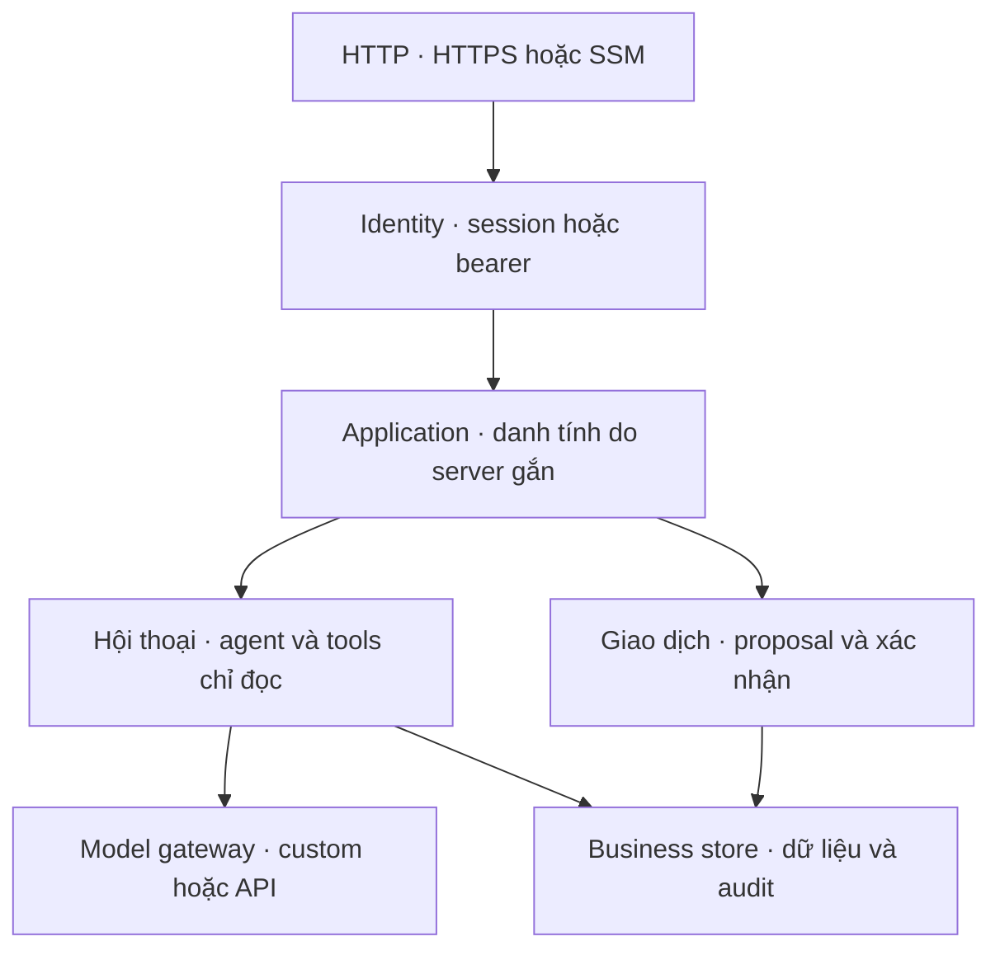

# RetailOps 0.8 — Khung hệ thống, giai đoạn 1–2

## Mục tiêu và phạm vi

Hoàn thiện ranh giới module của ứng dụng đang chạy trước khi benchmark hoặc tối ưu.
Một process ứng dụng vẫn dùng các module nghiệp vụ chung cho web HTTPS, API riêng và
notebook. Đây là **modular monolith**: chia trách nhiệm trong code, chưa tách dịch vụ triển khai.

Giai đoạn 1 tách module, cấu hình và session binding. Giai đoạn 2 thêm identity backend
với tài khoản cá nhân, tenant/customer/role, database theo cửa hàng và migration v1.
PostgreSQL là backend tùy chọn, có schema theo tenant, nhập snapshot SQLite có đối chiếu và kiểm tra restore.
Xem [PostgreSQL](POSTGRESQL.md). Chi tiết và hướng dẫn vận hành: [Persistent identity](PERSISTENT_IDENTITY.md).
Mặc định `synthetic-demo` giữ hành vi guest cũ; `persistent-demo` bật tài khoản và dữ liệu
không phụ thuộc thời hạn phiên. Cả hai chỉ dùng dữ liệu giả lập. `production` vẫn bị từ chối.
Khung điều phối request/budget và tích hợp hệ thống bán hàng còn ở các giai đoạn sau.

## Các phần đã có trong code

| Module | Trách nhiệm |
|---|---|
| `retailops/config.py` | Đọc và kiểm tra cấu hình một lần; phân biệt cấu hình public/private; không in secret |
| `retailops/bootstrap.py` | Khởi tạo gateways, dữ liệu/phiên và HTTP theo thứ tự; validate adapter trước khi tạo dữ liệu |
| `retailops/identity/contracts.py` | `SessionBackend` và `SessionBinding`: ứng dụng, khách hàng và workspace được xác định phía server |
| `retailops/identity/demo.py` | Mã mời, cookie, hết hạn và dọn **workspace demo** |
| `retailops/identity/store.py`, `persistent.py`, `cli.py` | Tài khoản, membership, mã cá nhân, session thu hồi được và dữ liệu tenant bền vững |
| `retailops/business/permissions.py`, `schema.py`, `retailops/schema.py` | Quyền nghiệp vụ và migration SQLite có version |
| `retailops/identity/bearer.py` | Xác thực bearer cho API riêng qua localhost/SSM |
| `retailops/business/store.py` | SQLite, quyền sở hữu, trạng thái/version, proposal, xác nhận, idempotency và audit trong transaction |
| `retailops/business/application.py` | Use case hội thoại, chọn nguồn model và ngữ cảnh đơn/sản phẩm |
| `retailops/storage/`, `retailops/identity/postgres.py` | PostgreSQL adapter, DDL rõ ràng, import SQLite và account backend |
| `retailops/models.py` | Hợp đồng `ModelGateway` và factory cho custom/API được cấu hình; không tự fallback |
| `retailops/http/routes.py` | Cùng bộ business routes dùng cho HTTP public/private |
| `retailops/http/public.py` | HTTPS-facing WSGI, Host/Origin/cookie và giới hạn request; nhận danh tính từ session backend |
| `retailops/http/private.py` | HTTP localhost/SSM với bearer |
| `retailops/core.py` | Lỗi nghiệp vụ, từ vựng trạng thái/lý do, version và vị trí asset |

Các thành phần agent/inference hiện có (`retailops_agent.py`, `retailops_tools.py`,
`retailops_providers.py`, `agent_protocol.py`, `inference_proxy.py`) vẫn là implementation
được các module mới sử dụng. Chưa đổi prompt, thuật toán chọn tool, số model calls,
khóa chat dùng chung hay hành vi nhà cung cấp.



`bootstrap.py` nối các implementation cụ thể; việc import package không khởi động
web, mở database, tải model hoặc gửi request ra ngoài. Business store không import
HTTP, session hay inference và có thể chạy transaction độc lập trong test.

## Ranh giới dữ liệu và giao dịch

- HTTP không lấy `customer_id` hay đường dẫn workspace từ body/query. Session backend
  cung cấp `SessionBinding`; mọi lookup và tool được ràng buộc theo khách đó.
- `BusinessStore` không seed tự động. Factory private và adapter demo chủ động gọi `seed()`.
- Chỉ adapter `identity/demo.py` được dọn database theo vòng đời phiên demo. Core nghiệp vụ
  không biết thời hạn cookie và không tự xóa file database.
- API private vẫn dùng `<output>/business.sqlite3`; public vẫn dùng
  `<output>/public-guests/`. Cấu trúc file/schema cũ tương thích với phiên bản này.
- Agent chỉ chuẩn bị giao diện hủy. Backend vẫn yêu cầu xác nhận riêng và kiểm tra lại
  owner/status/version/TTL/idempotency trước khi ghi dữ liệu cùng audit.
- Persistent backend gắn tenant/principal/customer/role phía server, lưu tại `<output>/persistent/`.
  Tenant có database riêng; HTTP và tool hủy kiểm tra quyền. Xem phạm vi còn giới hạn trong tài liệu phase 2.

## Khởi động và kiểm tra cấu hình

Các biến môi trường hiện có tiếp tục được sử dụng. Public đọc
`RETAILOPS_PUBLIC_INVITE_TOKEN`, `RETAILOPS_PUBLIC_ORIGIN` và
`RETAILOPS_PUBLIC_CUSTOM_ENABLED`; private đọc `RETAILOPS_DEMO_TOKEN` và
`RETAILOPS_MODEL_ENABLED`. Hai cờ custom không thay thế lẫn nhau.

Lệnh mới, sau khi các biến đã được đưa vào môi trường process:

```bash
python -m retailops check-config --interface public
python -m retailops serve-public
```

Hoặc API riêng:

```bash
python -m retailops check-config --interface private
python -m retailops serve-private
```

`check-config` kiểm tra giá trị và khởi tạo adapter ở mức local; **không** gọi model,
kiểm tra kết nối, mở port hay tạo database. Output chỉ gồm version, interface, data mode,
cờ nguồn model, hạn mức lượt và `connectivity_checked=false`. `CONFIG_VALID` không có
nghĩa là API key đã được nhà cung cấp chấp nhận hoặc Colab đang online.

Entrypoint cũ `python retailops_public.py` và `python retailops_api.py` chuyển tiếp vào
cùng factory. Compose/SSM và các import cũ tiếp tục dùng được. Package mới được đưa vào
Docker và source bundle của notebook; khi sửa code có trong bundle, chạy:

```bash
python scripts/build_agent_notebook.py
python scripts/build_agent_notebook.py --check
```

Ô source của notebook xóa cả cache module `retailops.*` khi nạp lại source để không
dùng lẫn module cũ/mới. Protocol Colab vẫn là `retailops-agent-v1`.

## Kiểm tra chức năng cho giai đoạn này

```bash
python -m unittest discover -s tests -v
node tests/test_provider_selector.js
node tests/test_public_session.js
python scripts/build_agent_notebook.py --check
```

`tests/test_system_foundation.py` kiểm tra các ranh giới mới:

- Transaction hủy chạy được khi chặn import HTTP, identity và model.
- Entrypoint/import cũ giữ cùng kiểu exception và repository, tránh lỗi catch sau refactor.
- Cấu hình sai bị từ chối trước khi tạo dữ liệu; public không cần Colab khi custom tắt.
- Kiểm tra cấu hình không gọi inference và không in token.
- HTTP dùng khách hàng do session backend cung cấp, bao gồm trường hợp khác `C-001`.
- Logout public không xóa dữ liệu private; khởi động lại private giữ đơn đã hủy và replay.
- Các test cũ vẫn kiểm tra ownership, giao dịch, cô lập guest, cookie, tool protocol và HTTP.

Đây là kiểm tra correctness/compatibility. Không dùng chúng làm bằng chứng throughput,
latency production, chất lượng Qwen hoặc chi phí inference. CI vẫn thực hiện build và
kiểm tra Docker/HTTPS như trước.

## Phần khung làm tiếp sau PR này

| Giai đoạn | Việc phải hoàn tất | Điều kiện hoàn tất |
|---|---|---|
| 1 — Đã có | Module, cấu hình, factory và session binding | Luồng cũ qua test; các ranh giới mới được kiểm tra; notebook và Docker đóng gói đủ |
| 2 — Đã có cho dữ liệu giả lập | Mô hình tenant/customer/role; identity backend; schema migration và repository theo tenant; tách hẳn thời hạn session khỏi thời hạn đơn | Logout/expiry không mất đơn; tenant khác không đọc/ghi lẫn; có đường migration và restore |
| 3 — Luồng điều phối hệ thống | Khóa conversation, admission theo provider/tenant, lifecycle request và budget reservation; trạng thái pending/failed rõ ràng | Không đảo lịch sử, không thực hiện giao dịch lặp, không gọi vượt phần ngân sách đã giữ |
| 4 — Tích hợp và vận hành | Hợp đồng hệ thống bán hàng/provider; promotion đúng image đã qua gate; backup/restore/rollback | Một workflow từ đăng nhập đến giao dịch và khôi phục chạy được trên staging |
| 5 — Đo và tối ưu | Baseline toàn tuyến, tải, chất lượng và chi phí; sau đó mới cache, serving hoặc fine-tune theo kết quả | So sánh trước–sau tái lập được trên cùng tập tác vụ |

Giai đoạn 3 là phần làm tiếp: điều phối request và giữ ngân sách trước khi gọi provider.
Các hàng 3–5 là kế hoạch, chưa phải tính năng đã hoàn tất. Không thêm dịch vụ trả phí hoặc thay đổi hạ tầng EC2 trong phase 2.
